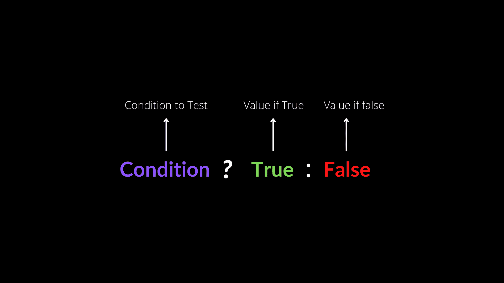
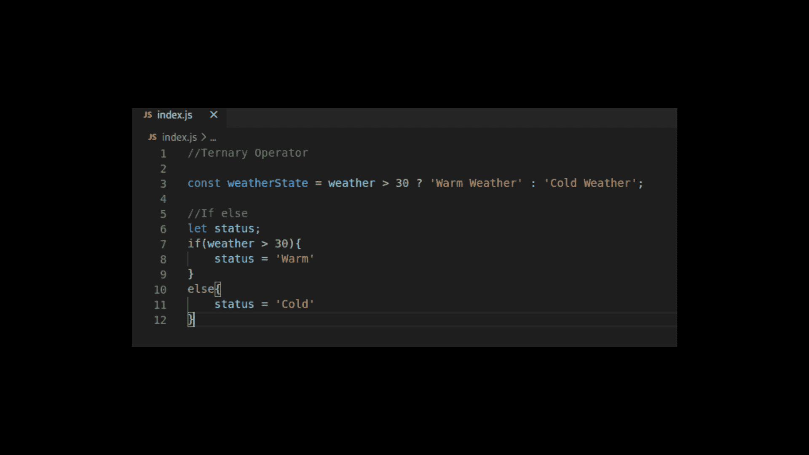
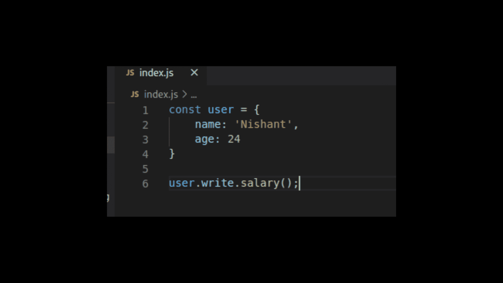
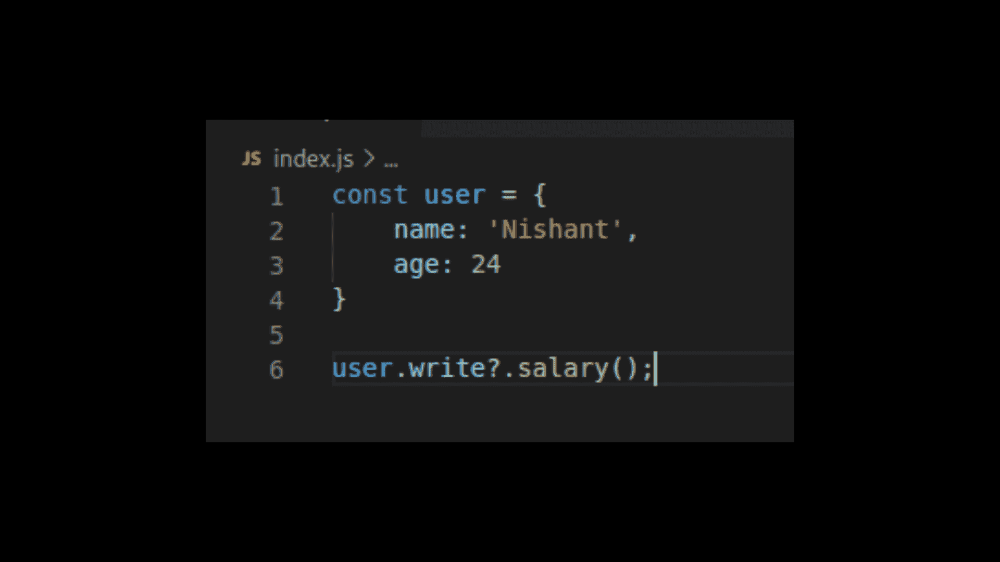
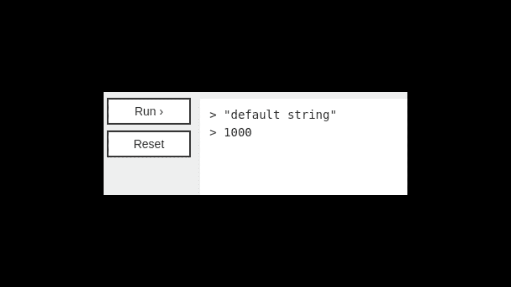
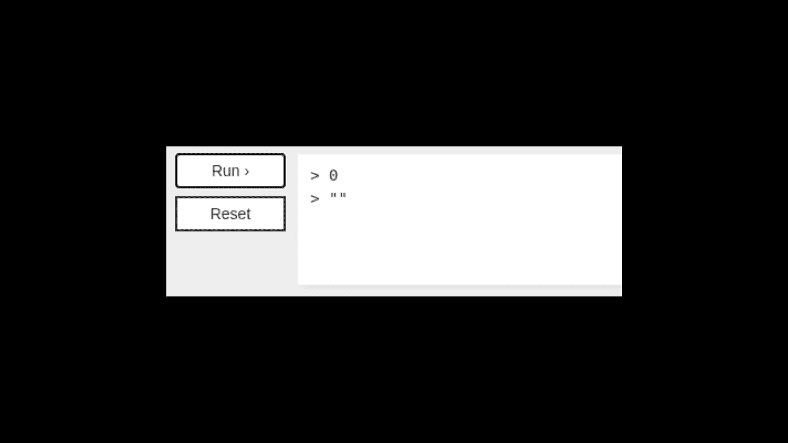

# 问号(？)运算符在 JavaScript 中起作用

> 原文：<https://www.freecodecamp.org/news/how-the-question-mark-works-in-javascript/>

由`?`表示的条件或问号操作符是 JavaScript 中最强大的特性之一。`?`操作符用于条件语句中，当与`:`配对时，可以作为`if...else`语句的紧凑替代。

但是事情并不像看上去那样简单。`?`操作符有三个主要用途，其中两个你可能没用过甚至没听说过。下面我们就来详细了解一下。

## JavaScript 中问号(`?`)的三个主要用途:

1.  三元运算符
2.  可选链接
3.  看涨合并

我们将详细研究每一个操作符，从最常见的方式开始，你将看到`?`操作符被用作三元操作符。

## 1.三元运算符

术语三元意味着由三个项目或部分组成。`?`运算符也被称为三元运算符，因为它不同于其他运算符，如严格等于(`===`)或余数(`%`)，它是唯一一个接受三个操作数的运算符。

从`?`开始，我们在左侧添加一个条件，在右侧添加一个值，当条件为真时返回。然后我们添加一个冒号(`:`)，后跟一个条件为假时返回的值。



三元运算符基本上是传统`if...else`语句的快捷方式。

让我们比较一个三元运算符和一个更长的`if...else`语句:



这里，三元运算符只占用一行代码，而`if...else`占用了七行代码。

使用三元运算符要有效得多，对吗？

## 2.可选链接

2020 年，引入了一个被称为可选链接的令人敬畏的新功能。

为了理解它是如何工作的，想象一下这个场景。

假设您的代码调用了一个不存在的对象属性，这会在运行时触发一个错误。这可能是因为数据库中缺少或未定义的值，或者来自 API:



A common error – `TypeError: Cannot read property ‘salary’ of undefined`

由于可选的链接，您可以在属性名称和下一个属性之间的句点之间插入一个`?`。



这样，它只会返回`undefined`而不是抛出一个难看的错误。

对于 JavaScript 开发人员来说，可选链接确实是一个改变生活的特性。

## 3.无效合并

在某些情况下，您必须为缺少的属性名称或值设置默认值。

例如，假设我们正在创建一个天气应用程序，在这个应用程序中，我们获取温度、湿度、风速、压力、日出和日落的时间以及城市的图片。我们输入了一个地方，比如说*班加罗尔*，但是由于某种原因，它的图像不在数据库中。

当应用程序获取和显示数据时，图片会是空白的，看起来很丑。在这种情况下，我们能做的是为那些没有图像的城市设置默认图片，在我们的例子中是班加罗尔。

这样，当应用程序显示数据时，没有图像的城市将有默认图片。

您可以使用`||`运算符来实现这一点，该运算符称为逻辑 or 运算符:


但是如果您使用`||`来提供一个默认值，如果您认为某些值是可用的(例如，`''`或`0`，您可能会遇到意想不到的行为。

考虑一个场景，其中变量的值为 0 或空字符串。如果我们使用(`||`)，它将被认为是未定义的或空的，并返回一些我们已经固定的默认值。

除了逻辑 OR ( `||`)运算符之外，您还可以使用双问号(`??`)或 Nullish 合并。

我们来举个例子学习一下。

```
const value1 = 0 || 'default string';
console.log(value1);

const value2 = '' || 1000;
console.log(value2);
```

With Logical OR (`||`)

这里，变量值 1 中有“0”和“默认字符串”。如果我们在控制台中记录它的值，我们将得到'默认字符串'，这很奇怪。我们应该得到 0，而不是缺省字符串，因为零不是未定义的或空的。因此，'`||`'在这里做不到这一点。

同样，value2 也是如此。



Output for '`||`'

```
const value1 = 0 ?? 'default string';
console.log(value1);

const value2 = '' ?? 1000;
console.log(value2);
```

With Nullish Coalescing

但是如果我们把'`||`'换成'`??`'，就会得到 0 和一个空字符串，这样就很酷了。



Output for '`??`'

Nullish 合并的工作方式与逻辑 OR 运算符完全一样，除了当左侧值为`undefined`或`null`时，您将获得右侧值。

换句话说，`??`只允许`undefined`和`null`值，不允许空字符串(`''`或`0` s)

## 结论

现在，希望您理解了 JavaScript 中的`?`操作符是如何工作的。它看起来很简单，但它是语言中最强大的字符之一。它以三种不同的方式提供了语法上的好处。

试试吧，让我知道效果如何。

快乐学习！