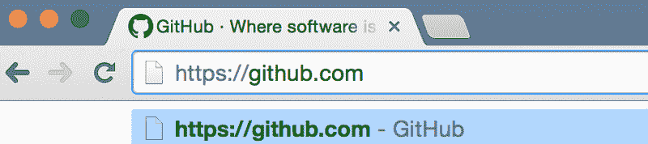
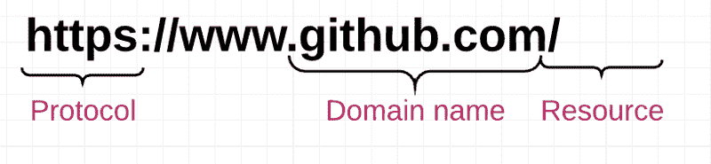
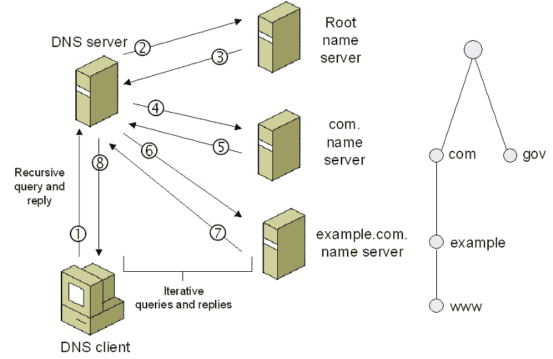
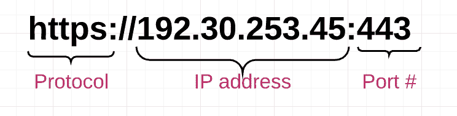
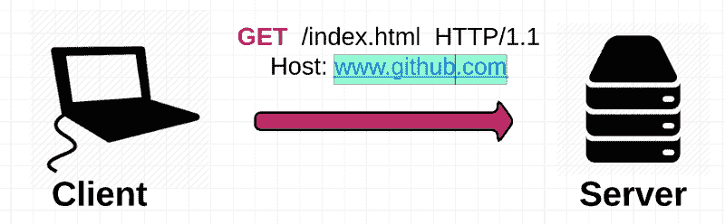
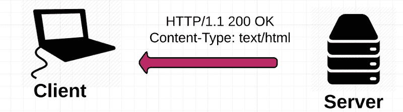
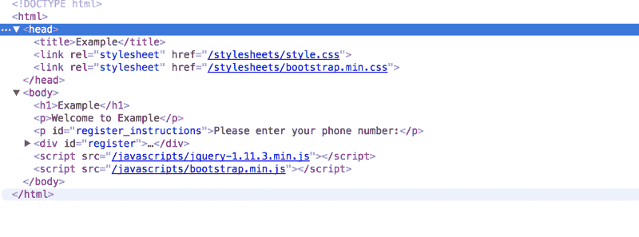
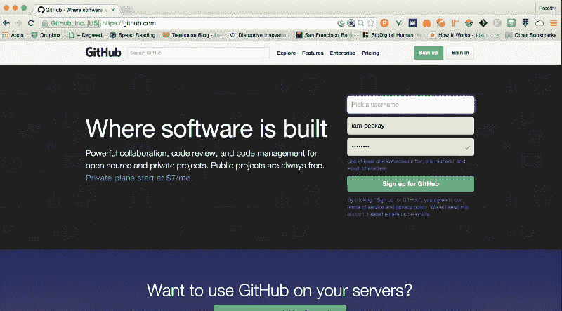
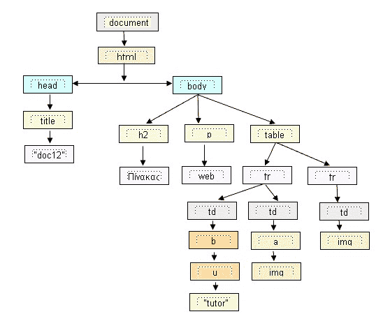

# Web 如何工作:Web 开发新手入门(或者任何人，真的)

> 原文：<https://www.freecodecamp.org/news/how-the-web-works-a-primer-for-newcomers-to-web-development-or-anyone-really-b4584e63585c/>

作者:Preethi Kasireddy

# Web 如何工作:Web 开发新手入门(或者任何人，真的)

如果你刚刚进入 web 开发，很可能你认为你知道 web 是如何工作的——至少在基本水平上。

…但是当你试图解释一个基本的网站是如何工作的时候，却一无所获。IP 地址是什么意思？“客户机-服务器”模式到底是如何工作的？

如今，开发框架非常强大。事实上，它如此强大，以至于我们这些新来者很容易忘记网络是如何工作的。*

我知道我做到了。承认这一点并不丢人:网络是复杂的，只有当你开始在后台设计时，你才会意识到这些基础是多么重要。(无论如何，如果你想制作实际上可以运行的 web 应用程序。)

因此，我决定自己写一份由四部分组成的指南，介绍每个人都应该掌握的令人生畏的基础知识，无论你是刚刚开始从事 web 开发，还是只是对学习感兴趣:

第一部分:网络是如何工作的

第二部分:网络应用的结构

**第三部分:** HTTP 和 REST

第 4 部分:客户端-服务器交互的代码示例

### 基本的网络搜索

让我们从我们以前都去过的地方开始:在浏览器的地址栏中键入“www.github.com ”,然后查看页面加载情况。

尽管这笔交易看起来很简单，但实际上有很多神奇的事情在发生。让我们开始吧。

### 定义 web 的各个部分

理解网络是令人生畏的，因为有很多行话。不幸的是，其中一些术语对于理解这篇文章的其余部分至关重要。

如果你想探究万维网的秘密，以下是需要理解的最重要的术语:

**客户端:**在电脑上运行并连接到互联网的应用程序，如 Chrome 或 Firefox。它的主要作用是接受用户的交互，并把它们转换成对另一台叫做 web 服务器的计算机的请求。虽然我们通常使用浏览器来访问 web，但是您可以将您的整个计算机视为客户机-服务器模型的“客户机”部分。每台客户端电脑都有一个唯一的地址，称为 IP 地址，其他电脑可以使用该地址来识别它。

**服务器:**连接到互联网并拥有 IP 地址的机器。服务器等待来自其他机器(例如客户机)的请求，并对它们做出响应。与也有 IP 地址的计算机(即客户端)不同，服务器安装并运行特殊的服务器软件，告诉它如何响应来自浏览器的传入请求。网络服务器的主要功能是存储、处理和向客户提供网页。有许多类型的服务器，包括 web 服务器、数据库服务器、文件服务器、应用服务器等等。(在本帖中，我们讨论的是 web 服务器。)

**IP 地址:**互联网协议地址。设备(计算机、服务器、打印机、路由器等)的数字标识符。)在 TCP/IP 网络上。互联网上的每台计算机都有一个 IP 地址，用于识别其他计算机并与之通信。IP 地址有四组由小数点分隔的数字(例如 244.155.65.2)。这被称为“逻辑地址”。为了定位网络中的设备，TCP/IP 协议软件将逻辑 IP 地址转换为物理地址。该物理地址(即 MAC 地址)内置于您的硬件中。

**ISP:** 互联网服务提供商。ISP 是客户端和服务器之间的中间人。对于典型的房主来说，ISP 通常是一家“有线电视公司”当你的浏览器收到你去 www.github.com[，](http://www.github.com,)的请求时，它不知道去哪里找 www.github.com[。](http://www.github.com.)因此，ISP 的工作就是进行 DNS(域名系统)查找，询问你试图访问的网站配置了什么 IP 地址。

**DNS:** 域名系统。一个分布式数据库，跟踪计算机的域名和它们在互联网上相应的 IP 地址。现在不要担心“分布式数据库”是如何工作的:只要知道 DNS 的存在，用户就可以输入 www.github.com 的[而不是 IP 地址。](http://www.github.com)

**域名:**用于标识一个或多个 IP 地址。用户使用域名(例如【www.github.com】)访问互联网上的网站。当您在浏览器中键入域名时，DNS 会使用它来查找给定网站的相应 IP 地址。

**TCP/IP:** 传输控制协议/互联网协议。使用最广泛的通信协议。“协议”只是一套标准的规则。TCP/IP 被用作通过网络传输数据的标准。

**端口号:**一个 16 位整数，标识服务器上的一个特定端口，并且总是与一个 IP 地址相关联。它是一种识别服务器上特定进程的方法，网络请求可以转发到该进程。

**主机:**连接到网络的计算机——它可以是客户端、服务器或任何其他类型的设备。每台主机都有唯一的 IP 地址。对于像 www.google.com[这样的网站来说，](http://www.google.com,)主机可以是为网站提供页面服务的网络服务器。主机和服务器之间经常有些混淆，但是请注意它们是两回事。服务器是一种主机——它们是一种特定的机器。另一方面，主机可以指提供托管服务来维护多个 web 服务器的整个组织。从这个意义上说，您可以从主机上运行服务器。

**HTTP:** 超文本传输协议。web 浏览器和 web 服务器用于通过 Internet 相互通信的协议。

**URL:** 统一资源定位符。URL 标识特定的 web 资源。一个简单的例子是 https://github.com/someone.URL 指定协议(“https”)、主机名(github.com)和文件名(某人的个人资料页面)。用户可以通过 HTTP 从域名为 github.com 的网络主机获得由该 URL 标识的 web 资源。(绕口令多吗？！)

### 从代码到网页的旅程

好了，现在我们已经有了基本的定义，让我们浏览一下 Github 搜索，看看我们如何从地址栏中输入的 URL 到运行的网页:

1)您在浏览器中键入一个 URL

2)浏览器解析 URL 中包含的信息。这包括协议(“https”)、域名(“github.com”)和资源(“/”)。在这种情况下，什么都没有了”。com”来指示特定的资源，这样浏览器就知道只检索主(索引)页面

3)浏览器与您的 ISP 通信，对托管[www.github.com 的 web 服务器的 IP 地址进行 DNS 查找。](http://www.github.com.)DNS 服务将首先联系根域名服务器，根域名服务器查看 https://www.github.com 的[，并回复“域名服务器”的 IP 地址。com”顶级域名。该地址将被发送回您的 DNS 服务。DNS 服务对“进行另一次扩展。并向它询问 https://www.github.com](https://www.github.com)[的地址。](https://www.github.com.)

*来源:[https://technet.microsoft.com/en-us/library/bb962069.aspx](https://technet.microsoft.com/en-us/library/bb962069.aspx)*

ISP 收到目的服务器的 IP 地址后，会将其发送到您的 web 浏览器

你的浏览器从 URL 中获取 IP 地址和给定的端口号(HTTP 协议默认为端口 80，HTTPS 默认为端口 443)并打开一个 TCP 套接字连接。至此，您的 web 浏览器和 web 服务器终于连接上了。

你的网络浏览器向网络服务器发送一个 HTTP 请求，请求访问 www.github.com[的主 HTML 网页。](http://www.github.com.)

GET request from Client

web 服务器接收请求并寻找 HTML 页面。如果该页面存在，web 服务器会准备响应并将其发送回您的浏览器。如果服务器找不到请求的页面，它将发送一条 HTTP 404 错误消息，表示“未找到页面”。

Server response

8)您的 web 浏览器获取它接收到的 HTML 页面，然后对其进行全面的从头到脚的扫描，查找列出的其他资产，如图像、CSS 文件、JavaScript 文件等。

index.html page

9)对于列出的每个资产，浏览器重复上面的整个过程，为每个资源向服务器发出额外的 HTTP 请求。

10)一旦浏览器加载完 HTML 页面中列出的所有其他资源，该页面将最终加载到浏览器窗口中，并且连接将关闭

Github

### 穿越互联网深渊

值得注意的一点是，当你请求信息时，信息是如何传递的。当你发出一个请求时，这些信息被分解成许多称为数据包的小块。每个数据包都标有 TCP 报头和 IP 报头，其中 TCP 报头包括源端口号和目的端口号，IP 报头包括源 IP 地址和目的 IP 地址，用于标识数据包。然后，数据包通过以太网、WiFi 或蜂窝网络传输，并被允许在任何路线上传输，需要多少跳就跳多少跳，以到达最终目的地。

(实际上，我们并不关心数据包是如何到达目的地的，重要的是它们能够安全到达目的地！)一旦数据包到达目的地，它们会被重新组装并作为一个整体发送出去。

那么，所有的数据包如何知道如何到达目的地而不丢失呢？

答案是 TCP/IP。

TCP/IP 是一个由两部分组成的系统，作为互联网的基本“控制系统”。IP 代表互联网协议；它的工作是使用每个数据包上的 IP 报头(即 IP 地址)将数据包发送和路由到其他计算机。第二部分是传输控制协议(TCP ),它负责将消息或文件分成更小的数据包，使用 TCP 报头将数据包路由到目的计算机上的正确应用程序，如果数据包在途中丢失，则重新发送数据包，并在数据包到达另一端后按正确的顺序重新组装数据包。

### 画最后一幅画

但是等等——工作还没有完成！现在你的浏览器已经拥有了构成网站的资源(HTML、CSS、JavaScript、图片等)，它必须经过几个步骤才能将这些资源以人类可读的网页形式呈现给你。

您的浏览器有一个负责显示内容的渲染引擎。呈现引擎接收小块资源的内容。然后有一个 HTML 解析算法告诉浏览器如何解析资源。

解析后，它会生成 DOM 元素的树形结构。DOM 代表文档对象模型，它是如何表示位于 HTML 文档中的对象的约定。每个文档的这些对象——或“节点”——都可以使用 JavaScript 之类的脚本语言进行操作。

A DOM tree

一旦构建了 DOM 树，就对样式表进行解析，以了解如何设计每个节点的样式。使用这些信息，浏览器向下遍历 DOM 节点，并计算每个节点的 CSS 样式、位置、坐标等。

一旦浏览器有了 DOM 节点和它们的样式，它就*最终*准备好相应地将页面绘制到您的屏幕上。结果是:你在网上看过的所有东西。

### 网络是复杂的，但是你刚刚完成了最难的部分

简而言之，这就是网络。迷路了？我们都是，但是如果你读到这里，你已经完成了最难的部分。显然，为了向您展示全局，我跳过了一些细节；但是如果你能把上述事件的基本顺序想清楚，填写细节将是小菜一碟。

查看第 2 部分，在这里我们将讨论一个基本的 web 应用程序的结构。:)