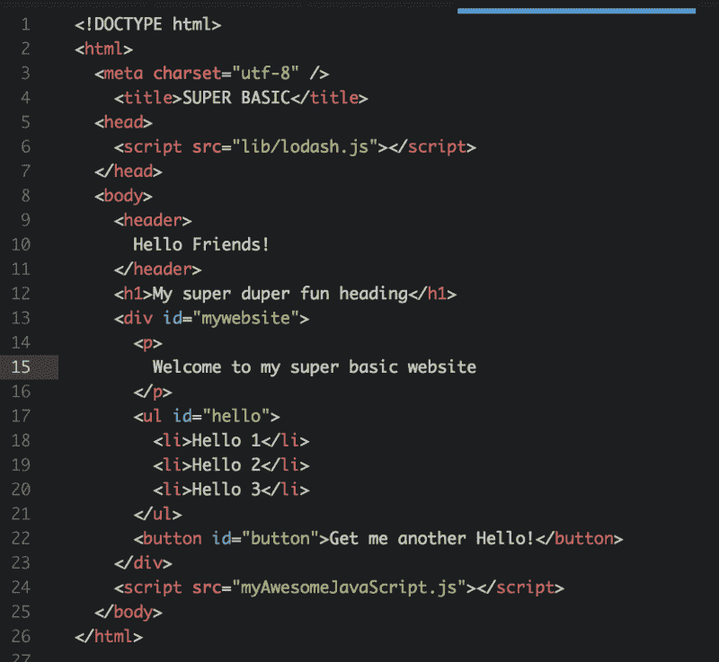
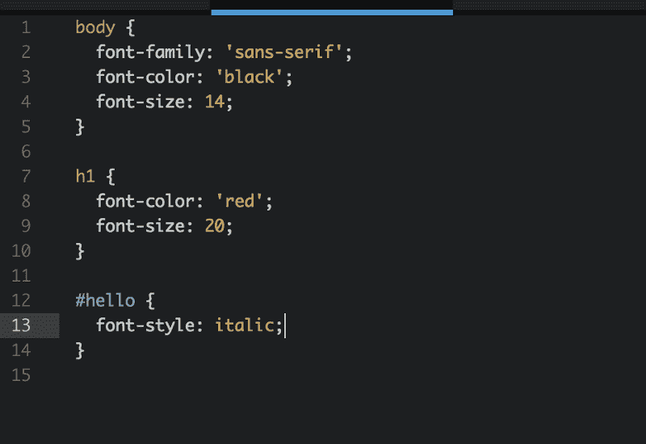
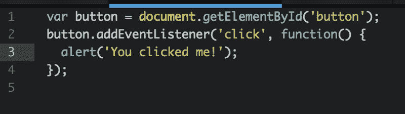
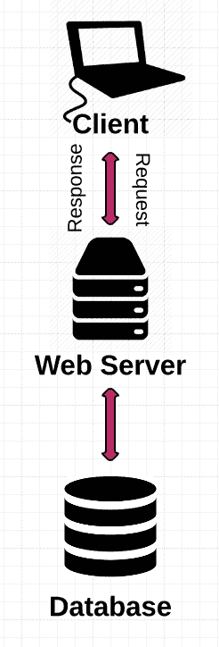
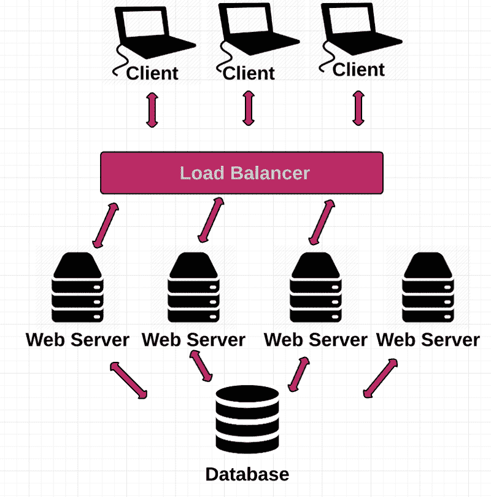
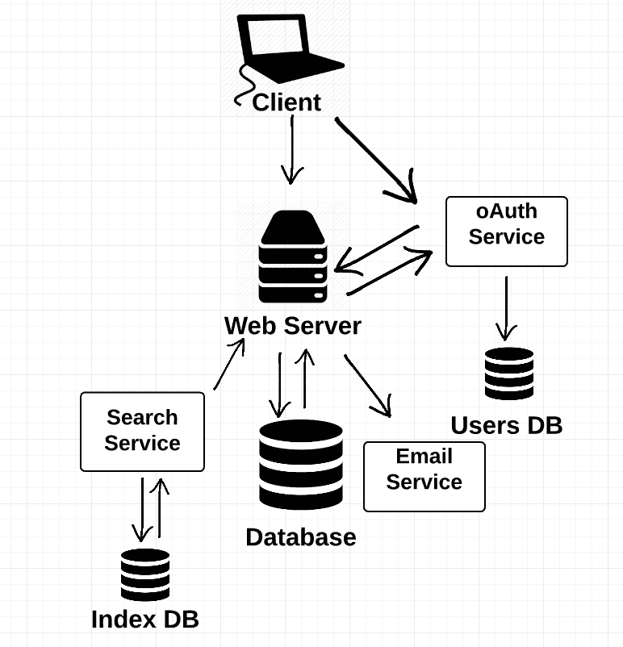
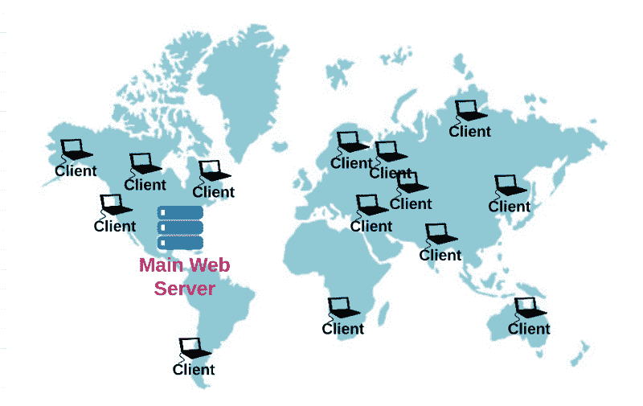
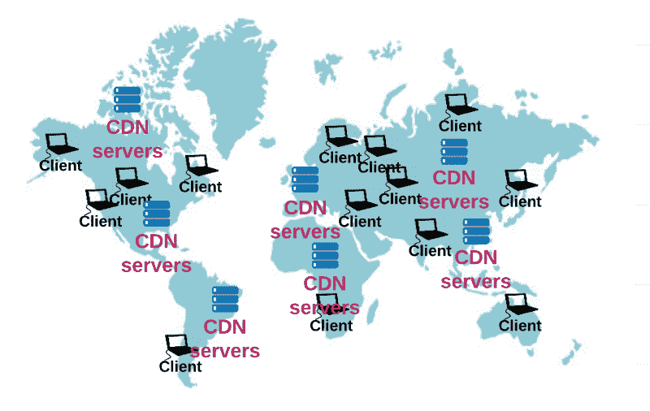

# Web 如何工作第二部分:客户机-服务器模型& Web 应用程序的结构

> 原文：<https://www.freecodecamp.org/news/how-the-web-works-part-ii-client-server-model-the-structure-of-a-web-application-735b4b6d76e3/>

作者:Preethi Kasireddy

# Web 如何工作第二部分:客户机-服务器模型& Web 应用程序的结构

在我的[上一篇](https://medium.freecodecamp.com/how-the-web-works-a-primer-for-newcomers-to-web-development-or-anyone-really-b4584e63585c#.8nc8nkx2u)文章中，我们深入探讨了网络的基本工作原理，包括客户端(你的电脑)和服务器(另一台响应客户端网站请求的电脑)之间的交互。

这篇文章是四篇系列文章的第二篇，让我们双击了解基本 web 应用程序的客户端、服务器和其他部分是如何配置的，以使您的 web 浏览体验成为可能。

### 客户机-服务器模式

这种客户机和服务器通过网络进行通信的想法被称为“客户机-服务器”模型。这使得浏览网站(比如这个)和与网络应用程序(比如 Gmail)互动成为可能。

客户机-服务器模型实际上只是描述 web 应用程序中客户机和服务器之间交换关系的一种方式——就像你可能用“男朋友”和“女朋友”来描述你的个人关系一样。这是信息如何从一端传递到另一端的细节，画面变得复杂。

### 基本的 Web 应用程序配置

配置 web 应用程序有数百种方法。也就是说，大多数都遵循相同的基本结构:客户机、服务器和数据库。

#### 客户

客户端是用户与之交互的对象。所以“客户端”代码负责用户实际看到的大部分内容。这包括:

1.  定义网页的**结构**
2.  设置网页的**观感**
3.  实现响应**用户交互**(点击按钮、输入文本等)的机制。)

**结构:**你的网页的布局和内容都是由 HTML 定义的(现在说到 web apps 一般都是 HTML 5，不过那是后话了。)

HTML 代表超文本标记语言。它允许你用 HTML 标签描述文档的基本物理结构。每个 HTML 标签描述了文档中的一个特定元素。

例如:

*   “

    # ”标签内的内容描述了标题。

*   “

    ”标签内的内容描述了一个段落。

*   “
*   诸如此类…

web 浏览器使用这些 HTML 标记来确定如何显示文档。

**观感:**为了定义网页的观感，web 开发人员使用 CSS，它代表级联样式表。CSS 是一种语言，它允许你描述 HTML 中定义的元素应该如何样式化，允许改变字体、颜色、布局、简单动画和其他表面元素。

您可以像这样为上面的 HTML 页面设置样式:

**用户交互:**最后，JavaScript 开始处理用户交互。

例如，如果您想在用户单击您的按钮时做一些事情，您可以这样做:

一些用户交互，就像上面的，可以在不接触服务器的情况下处理——因此有了“客户端 JavaScript”这个术语其他交互需要您将请求发送到服务器来处理。

例如，如果一个用户在一个线程上发表了评论，您可能希望将该评论存储在您的数据库中，以便将所有的 riff-raff 组织在一个地方。因此，您可以用新的注释和用户 ID 向服务器发送请求，服务器会监听这些请求并相应地处理它们。

在本系列的下一部分中，我们将更深入地研究 HTTP 请求-响应。

#### 服务器

web 应用程序中的服务器监听来自客户端的请求。当您设置一个 HTTP 服务器时，您设置它监听一个端口号。端口号总是与计算机的 IP 地址相关联。

你可以把端口想象成每台电脑上独立的通道，你可以用它们来执行不同的任务:一个端口可以浏览 www.facebook.com，而另一个端口可以接收你的电子邮件。这是可能的，因为每个应用程序(web 浏览器和电子邮件客户端)使用不同的端口号。

一旦您设置了一个 HTTP 服务器来监听一个特定的端口，该服务器就会等待客户端请求到达该特定的端口，执行请求所声明的任何操作，并通过 HTTP 响应发送任何请求的数据。

#### 数据库

数据库是 web 架构的基础——我们大多数人都害怕去那里，但它们对一个坚实的基础至关重要。数据库是存储信息的地方，以便于访问、管理和更新。

例如，如果你正在建立一个社交媒体网站，你可能会使用一个数据库来存储关于你的用户、帖子和评论的信息。当访问者请求页面时，插入页面的数据来自网站的数据库，允许我们在脸书等网站或 Gmail 等应用程序上理所当然的实时用户交互。

#### 那都是乡亲们！(嗯，有点……)

就这么简单。我们刚刚浏览了一个 web 应用程序的所有基本功能。

### 如何扩展一个简单的 Web 应用程序

上述配置非常适合简单的应用程序。但是随着应用程序的增长，单个服务器将没有能力处理来自访问者的成千上万的并发请求。

为了扩展以满足这些高容量，我们可以做的一件事是在一组后端服务器上分发传入流量。

这就是事情变得有趣的地方。您有多台服务器，每台都有自己的 IP 地址。那么，域名服务器(DNS)如何知道将流量发送到应用程序的哪个实例呢？

简单的回答是不会。管理应用程序所有这些独立实例的方法是通过一种叫做负载平衡器的东西。

负载平衡器充当流量警察，以最快、最有效的方式在服务器之间路由客户端请求。

因为您不能广播所有服务器实例的 IP 地址，所以您创建一个虚拟 IP 地址，它是您公开广播给客户机的地址。这个虚拟 IP 地址指向您的负载平衡器。所以当你的网站有 DNS 查询时，它会指向负载平衡器。然后，负载平衡器将流量实时分配给各种后端服务器。

您可能想知道负载平衡器如何知道将流量发送到哪个服务器。答案是:算法。

一种流行的算法——循环法——包括在服务器群(所有可用的服务器)中平均分配传入的请求。如果您的所有服务器都具有相似的处理速度和内存，您通常会选择这种方法。

使用另一种算法“最少连接数”,下一个请求将被发送到活动连接数最少的服务器。

根据您的需要，您可以实现更多的算法。

所以现在流程看起来是这样的:

### 服务

好了，我们通过创建服务器池和一个负载平衡器来管理它们，从而解决了流量问题。很好用，对吧？

…但是，随着应用程序的增长，仅仅复制一堆服务器仍然会带来问题。当您向应用程序添加更多功能时，您必须在它继续增长的同时维护相同的整体服务器。为了解决这个问题，我们需要一种方法来分离服务器的功能。

这就是服务概念的由来。服务只是另一个服务器，只是它只与其他服务器交互，而不是与客户端交互的传统 web 服务器。

每个服务都有一个独立的功能单元，比如授权用户或提供搜索功能。服务允许您将单个 web 服务器分成多个服务，每个服务执行一个独立的功能。

将单个服务器分解成许多服务的主要好处是，它允许您完全独立地扩展服务。

这里的另一个优势是，它允许公司内的团队独立工作于特定的服务，而不是让 10 个、100 个甚至 1000 个工程师在一个单一的服务器上工作，这很快成为项目管理的噩梦。

这里有一个提示:当您扩展应用程序以添加越来越多的服务器时，负载平衡器以及后端服务器和服务池的概念变得非常具有挑战性。像会话持久性这样的事情变得特别棘手——比如如何在会话期间处理从一个客户端向同一服务器发送多个请求——以及如何部署您的负载平衡解决方案。在这篇文章中，我们将把那些高级的话题放在一边。

### 内容交付网络

以上所有方法都非常适合扩展流量，但是您的应用程序仍然集中在一个位置。当您的用户开始从国家的其他地方(或世界的另一边)访问您的站点时，他们可能会遇到更长的加载时间，因为客户端和服务器之间的距离增加了。毕竟，我们谈论的是“万维网”，而不是“局域互联网”:)

解决这个问题的一个流行策略是使用内容交付网络(CDN)。CDN 是一个由部署在许多数据中心的“代理”服务器组成的大型分布式系统。代理服务器只是充当客户端和服务器之间中介的服务器。

拥有大量分布式流量的公司可以选择向 CDN 公司付费，让他们使用 CDN 的服务器将内容交付给最终用户。Akamai 就是 CDN 的一个例子。Akamai 在世界各地的战略地理位置拥有数千台服务器。

让我们比较一下一个网站在有和没有 CDN 的情况下是如何工作的。

正如我们在第 1 节中谈到的，对于一个典型的网站，URL 的域名被转换为主机服务器的 IP 地址。

但是，如果客户使用 Akamai，URL 的域名将被转换为 Akamai 拥有的边缘服务器的 IP 地址。Akamai 然后将网络内容交付给客户的用户，而无需接触客户的服务器。

Akamai 能够通过存储经常使用的元素的副本来做到这一点，如来自客户服务器的 HTML、CSS、软件下载和媒体对象。

主要目标是让你的网站内容更贴近你的用户。如果内容不需要传播很远才能到达用户，这意味着更低的延迟，从而减少加载时间。

哒哒！更快的网站:)

### 再跟我说一遍。

接下来，阅读[第 3 部分](https://medium.freecodecamp.com/how-the-web-works-part-iii-http-rest-e61bc50fa0a#.vbrmrnihn),我们将详细了解 HTTP 和 REST！:)