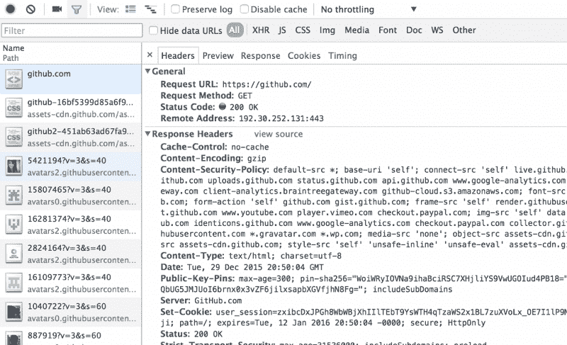

# 网络如何工作第三部分:HTTP & REST

> 原文：<https://www.freecodecamp.org/news/how-the-web-works-part-iii-http-rest-e61bc50fa0a/>

作者:Preethi Kasireddy

# 网络如何工作第三部分:HTTP & REST

我们在第一部分回顾了基本的 web 架构，在第二部分的[中讨论了 web 应用结构。现在是时候卷起袖子开始研究第三部分了:更仔细地研究 HTTP 和 REST。](https://medium.freecodecamp.com/how-the-web-works-part-ii-client-server-model-the-structure-of-a-web-application-735b4b6d76e3)

理解 HTTP 对于 web 开发人员来说是至关重要的，因为它促进了 web 应用程序中的信息流——允许更好的用户交互和改进的站点性能。

### 什么是 HTTP？

在客户机-服务器模型中，客户机和服务器以“请求-响应”的消息传递模式交换消息:客户机发送请求，服务器返回响应。

跟踪这些消息比听起来要复杂得多，所以客户机和服务器遵循一种通用语言和一套规则，这样它们就知道会发生什么。这种语言或“协议”被称为 HTTP。

HTTP 协议定义了语法(数据格式和编码)、语义(与语法相关的含义)和时间(速度和顺序)。客户机和服务器之间交换的每个 HTTP 请求和响应都被认为是一个单独的 **HTTP 事务**。

### HTTP:大招

在我们深入细节之前，有一些关于 HTTP 的事情值得注意。

首先，HTTP 是基于文本的，这意味着客户机和服务器之间交换的消息是一些文本。每条消息包含两个部分:头部和主体。

其次，HTTP 是一个应用层协议，这意味着它只是一个抽象层，标准化主机如何通信。HTTP 本身并不传输数据。它仍然依赖于底层的 TCP/IP 协议将请求和响应从一台机器传递到另一台机器。

(提醒一下，TCP/IP 是一个由两部分组成的系统，其功能相当于互联网的基本“控制系统”。有关 TCP/IP 的更多信息，请查看第一部分

最后，您可能在浏览器的地址栏中看到了“HTTPS”协议，并想知道 HTTP 是否与 HTTP+“S”是一回事。简短的回答是 sorta，略有不同。

普通的 HTTP 请求或响应是不加密的，容易受到各种类型的安全攻击。另一方面，HTTPS 是一种更安全的通信方式，它使用加密来保证安全。它代表 HTTP over TLS/SSL。

SSL 是一种安全协议，允许客户端和服务器以安全的方式在网络上通信，以防止消息在网络上传输时被窃听和篡改。

客户端通常使用一个特殊的端口号来指示它是否需要 TLS/SSL 连接:443。一旦客户机和服务器同意使用 TLS/SSL 进行通信，它们就通过所谓的“TLS 握手”来协商有状态连接然后，客户端和服务器建立秘密的会话密钥，当它们相互交谈时，可以用这些密钥来加密和解密消息。

许多像谷歌和脸书这样的主要网站都使用 HTTPS——毕竟，它可以在网络上保护你的密码、个人信息和信用卡信息的安全。

### HTTP:精细的笔画

有了这些基础知识，让我们稍微深入一点 HTTP 的结构。

我们可以从访问[https://www.github.com](https://www.github.com)开始，与 GitHub 服务器进行交流。如果你使用的是 Chrome 或者 Firefox，并且安装了 Firebug 扩展，你可以通过“网络”标签来调查 HTTP 请求的细节。如果你打开了这个，那么在你的地址栏中输入它，然后访问 www.github.com 的，你应该会看到这样的内容:

然后在左边的面板上，点击第一个路径“github.com”，你现在应该看到这个:

### HTTP 请求标头

HTTP 头通常包含元数据(关于数据的数据)。元数据包括请求类型(GET vs. POST vs. PUT vs. DELETE)、路径、状态代码、内容类型、用户代理、cookie、POST 主体(有时)等等。

让我们以 Github 为例，从“response headers”部分开始，更仔细地看看这个消息头最重要的部分:

*   **请求网址:https://github.com/**
*   我们请求的 URL
*   **请求方式:获取**
*   正在使用的 HTTP 方法的类型。在我们的例子中，我们的浏览器说:“嘿，Github 的服务器，让我进入你的主页。”
*   **状态代码:200 OK**
*   服务器告诉客户端其请求结果的标准化方式。状态代码 200 表示服务器成功地找到了资源，并且正在将它发送给您。
*   **远程地址:192.30.252.129:443**
*   我们访问的 GitHub 网站的 IP 地址和端口号。注意，它是端口# 443(这意味着我们使用 HTTPS 而不是 HTTP)。
*   **内容编码:gzip**
*   我们收到的资源的编码。在我们的例子中，Github 的服务器告诉我们它发回的内容是压缩的。Github 可能正在压缩文件，这样你可以有更快的下载时间。
*   **内容类型:文本/HTML；charset=utf-8**
*   指定响应正文中数据的表示形式，包括类型和子类型。类型描述了数据的类型，而子类型指定了该数据类型的特定格式。在我们的例子中，文本以 HTML 的形式返回
*   第二部分指定了 HTML 文档的字符编码。最常见的是 UTF-8，如上所述。

还有一堆头信息，客户端必须发送这些信息，以便服务器知道如何响应。查看“请求标题”部分:

*   **用户代理:Mozilla/5.0(Macintosh；英特尔 Mac OS X 10 _ 10 _ 5)apple WebKit/537.36(KHTML，像壁虎)Chrome/47 . 0 . 2526 . 73 Safari/537.36**
*   代表用户的软件。有时候网站需要知道它是如何被浏览的。因此，浏览器发送这个用户代理字符串，服务器可以用它来确定正在使用什么来访问一个网站
*   **接受-编码:gzip，deflate，sdch**
*   指定浏览器愿意接受的内容编码。我们可以看到 gzip 被列出，这就是为什么 Github 的服务器能够以 gzip 格式发送内容给我们。
*   **接受-语言:en-US，en；q=0.8**
*   描述我们希望网页使用的语言。在我们的例子中，“en”代表英语。
*   **主持人:github.com**
*   不言自明:)
*   **cookie:_ octo = GH 1 . 1 . 491617779 . 1446477115；logged _ in = yes；dotcom _ user = iam-peek；****_ GH _ sess =某些伪方法学的事物流形学的事物流形学的事物流形学的事物；user _ session = fakesomethodologake something gfalogy；_ ga=9389479283749823749tz=america % 2 flos _ 洛杉矶 _**
*   web 服务器可以存储在用户机器上并在以后检索的一段文本。信息存储为名称-值对。例如，Github 为我的请求存储的名称-值对之一是“dotcom_user=iam-peekay”，它通知 Github 我的 userid 是 iam-peekay。

#### TL；dr:所有这些名称-值对是怎么回事？

长话短说，我们留下了许多名称-值对。但是这些名称-值对是如何创建的呢？

每当您的浏览器访问某个网站时，它都会在您的电脑上查找该网站之前设置的 cookie 文件。

因此，如果我访问[www.github.com，](http://www.github.com,)我的浏览器会寻找 GitHub 保存在我硬盘上的 cookie 文件。如果它找到一个 cookie 文件，它将在请求头中发送所有的名称-值对。

GitHub 的网络服务器现在可以以许多不同的方式使用 cookie 数据，例如根据我存储的用户偏好呈现内容，计算我访问他们网站的次数。

如果浏览器找不到 cookie 文件，要么是因为该站点以前从未被访问过，要么是用户阻止或删除了它，浏览器不会发送任何 cookie 数据。

在这种情况下，GitHub 的服务器创建一个新的 ID 作为名称-值对，以及它想要的任何其他名称-值对，并通过 HTTP 头将其发送到我的计算机——然后我的计算机将其存储在硬盘上。

### HTTP 正文

正如您在上面看到的，服务器保存了它需要与客户机通信的大部分重要的“元数据”(关于数据的数据)。

现在到身体上。

正如你可能猜到的，正文是消息的主体。根据请求的类型，它可以为空。

在我们的例子中，您可以在“Response”选项卡中看到正文。由于我们向[www.github.com 发出了 GET 请求，](http://www.github.com,)正文包含了[www.github.com 的 HTML 页面内容。](http://www.github.com.)

…当然，这对于显示该页面非常重要。

#### 附加练习

我希望这能让您更好地理解 HTTP 的结构。实际上，您可以查看浏览器请求的所有其他资产(图像、JavaScript 文件等。)当你参观 www.github.com 的时候。

至此，让我们来看看客户机可以启动的各种类型的 HTTP 方法。

### HTTP 方法

HTTP 动词或方法告诉服务器如何处理 URL 所标识的数据。URL 总是标识特定的资源。当客户机结合使用 URL 和 HTTP 动词时，这会告诉服务器需要对哪个资源执行什么操作。

URL 的示例包括:

*   **获取 http://www.example.com/users**T2(获取所有用户)
*   **帖子**【http://www.example.com/users/a-unique-id】T2(创建新用户)
*   **放**【http://www.example.com/comments/a-unique-id】T2(更新一条评论)
*   **删除 http://www.example.com/comments/a-unique-id**T2(删除一条评论)

当客户端发出请求时，它会使用这些动词之一来指示请求的类型。最重要的是 GET、POST、PUT 和 DELETE。还有其他方法，如 HEAD 和 OPTIONS，但它们比较少见，所以我们在这篇文章中将跳过这些方法。

#### **获取**

GET 是最常用的方法。它用于从服务器读取给定 URL 的信息。

GET 请求是只读的，这意味着永远不应该在服务器上修改数据——服务器应该不加修改地检索数据。这样，GET 请求就被认为是安全的操作，因为调用它一次，或者调用它 20 次，效果都是一样的。

另外，GET 请求是**幂等的**。这意味着向同一个 URL 提交多个 GET 请求应该与只提交一个 GET 请求产生完全相同的效果，因为 GET 请求只是向服务器请求数据，并不实际改变服务器上的任何数据。

如果成功找到了资源，GET 请求以状态代码 200 (OK)响应，如果没有找到资源，则以状态代码 404 (NOT FOUND)响应。(因此，当访问失效或错误输入的 URL 时，错误消息称为“404 页面”。)

GitHub’s famous Star Wars-themed 404 page.

#### **发帖**

POST 用于创建新的资源，比如注册表单。当您想要创建某个其他父资源(http://example.com/users)的从属资源(例如新用户)时，可以使用 POST。您对这个由 URL 标识的父资源的发布，服务器处理新资源并将其与父资源相关联。

POST 既不安全也不幂等。这是因为发出两个或更多相同的 POST 请求可能会导致创建两个新的相同资源。

POST 请求用一个状态代码 201 (CREATED)和一个 location 头响应，location 头带有指向新创建的资源的链接。

#### **放**

PUT 用于使用请求体中的信息更新 URL 所标识的资源。PUT 也可以用来创建新的资源。PUT 请求被认为是不安全的操作，因为它们会修改服务器上的状态。然而，它是幂等的，因为更新资源的多个相同的 PUT 请求应该具有与第一个相同的效果。

如果成功更新了资源，PUT 请求将以状态代码 200 (OK)响应，如果没有找到资源，则以状态代码 404 (NOT FOUND)响应。

#### **删除**

DELETE 用于删除由 URL 标识的资源。删除请求是幂等的，因为如果你删除一个资源，它就被删除了，即使你发出多个相同的删除请求，结果也是一样的:一个被删除的资源。

如果对同一个资源多次发送删除请求，很可能会得到 404 错误消息，因为一旦资源被删除，服务器将无法找到它。

如果成功删除，删除请求会以 200 (OK)状态代码响应，如果找不到要删除的资源，则以 404(未找到)响应。

如果处理失败，服务器出错，上述所有请求都会返回 500(内部服务器错误)。

### 休息到底是什么？

在我们结束之前，我还有最后一个术语要讲:休息。

您可能以前听说过“RESTful 应用程序”这个术语。理解这意味着什么是很重要的，因为如果您使用 HTTP 在客户端和服务器之间进行通信，遵循 REST 指南是有益的。(事实上，我们上面定义的 HTTP 动词代表了 REST 的大部分内容。)

REST 代表“代表性状态转移”这是一种设计应用程序的架构风格。

基本思想是，您使用“无状态”、“客户机-服务器”、“可缓存”协议在机器之间进行调用——通常，这种协议是 HTTP。这只是一种奇特的说法，REST 为您提供了一组设计应用程序的约束。这些约束有助于提高系统的性能、可伸缩性、简单性、可修改性、可见性、可移植性和可靠性。

约束的完整列表很长，你可以在这里阅读更多相关内容[。为了这篇文章，我想双击两个最重要的:](https://en.wikipedia.org/wiki/Representational_state_transfer)

1.  统一接口(Uniform interface):这个约束告诉你如何以一种简化和解耦架构的方式定义客户机和服务器之间的接口。上面写着:

*   资源在请求中必须是可识别的(例如，通过使用 URI 中的资源标识符)。资源(例如数据库中的数据)是定义资源表示(例如 JSON、HTML)的数据。资源和资源表示是不同的东西——客户端只与资源表示进行交互。
*   客户端必须有足够的信息来使用资源的表示来操作服务器上的资源。
*   客户机和服务器之间交换的每条消息都需要是自描述的，带有如何处理消息的信息。
*   客户端必须使用 HTTP 主体内容、HTTP 请求头、查询参数和 URL 发送状态数据。服务器必须使用 HTTP 正文内容、响应代码和响应头发送状态数据。
*   注意:我们上面描述的 HTTP 动词构成了这个“统一接口”约束的主要部分，因为它们代表了发生在资源上的统一动作。

**2。无状态**:这个约束表示处理客户机请求所需的所有状态数据必须包含在请求本身(URL、查询参数、HTTP 主体或 HTTP 头)中，并且服务器必须通过响应本身(HTTP 头、状态代码和 HTTP 响应主体)将所有必要的状态数据发送回客户机。

**旁注**:状态——或应用程序状态——是服务器完成请求所必需的数据。

这意味着对于每个请求，我们来回重发状态信息，这样服务器就不必维护、更新和发送状态。

有了这样一个无状态系统，应用程序的可伸缩性就大大提高了，因为服务器不必担心在多个请求期间维护相同的会话状态。获取状态数据所需的一切都可以在请求和响应本身中获得。

### 结束语

唷！HTTP 远不简单。但是正如您所看到的，它是客户机-服务器关系的一个重要组成部分。

制作 RESTful 应用程序至少需要对 HTTP 有一个基本的了解。有了这些内容，您就可以在下一个编码项目中破解客户机-服务器通信的奥秘了。