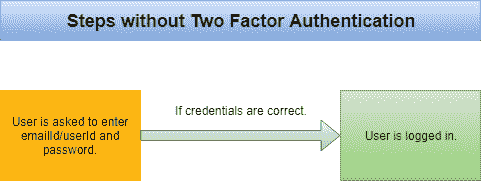
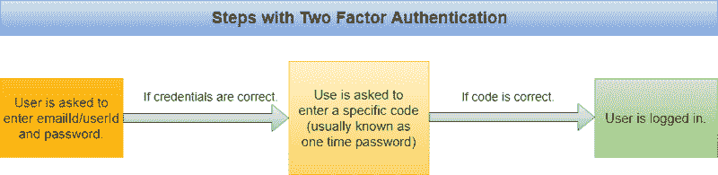

# 基于时间的一次性密码如何工作，以及为什么应该在应用程序中使用它们。

> 原文：<https://www.freecodecamp.org/news/how-time-based-one-time-passwords-work-and-why-you-should-use-them-in-your-app-fdd2b9ed43c3/>

普拉卡什·夏尔马

# 基于时间的一次性密码如何工作，以及为什么应该在应用程序中使用它们。


Photo by [William Iven](https://unsplash.com/photos/SpVHcbuKi6E?utm_source=unsplash&utm_medium=referral&utm_content=creditCopyText) on [Unsplash](https://unsplash.com/search/photos/security?utm_source=unsplash&utm_medium=referral&utm_content=creditCopyText)

随着网络安全威胁的增加，升级 web 应用程序的安全标准变得越来越有必要。你需要确保你的用户的账户是安全的。

如今，许多在线网络应用程序都要求用户为他们的帐户增加一层额外的安全措施。他们通过启用双因素身份认证来做到这一点。实施二元身份认证有多种方法，TOTP(基于时间的一次性密码算法)身份认证就是其中之一。

本文解释了它是什么，以及如何和为什么使用它。但在理解这一点之前，我们先来简单了解一下双因素身份认证是什么意思。

### 什么是双因素身份认证？

双因素身份验证(或多因素身份验证)只是用户帐户的额外安全层。这意味着，启用双因素身份认证后，用户必须再经历一个步骤才能成功登录。例如，登录帐户的通常步骤是:



但是启用双因素身份认证后，步骤如下所示:



因此，这为登录过程增加了一个步骤。这种方法更安全，因为罪犯无法访问用户的帐户，除非他们能够访问用户的常规密码和一次性密码。

目前，有两种广泛使用的方法来获取一次性密码:

1.  **基于短信:**在这种方法中，用户每次登录时，都会收到一条发送到其注册电话号码的短信，其中包含一次性密码。
2.  **TOTP:**在这种方法中，在启用双因素身份验证的同时，要求用户使用特定的智能手机应用程序扫描 QR 图像。
    然后，该应用程序继续为用户生成一次性密码。

基于 SMS 的方法不需要任何解释。这很简单，但是它也有自己的问题，比如每次登录都要等待短信，安全问题等等。基于 TOTP 的方法越来越受欢迎，因为它比基于 SMS 的方法更有优势。让我们来理解一下基于 TOTP 的方法是如何工作的。

### 基于 TOTP 的方法是如何工作的

在理解这个之前，我们先来讨论一下这个方法会为我们解决什么问题。

通过使用 TOTP 方法，我们通过智能手机应用程序在用户端(而不是服务器端)创建一次性密码。

这意味着用户始终可以访问他们的一次性密码。因此，它可以防止服务器在用户每次尝试登录时发送文本消息。

此外，生成的密码在一定时间间隔后会发生变化，因此它的行为类似于一次性密码。

太好了！现在让我们理解 TOTP 方法的工作原理，并尝试自己实现上面的解决方案。我们这里的要求是在用户端创建一个密码，并且该密码应该不断变化。

以下是实现该解决方案的一种方法:

```
When the user enables two factor authentication:
```

```
1\. Backend server creates a secret key for that particular user.2\. Server then shares that secret key with the user’s phone application.3\. Phone application initializes a counter.4\. Phone application generate a one time password using that secret key and counter.5\. Phone application changes the counter after a certain interval and regenerates the one time password making it dynamic.
```

这应该可行，但有三个主要问题:

1.  应用程序如何使用密钥和计数器生成一次性密码？
2.  计数器将如何更新？web 服务器如何跟踪计数器？
3.  服务器将如何与手机应用程序共享密钥？

第一个问题的解决方案定义在 HOTP 算法中。

### 了解 HOTP:

HOTP 代表“基于 HMAC 的一次性密码”。该算法由[互联网工程任务组](https://en.wikipedia.org/wiki/Internet_Engineering_Task_Force) (IETF)发布为 [RFC4226](https://tools.ietf.org/html/rfc4226) 。HOTP 定义了一种从密钥和计数器创建一次性密码的算法。

您可以分两步使用该算法:

1.  第一步是从密钥和计数器中创建一个 [HMAC](https://en.wikipedia.org/wiki/HMAC) 散列。

```
// Obtain HMAC hash (using SHA-1 hashing algorithm) by secretKey and counter
```

```
hmacHash = HMAC-SHA-1(secretKey, counter);
```

2.在这段代码中，输出将是一个 20 字节长的字符串。那么长的字符串不适合作为一次性密码。所以我们需要一种方法来截断这个字符串。HOTP 定义了一种方法来截断字符串到我们想要的长度。

```
// hmacHash[19] means 19th byte of the string.offset = hmacHash[19] & 0xf;
```

```
truncatedHash = (hmacHash[offset++] & 0x7f) << 24 | (hmacHash[offset++] & 0xff) << 16 | (hmacHash[offset++] & 0xff) << 8 | (hmacHashh[offset++] & 0xff);
```

```
finalOTP = (truncatedHash % (10 ^ numberOfDigitsRequiredInOTP));
```

这看起来可能很可怕，但事实并非如此。在这个算法中，我们首先获得`hmacHash[19]`的最后 4 位`offset`。之后，我们将从`hmacHash[offset]`到`hmacHash[offset+3]`的字节连接起来，并将最后 31 位存储到`truncatedHash`。最后，使用简单的模运算，我们获得了合理长度的一次性密码。

这基本上定义了 HOTP 算法。 [RFA4226](https://tools.ietf.org/html/rfc4226) 文档解释了为什么这是从这两个值获得一次性密码的最安全的方式。

太好了！因此，我们找到了一种方法来获得一次性密码使用秘密密钥和计数器。但是第二个问题呢？如何跟踪计数器？

第二个问题的解决方法在 TOTP。

### 了解 TOTP:

TOTP 代表“基于时间的一次性密码”。这是由 [IETF](https://en.wikipedia.org/wiki/Internet_Engineering_Task_Force) 以 [RFC6238](https://tools.ietf.org/html/rfc6238) 发布的。

TOTP 使用 HOTP 算法获得一次性密码。唯一的区别是它用“时间”代替了“计数器”，这就给出了第二个问题的解决方案。

这意味着，我们可以在 HOTP 算法中使用时间作为计数器来获得 OTP，而不是初始化计数器并跟踪它。因为服务器和电话都可以访问时间，所以它们都不需要跟踪计数器。

此外，为了避免服务器和手机的时区不同的问题，我们可以使用一个独立于时区的 [Unix 时间戳](https://en.wikipedia.org/wiki/Unix_time)。

然而，Unix 时间是以秒为单位定义的，所以它每秒都在变化。这意味着生成的密码每秒都会改变，这是不好的。相反，我们需要在更改密码之前添加一个重要的时间间隔。例如，Google Authenticator 应用程序每 30 秒更改一次代码。

```
counter = currentUnixTime / 30
```

这样我们就解决了计数器的问题。现在我们需要解决第三个问题:与电话应用程序共享密钥。在这里，二维码可以帮助我们。

### 使用二维码

尽管我们可以要求用户直接将密钥输入到他们的手机应用程序中，但出于安全原因，我们希望密钥很长。要求用户键入如此长的字符串对用户来说不是一种友好的体验。

由于大多数智能手机都配有摄像头，我们可以使用它，并要求用户扫描二维码以从中获取密钥。所以我们要做的就是把二维码里的秘钥转换出来，展示给用户。

这三个问题我们都解决了！现在你知道 TOTP 是怎么工作的了。让我们看看如何在应用程序中实现它。

### 如何实现 TOTP

有一些免费的手机应用程序(如 Google Authenticator App，Authy 等)可以为用户生成一个动态口令。因此，在大多数情况下，创建自己的电话应用程序是没有必要的。

以下伪代码解释了在 web 应用程序中实现基于 TOTP 的双因素身份验证的方法。

```
When user request to enable 2-factor authentication
```

```
// Generate a secret key of length 20.secretKey = generateSecretKey(20);
```

```
// Save that secret key in database for this particular user.saveUserSecretKey(userId, secretKey);
```

```
// convert that secret key into qr image.qrCode = convertToQrCode(secretKey);
```

```
// send the qr image as responseresponse(qrCode);
```

用户被要求扫描该 QR 码。当手机应用程序扫描二维码时，它会获得用户的密钥。使用这个密钥、当前的 Unix 时间和 HOTP 算法，电话应用程序将生成并显示密码。

我们要求用户在扫描二维码后输入生成的代码。这是必需的，因为我们希望确保用户已经成功地扫描了图像，并且电话应用程序已经成功地生成了代码。

```
User types the code displayed in the application.
```

```
// Fetch secret key from database.secretKey = getSecretKeyOfUser(userId);
```

```
if (codeTypedByUser == getHOTP(secretKey, currentUnixTime / 30)) {   enableTwoFactorAuthentication(userId);}
```

这里，我们在服务器端使用 HOTP 算法来获得基于密钥和当前 unix 时间的 OTP 认证。如果该 OTP 与用户输入的相同，那么我们可以为该用户启用双因素身份验证。

现在，在每次登录操作之后，我们需要检查这个特定用户是否启用了双因素身份认证。如果启用，那么我们要求在电话应用程序中显示一次性密码。如果键入的代码是正确的，那么用户才被认证。

```
User types the code displayed in the phone application to login
```

```
// Fetch secret key from database.secretKey = getSecretKeyOfUser(userId);
```

```
if (codeTypedByUser == getHOTP(secretKey, currentUnixTime)) {   signIn(userId);}
```

### 如果用户丢失了代码会怎么样？

有几种方法可以帮助用户恢复代码。通常，当他们启用双因素身份认证时，我们可以向他们展示密钥和 QR 码，并要求他们将该码保存在安全的地方。

像 Google Authenticator App 这样的应用程序可以让你通过直接输入密钥来生成密码。如果用户丢失了密码，他们可以在电话应用程序中输入安全保存的密钥来再次生成 OTP。

如果我们有用户的电话号码，我们还可以使用基于 SMS 的方法向用户发送一个 OTP 来帮助他们恢复代码。

### 包扎

双因素认证越来越受欢迎。许多 web 应用程序正在实现它以获得额外的安全性。

与基于 SMS 的方法不同，TOTP 方法也不需要太多额外的努力。所以这个特性对于任何应用程序都是值得实现的。