# 如何在 Android 中访问剪贴板(并清除它)

> 原文：<https://www.freecodecamp.org/news/how-to-access-clipboard-in-android-and-clear-it/>

Android 智能手机上的复制和粘贴功能似乎是“一次性”的事情。一旦您拷贝了一段文本，您需要在拷贝或剪切另一段之前粘贴它。如果你不这么做，你就再也无法访问它了。

还有，如果你复制文字，在粘贴前关掉手机，文字会消失得无影无踪。

这是因为 Android 智能手机将复制的文本保存到 RAM(随机存取存储器)，这是一种短期类型的存储器。

但是有一种方法可以访问你的 Android 手机上的剪贴板，并看到那些复制的项目——这就是本教程的全部内容。

## 如何在 Android 手机上访问剪贴板

你可以通过两种方式访问剪贴板:第一种是通过谷歌的键盘应用 Gboard。第二种方法是使用 clipper，这是一个第三方应用程序，可以让你以稍微更高效的方式管理复制的项目。

Google 出于安全原因已经禁止了 Android 10 及以上版本的第三方剪贴板管理器，所以本教程中的指南将基于使用 Gboard 访问和清除剪贴板。

## 如何下载和设置 Gboard

### 第一步:下载 Gboard

首先，你需要在搜索栏上输入“Gboard”并点击搜索图标，从 Google PlayStore 下载 Gboard。

安装应用程序并打开它。在我的例子中，我已经安装了它，它看起来像这样:

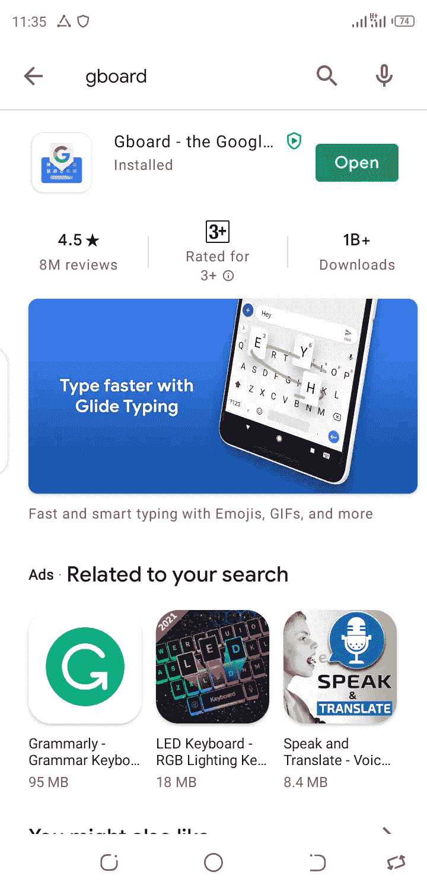

### 步骤 2:配置 Gboard 应用程序

打开应用程序后，您需要完成一些基本的配置来启动并运行它。

你需要做的第一件事是在你的语言和输入设置中选择 Gboard。应用程序会提示你这样做。

如果没有(在极少数情况下)，进入设置，点击系统，点击“语言&输入”，点击“虚拟键盘”，然后选择 Gboard。

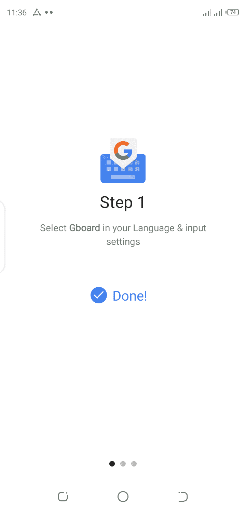

### 第三步:将 Gboard 设置为默认键盘

接下来，系统会提示您选择 Gboard 作为默认键盘。点击输入法，在接下来弹出的模式中选择 Gboard。

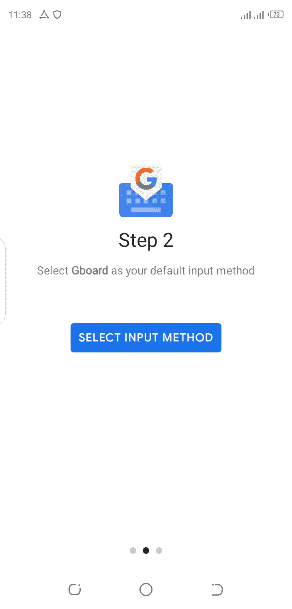

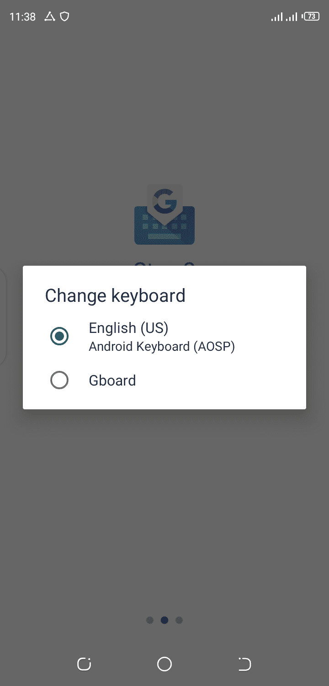

这就是您需要配置的全部内容。轻按“完成”以开始使用 Gboard。

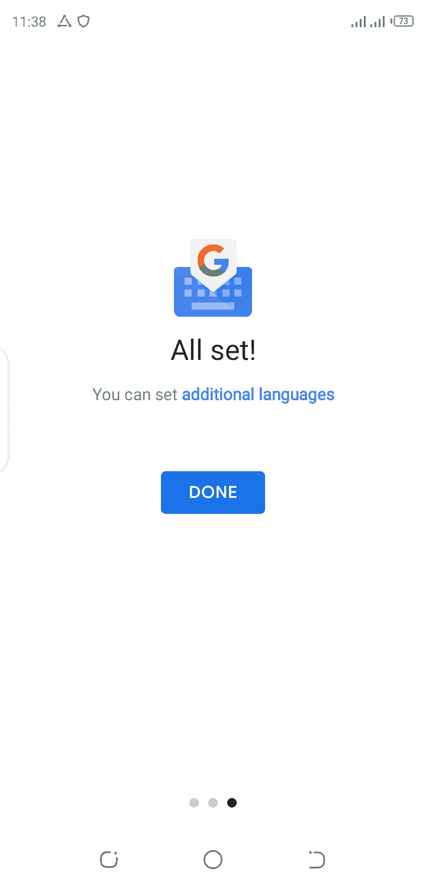

## 如何在 Android 上访问剪贴板

要访问 Gboard 的剪贴板功能，请打开一个笔记应用程序或任何其他您想要输入的应用程序。

有时你会在菜单中看到剪贴板图标，旁边是设置、GIF 等。但是，如果您没有看到图标，请点击右侧的三个点来显示隐藏的图标。在那里你会看到剪贴板图标。

你可以选择继续像那样使用它，或者你可以点击、按住并拖动剪贴板图标到主菜单，如下图所示。

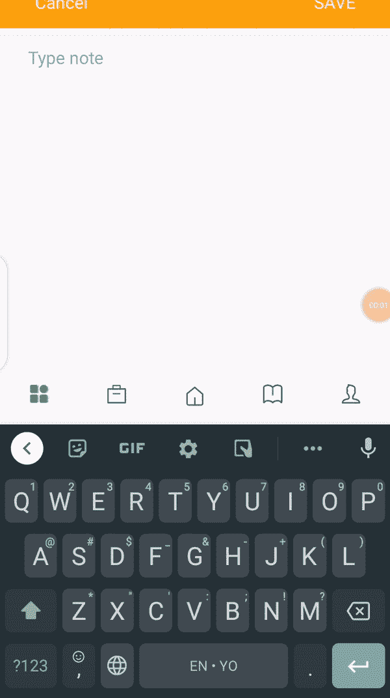

### 如何打开剪贴板

默认情况下，剪贴板功能是关闭的。你可以通过点击右边的滑动图标并点击“打开剪贴板”来打开它:

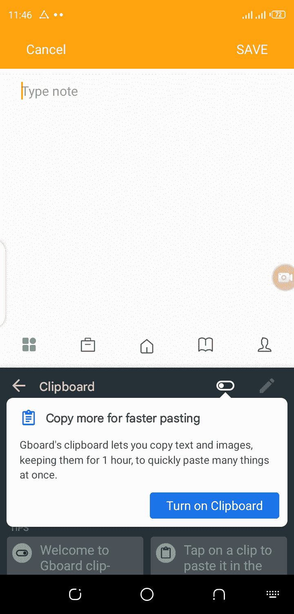

紧接着，您将在剪贴板上看到一些默认项目。它们是关于如何使用 Gboard 提供的剪贴板功能的说明。

要粘贴项目，只需点击它们，如下所示:

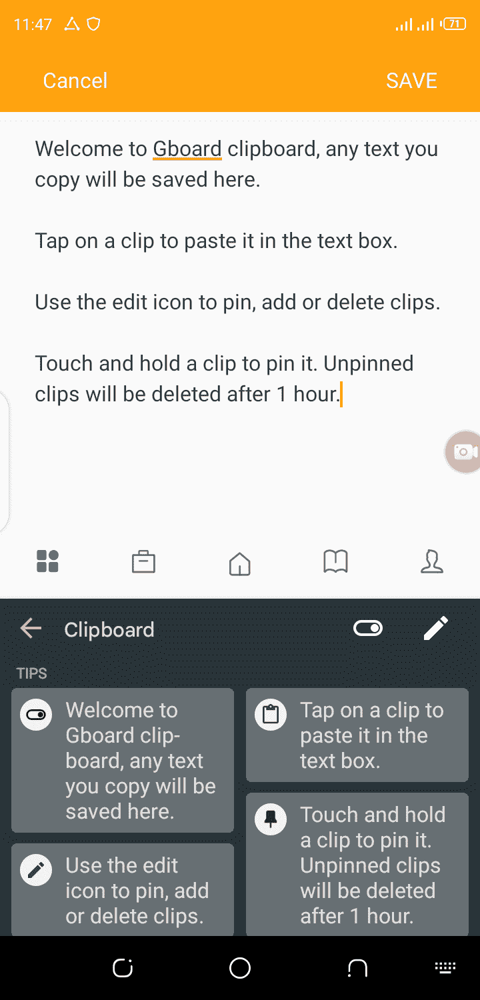

### 如何用剪贴板复制

若要开始拷贝和粘贴，请键入您自己的文本，按住两端并拖到您想要开始和结束的位置，然后轻按“拷贝”或“剪切”，视情况而定。

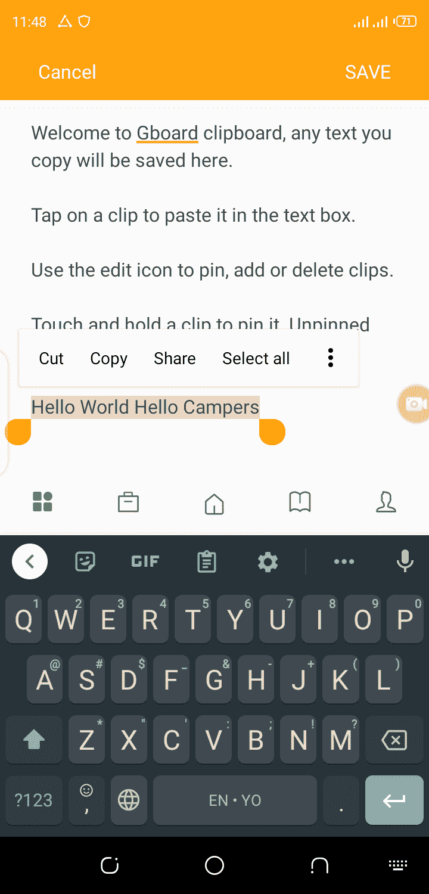

### 如何用剪贴板粘贴

要粘贴复制的文本，请检查您的剪贴板以显示复制的片段。最近复制的片段应该在“最近项目”选项卡下。

轻按该项目，将其粘贴到您想要的任何文本编辑器中，无论是笔记、信息还是社交媒体网站。

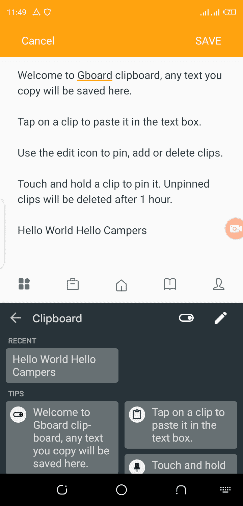

## 如何清除 Android 上的剪贴板

有两种方法可以用 Gboard 清除剪贴板上的项目。

### 选项 1 清除剪贴板

打开剪贴板，点击并按住项目，然后点击删除。你必须对每个项目都这样做。

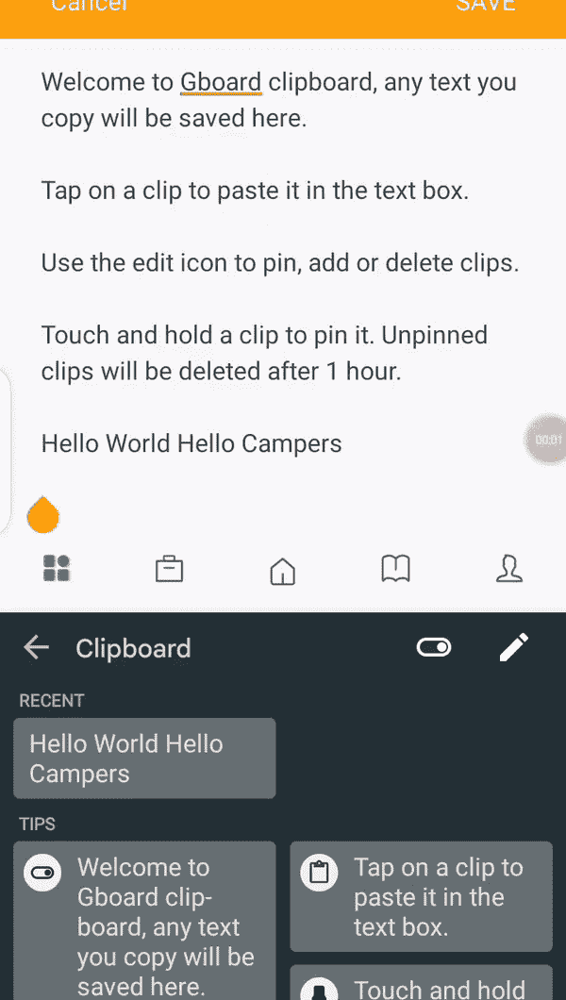

### 选项 2 清除剪贴板

打开剪贴板，单击右侧的铅笔图标，选择所有项目，然后单击垃圾桶图标。

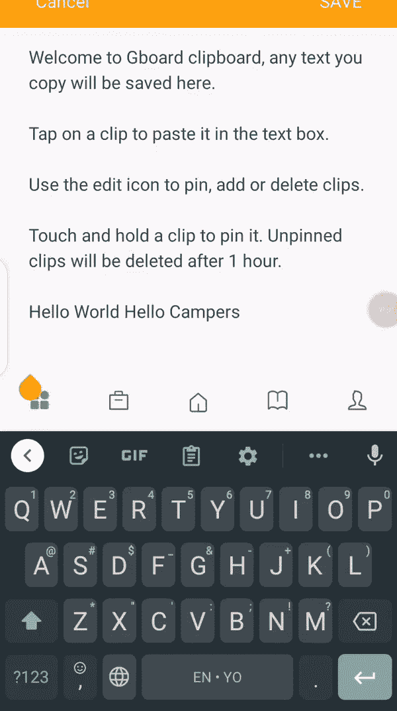

## 如何将项目固定到剪贴板

请注意，任何用 GBoard 复制的物品都会在一小时后消失。要阻止这种情况发生，您需要固定复制的项目。

要锁定片段，请打开剪贴板，点击并按住文本片段，然后单击锁定。

要锁定一组片段，请点击铅笔图标，选择要锁定的项目，然后单击锁定图标。

## 结论

我希望这篇教程能帮助你访问 Android 剪贴板并有效地管理它。感谢您的阅读，祝您玩得愉快。