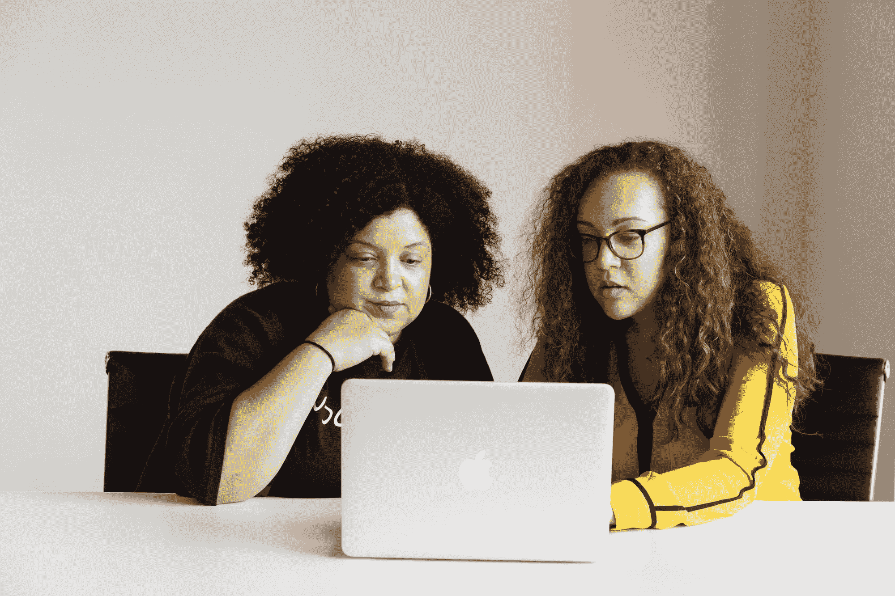

# 如何在编码面试中胜出——来自高级软件工程师的建议

> 原文：<https://www.freecodecamp.org/news/how-to-acing-your-coding-interview-advice-from-senior-software-engineer/>

技术面试是在技术行业找到工作最有压力的部分之一。

你不知道面试官会问什么问题。如果你不知道如何解决眼前的问题怎么办？如果你僵住了，看起来不知道自己在做什么怎么办？

许多有抱负的程序员在试图记住每一个编码面试问题时，都会让自己陷入疯狂。你我都知道这种方法是不可持续的。我是来告诉你有一个更简单的方法。

最近，我和我的朋友米歇尔坐在一起，她是 Stitch Fix(一家最近首次公开募股的公司)的高级软件工程师。她分享了她在面试的开发人员身上寻找的品质。

老实说，这些品质可能会让你吃惊。我保证它们不包括记忆编码面试问题和答案。

本文的其余部分将揭示 Michelle 在开发人员候选人中寻找的品质。我将把这些品质转化为关键的面试行为。然后我会告诉你如何在你自己的面试中实现它们。让我们开始吧。

## 参加编码面试时你应该具备的素质

当我和米歇尔坐下来的时候，我的一部分想象着我得到了破解编码面试的秘密代码。我以为我会听到解决所有问题的终极算法。

虽然我们知道不存在通用的算法，但她确实分享了一些更好的东西:如何为面试创建一个心理框架。

成功不是记住每一个问题和解决方案。相反，这是关于学习如何解决问题。

作为开发者，不会有千篇一律的 LeetCode 类型的答案。这就是心理框架非常有用的地方。他们创造了足够的解决问题的确定性来克服一个看似模糊的问题。

以下是米歇尔为你的编码面试建立杀手思维框架的关键要素。

## 好奇

米歇尔给开发者候选人的最大建议之一就是保持好奇心。阐明问题，提出问题。分享你对所面临问题的想法。面试官不只是在寻找正确的解决方案。他们想知道你是怎么想的。

你能展示你如何思考的最好方式是提问。假设一位面试官要求你检查一个字符串是否包含任何数字。你应该用自己的话来阐明这个问题，比如:

"所以我需要找到一种方法来验证一组字符是否包含任何数字？"

当你这样说的时候，你让面试官了解了你的逻辑。你也在向他们展示你对这个问题感兴趣。

不要害怕问后续问题。使用上面的同一个例子，这里有几个你可以问的问题:

"我要找的数字包含小数吗？"

"在检查之前，我需要对字符进行排序吗？"

## 虚心接受建议

有一点很容易忘记，那就是面试官希望你成功。大多数面试官都希望给应聘者提供实时的反馈和建议。但是候选人经常采取一种非语言的、孤立的方法来进行编码面试。

让你更乐于接受建议的一个方法是让你的面试官参与进来。用语言表达你的逻辑，并在你解决问题的旅途中带着它们。

我们将使用与上面相同的问题。这里有一些方法可以让你一开始就用语言表达你的逻辑:

"所以我需要建立一种方法来区分字符和数字，对吗？"

"我在考虑从头到尾遍历一组字符."

"我想要一个编程的方法来遍历字符，但停留在数字上."

你能提供的见解越多，你的面试官就越愿意帮助你。

## 协同工作

这和上面的是齐头并进的。开发人员孤立工作的想法是一个神话。您拥有需要协作的版本控制和项目管理工具。

你应该用语言描述你的方法，问一些很棒的问题，并让面试官参与进来。你会更快地找到答案。但是你也要向面试官展示你能有效地与其他开发人员合作。

这里有一些方法可以让你的面试官了解你:

"对于这个解决方案来说，for 循环会不会太简单/太复杂？"

"确定是否有浮动有多重要？"

"你心里有什么解决办法吗？"

## 愿意去追求它

最后，Michelle 建议开发者候选人应该放手去做。意思是，追求你想看到的成功。

对于候选人来说，最常见的事情之一就是他们僵住了。虽然这可以理解，但在这种情况下没有人会赢。你无法展示自己有多不可思议，面试官也帮不了你。以下是米歇尔对“放手一搏”说的话:

> 即使您必须对您的实现进行伪代码化，这也比紧张得不敢尝试要好。把一些东西放在黑板/coderpad 上会引起讨论，有机会分享你的想法，也有机会学习。
> 
> 不要害怕失败！这只意味着你离成功又近了一步。:)

“放手一搏”可以有很多含义。也就是说，这里有几个这样的例子:

*   在白板、纸张或 coderpad 上写伪代码
*   准确地记下你在逻辑中被卡住的地方
*   用语言表达你希望能想出的解决方案

## 使用思维框架来赢得你的编码面试！

编码面试可能会很可怕，而且总是担心你会被冻结。这种恐惧部分源于不知道会出现哪些问题。

最棒的是你不再需要记忆编码问题和解决方案。相反，用你今天读到的关键面试行为建立一个思维框架。

你想保持好奇并接受建议。你应该和你的面试官合作。愿意去追求你想看到的成功。面试愉快！

如果你想看到更多这种类型的内容，请在[课程订阅我的时事通讯，以便雇佣](https://coursetohire.com/)。我会帮你学习如何编码和进入科技领域。也可以随时在 [LinkedIn](https://www.linkedin.com/in/daniel-chae11/) 上加我。

附:如果你有兴趣和 Michelle 联系，请联系我或 LinkedIn，我会帮你介绍。