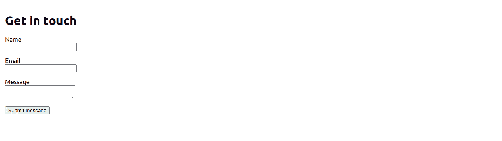
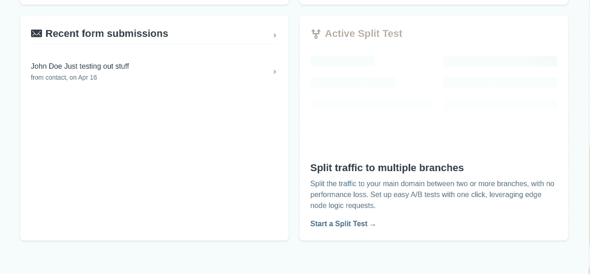
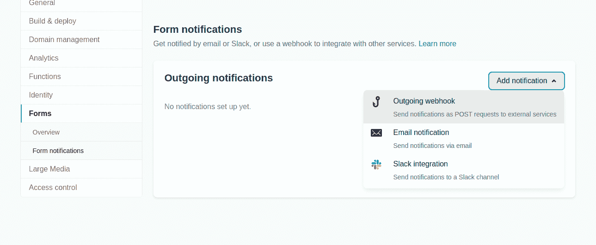

# 如何向使用 create-react-app 构建的 React 应用程序添加 Netlify 表单

> 原文：<https://www.freecodecamp.org/news/how-to-add-a-netlify-form-to-a-react-app/>

如果你是一个网站开发者，在某些时候你需要从使用你的网站或应用的人那里获取信息。

一种方法是使用 HTML 表单。但是也有大量的框架可以用来快速构建 web 应用程序。

一个这样框架是 React。你可以使用`create-react-app` (CRA)非常容易地引导一个单页面应用程序(SPA)。然后，只需几个步骤，您就可以将其部署到 Netlify、Vercel、Firebase 和 Digital Ocean 等平台上。

本文的重点是如何将 Netlify 表单功能添加到使用`create-react-app`引导的 React 应用程序中。本教程结束时，您将能够:

*   使用`create-react-app`快速设置单页应用程序
*   添加功能以利用 Netlify 的内置表单处理特性
*   将应用程序部署到 Netlify
*   配置 Netlify 上的内置表单处理功能，以便在客户端提交表单时发送电子邮件通知

无论您是尝试部署第一个 React 应用程序的初学者，还是经验丰富的 React 开发人员，本文都将帮助您学习使用 Netlify 的内置表单功能，而无需编写任何服务器端代码。

如果你是一个有经验的 React 开发者，可以跳过介绍直接去`step 6`。如果您是 React 的初学者，您可以从头开始学习。

## 先决条件

要阅读本文，您应该:

*   对 JavaScript 有一定的了解。如果你是一个初学者，如果你有不明白的地方，你仍然可以跟随并在 [freeCodeCamp 论坛](https://forum.freecodecamp.org)上提问。您还可以复制每一部分中的代码示例，并在您的文本编辑器中使用它们来理解正在发生的事情。
*   至少具备 React 库的基本知识
*   在您的计算机上安装节点
*   有一个账户。如果您没有帐户，您可以使用您的电子邮件地址免费注册一个帐户。
*   在你的机器上安装一个文本编辑器，比如 [VS code](https://code.visualstudio.com/) 或者 [Atom](https://atom.io/) 。您可以在后续工作中尝试代码示例。这会让你更容易理解。

## 第一步:检查你的机器上是否安装了`node`和`npm`

在我们开始之前，您应该检查您的机器上是否安装了[节点](https://nodejs.org/en/)。

Node 是一个 JavaScript 运行时环境，为了能够运行项目，安装它是很重要的。打开终端，在命令提示符下键入以下命令。

```
node - v 
```

除了上面的命令，您还可以键入下面的命令。他们俩做着同样的事情。

```
node --version 
```

如果安装了 Node，您应该能够看到打印在终端上的版本。您的版本可能与我的不同，但您应该会看到如下内容:

```
v15.13.0 
```

如果安装了 Node，这意味着也安装了`npm`，因为 Node 的最新版本附带了`npm`。如果你想知道，输入命令`npm --version`或`npm -v`。你应该可以看到已经安装的`npm`的版本。

另一方面，如果您的机器上没有安装 Node，您可以从这里的[下载并安装您的平台。](https://nodejs.org/en/download/)

## 步骤 2:导航到您想要创建项目的目录

接下来，您需要导航到您想要创建项目的目录。您可以在桌面或您选择的任何目录中工作。

我喜欢把我的个人项目放在桌面上一个名为`projects`的目录中，以便于访问。这只是个人选择。

打开终端并导航到您想要创建项目的目录。我在下面的命令中使用了`cd`(改变目录)。

**注意**:我桌面上已经有一个名为`projects`的目录。如果不这样做，您将不得不在进入`cd`之前先运行命令`mkdir projects`。就像我上面说的，你可以决定从另一个目录工作，然后你就不必运行下面的命令了。

1.  `cd Desktop`
2.  `cd projects`

## 步骤 3:如何使用`create-react-app`引导单页应用

我们将如何使用`create-react-app`引导一个 React 项目。在要创建项目的目录中，运行下面的命令。

```
npx create-react-app netlify-form 
```

我已经把这个项目命名为`netlify-form`。如果您愿意，可以给它一个不同的名称。

如果没有安装`create-react-app`，会在终端上看到提示，询问是否要安装。在命令提示符下键入`Y`(表示“是”)。它将安装`create-react-app`，然后在`netlify-form`目录下创建一个 React 项目。

如果您的系统中已经有了`create-react-app`，它将直接在`netlify-form`目录中创建一个 React 项目。这需要几分钟时间，请耐心等待。

在下一步中，您将启动开发服务器。

## 步骤 4:启动开发服务器

在这一步中，我们将启动开发服务器。这确保了当我们在开发过程中对项目进行更改时，可以热重装，这样我们就可以看到我们的项目是如何成形的。

您可以在您选择的文本编辑器中打开`netlify-form`目录。当您在`netlify-form`中时，打开终端并运行下面的命令。

```
npm run start 
```

上述命令在端口 3000 上启动开发服务器。如果在端口 3000 上有另一个项目或服务正在运行，将提示您在另一个端口上启动服务器。

将在您的默认浏览器中打开一个新的浏览器选项卡，您可以在其中查看项目。您所做的任何更改都会自动反映在浏览器中。

在下一步中，您将创建一个包含表单的组件。

## 步骤 5:在`src`目录中创建一个新组件

现在您将在`src`目录中创建一个名为`Form`的组件。在该组件中，您将拥有将在您的应用程序中呈现的表单。

在`src`目录下创建一个`Form.js`文件，然后将下面的代码复制并粘贴到其中:

```
import React from "react";

export default function Form() {
  return (
    <form name="contact" method="post">
      <p>
        <label htmlFor="name">Name</label> <br />
        <input type="text" id="name" name="name" required />
      </p>
      <p>
        <label htmlFor="email">Email</label> <br />
        <input type="email" id="email" name="email" required />
      </p>
      <p>
        <label htmlFor="message">Message</label> <br />
        <textarea id="message" name="message" required></textarea>
      </p>
      <p>
        <input type="submit" value="Submit message" />
      </p>
    </form>
  );
} 
```

上面的组件返回一个普通的表单。我已经将每个标签-输入对和标签-文本区域对包含在它自己的`p`标签中。

`p`标签没有什么特别的。如果你愿意，可以使用`div`。我之所以使用它，是因为我想在不使用 CSS 的情况下在连续的标签输入对之间应用间距。

您可以导入`Form`组件，并在`App`中呈现它。为了清理`App.js`，你也可以删除一些`create-react-app`自带的物品，这样看起来就像:

```
import "./App.css";
import Form from "./Form";

function App() {
  return (
    <div className="App">
      <h1> Get in touch </h1>
      <Form />
    </div>
  );
}

export default App; 
```

你也可以清理`App.css`,让它只有下面的 CSS:

```
.App {
  padding: 1em;
} 
```

当您在浏览器中检查表单时，它应该看起来像下图。



目前，将该应用部署到 Netlify 还不能让我们捕获客户提交的表单。为此，我们需要向我们的应用程序添加必要的信息，以便 Netlify 的机器人能够检测到我们的表单。

下一步，我们将添加所有必要的信息，使 Netlify 能够检测到 React 中的 JSX。

## 第 6 步:添加必要的信息，让 Netlify 的机器人可以检测到`form`

在这一步中，您将向您的应用程序添加一些信息，以便 Netlify 能够检测您的应用程序的表单设置。如果您的表单是以普通 HTML 格式部署的，那么使其可检测的过程就非常简单。你可以在[文档](https://docs.netlify.com/forms/setup/?_ga=2.214149207.1369394306.1618461268-796209470.1617367540)中读到它。

但是如果你在 React 中处理一个 JSX 表单，就像我们正在构建的这个简单的应用程序一样，那么你将不得不做更多的工作。您可以遵循下面列出的步骤。

### 将表单的 HTML 版本添加到`index.html`文件中

将您的 JSX 表单复制并粘贴到开始的`body`标签之后的`index.html`文件中。这将确保 Netlify 检测到我们的表单，因为构建机器人在部署时直接解析 HTML 文件。机器人无法解析 JSX 表单。

您可以删除`label`元素和`submit`输入元素，因为我们将为`form`添加一个`hidden`属性，这样用户和屏幕阅读器就看不到它了。

您只能在`input`元素上保留`type`和`name`属性，在`textarea`上保留`name`属性，这样我们可以保持表单最小化。

下面的代码说明了这一点:

```
<form name="contact" netlify netlify-honeypot="bot-field" hidden>
     <input type="text"  name="name">
     <input type="email" name="email">
     <textarea name="message"></textarea>
</form> 
```

正如您在上面的代码片段中看到的，在`form`上有额外的属性`netlify`和`netlify-honeypot`。Netlify 机器人在解析你的 HTML 时会用到它们，所以一定要添加它们。

不要忘记添加`hidden`属性，因为这个表单需要对网站的用户隐藏。还值得指出的是，HTML 表单中的名称属性必须与相应的 JSX 表单中的名称属性完全相同。

### 在你的 JSX 表单中添加一个隐藏的`input`元素

您还需要在 JSX 表单中添加一个隐藏的`input`元素，属性为`name`和`value`，如下面的代码所示:

```
<input type="hidden" name="form-name" value="contact" /> 
```

属性`name`的值应该总是`"form-name"`，属性`value`的值应该是 HTML 表单的名称，在我们的例子中是`contact`。

您的`Form.js`文件现在应该是这样的:

```
import React from "react";

export default function Form() {
  return (
    <form name="contact" method="post">
      <input type="hidden" name="form-name" value="contact" />
      <p>
        <label htmlFor="name">Name</label> <br />
        <input type="text" id="name" name="name" required />
      </p>
      <p>
        <label htmlFor="email">Email</label> <br />
        <input type="email" id="email" name="email" required />
      </p>
      <p>
        <label htmlFor="message">Message</label> <br />
        <textarea id="message" name="message" required></textarea>
      </p>
      <p>
        <input type="submit" value="Submit message" />
      </p>
    </form>
  );
} 
```

如果您在浏览器中检查该应用程序，您应该能够看到该表单，但您将无法从本地设置提交它。您只能在将应用程序部署到 Netlify 后提交表单。

所以让我们现在就开始吧。

## 步骤 7:将应用程序部署到 Netlify

在这一步中，您将把我们的应用程序部署到 Netlify，这样您就可以测试客户是否可以提交表单。

有几种方法可以将应用部署到 Netlify。一种方法是在本地构建应用并从命令行部署，或者将生产版本拖放到 Netlify。第二种方法是通过 GitHub、BitBucket 或 GitLab 配置自动部署。

在这个应用程序中，您将在本地构建应用程序，并使用最简单的拖放方法。此步骤要求您登录 Netlify 帐户。如果您没有帐户，可以注册一个。

在终端中运行命令`npm run build`。这将把生产应用程序构建到`build`文件夹中。这需要一点时间。成功运行该命令后，您应该能够看到`build`目录。

登录您的 Netlify 帐户。在网络生活仪表板上，点击`Sites`菜单项。在页面底部，有一个区域，您可以拖放应用程序的生产版本。拖放`build`文件夹后，构建过程开始。

成功构建站点后，您可以检查项目仪表板，以了解 Netlify 是否正在检测您的表单。如果它正在检测表单，您通常会在左下方的表单部分看到一条消息。

剩下你要做的就是填表并提交。提交后，您应该能够看到提交的信息。



接下来，我们将学习如何配置电子邮件提醒，以便每当用户提交表单时您都会收到通知。

## 步骤 8:每当用户提交表单时配置电子邮件更新

在本节中，您将配置您的应用程序，以便在提交表单时向电子邮件地址发送电子邮件通知。

为此，请导航到网站设置。在左侧，您会看到一个菜单项列表。点击`forms`选项。

在`outgoing notifications`下，点击`Add notification`并选择`Email notification`选项。然后，您将相应地配置您的首选项。



这就是在 CRA 中使用 Netlify 内置表单功能所需要做的全部工作。您不需要服务器端代码来从您的客户端获得反馈。

如果你成功地遵循了上述步骤，那么恭喜你！现在，您可以继续探索其他功能。

如果您在学习本教程时遇到了与网络表单相关的错误或问题，请随时查看[这个网络表单错误调试提示](https://answers.netlify.com/t/support-guide-form-problems-form-debugging-404-when-submitting/92)。

您也可以阅读 [netlify 表单文档](https://docs.netlify.com/forms/setup/)。

如果你在使用上述资源后仍未找到解决方案，你可以在[网络论坛](https://answers.netlify.com/)中提问。那个社区里有很多友好的人可能会帮助你。

## 结论

在这篇文章中，我们看了看:

*   如何使用`create-react-app`创建 React 应用
*   如何将 JSX 表单添加到 React 应用程序
*   如何添加必要的信息，以便 Netlify 的机器人可以检测到您的表单
*   如何将生产版本部署到 Netlify
*   如何在客户提交表单时设置电子邮件通知

### 参考

*   [网络表单文档](https://docs.netlify.com/forms/setup/)
*   [创建 react 应用文档](https://create-react-app.dev/)
*   [React 文档](https://reactjs.org/docs/getting-started.html)
*   [Netlify 表单错误调试](https://answers.netlify.com/t/support-guide-form-problems-form-debugging-404-when-submitting/92)