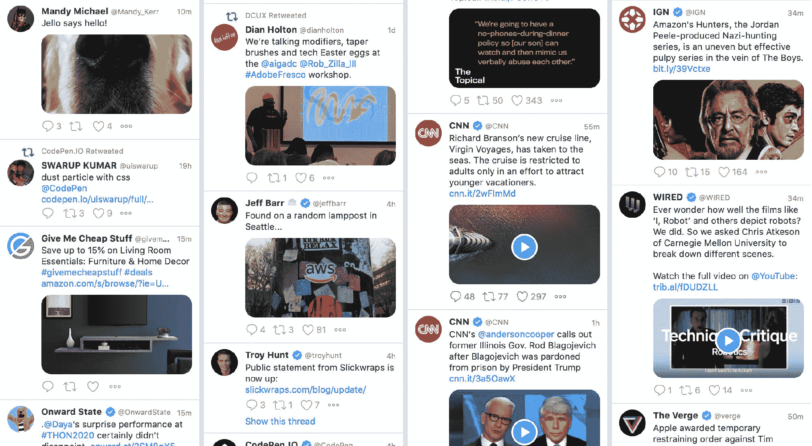

# 如何将社交媒体图片添加到 Github 项目存储库中

> 原文：<https://www.freecodecamp.org/news/how-to-add-a-social-media-image-to-your-github-project/>

没有社交形象的分享链接会把强大的内容变成失败。在 Github 上分享我们的辛勤工作时，我们如何利用社交媒体给我们的房地产？

想跳过“是什么”和“为什么”吗？[跳到“如何”](#adding-an-image-to-your-github-repo)！

[https://www.youtube.com/embed/KRNiqCLlPNQ?feature=oembed](https://www.youtube.com/embed/KRNiqCLlPNQ?feature=oembed)

## 社交媒体中图像的影响

任何社交媒体源都是一连串难以完全消化的内容。当你在提要中滑动或滚动时，你会看到一些基于文本的内容和大量的媒体。

Twitter feeds with media on TweetDeck

这是有充分理由的！当你浏览上面的例子时，有什么突出的呢？左边的不是来自[笔会](https://twitter.com/CodePen)的[微尘 retwee](https://twitter.com/uiswarup/status/1230781530907324417) t，而是中间的 AWS，左上角的狗鼻子，右上角的阿尔·帕西诺和其他大型媒体的帖子。

图像、gif 和视频是提供吸引眼球内容的好方法。另外，它们通常会在提要中占据更多的空间，这使得你更有可能有机会看到它。

## Github 上的最低限额

当在社交媒体上分享你的 Github 项目时，默认选项是相当乏味的。以这条推文为例:

> 需要从另一个空闲工作区导入表情符号？不要担心，现在有一个脚本！[https://t.co/cNKihZyCMP](https://t.co/cNKihZyCMP)
> 
> — Colby Fayock (@colbyfayock) [February 8, 2020](https://twitter.com/colbyfayock/status/1226204581824204804?ref_src=twsrc%5Etfw)