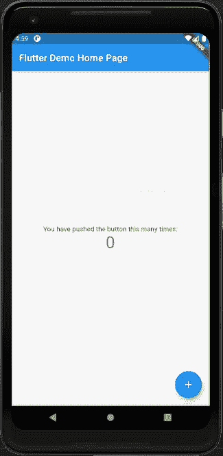
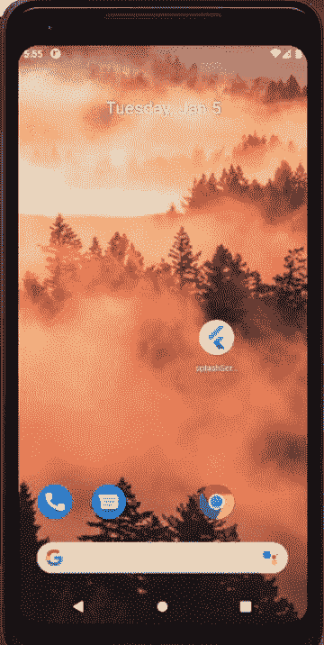
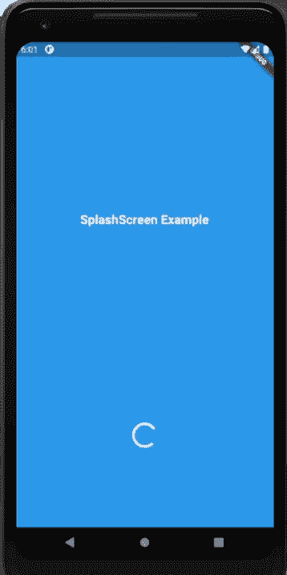
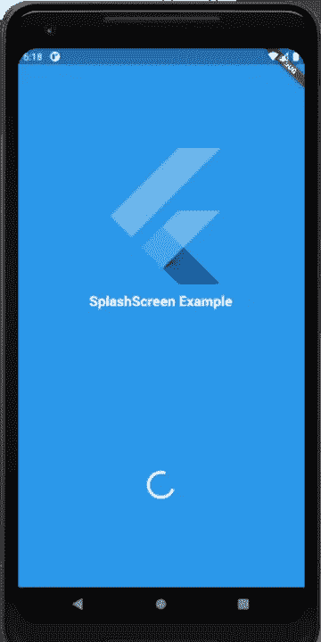

# 如何给你的 Flutter 应用添加闪屏

> 原文：<https://www.freecodecamp.org/news/how-to-add-a-splash-screen-in-flutter-app/>

在本文中，我们将学习如何在 Flutter 应用程序中集成闪屏。但是首先，为什么在你的应用程序中有一个闪屏是必不可少的？

## 什么是闪屏？

闪屏是一个初始屏幕，当用户启动应用程序时，在主页面加载之前显示。它可能看起来不怎么样，因为它只显示了很短的时间。但是闪屏确实很有冲击力，因为它们是应用程序的第一印象。

你可能认为大多数用户都忽略了它们。但是闪屏确实有影响，甚至是潜意识的。它们为整个应用主题和用户体验定下了基调。

把闪屏想象成你的应用程序的欢迎屏幕。它们也有助于让你的用户知道什么时候由于网络问题或其他错误导致加载延迟。正因为如此，作为开发者，我们应该知道如何给我们的移动应用程序添加一个合适的闪屏。

## 闪屏概述

由于闪屏在任何应用中都是一个有价值的初始元素，你需要学习如何正确地整合它们。所以在本教程中，我们将学习如何在 Flutter 生态系统中这样做。

确切的步骤非常简单，因为我们将使用一个包来帮助我们集成名为 [*闪屏*](https://pub.dev/packages/splashscreen) 的屏幕。这个包允许我们用几行代码来设置闪屏和闪屏出现的时间。我们不需要接触任何本地代码。

因此，让我们开始学习如何添加一个包含文本、图像和加载指示器的简单闪屏。

## 创建一个新的颤振项目

首先，我们需要创建一个新的 Flutter 项目。为此，请确保您已经安装了 Flutter SDK 和其他与 Flutter 应用程序开发相关的组件。

如果一切都设置妥当，那么要创建一个项目，只需在您想要的任何本地目录中运行以下命令:

```
flutter create splashSceenExample 
```

建立项目后，在项目目录中导航，并在终端中执行以下命令，以便在可用的仿真器或实际设备中运行项目:

`flutter run`

成功构建后，您将在模拟器屏幕上获得以下结果:



### 如何安装闪屏软件包

现在我们已经启动并运行了我们的 flutter 项目，我们可以安装所需的依赖项了。现在，你可以通过篡改 Android 和 iOS 文件夹中的本机代码来添加闪屏——但如果你不是本地 Android 或 iOS 开发人员，这不是你需要知道如何做的事情。

幸运的是，我们有 *[闪屏](https://pub.dev/packages/splashscreen)* 包，可以很容易地在你的 Flutter 应用程序中添加闪屏。这个包提供了小部件和各种定制参数，在你的应用程序中建立一个简单的介绍性闪屏。

为了使用它，您需要首先将它添加到您的依赖项中。为此，只需复制下面代码片段中的一段代码，并将其粘贴到您的 ****pubspec.yaml**** 文件中:

`splashscreen: ^1.3.5`

该软件包提供了一个`SplashScreen`小部件，让你在导航到应用程序的主屏幕之前显示一个闪屏。

## 如何给你的应用程序添加闪屏

现在，我们将使用由*闪屏*包提供的`SplashScreen`小部件。这个想法是将`SplashScreen`小部件应用于`MaterialApp`小部件的`home`参数。您可以在下面的代码片段中看到整体的编码实现:

```
class MyApp extends StatelessWidget {
  // This widget is the root of your application.
  @override
  Widget build(BuildContext context) {
    return MaterialApp(
      title: 'Flutter Demo',
      theme: ThemeData(
        primarySwatch: Colors.blue,
        visualDensity: VisualDensity.adaptivePlatformDensity,
      ),
      home: SplashScreen(
        seconds: 8,
        navigateAfterSeconds:MyHomePage(title: 'Flutter Demo Home Page'),
        title: new Text(
          'SplashScreen Example',
          style: new TextStyle(
              fontWeight: FontWeight.bold,
              fontSize: 20.0,
              color: Colors.white),
        ),
        backgroundColor: Colors.lightBlue[200],
      )
    );
  }
} 
```

在这段代码中，我们在 MaterialApp 的 home 参数中引入了 SplashScreen 小部件。我们在`SplashScreen`小部件中配置了几个参数。让我们更仔细地看看每一个。

*   `seconds`:`seconds`选项允许您输入您希望启动画面显示的时间(以秒为单位)。
*   `navigateAfterSeconds`:此选项允许您定义闪屏结束后显示的小工具或屏幕(最好是应用程序的主屏幕)。
*   这个选项可以让你在启动画面中添加文本。在这里，我们使用了带有一些样式的`Text`小部件来完成这个任务。
*   `backgroundColor`:这允许您指定启动画面的整体背景颜色。

好了，这是一个带有文本的闪屏的简单配置。这是它看起来的样子:



在这里，您可以看到在默认主页加载之前闪屏出现了几秒钟。默认情况下也会显示加载程序。

但是，我们可以通过应用`SplashScreen`小部件中的`useLoader`参数来控制加载器的可见性，该参数可以是真或假。

### 如何将自定义加载程序添加到您的闪屏

默认情况下，我们已经有了加载器。但是，我们可以通过使用`loaderColor`选项来控制它的颜色和样式，如下面的代码片段所示:

```
home: SplashScreen(
        seconds: 8,
        navigateAfterSeconds:MyHomePage(title: 'Flutter Demo Home Page'),
        title: new Text(
          'SplashScreen Example',
          style: new TextStyle(
              fontWeight: FontWeight.bold,
              fontSize: 20.0,
              color: Colors.white),
        ),
        backgroundColor: Colors.blue,
        styleTextUnderTheLoader: new TextStyle(),
        loaderColor: Colors.white
      ) 
```

现在，您将获得如下演示所示的结果:



在这里，您可以看到我们已经将加载器的颜色更改为白色。

### 如何将图像或徽标添加到闪屏

现在，为了让启动画面看起来更好，我们可以添加一个图像或图表——可能是一个徽标或类似的东西。

`SplashScreen`小部件为您提供了两个额外的参数来正确设置闪屏中的徽标。`image`选项允许您从您的资产或网络添加图像，而`photoSize`选项允许您指定图像的尺寸。

最好从您的资产中添加图像，因为加载网络图像取决于连接，有时由于互联网连接缓慢，图像可能不会显示。

所以我们需要将图像传送到我们的**T3。/assets** 目录，然后在我们的 ****pubspec.yaml**** 文件中注册它的路径。然后，我们可以使用`image`和`photoSize`选项，如下面的代码片段所示:

```
home: SplashScreen(
        seconds: 5,
        navigateAfterSeconds:MyHomePage(title: 'Flutter Demo Home Page'),
        title: new Text(
          'SplashScreen Example',
          style: new TextStyle(
              fontWeight: FontWeight.bold,
              fontSize: 20.0,
              color: Colors.white),
        ),
        image: new Image.asset('assets/flut.png'),
        photoSize: 100.0,        
        backgroundColor: Colors.blue,
        styleTextUnderTheLoader: new TextStyle(),
        loaderColor: Colors.white
      ) 
```

这将是结果:



如您所见，我们将图像放在了文本的顶部。还有其他可用的选项，您可以通过闪屏包本身的文档来探索。

现在你知道了！请记住，这在 Android 和 iOS 上都有效，不需要单独的实现。

## 结论

多亏了*闪屏*插件，给你的应用添加闪屏并不困难。本教程的主要目的是向您展示如何将闪屏集成到您的 Flutter 应用程序中，而无需接触本机代码。

在这里，您了解了如何创建闪屏并包含文本、加载指示器和图像。现在，挑战是使用由`SplashScreen`小部件提供的剩余参数。

请记住，一个漂亮的闪屏也有助于减轻用户在启动应用程序时的焦虑。所以，它也确实有益于精神健康。

请记住,`splashcreen`插件的功能有点有限。如果你想创建一个自定义的闪屏，并完全控制你可以添加到其中的内容，那么你必须使用本地代码。不过，对于简单的闪屏，这个插件可以完成这项工作。

最后，你可以从已经存在的其他人那里获得你的 [Flutter 应用](http://instaflutter.com/)的灵感。