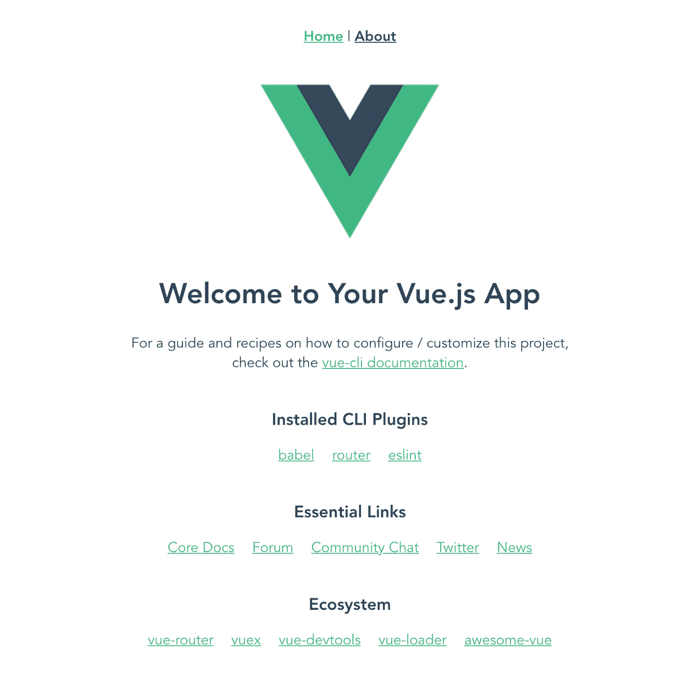
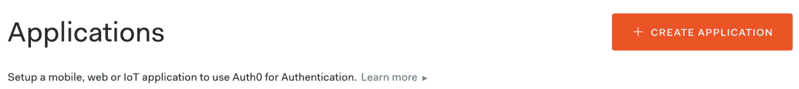
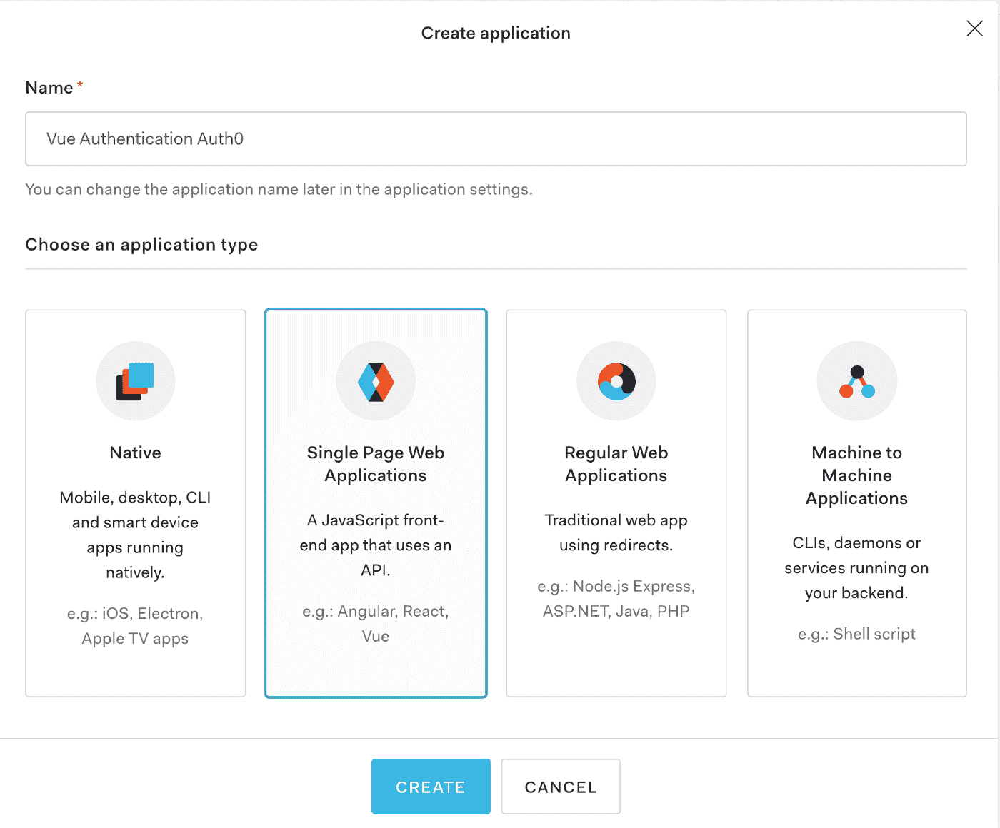
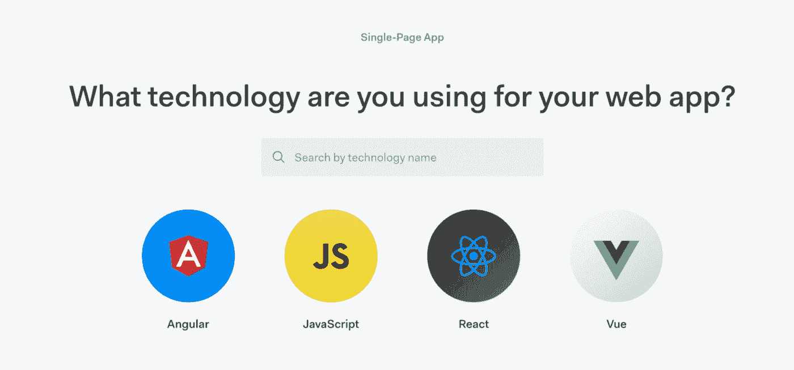
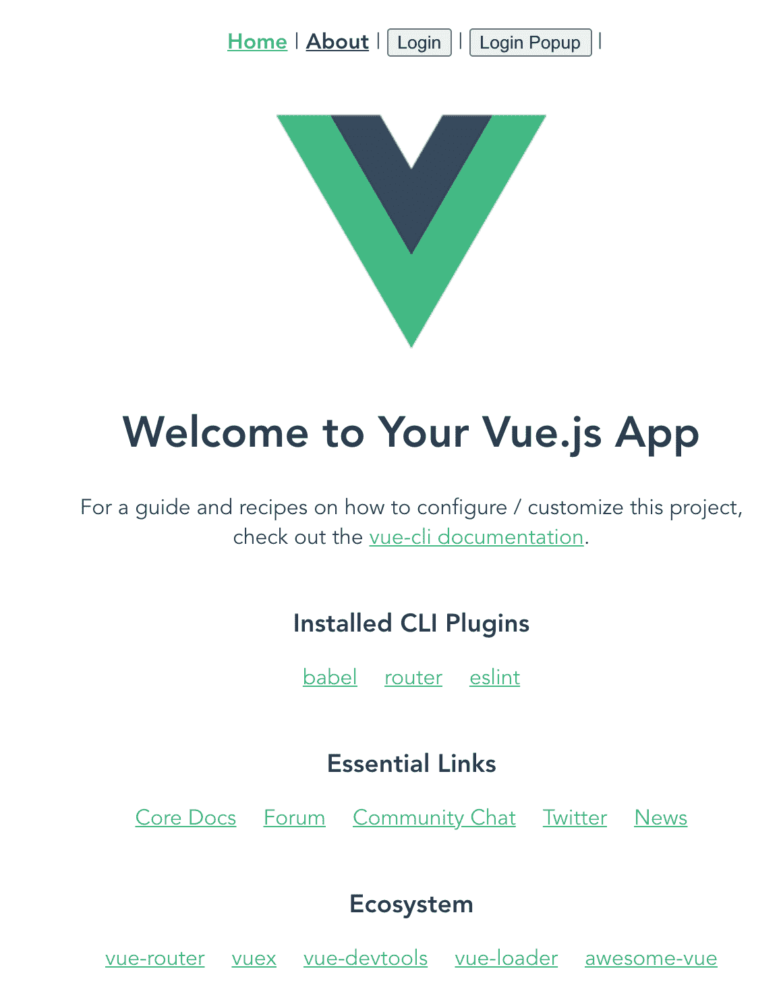
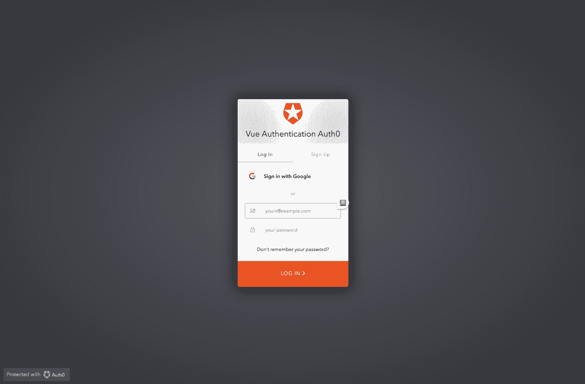
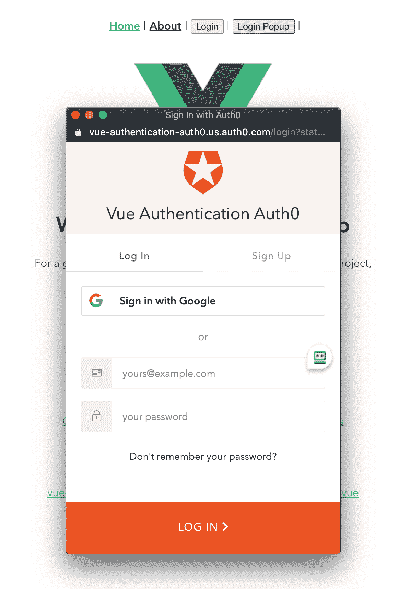
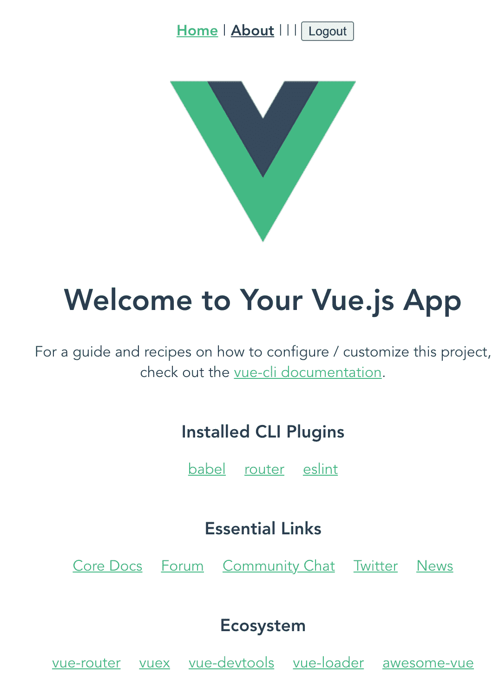

# 如何使用 Auth0 向 Vue 应用添加身份验证

> 原文：<https://www.freecodecamp.org/news/how-to-add-authentication-to-a-vue-app-using-auth0/>

Auth0 是一个灵活的嵌入式解决方案，用于向应用程序添加身份验证和授权服务。了解添加到您的 Vue 应用程序有多简单，这样您就可以使用用户的电子邮件地址和密码来注册和登录用户。

# 我们将创造什么

我们将使用 Vue CLI 创建一个非常简单的 Vue 应用程序。我们将修改默认的 scaffolded 应用程序，以便我们可以使用 Auth0 来注册新用户或登录现有用户。一旦用户登录，他们将有权查看 ****关于**** 页面。

用户将能够使用 Auth0 中的电子邮件和密码认证系统向应用程序注册。

# 创建我们的项目

我将使用 Vue CLI 为我们搭建一个项目。为此，您需要在系统上安装 Vue CLI。如果您的 ****没有安装**** ，您可以使用以下命令进行全局安装:

```
npm install -g @vue/cli
```

现在我们可以使用 Vue CLI 来创建我们的项目。使用以下命令创建一个新项目:

```
vue create vue-authentication-auth0
```

您将被要求选择一个预设。选择“手动选择功能”，然后选择“babel”、“Router”和“Linter / Formatter”。

系统会询问您是否要对路由器使用历史模式。选择“是”(应该是默认值)。

你可以选择任何你想要的棉绒，但在本教程中，我将选择“Eslint+beauty”。

在 Vue CLI 完成后，它将为您提供切换到刚刚创建的新目录的命令以及启动服务器的命令。遵循这些指示。一旦服务器启动，您就可以打开浏览器进入`localhost:8080`。您应该看到这个:



# 如何设置 Auth0 帐户

如果你还没有一个帐户，你需要做的第一件事就是创建一个 Auth0 帐户。创建帐户是免费的。您可以在这里创建您的免费帐户[。](https://auth0.com/signup)

# 如何创建我们的 Auth0 应用程序

创建免费的 Auth0 帐户后，登录您的帐户。在左侧导航栏中，单击应用程序。


从这里单击“创建应用程序”按钮。



您将看到一个对话框，让您为应用程序提供一个名称，并指定要创建的应用程序的类型。

我的应用的名字是 ****Vue 认证 Auth0**** 。您可以为您的应用程序取任何您想要的名称。

对于应用类型，选择 ****单页面 Web 应用**** 。



创建应用程序后，Quick Start 选项卡将提供如何使用最流行的 JavaScript 框架在 web 应用程序中实现 Auth0 的说明。

因为我们在应用程序中使用 Vue.js，所以单击 Vue 图标。



Auth0 就如何实现他们的身份验证即服务产品提供了非常详细的说明。对于本教程，我们将在我们已经创建的 Vue 应用程序中实现他们的指令。

# 如何配置应用程序设置

您可以通过点击页面顶部的设置选项卡来访问您的设置。

您将在基本信息下看到您的域名和客户端 ID。我们稍后将回到这一点，因为我们将需要存储这些值以使我们的应用程序工作。

在应用程序 URIs 部分，我们将需要定义我们的 ****允许回调的 URL****、 ****允许注销的 URL****，以及 ****允许的 Web 源**** 。

为了在本地测试我们的应用程序，我们将使用 URL****http://localhost:8080****。

****注意:**** 如果你决定在 Netlify 或 Heroku 上托管你的应用程序，那么你需要用你托管的应用程序的 URL 来更新所有这些设置。

将您的 strong >允许回调网址、 ****允许注销网址**** 、 ****允许网址来源**** 设置为****http://localhost:8080****。


# 如何安装 Auth0 SDK

返回到您的 Vue 应用程序，使用以下命令添加 Auth0 Client SDK:

```
npm install @auth0/auth0-spa-js
```

# 如何创建身份验证包装

Auth0 SDK 要求在 Vue 应用程序启动之前对其进行初始化。

Vue 有生命周期挂钩，我们可以用它来初始化 SDK。你可能认为我们可以在创建 之前在 ****App.vue**** 文件中使用一个 ****钩子，但是这是行不通的。让我告诉你为什么。****

这是 Vue 生命周期挂钩的图像。


****beforeCreate**** 是第一个触发的 Vue 生命周期钩子。但是请注意，在该图像中，它是在使用 ****new Vue()**** 创建了 Vue 应用程序之后触发的。

我们需要能够在创建我们的 Vue 应用程序的 ****new Vue()**** 之前初始化 Auth0 SDK。Vue 提供了一种机制来用 Vue 插件做到这一点。

为了使用一个插件，你必须用 ****Vue.use()**** 命令调用它。此命令必须在您通过调用 ****new Vue()**** 启动应用程序之前完成。

我们将创建的认证包装器实际上将是一个 Vue 插件。

在 ****src**** 目录下创建一个名为 ****auth**** 的新目录。在 auth 目录中创建一个名为 ****index.js**** 文件。

我们将复制快速入门选项卡中提供的代码，并将其粘贴到此文件中。代码如下:

```
import Vue from "vue";
import createAuth0Client from "@auth0/auth0-spa-js";
/** Define a default action to perform after authentication */
const DEFAULT_REDIRECT_CALLBACK = () =>
  window.history.replaceState({}, document.title, window.location.pathname);
let instance;
/** Returns the current instance of the SDK */
export const getInstance = () => instance;
/** Creates an instance of the Auth0 SDK. If one has already been created, it returns that instance */
export const useAuth0 = ({
  onRedirectCallback = DEFAULT_REDIRECT_CALLBACK,
  redirectUri = window.location.origin,
  ...options
}) => {
  if (instance) return instance;
// The 'instance' is simply a Vue object
  instance = new Vue({
    data() {
      return {
        loading: true,
        isAuthenticated: false,
        user: {},
        auth0Client: null,
        popupOpen: false,
        error: null
      };
    },
    methods: {
      /** Authenticates the user using a popup window */
      async loginWithPopup(options, config) {
        this.popupOpen = true;
try {
          await this.auth0Client.loginWithPopup(options, config);
        } catch (e) {
          // eslint-disable-next-line
          console.error(e);
        } finally {
          this.popupOpen = false;
        }
this.user = await this.auth0Client.getUser();
        this.isAuthenticated = true;
      },
      /** Handles the callback when logging in using a redirect */
      async handleRedirectCallback() {
        this.loading = true;
        try {
          await this.auth0Client.handleRedirectCallback();
          this.user = await this.auth0Client.getUser();
          this.isAuthenticated = true;
        } catch (e) {
          this.error = e;
        } finally {
          this.loading = false;
        }
      },
      /** Authenticates the user using the redirect method */
      loginWithRedirect(o) {
        return this.auth0Client.loginWithRedirect(o);
      },
      /** Returns all the claims present in the ID token */
      getIdTokenClaims(o) {
        return this.auth0Client.getIdTokenClaims(o);
      },
      /** Returns the access token. If the token is invalid or missing, a new one is retrieved */
      getTokenSilently(o) {
        return this.auth0Client.getTokenSilently(o);
      },
      /** Gets the access token using a popup window */
getTokenWithPopup(o) {
        return this.auth0Client.getTokenWithPopup(o);
      },
      /** Logs the user out and removes their session on the authorization server */
      logout(o) {
        return this.auth0Client.logout(o);
      }
    },
    /** Use this lifecycle method to instantiate the SDK client */
    async created() {
      // Create a new instance of the SDK client using members of the given options object
      this.auth0Client = await createAuth0Client({
        ...options,
        client_id: options.clientId,
        redirect_uri: redirectUri
      });
try {
        // If the user is returning to the app after authentication..
        if (
          window.location.search.includes("code=") &&
          window.location.search.includes("state=")
        ) {
          // handle the redirect and retrieve tokens
          const { appState } = await this.auth0Client.handleRedirectCallback();
// Notify subscribers that the redirect callback has happened, passing the appState
          // (useful for retrieving any pre-authentication state)
          onRedirectCallback(appState);
        }
      } catch (e) {
        this.error = e;
      } finally {
        // Initialize our internal authentication state
        this.isAuthenticated = await this.auth0Client.isAuthenticated();
        this.user = await this.auth0Client.getUser();
        this.loading = false;
      }
    }
  });
return instance;
};
// Create a simple Vue plugin to expose the wrapper object throughout the application
export const Auth0Plugin = {
  install(Vue, options) {
    Vue.prototype.$auth = useAuth0(options);
  }
};
```

# 如何创建配置文件

传递给插件的 options 对象用于为 ****clientId**** 和 ****domain**** 提供值，我在前面提到过这些值，并说我们稍后会用到它们。

在应用程序的根目录下创建一个名为 ****auth_config.json**** 的新文件。我们将从您的应用程序中为 ****域**** 和 ****clientId**** 填充值。将这段代码放入 auth_config.json 文件，并确保用应用程序的值更新它。

```
{   
  "domain": "yourAppValuesHere",   
  "clientId": "yourAppValuesHere"
}
```

此配置文件包含与您的 Auth0 应用程序相关的非敏感值。不应将该文件提交到源代码管理中。我们可以通过将文件名添加到 ****来实现。gitignore**** 文件。

打开 ****。gitignore**** 文件并在文件中添加`auth_config.json`。

# 如何将插件添加到我们的 Vue 应用程序中

现在我们已经创建了插件，我们需要告诉 Vue 使用它。打开 ****main.js**** 文件。添加这两个导入语句，它们从 ****auth_config.json**** 文件中导入我们的插件以及我们的域和客户端 Id。

```
// Import the Auth0 configuration
import { domain, clientId } from "../auth_config.json";
// Import the plugin here
import { Auth0Plugin } from "./auth";
```

接下来我们需要告诉 Vue 使用我们的插件。在导入语句后添加以下代码:

```
// Install the authentication plugin here
Vue.use(Auth0Plugin, {
  domain,
  clientId,
  onRedirectCallback: appState => {
    router.push(
      appState && appState.targetUrl
        ? appState.targetUrl
        : window.location.pathname
    );
  }
});
```

# 如何登录应用程序

如果你看一下 ****auth/index.js**** 文件中的插件代码，你会注意到提供了两种不同的登录方法: ****loginWithPopup**** 和****loginwithredict****。

Auth0 提供了一个托管的登录页面，任何应用程序都可以使用它来为他们的应用程序登录或注册用户。

****loginwithrirect****方法将访问托管登录页面。这意味着，当用户单击登录按钮时，URL 将更改为指向 Auth0 网站，用户将在该网站上输入他们的登录详细信息。他们成功通过身份验证后，将被重定向回我们的应用程序。

如果我们不想做这个重定向，Auth0 提供了通过弹出窗口登录或注册用户的选项，该弹出窗口显示在我们的网站上。

我将向您展示如何使用这两种登录方法。

打开 ****App.vue 文件**** 。导航目前有主页和关于页面两个条目。我们需要添加两个按钮来登录。在导航中添加如下代码:

```
<div id="nav">
  <router-link to="/">Home </router-link>|
  <router-link to="/about">About</router-link> |
  <div v-if="!$auth.loading">
    |
    <button @click="login" v-if="!$auth.isAuthenticated">
      Login
    </button>
    |
    <button @click="loginPopup" v-if="!$auth.isAuthenticated">
      Login Popup
    </button>
    |</div>
</div>
```

注意，按钮被包裹在一个指令中，该指令确保 ****$auth.loading**** 为假。如果您查看我们插件的代码，会发现有一个数据段，其值为 ****isAuthenticated**** 。如果用户成功通过 Auth0 验证，则设置该值。如果用户已经过身份验证，那么我们不想显示两个登录按钮。

当我们添加 div 时，按钮出现在 Home 和 About 按钮链接下面的行中。我希望它们都在同一行，所以我将 CSS 样式更新为:

```
#nav { 
  display: flex; 
  justify-content: center; 
  padding: 30px; 
} 
#nav a { 
  font-weight: bold; 
  color: #2c3e50; 
  padding: 0 5px; 
}
```

现在，当您查看应用程序时，您会看到两个按钮。



这两个按钮分别是调用方法 ****登录**** 和 ****登录弹出**** 。让我们现在就实施它们。

添加带有两个方法的方法对象。代码如下:

```
methods: { 
  login() { 
    this.$auth.loginWithRedirect(); 
  }, 
  loginPopup() { 
    this.$auth.loginWithPopup(); 
  }, 
}
```

****这个。$auth**** 是我们插件的一个句柄。然后我们调用插件中可用的方法。

现在回到您的应用程序。如果您单击登录按钮，您将被带到 Auth0 的托管登录页面。



如果您单击登录弹出按钮，您将在您的应用程序中看到一个登录模式。



无论您选择哪一个，您都会看到您可以选择登录或注册。继续创建一个帐户。当您返回应用程序时，您会看到两个登录按钮都被隐藏。它们是隐藏的，因为插件中的 ****被认证的**** 值现在为真。

# 如何实现注销

下一步是实现注销。打开 ****App.vue**** 文件。像这样添加一个注销按钮:

```
<button @click="logout" v-if="$auth.isAuthenticated">
  Logout
</button>
```

这里我们有一个指令，只在用户当前通过身份验证时显示这个按钮。回到您的应用程序，您现在应该会看到 Logout 按钮。



添加此方法以实现注销功能:

```
logout() { 
  this.$auth.logout(); 
  this.$router.push({ path: '/' }); 
}
```

在这个方法中，我们调用插件中的注销函数。如果用户在一个只有经过身份验证的用户才能看到的页面上，我们会将用户重定向到主页。

# 如何只向经过身份验证的用户显示页面

目前，我们在上的应用程序有一个主页和一个关于页面。我们不创建新页面，而是将 About 页面设置为只有用户登录时才可见。

如果用户已经登录，我们只想在导航中显示“关于”页面。我们将使用与显示注销按钮相同的指令，并将它放在导航中的 About 页面上。将导航更新为:

```
<router-link v-if="$auth.isAuthenticated" to="/about">About</router-link>
```

# 如何添加路线守卫

如果用户当前没有被认证，我们已经隐藏了导航中的关于页面的链接。但是用户可以输入网址****/关于**** 直接进入页面。这表明未经验证的用户可以访问该页面。您可以通过使用路由保护来避免这种情况。

在 auth 目录下新建一个名为 ****authGuard.js**** 的文件。

将以下代码添加到文件中:

```
import { getInstance } from "./index";
export const authGuard = (to, from, next) => {
  const authService = getInstance();
const fn = () => {
    // If the user is authenticated, continue with the route
    if (authService.isAuthenticated) {
      return next();
    }
// Otherwise, log in
    authService.loginWithRedirect({ appState: { targetUrl: to.fullPath } });
  };
// If loading has already finished, check our auth state using `fn()`
  if (!authService.loading) {
    return fn();
  }
// Watch for the loading property to change before we check isAuthenticated
  authService.$watch("loading", loading => {
    if (loading === false) {
      return fn();
    }
  });
};
```

这段代码检查用户当前是否已经过身份验证。如果不是，它将显示 Auth0 托管登录页面供用户登录。如果用户无法登录或不能成功登录，那么它会将用户从他们试图访问的具有路由保护的页面重定向出去。

现在让我们在 Vue 路由器中实现这个路由保护。打开路由器目录下的 ****index.js**** 文件。

在文件的顶部，为我们刚刚创建的 authGuard 文件添加一个导入:

```
import { authGuard } from "../auth/authGuard";
```

接下来，我们需要在/about 路由中添加路由保护。将/about 路由更新为:

```
{ 
  path: '/about', 
  name: 'About', 
  component: () => import(/* webpackChunkName: "about" */ '../views/About.vue'), 
  beforeEnter: authGuard 
}
```

回到您的应用程序。如果您当前未通过身份验证，请登录您的应用程序。您应该会在导航中看到 About 条目。现在注销应用程序。手动试走网址****/关于**** 。您应该会被重定向到 Auth0 托管登录页面。

恭喜你！您已成功将 Auth0 身份验证添加到您的 Vue 应用程序中。

# 获取代码

我的 GitHub 账户里有完整的代码。如果你得到代码，请帮我一个忙，开始我的回购。谢谢大家！

# 使用其他身份验证方法

我写过几篇后续文章，介绍如何使用其他身份验证方法向 Vue 应用程序添加身份验证。

想用 Firebase 做认证，[看这篇文章](https://www.freecodecamp.org/news/how-to-add-authentication-to-a-vue-app-using-firebase/)。

想用 AWS Amplify 做认证，[看这篇文章](https://www.freecodecamp.org/news/how-to-add-authentication-to-a-vue-app-using-aws-amplify/)。

# 结论

Auth0 是一个身份验证即服务产品，您可以将其添加到您的应用程序中。它提供了非常容易使用的认证。

希望你喜欢这篇文章。如果你喜欢，请分享。感谢阅读。你可以在我的个人网站上阅读更多我的教程。