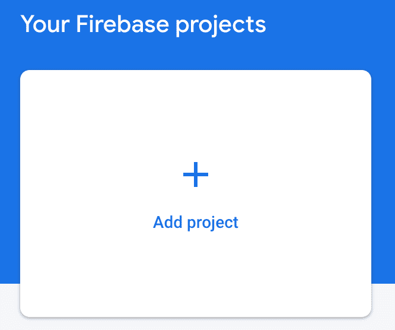
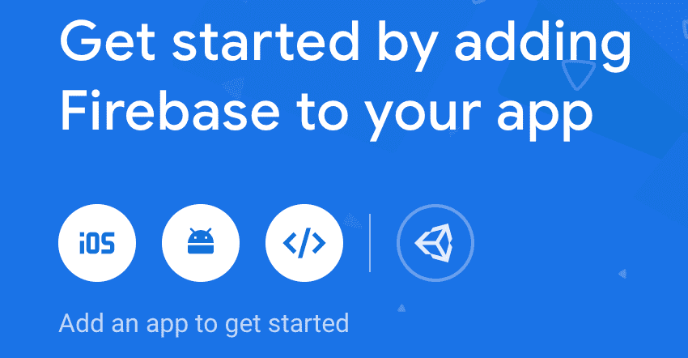
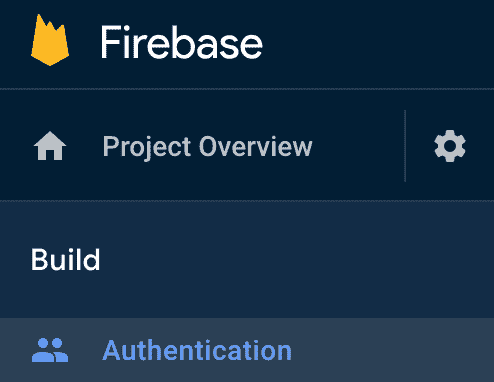
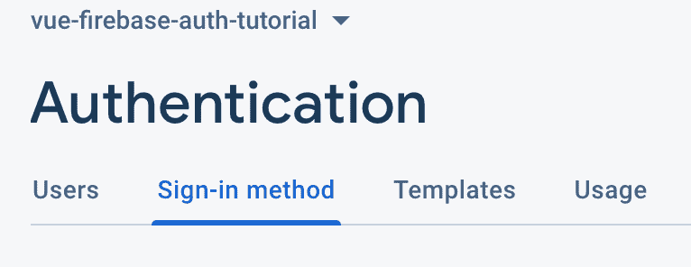
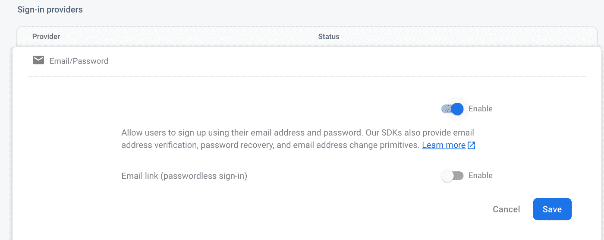
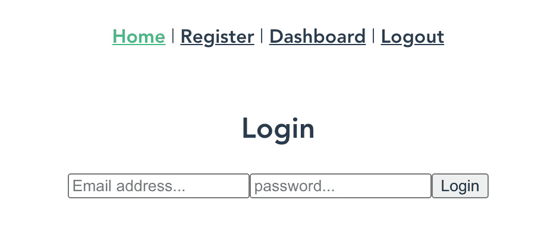
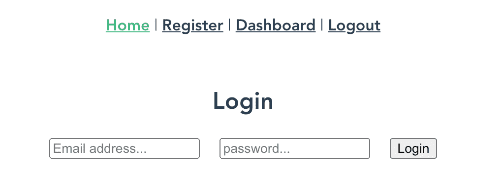
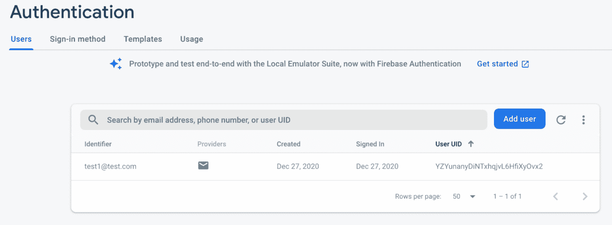

# 如何使用 Firebase 向 Vue 应用程序添加身份验证

> 原文：<https://www.freecodecamp.org/news/how-to-add-authentication-to-a-vue-app-using-firebase/>

Firebase 为您的 Vue.js 应用程序添加身份验证提供了一种非常简单快捷的方式。在本文中，我将向您展示允许用户使用他们的电子邮件和密码注册您的应用程序是多么容易。

# 我们将创造什么

我们将使用 Vue CLI 创建一个非常简单的 Vue 应用程序。我们将修改默认的 scaffolded 应用程序，以便它提供一个注册为新用户的表单、一个登录页面和一个只显示给登录用户的仪表板页面。

用户将能够使用 Firebase 中的电子邮件和密码认证系统向应用程序注册。一旦他们注册并登录，就会看到仪表板页面。

# 如何创建我们的项目

我将使用 Vue CLI 为我们搭建一个项目。为此，您需要在系统上安装 Vue CLI。如果您的 ****没有安装**** ，您可以使用以下命令进行全局安装:

```
npm install -g @vue/cli
```

现在我们可以使用 Vue CLI 来创建我们的项目。使用以下命令创建一个新项目:

```
vue create vue-firebase-auth-tutorial
```

您将被要求选择一个预设。选择“手动选择功能”，然后选择“babel”、“Router”和“Linter / Formatter”。

系统会询问您是否要对路由器使用历史模式。选择“是”(应该是默认值)。

你可以选择任何你想要的棉绒，但在本教程中，我将选择“Eslint+beauty”。

在 Vue CLI 完成后，它将为您提供切换到刚刚创建的新目录的命令以及启动服务器的命令。遵循这些指示。

一旦服务器启动，您就可以打开浏览器进入`localhost:8080`。您应该看到这个:


# 重火力点

对于本教程，我假设您已经创建了一个 Firebase 帐户。如果没有，您需要在继续之前这样做。

我们将在应用程序中使用 Firebase SDK 来提供身份验证功能。您可以使用以下命令在应用程序中安装 Firebase:

```
npm install firebase
```

# 如何在 Firebase 中创建项目

下一步是在 Firebase 控制台中添加一个项目。登录到您的 Firebase 控制台。单击按钮添加新项目。



如果你想将谷歌分析添加到你的项目中，你可以，但我不会在本教程中添加它。单击“创建项目”按钮。

一旦 Firebase 创建了您的新项目，您需要将 Firebase 添加到您的应用程序中。点击网络图标。



您将被要求输入应用程序的昵称。我已经输入了一个“Vue Firebase Auth 教程”的昵称。输入您的昵称后，点击“注册应用程序”按钮。


对于步骤 2，它将为您提供将 Firebase SDK 添加到您的应用程序中的说明。我们只需要复制 firebaseConfig 和行来初始化应用程序。

打开你的 ****main.js**** 文件。我们将在 Vue 应用程序中初始化 Firebase。在现有的导入行下面，粘贴 firebaseConfig 和行来初始化应用程序。您需要为 Firebase 添加一个导入。您的 ****main.js**** 文件应该是这样的:

```
import Vue from "vue";
import App from "./App.vue";
import router from "./router";
import firebase from "firebase";

var firebaseConfig = {
  apiKey: "YourConfigHere",
  authDomain: "YourConfigHere",
  projectId: "YourConfigHere",
  storageBucket: "YourConfigHere",
  messagingSenderId: "YourConfigHere",
  appId: "YourConfigHere"
};
// Initialize Firebase
firebase.initializeApp(firebaseConfig);

Vue.config.productionTip = false;

new Vue({
  router,
  render: h => h(App)
}).$mount("#app");
```

# 如何设置认证方法

在浏览器中打开 Firebase 控制台。从控制台中，找到您刚刚创建的项目并单击它。

在左侧导航栏的顶部，单击“Authentication”。



单击“开始”按钮。

从“身份验证”菜单中，单击“登录方法”选项卡。



将鼠标悬停在第一个条目“电子邮件/密码”上。点击铅笔图标打开一个对话框。选择启用。



点击“保存”按钮。现在，您已经添加了使用用户的电子邮件地址和密码来创建和验证用户的功能。

# 如何添加新组件

当我们用 Vue Router 创建我们的应用程序时，它自动为我们的应用程序创建了两条路由— ****Home**** 和 ****About**** 。我们将使用 ****Home**** 作为我们应用程序的登录。我们将使用关于 的 ****作为页面，为我们的应用程序注册一个新用户。****

当注册用户登录到我们的应用程序时，我们希望向他们显示仪表板页面。我们还想为用户提供一种方法来注销我们的应用程序。目前这两个选项在我们的应用程序中都不可用，所以让我们现在添加它们。

打开 ****App.vue**** 文件。目前 nav 有两个条目，分别为 ****首页**** 和 ****关于**** 。我们将更改即将注册并为 ****仪表板**** 和 ****注销**** 添加两个新条目。更新您的导航，使其看起来像这样:

```
<div id="nav">
  <router-link to="/">Home</router-link> |
  <router-link to="/register">Register</router-link> |
  <router-link to="/dashboard">Dashboard</router-link> |
  <button @click="logout">Logout</button>
</div>
```

当您单击 logout 按钮时，它会调用 logout 方法。我们稍后将对此进行定义。

# 如何创建我们的登录组件

打开 views 文件夹中的 ****Home.vue**** 文件。删除模板部分的所有 HTML 代码。用这段代码替换它，它提供了一个非常基本的登录表单。代码如下:

```
<div>   
  <form @submit.prevent="login">     
    <h2>Login</h2>     
    <input       
      type="email"       
      placeholder="Email address..."       
      v-model="email"     
    />     
    <input       
      type="password"       
      placeholder="password..."       
      v-model="password"     
    />     
    <button type="submit">
       Login
    </button>   
  </form> 
</div>
```

现在，如果您查看我们的应用程序，您会在主页上看到这样的登录表单:



我们的表单有点拥挤，输入字段和按钮相互接触。我们可以通过添加一些 CSS 样式来改变这一点。我们可以在 ****Home.vue**** 文件中添加 CSS 样式。

因为我们将使用相同的表单注册用户，所以我们需要在该组件中复制相同的 CSS 样式。因此，我们可以将样式放在 ****App.vue**** 文件中，它将样式化我们的登录和注册表单。

打开 ****App.vue** 文件。在样式中添加以下内容:**

```
input {   
  margin-right: 20px; 
}
```

现在我们的登录表单看起来更好了。



# 如何创建我们的注册表单

打开 views 文件夹中的 ****About.vue**** 文件。可以从 ****Home.vue**** 文件中复制 HTML 代码，粘贴到这个文件中。将 ****登录**** 的所有引用改为 ****注册**** 。您的 ****About.vue**** 文件应该是这样的:

```
<div>
  <form @submit.prevent="register">
    <h2>Register</h2>
    <input
      type="email"
      placeholder="Email address..."
      v-model="email"
    />
    <input
      type="password"
      placeholder="password..."
      v-model="password"
    />
    <button type="submit">Register</button>
  </form>
</div>
```

# 如何更新我们的路线

目前显示我们注册页面的网址是****/关于**** 。让我们把它改成****/寄存器**** 。打开路由器文件夹中的 ****index.js**** 文件。将****/关于**** 的第二条路线改为****/寄存器**** 。您的 routes 数组应该如下所示:

```
const routes = [
    {
        path: '/',
        name: 'Home',
        component: Home,
    },
    {
        path: '/register',
        name: 'Register',
        component: () =>
            import(/* webpackChunkName: "about" */ '../views/About.vue'),
    },
];
```

当我们在这个文件中时，让我们继续添加一个条目来显示我们的仪表板组件。添加第三条路线显示****/仪表盘**** 。您的 routes 数组现在应该如下所示:

```
const routes = [
    {
        path: '/',
        name: 'Home',
        component: Home,
    },
    {
        path: '/register',
        name: 'Register',
        component: () =>
            import(/* webpackChunkName: "about" */ '../views/About.vue'),
    },
    {
        path: '/dashboard',
        name: 'Dashboard',
        component: () =>
            import(/* webpackChunkName: "dashboard" */ '../views/Dashboard.vue'),
    },
];
```

# 如何创建仪表板组件

在 views 文件夹中新建一个名为 ****Dashboard.vue**** 的文件。这个页面应该只对已经登录到我们的应用程序的用户可见。

在模板部分添加以下 HTML 代码。

```
<div>
  <h2>Dashboard</h2>
  <p>This page is only visible to users that are currently logged in</p>
</div>
```

# 如何注册用户

早些时候，当我们更新 ****About.vue**** 文件来注册用户时，我们调用了一个名为 ****Register**** 的方法。我们需要添加注册新用户的功能。

首先，让我们看看关于如何创建基于密码的账户的 [Firebase 文档。Firebase Auth 有一个方法叫做****createuserWithEmailAndPassword****。您需要传递用户的电子邮件和密码。这个方法要么注册用户并返回一个用户对象，要么返回一个错误消息。现在让我们实现这个方法。](https://firebase.google.com/docs/auth/web/password-auth)

打开 ****About.vue**** 文件。我们需要向我们的数据对象添加电子邮件和密码。在脚本部分添加以下数据对象:

```
data() { 
  return { 
    email: '', 
    password: '', 
  }; 
},
```

接下来添加一个方法对象，其中有一个方法叫做 ****寄存器**** 。我们可以从 Firebase 文档中复制这个方法的例子。我们需要对文档中的代码进行以下更改:

*   我们将不使用用户对象
*   登录失败时显示警告
*   如果用户已注册，将他们重定向到登录页面

下面是 register 方法的代码:

```
methods: {
  register() {
    firebase
      .auth()
      .createUserWithEmailAndPassword(this.email, this.password)
      then(() => {
        alert('Successfully registered! Please login.');
        this.$router.push('/');
      })
      .catch(error => {
        alert(error.message);
      });
  },
},
```

让我们测试为我们的应用程序注册第一个用户。点击 ****注册导航中的**** 。输入邮箱地址和密码，点击 ****注册**** 按钮。

如果用户成功注册，您应该会收到一个警告，并被重定向到登录页面。

如果注册失败，您应该会收到一个带有错误消息的警报。

要检查用户是否注册成功，请转到 Firebase 控制台并单击您的项目。在左侧导航中点击 ****认证**** 。然后点击 ****用户**** 标签页。您将看到您的用户列表:



既然我们已经成功地实现了为我们的应用程序注册新用户，我们需要实现用户登录的能力。

# 如何登录用户

我们使用 Firebase 提供的代码注册了一个新用户。在 [Firebase 文档页面](https://firebase.google.com/docs/auth/web/password-auth)上，它提供了使用电子邮件地址和密码登录用户的示例代码。我们将使用的防火墙身份验证方法是****sign in with email and password****。

像 Register 一样，我们将对示例代码进行同样的更改。如果用户成功登录，我们会提醒他们，并将他们重定向到 ****仪表板**** 页面。

如果登录失败，我们会显示一条带有错误消息的警报。

下面是 ****登录**** 的方法，你应该在你的 ****Home.vue**** 文件中有。

```
methods: {
  login() {
    firebase
      .auth()
      .signInWithEmailAndPassword(this.email, this.password)
      .then(() => {
        alert('Successfully logged in');
        this.$router.push('/dashboard');
      })
      .catch(error => {
        alert(error.message);
      });
  },
},
```

# 如何创建路线守卫

我们不希望用户能够导航到****/仪表板**** ，除非他们已经登录。我们可以通过为/dashboard 添加路由保护来实现这一点。

打开路由器文件夹中的 ****index.js**** 文件。我们将向 ****/register**** 路由添加一个元密钥，表明需要认证。以下是更新后的路线:

```
{
  path: '/dashboard',
  name: 'Dashboard',
  component: () =>
    import(/* webpackChunkName: "dashboard" */ '../views/Dashboard.vue'),
  meta: {
    authRequired: true,
  },
},
```

在 Vue 路由器处理路由之前，它在每个 之前有一个名为 ****的方法。我们可以通过检查元值来查看路由是否需要认证。****

如果需要身份验证，我们需要能够检查用户是否登录。幸好 Firebase Auth 中有一个 ****currentUser**** 对象。我们将使用它来检查用户是否登录。

如果他们当前已登录，我们将显示 ****仪表板**** 页面。

如果没有，我们将显示一个警告，告诉用户他们必须登录，并重定向到 ****主页**** 页面让他们登录。

代码如下:

```
router.beforeEach((to, from, next) => {
  if (to.matched.some(record => record.meta.authRequired)) {
    if (firebase.auth().currentUser) {
      next();
    } else {
      alert('You must be logged in to see this page');
      next({
        path: '/',
      });
    }
  } else {
    next();
  }
});
```

# 如何注销用户

我们需要添加到应用程序中的最后一件事是 logout 方法。Firebase Auth 提供了我们将使用的注销方法。

打开 ****App.vue**** 文件。我们将注销用户。如果成功，他们将收到一个警告，并被重定向到 ****主页**** 页面。

如果注销失败，我们会显示一条带有错误消息的警告，并将他们重定向到 ****主页**** 页面。

添加此代码为 ****注销**** 的方法:

```
methods: {
  logout() {
    firebase
      .auth()
      .signOut()
      .then(() => {
        alert('Successfully logged out');
        this.$router.push('/');
      })
      .catch(error => {
        alert(error.message);
        this.$router.push('/');
      });
  },
},
```

在上面的代码中，我们使用了 Firebase，但是在 index.js 文件中没有对它的任何引用。我们需要加上这一点。向上滚动到现有导入行所在的文件顶部。添加这一行:

```
import firebase from 'firebase';
```

现在添加了这些内容，您可以练习注册新用户了。然后使用该用户登录，并确认您被重定向到 ****仪表板**** 页面。然后注销并确认你被重定向到 ****主页**** 页面。

祝贺您，您已经成功地将 Firebase 身份验证添加到您的 Vue 应用程序中！

# 获取代码

我的 GitHub 账户里有完整的代码。如果你得到代码，请帮我一个忙，开始我的回购。谢谢大家！

# 使用其他身份验证方法

我写过几篇后续文章，介绍如何使用其他身份验证方法向 Vue 应用程序添加身份验证。

如果想用 Auth0 进行认证，[看这篇文章](https://www.freecodecamp.org/news/how-to-add-authentication-to-a-vue-app-using-auth0/)。

如果你想使用 AWS Amplify 进行认证，[阅读这篇文章](https://www.freecodecamp.org/news/how-to-add-authentication-to-a-vue-app-using-aws-amplify/)。

# 结论

Firebase 是向 Vue 应用程序添加身份验证的一种非常有效的方法。它允许您添加身份验证，而不必编写自己的后端服务并自己实现身份验证。

希望你喜欢这篇文章。如果你喜欢，请分享。感谢阅读。

**原载于 2020 年 12 月 28 日**[](https://www.jenniferbland.com/how-to-add-authentication-to-a-vue-app-using-firebase/)***。***

## *詹妮弗·布兰德*

#### *软件工程师。谷歌开发者专家。主旨发言人。企业家。登山者。尼尔·岱尔蒙德迷。世界旅行家。[jenniferbland.com](http://jenniferbland.com/)T4[codeprep . io](http://codeprep.io/)*

#### *Fifty-seven*