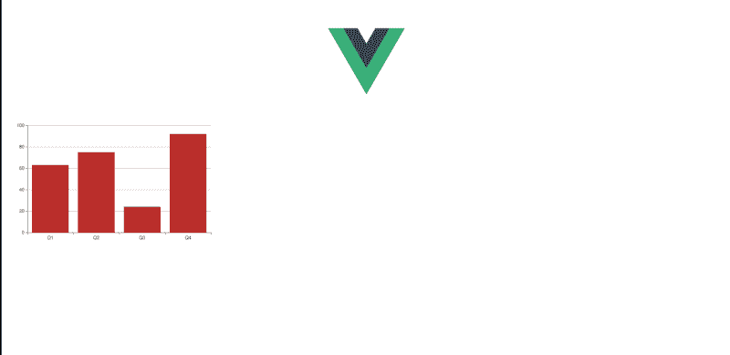
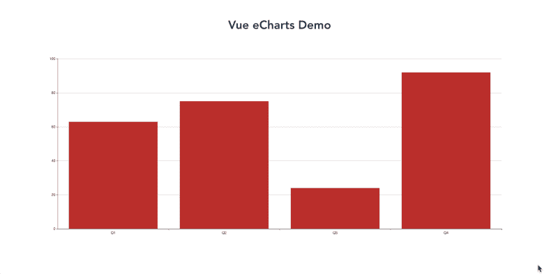
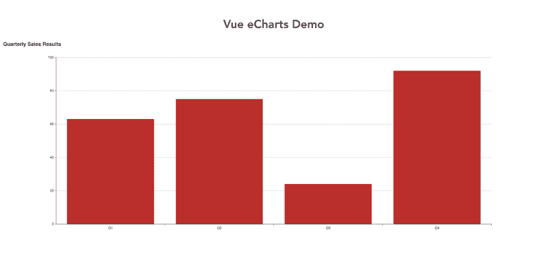
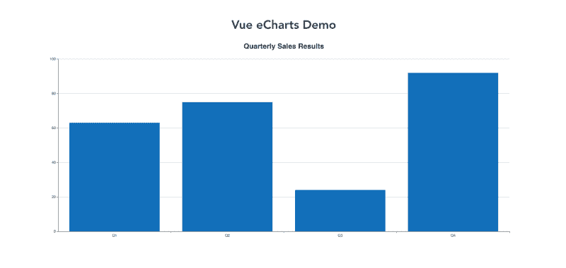
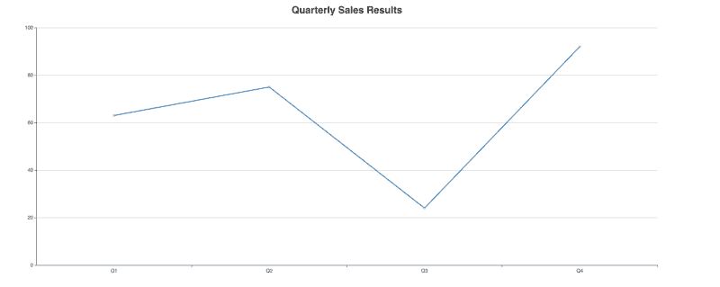
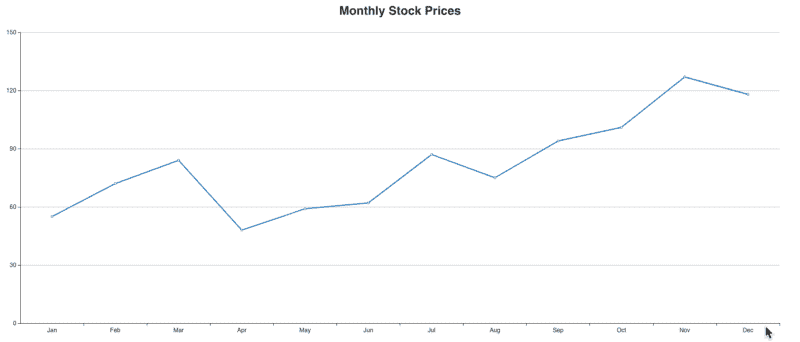

# 如何向 Vue.js 应用程序添加图表和图形

> 原文：<https://www.freecodecamp.org/news/how-to-add-charts-and-graphs-to-a-vue-js-application-29f943a45d09/>

### 使用 echarts 和 vue-echarts 的快速指南

每个应用程序的核心都是向用户显示数据。有时候，用文本显示这些数据是很有挑战性的。图表和图形是提供这些数据的可视化表示的好方法。在本文中，我将向您展示在 Vue.js 应用程序中创建视觉上吸引人的图表是多么容易。

### 入门指南

我将使用 Vue CLI 快速搭建一个入门应用程序。我将使用 echarts 和 vue-echarts 向我们的 starter 应用程序添加图表。所以让我们开始吧。

使用以下命令安装 Vue CLI:

```
npm install @vue/cli
```

接下来，我们将使用 Vue CLI 来搭建我们将使用的 Vue 应用程序。我们将使用以下命令创建应用程序:

```
vue create vue-echarts-demo
```

Vue CLI 将询问您是要使用默认预设还是手动选择功能。选择`default`。

这将在名为`vue-echarts-demo`的文件夹中创建我们的应用程序。使用以下命令切换到该目录:

```
cd vue-echarts-demo
```

#### 安装图表包

**eCharts** 是最大、使用最广泛的图表程序之一。我们将在我们的 vue 应用程序中使用它。为了让它在 Vue 中使用，我们还将使用一种叫做 **vue-echarts** 的产品。Vue-echarts 是 echarts 的一个包装器，允许它在 Vue 环境中工作。

您可以使用以下命令安装它们:

```
npm install echarts vue-echarts
```

#### 配置图表包

现在我们已经安装了图表包，我们需要将它们安装到我们的应用程序中。打开`src`目录并创建一个名为`plugins`的新目录。在新插件目录中创建一个名为`echarts.js`的文件。

我们将在这个文件中为 eCharts 创建一个 Vue 组件。该组件将在我们的应用程序中全局可用。我们需要采取的步骤是导入 vue 和 vue-echarts。接下来，我们将导入将要使用的 eCharts 的部件。我们的第一个图表将是一个条形图，所以我们也需要导入它。最后，我们创建一个名为`chart`的全局组件。您的 echarts.js 文件应该是这样的:

```
import Vue from 'vue';
import Echarts from 'vue-echarts';

import 'echarts/lib/chart/bar';

Vue.component('chart', Echarts);
```

#### 导入我们的插件文件

我们必须让 Vue 知道我们刚刚创建的文件。我们通过将它导入到`main.js`文件中来实现。打开 main.js 文件，在最后一条 import 语句后添加以下行:

```
import "@/plugins/echarts";
```

现在我们准备创建我们的第一个图表。

### 创建条形图

我们将在 HelloWorld 组件中创建所有图表。这个组件是在我们使用 Vue CLI 创建应用程序时自动创建的。

打开文件`HelloWorld.vue`并执行以下操作:

*   删除模板标签中的所有 html
*   删除脚本标签中的道具
*   删除样式标签中的所有 CSS

您的文件应该如下所示:

```
<template>
</template>

<script>
export default {
  name: 'HelloWorld',
}
</script>

<style scoped>
</style>
```

在我们的插件中，我们称我们的组件为`chart`。Vue-echarts 使用一个叫做`options`的道具，通过使用你传递给它的数据来构建图表。让我们用它来创建第一个图表的 html。在模板标记内添加以下代码:

```
<chart :options="chartOptionsBar"></chart>
```

#### 定义我们的图表

接下来，我们需要定义将用于创建图表的数据。在脚本标记中，创建一个新的数据对象，并为 chartOptionsBar 添加一个条目。您的脚本标记应该如下所示:

```
<script>
export default {
  name: 'HelloWorld',
  data: () => ({
    chartOptionsBar: {}
  })
}
</script>
```

#### 创建图表数据

我们的第一个条形图将包含一个虚构公司的季度销售数据。每个季度将显示在图表的 x 轴上。销售额将显示在图表的 y 轴上。

让我们先定义我们的 xAxis。我们将提供一个数据数组，其中包含一年中每个季度的条目。将以下内容添加到我们的`chartOptionsBar`对象中:

```
chartOptionsBar: {
  xAxis: {
    data: ['Q1', 'Q2', 'Q3', 'Q4']
  }
}
```

我们的 yAxis 只会显示每个季度的销售额。因此，我们不需要为它创建数据数组。相反，我们告诉它将显示`value`。将以下内容添加到 chartOptionsBar 对象中:

```
chartOptionsBar: {
  xAxis: {
    data: ['Q1', 'Q2', 'Q3', 'Q4']
  },
  yAxis: {
    type: 'value'
  }
}
```

最后一步是提供将在我们的条形图中显示的数据。您可以通过添加一个系列数组来实现这一点。Series 是一个对象数组。每个对象都定义了要创建的图表的类型，并将有一个值的数据数组绘制在图表上。你可以用这个来添加:

```
chartOptionsBar: {
  xAxis: {
    data: ['Q1', 'Q2', 'Q3', 'Q4']
  },
  yAxis: {
    type: 'value'
  },
  series: [
    {
      type: 'bar',
      data: [63, 75, 24, 92]
    }
  ]
}
```

您可以使用以下命令启动服务器:

```
npm run serve
```

然后打开浏览器到 localhost:8080，您将看到第一个图表，如下所示:



Our first bar chart

#### 为我们的图表添加样式

默认情况下，vue-echarts 将图表的宽度设置为 600 像素。我更希望我们的图表是容器的全宽。为此，我将把图表放在一个 div 中。我给这个 div 一个`chart-wrapper`的类。我的模板现在看起来像这样:

```
<template>
  <div class="chart-wrapper">
    <chart :options="chartOptionsBar"></chart>
  </div>
</template>
```

接下来，我想给新的`chart-wrapper`类添加一些样式。我将使这个类的宽度等于屏幕大小，高度为 700 像素。以下是我添加的样式:

```
.chart-wrapper {
  width: 100%;
  height: 700px;
}
```

Vue-echarts 在其所有图表中添加了一个名为`echarts`的类别。我们也将在 CSS 中设置样式。我们将告诉这个类占据其容器`chart-wrapper`的 100%的高度和宽度。下面是我添加的 CSS:

```
.echarts {
  width: 100%;
  height: 100%;
}
```

当我们添加样式时，我想用标题替换 Vue 徽标。打开 App.vue 文件。删除标签，替换为:

```
<h1>Vue eCharts Demo</h1>
```

现在我们的图表看起来像这样:



Updated bar chart with our styling

#### 添加标题和颜色

这是我们第一张图表的良好开端。当人们查看图表时，他们不确定他们正在查看什么。我们可以通过在图表中添加一个标题来解决这个难题。

您想要使用的每个电子海图组件都必须被导入。标题是一个组件，所以我们需要导入它。打开 echarts.js 文件并添加以下行:

```
import 'echarts/lib/component/title';
```

接下来，我们可以向条形图添加一个标题。回到 HelloWorld.vue 组件，让我们给我们的`chartOptionsBar`对象添加一个标题。

```
chartOptionsBar: {
  xAxis: {
    data: ['Q1', 'Q2', 'Q3', 'Q4']
  },
  yAxis: {
    type: 'value'
  },
  series: [
    {
      type: 'bar',
      data: [63, 75, 24, 92]
    }
  ],
  title: {
    text: 'Quarterly Sales Results'
  }
}
```

默认情况下，eCharts 将标题放在条形图的左侧。这是我们的图表现在的样子:



Adding a title for our chart

我不喜欢这个标题的样子，所以让我们改变它。我希望标题有一个更大的字体大小，并居中。图表有一个名为`x`的选项，代表水平面。我希望标题以此为中心。为了让标题有更大的字体，我们需要添加一个`textStyle`。我想做的最后一个更改是将条形设置为不同的颜色。以下是我现在的选择:

```
chartOptionsBar: {
  xAxis: {
    data: ['Q1', 'Q2', 'Q3', 'Q4']
  },
  yAxis: {
    type: 'value'
  },
  series: [
    {
      type: 'bar',
      data: [63, 75, 24, 92]
    }
  ],
  title: {
    text: 'Quarterly Sales Results',
    x: 'center',
    textStyle: {
      fontSize: 24
    }
  },
  color: ['#127ac2']
}
```

这是我的条形图的最终版本:



The final version of our bar chart

### 创建折线图

接下来，我将向您展示如何创建折线图。我们将创建一个折线图，显示一家虚构公司的月度股票价格。所以让我们开始吧。

首先，我们需要创建一个新的图表包装器 div 和一个新的图表元素。新的图表元素将从`chartOptionsLine`对象中获取其选项。下面是我的 html 代码现在的样子:

```
<div>
  <div class="chart-wrapper">
    <chart :options="chartOptionsBar"></chart>
  </div>
  <hr />
  <div class="chart-wrapper">
    <chart :options="chartOptionsLine"></chart>
  </div>
</div>
```

接下来，在我们的数据对象中创建一个新的 chartOptionsLine 对象。复制现有的 chartOptionsBar 对象，而不是创建新对象。将副本重命名为`chartOptionsLine`。目前，我们只需要将系列中的类型从条形改为线形。下面是我们的`chartOptionsLine`对象的样子:

```
chartOptionsLine: {
  xAxis: {
    data: ["Q1", "Q2", "Q3", "Q4"]
  },
  yAxis: {
    type: "value"
  },
  series: [
    {
      type: "line",
      data: [63, 75, 24, 92]
    }
  ],
  title: {
    text: "Quarterly Sales Results",
    x: "center",
    textStyle: {
      fontSize: 24
    }
  },
  color: ["#127ac2"]
}
```

如果你打开浏览器，你会发现折线图没有显示。这是因为我们需要将它导入到我们的插件中，就像我们对条形图所做的那样。

打开 echarts.js 并添加以下行:

```
import 'echarts/lib/chart/line';
```

我们现在有了这个线图:



Our initial line chart

#### 更改标题和数据

我们希望折线图显示一家虚构公司的月度股票价格。我们需要四个以上的数据点。我们的线图将有 12 个数据点。我们还希望 x 轴上显示的标题是一年中的月份，而不是季度。我们还需要更改图表的标题。

我们可以用这些值更新我们的 chartOptionsLine:

```
chartOptionsLine: {
  xAxis: {
    data: [
      "Jan",
      "Feb",
      "Mar",
      "Apr",
      "May",
      "Jun",
      "Jul",
      "Aug",
      "Sep",
      "Oct",
      "Nov",
      "Dec"
    ]
  },
  yAxis: {
    type: "value"
  },
  series: [
    {
      type: "line",
      data: [55, 72, 84, 48, 59, 62, 87, 75, 94, 101, 127, 118]
    }
  ],
  title: {
    text: "Monthly Stock Prices",
    x: "center",
    textStyle: {
      fontSize: 24
    }
  },
  color: ["#127ac2"]
}
```

现在我们的折线图看起来像这样:



Final Line Chart

### 访问图表文档

除了条形图和折线图，eCharts 还提供了更多类型的图表。eCharts 提供了大量选项，您可以将它们添加到图表中。例如，您可以添加图例或工具提示。

如果您想了解其他可用的图表类型和选项，可以阅读它们的文档。这里有一个到文档的[链接。](https://echarts.apache.org/option.html#title)

### 获取代码

这篇文章的所有代码都可以在我的 GitHub 账号中找到[。](https://github.com/ratracegrad/vue-eCharts-demo)

### 结论

使用 eCharts 和 vue-echarts 可以非常容易地将自定义图表和图形添加到 Vue.js 应用程序中。图表为用户提供了一种可视化数据的方式。

如果您有任何反馈，请在下面留下您的评论。请为这篇文章鼓掌。感谢阅读。