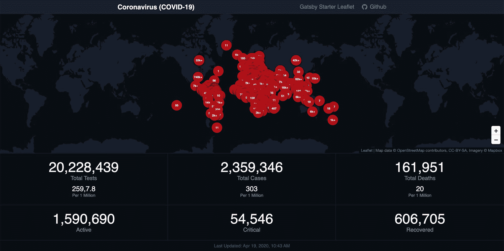
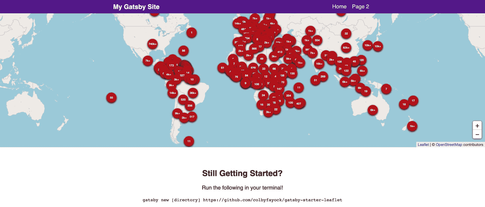
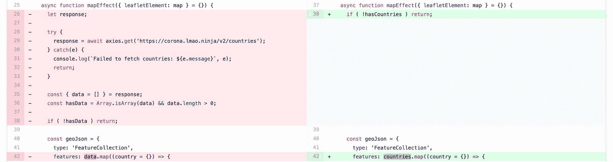
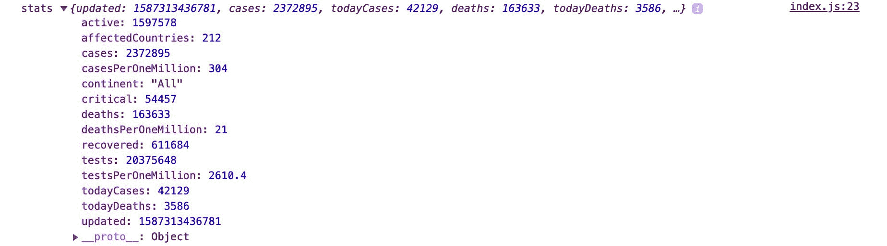
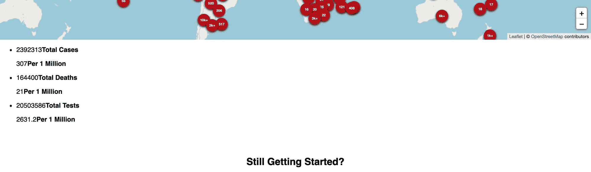
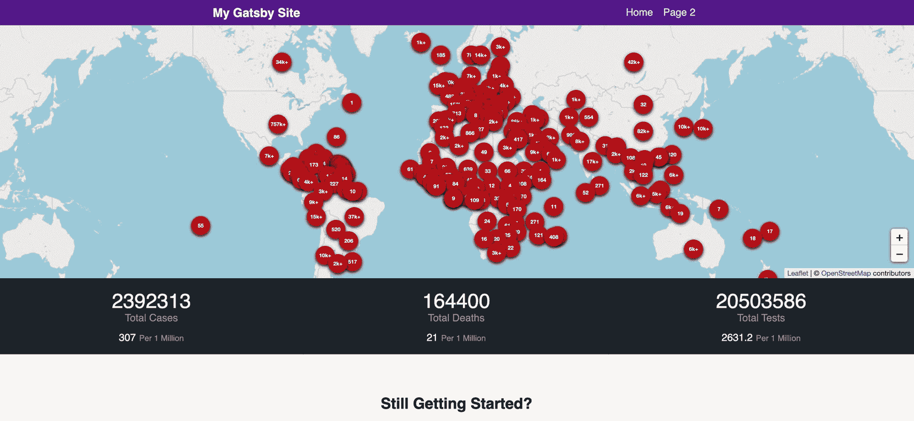
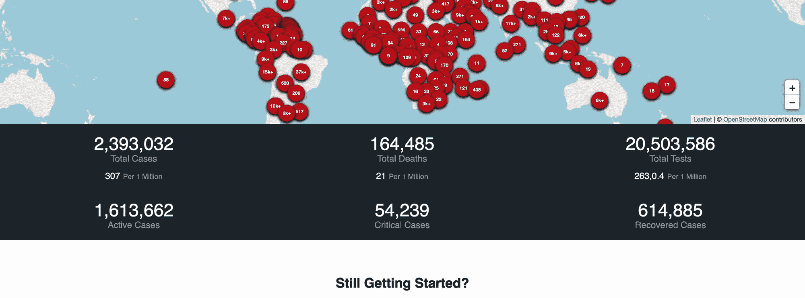
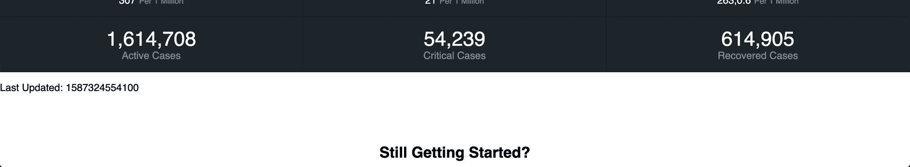
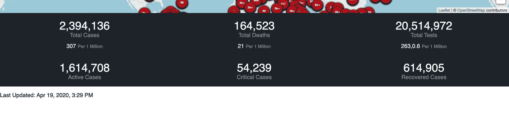
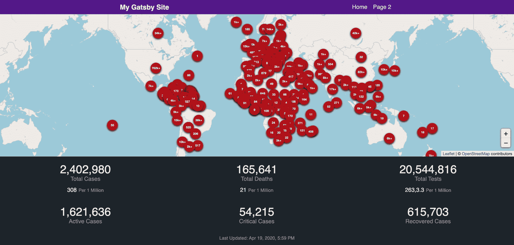

# 如何使用 Gatsby 将冠状病毒(新冠肺炎)病例统计数据添加到 React map 仪表盘

> 原文：<https://www.freecodecamp.org/news/how-to-add-coronavirus-covid-19-case-statistics-to-your-map-dashboard-in-gatsby-and-react-leaflet/>

之前，我们创建了一个地图，显示每个国家的冠状病毒(新冠肺炎)病例的交互视图。我们如何用一些案例统计来扩展这一点，以显示关于对我们的世界的影响的最新数据？

*作者注:与之前类似，该仪表板旨在演示和验证使用真实世界数据构建仪表板的概念。虽然根据 NovelCOVID API，这些数据应该是准确的，但我建议使用像约翰霍普金斯大学仪表板(T2)这样的工具进行完整准确的分析。呆在家里，注意安全！❤️*

*   我们要建造什么？
*   开始之前我们需要什么？
*   [步骤 1:更新我们获取数据和统计数据的方式](#step-1-update-how-we-fetch-our-data-and-fetch-the-statistics)
*   [步骤 2:向我们的仪表板添加统计数据](#step-2-adding-statistics-to-our-dashboard)
*   [第三步:让数据人性化](#step-3-make-the-data-human-friendly)
*   [第四步:添加最后更新日期](#step-4-add-the-last-updated-date)
*   接下来我能做什么？

[https://www.youtube.com/embed/9bfxeod27fU?feature=oembed](https://www.youtube.com/embed/9bfxeod27fU?feature=oembed)

## 我们要建造什么？

我们将使用一些可以从 [NovelCOVID API](https://github.com/NovelCOVID/API) 中检索到的基本统计数据来扩展我们的[原始地图演示](https://www.colbyfayock.com/2020/03/how-to-create-a-coronavirus-covid-19-dashboard-map-app-with-gatsby-and-leaflet)。为了得到一个想法，这里是[我的演示](https://coronavirus-map-dashboard.netlify.app/)我基于这个。



Coronavirus (COVID-19) map demo with dashboard statistics

虽然你不需要完成[第 1 部分](https://www.colbyfayock.com/2020/03/how-to-create-a-coronavirus-covid-19-dashboard-map-app-with-gatsby-and-leaflet/)来应用这些概念，但它绝对有帮助，它让你为你的仪表板建立一个地图。如果你想从那里开始，这是我推荐的，先看看[如何用盖茨比和传单](https://www.colbyfayock.com/2020/03/how-to-create-a-coronavirus-covid-19-dashboard-map-app-with-gatsby-and-leaflet/)创建一个冠状病毒(新冠肺炎)仪表盘&地图应用。

## 哇，一个地图应用？

没错。如果你之前没有玩过地图，也不要气馁！这并不像你想象的那么糟糕。如果你更愿意从映射基础开始，你可以先[阅读更多关于映射如何工作的信息](https://www.freecodecamp.org/news/easily-spin-up-a-mapping-app-in-react-with-leaflet/)。

## 开始之前我们需要什么？

对于本演练，您非常需要某种形式的 React 应用程序。我将使用我们在上次演练中构建的仪表板，其中包括每个国家冠状病毒(新冠肺炎)病例的[地图。](https://www.colbyfayock.com/2020/03/how-to-create-a-coronavirus-covid-19-dashboard-map-app-with-gatsby-and-leaflet/)



Coronavirus (COVID-19) map dashboard

我建议从之前的教程开始，但如果你想跳过地图重新开始，最简单的方法可能是使用 [Create React App](https://github.com/facebook/create-react-app) 、 [Gatsby](https://www.gatsbyjs.org/) 或 [Next.js](https://nextjs.org/) 。

## 步骤 1:更新我们获取数据和统计数据的方式

为了开始使用我们的统计仪表板，我们将通过改变获取数据的方式来做一些准备工作。这里的目标是，我们将以一种可重用的方式包装我们的请求逻辑，以便我们可以将它用于我们的国家数据和我们的新统计数据。

### 创建一个新的 React 钩子来获取数据

开始吧，我们要做的第一件事是创建一个新的 [React 钩子](https://reactjs.org/docs/hooks-reference.html)，它将作为我们获取数据的方式。首先，在 hooks 目录中创建一个名为`useTracker.js`的新文件，并在`hooks/index.js`中添加一行来导出它:

```
// New file src/hooks/useTracker.js
// This will be empty for now
```

```
// Inside hooks/index.js
export { default as useTracker } from './useTracker'; 
```

在我们的`useTracker.js`文件中，我们将设置我们的请求逻辑。这是一个很长的文件，所以在我们介绍它的作用之前，请确保您复制并粘贴了整个文件:

```
import { useEffect, useState } from 'react';
import axios from 'axios';

const API_HOST = 'https://corona.lmao.ninja/v2';

const ENDPOINTS = [
  {
    id: 'all',
    path: '/all',
    isDefault: true
  },
  {
    id: 'countries',
    path: '/countries'
  }
]

const defaultState = {
  data: null,
  state: 'ready'
}

const useTracker = ({ api = 'all' }) => {

  const [tracker = {}, updateTracker] = useState(defaultState)

  async function fetchTracker() {
    let route = ENDPOINTS.find(({ id } = {}) => id === api);

    if ( !route ) {
      route = ENDPOINTS.find(({ isDefault } = {}) => !!isDefault);
    }

    let response;

    try {
      updateTracker((prev) => {
        return {
          ...prev,
          state: 'loading'
        }
      });
      response = await axios.get(`${API_HOST}${route.path}`);
    } catch(e) {
      updateTracker((prev) => {
        return {
          ...prev,
          state: 'error',
          error: e
        }
      });
      return;
    }

    const { data } = response;

    updateTracker((prev) => {
      return {
        ...prev,
        state: 'ready',
        data
      }
    });

  }

  useEffect(() => {
    fetchTracker()
  }, [api])

  return {
    fetchTracker,
    ...tracker
  }
};

export default useTracker; 
```

从顶部开始:

*   我们导入依赖关系:我们将使用 reactions`useEffect`和`useState`钩子来管理我们的请求
*   我们定义了默认常量:我们有一个用于数据的基本 API 端点，一个我们将使用的可用端点列表，以及一个将存储我们的数据的状态对象
*   我们定义了我们的`useTracker`钩子:我们的钩子包含一个参数`api`,它允许我们指定使用哪个端点来发出请求
*   我们建立了一个状态实例:我们想要跟踪我们获取的数据，所以我们创建了一个能够更新的`tracker`状态实例
*   我们创建了一个异步`fetchTracker`函数:我们将使用它来发出实际的请求
*   在我们的函数内部:我们首先找到 API 路由并创建我们的 URL，将我们的 state 实例更新为“loading”状态，尝试发出请求，捕捉任何错误(如果有的话),最后，如果请求成功，我们用该数据更新我们的状态
*   我们触发我们的函数:使用一个`useEffect`钩子，我们触发我们的`fetchTracker`函数来发出请求。我们只有一个属地`api`。这意味着该函数将仅在第一次以及我们传入的`api`值发生变化时触发。我们不会改变这个值，但是在其他情况下，如果您动态地改变所使用的 API，可能会有所帮助
*   我们返回跟踪器:返回的对象既包括我们的`tracker`数据，也包括我们的`fetchTracker`函数，如果我们愿意，我们可以用它来重新提取数据

有了这些，我们有了一个全新的钩子，它将从 NovelCOVID API 获取数据。

### 使用我们新的跟踪钩

为了使用这个钩子，让我们跳到`src/pages/index.js`，删除我们的`axios`导入(如果它在的话),并导入我们的钩子:

```
import { useTracker } from 'hooks'; 
```

使用我们的钩子，让我们替换原来的国家数据请求。首先，将以下内容添加到`IndexPage`组件的顶部:

```
const { data: countries = [] } = useTracker({
  api: 'countries'
});

const hasCountries = Array.isArray(countries) && countries.length > 0; 
```

这将让我们获取我们国家的数据，并让我们知道我们是否有任何结果。接下来，让我们替换我们最初的请求。

在我们的`mapEffect`函数中，除了响应、析构的数据对象和`hasData`常量之外，让我们移除`axios`请求。



Code diff showing update to map effect

然后，将`hasData`替换为`hasCountries`:

```
if ( !hasCountries ) return; 
```

在我们映射特征的`geoJson`对象中，用`countries`替换`data`:

```
features: countries.map((country = {}) => { 
```

此时，如果您点击保存并刷新，您应该不会注意到与之前有任何不同。

### 添加对我们统计数据的请求

既然我们正在使用我们的`useTracker`钩子来获取我们的国家数据，让我们也使用它来获取我们的统计数据。

就在我们之前设置`useTracker`钩子的地方，让我们添加另一个请求:

```
const { data: stats = {} } = useTracker({
  api: 'all'
}); 
```

如果我们在下面添加一个`console.log`语句来查看`stats`中的内容:

```
console.log('stats', stats); 
```

我们应该看到我们的`stats`数据对象被注销了！



Using console.log to show Coronavirus (COVID-19) statistics

[跟随提交！](https://github.com/colbyfayock/my-coronavirus-map/commit/fe9d85e57f7474a86d38213676bf62df4b6168a4)

## 步骤 2:向我们的仪表板添加统计数据

既然我们有可用的数据，就让我们使用它吧！

要开始向仪表板添加统计数据，让我们创建一个数据结构，它将允许我们轻松地配置我们想要使用的数据。

为此，我们首先在页面组件顶部的`hasCountries`下创建一个名为`dashboardStats`的新数组:

```
const dashboardStats = []; 
```

在这个数组中，让我们添加一些新的对象，这些对象指定了我们从请求的`stats`对象中提取的数据。首先，让我们尝试添加:

```
const dashboardStats = [
  {
    primary: {
      label: 'Total Cases',
      value: stats?.cases
    },
    secondary: {
      label: 'Per 1 Million',
      value: stats?.casesPerOneMillion
    }
  },
  {
    primary: {
      label: 'Total Deaths',
      value: stats?.deaths
    },
    secondary: {
      label: 'Per 1 Million',
      value: stats?.deathsPerOneMillion
    }
  },
  {
    primary: {
      label: 'Total Tests',
      value: stats?.tests
    },
    secondary: {
      label: 'Per 1 Million',
      value: stats?.testsPerOneMillion
    }
  }
] 
```

我们将它分成`primary`和`secondary`键的原因是，我们将使用它们来区分逻辑上相似的统计数据，我们希望它们的样式有所不同。

*注意:如果你不熟悉`?.`语法，它被称为[可选链接](https://developer.mozilla.org/en-US/docs/Web/JavaScript/Reference/Operators/Optional_chaining)。这允许我们链接我们的属性，而不用担心对象是否存在。如果`stats`未定义，它将简单地返回 undefined，而不是抛出一个错误。*

使用我们的统计数据，让我们将追踪器添加到地图中。让我们移除当前的`<Map>`组件，并将它嵌套在跟踪器 div 中，如下所示:

```
<div className="tracker">
  <Map {...mapSettings} />
  <div className="tracker-stats">
    <ul>
      { dashboardStats.map(({ primary = {}, secondary = {} }, i) => {
        return (
          <li key={`Stat-${i}`} className="tracker-stat">
            { primary.value && (
              <p className="tracker-stat-primary">
                { primary.value }
                <strong>{ primary.label }</strong>
              </p>
            )}
            { secondary.value && (
              <p className="tracker-stat-secondary">
                { secondary.value }
                <strong>{ secondary.label }</strong>
              </p>
            )}
          </li>
        );
      })}
    </ul>
  </div>
</div> 
```

如果您一直在跟踪的话，这段代码应该紧跟在`<Helmet>`组件之后。

来解释我们在做什么:

*   我们正在创建一个“跟踪器”div 来组织我们的统计数据
*   我们将我们的`<Map`组件移动到这个跟踪器中
*   我们创建了一个名为“跟踪统计”的独立部分
*   在其中，我们创建了一个无序列表(`ul`)
*   在我们的列表中，我们循环遍历所有的统计数据
*   对于每个 stat，我们创建一个新的列表元素(`li`)并包含 2 个可选段落，其中包含我们的主要 stat 数据和次要 stat 数据

重新加载页面后，我们应该会看到一些统计数据:



Adding the first statistics to the page

现在我们的页面上已经有了统计数据，让我们让它们看起来像是在仪表板中。

让我们在我们的`src/assets/stylesheets/components`目录中创建一个名为`_tracker.scss`的新文件。一旦创建了该文件，另外将它添加到`src/assets/stylesheets/components/__components.scss`文件中:

```
@import "tracker"; 
```

随着我们新的组件样式文件准备就绪，让我们添加一些样式到`_tracker.scss`:

```
.tracker-stats {

  color: white;
  background-color: $blue-grey-900;
  border-top: solid 1px darken($blue-grey-900, 5);

  ul {
    display: grid;
    grid-template-columns: 1fr 1fr 1fr;
    list-style: none;
    padding: 0;
    margin: 0;
  }

}

.tracker-stat {

  font-size: 2em;
  text-align: center;
  padding: .5em;
  border-right: solid 1px darken($blue-grey-900, 5);
  border-bottom: solid 1px darken($blue-grey-900, 5);

  strong {
    font-weight: normal;
    color: $blue-grey-300;
  }

}

.tracker-stat-primary {

  margin: 0;

  strong {
    display: block;
    font-size: .5em;
  }

}

.tracker-stat-secondary {

  font-size: .5em;
  margin: .8em 0 0;

  strong {
    font-size: .8em;
    margin-left: .4em;
  }

} 
```

上图——我们正在添加颜色和组织效果，比如使用 [CSS Grid](https://developer.mozilla.org/en-US/docs/Web/CSS/CSS_Grid_Layout) ,让我们的数据以一种易于阅读的方式组织起来，并且看起来不错！我们还利用了项目中使用的一些预先存在的颜色变量来保持颜色使用的一致性。

保存这些样式并重新加载页面后，页面看起来应该会好很多:



Adding case statistics to the dashboard

从这里开始，你可以随意添加更多的属性或者根据你的喜好进行调整。在我创建的演示中，我添加了活动案例、关键案例和恢复案例的统计数据。如果你想做同样的事情，你可以[检查提交](https://github.com/colbyfayock/my-coronavirus-map/commit/eb8a28c9e46dc2327ada0df21b250422e55d304c)。

[跟随提交！](https://github.com/colbyfayock/my-coronavirus-map/commit/eb8a28c9e46dc2327ada0df21b250422e55d304c)

## 步骤 3:使数据对人友好

现在，本演练的其余部分可以被认为是可选的，但最终我们希望人们能够阅读这些统计数据，对不对？所以让我们把数字弄得更容易读一点。

首先，让我们打开我们的`src/lib/util.js`文件并添加这个函数:

```
/**
 * commafy
 * @description Applies appropriate commas to large numbers
 */

export function commafy(value) {
  let numberString = `${value}`;

  numberString = numberString.split('');

  numberString.reverse();

  numberString = numberString.reduce((prev, current, index) => {
    const shouldComma = (index + 1) % 3 === 0 && index + 1 < numberString.length;
    let updatedValue = `${prev}${current}`;
    if ( shouldComma ) {
      updatedValue = `${updatedValue},`;
    }
    return updatedValue;
  }, '');

  numberString = numberString.split('');
  numberString.reverse()
  numberString = numberString.join('');

  return numberString;
} 
```

这个函数将一个数字转换成一个带逗号的字符串。浏览它的功能:

*   接受一个值作为参数。在我们的使用中，这个值很可能是一个数字。
*   它将值转换成字符串。我们将使用它来为我们的数字添加逗号。
*   我们把这个字符串拆分成一个数组，然后反转它。我们想把它反过来，因为这样可以更容易地根据索引添加逗号。
*   我们使用 javascript `reduce`函数来重新创建我们的数字字符串。在每 3 个数字后，我们要加一个逗号。
*   一旦我们有了带逗号的新值，我们想要重新反转它。所以我们再次拆分它，反转字符数组，重新连接它，这就是我们返回的内容

现在我们有了我们的`commafy`函数，让我们使用它。回到`src/pages/index.js`内部，让我们在页面顶部导入我们的函数:

```
import { commafy } from 'lib/util'; 
```

然后，在我们的`dashboardStats`数组中，让我们用一个三元表达式和函数替换每个数字值，如果数字可用的话，它将转换我们的数字:

```
value: stats ? commafy(stats?.cases) : '-' 
```

这一行检查`stats`是否存在。如果是这样，我们就用`cases`值`commafy`。如果它不存在，我们返回一个`-`来表示它不可用。

一旦我们对所有的数字重复这个过程，我们可以保存，重新加载页面，并看到我们的人类友好的数字！



Formatting the statistics to be human readable

[跟随提交！](https://github.com/colbyfayock/my-coronavirus-map/commit/90f266c17815239d9d3356d9b9d660915fdc26c2)

## 第 4 步:添加最后更新日期

最后，我们希望确保人们了解最新信息，并了解该数据的最后更新时间。幸运的是，我们的 API 为我们提供了最后更新的日期，所以让我们使用它吧！

在我们的“追踪器”`div`底部的`tracker-stats`下，让我们添加以下内容:

```
<div className="tracker-last-updated">
  <p>
    Last Updated: { stats?.updated }
  </p>
</div> 
```

这创建了一个新的部分，我们简单地从统计数据中包含了`updated`属性。如果我们保存并重新加载页面，我们可以看到最后更新的日期！



Adding last updated to the dashboard

但是我们怎么能理解这个数字呢，除非你是抓取这篇博文的电脑？所以让我们把它改成人类可读的格式，就像我们处理数字一样。

在我们的`src/lib/util.js`文件中，让我们添加另一个函数:

```
/**
 * friendlyDate
 * @description Takes in a date value and returns a friendly version
 */

export function friendlyDate(value) {
  const date = new Date(value);
  return new Intl.DateTimeFormat('en', {
    year: 'numeric',
    month: 'short',
    day: '2-digit',
    hour: 'numeric',
    minute: 'numeric'
  }).format(date);
} 
```

这个函数创建一个新的`Date`对象，然后使用 javascript [国际日期时间格式 API](https://developer.mozilla.org/en-US/docs/Web/JavaScript/Reference/Global_Objects/DateTimeFormat) 将其转换成友好可读的格式！

保存后，让我们将它导入到`src/pages/index.js`顶部的`commafy`函数旁边:

```
import { commafy, friendlyDate } from 'lib/util'; 
```

然后我们可以像更新数字一样更新代码:

```
Last Updated: { stats ? friendlyDate(stats?.updated) : '-' } 
```

如果我们保存并重新加载，我们会以人类可读的方式看到它！



Formatting the last updated date

最后，我们的“最后更新”应该看起来与仪表板的其余部分相适应，所以让我们再添加一些样式。在我们之前使用的`_tracker.scss`文件中:

```
.tracker-last-updated {

  color: white;
  background-color: $blue-grey-900;
  padding: .8em 0;

  p {
    color: $blue-grey-300;
    font-size: .8em;
    text-align: center;
    margin: 0;
  }

} 
```

一旦我们点击保存并刷新浏览器，我们的控制面板统计数据就会显示上次更新的时间！？



Final dashboard with formatted lasted updated date

[跟随提交！](https://github.com/colbyfayock/my-coronavirus-map/commit/408286aecb32223c8782eb1539f5563135c75dfb)

## 接下来我能做什么？

### 使标记工具提示数据对人友好

现在我们有了方便的`commafy`和`friendlyDate`函数，我们可以重用这些函数来清理国家标记弹出窗口中的数据！

### 使用 fetchTracker 函数轮询更新

在我们创建的`useTracker`钩子内部，我们导出了一个名为`fetchTracker`的函数。这允许我们强制请求 API 获取新数据。为了确保我们的地图保持最新，即使有人没有刷新页面，我们可以在 javascript 中创建一个[计时器](https://developer.mozilla.org/en-US/docs/Web/API/WindowOrWorkerGlobalScope/setTimeout)，定期调用该函数来更新我们的仪表板数据。

### 在重新添加新图层之前清除地图图层

我们目前没有做的一件事是在添加新层之前清理旧层。地图的设置方式是，一直把它们放在最上面。我们能做的是，在添加所有新图层之前，我们可以清除旧图层。[看看这个提交](https://github.com/colbyfayock/my-coronavirus-map/commit/cad3b5a6e31a6ae090549c12e40a08fee4db4aa5)开始吧！

## 想了解更多关于地图的知识？

您可以查看我的一些其他资源来开始:

*   [如何创建一个冠状病毒(新冠肺炎)仪表板&地图应用与盖茨比反应和传单](https://www.colbyfayock.com/2020/03/how-to-create-a-coronavirus-covid-19-dashboard-map-app-with-gatsby-and-leaflet)(本文第一部分)
*   [如何使用 React 传单和传单 Gatsby Starter 设置自定义地图框底图样式](https://www.colbyfayock.com/2020/04/how-to-set-up-a-custom-mapbox-basemap-style-with-react-leaflet-and-leaflet-gatsby-starter/)
*   [谁都会地图！灵感和对地图世界的介绍](https://www.colbyfayock.com/2020/03/anyone-can-map-inspiration-and-an-introduction-to-the-world-of-mapping)
*   [如何用盖茨比和传单创建一个夏季公路旅行地图应用](https://www.colbyfayock.com/2020/03/how-to-create-a-summer-road-trip-mapping-app-with-gatsby-and-leaflet)
*   [如何用盖茨比和 React 传单创建自己的圣诞老人追踪器](https://www.colbyfayock.com/2019/12/create-your-own-santa-tracker-with-gatsby-and-react-leaflet/)
*   [如何使用传单以简单的方式创建地图应用](https://www.freecodecamp.org/news/easily-spin-up-a-mapping-app-in-react-with-leaflet/)

[](https://twitter.com/colbyfayock)

*   [？在 Twitter 上关注我](https://twitter.com/colbyfayock)
*   [？️订阅我的 Youtube](https://youtube.com/colbyfayock)
*   [✉️注册我的简讯](https://www.colbyfayock.com/newsletter/)