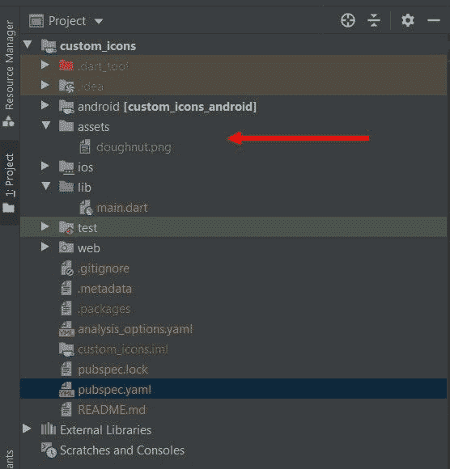
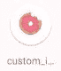
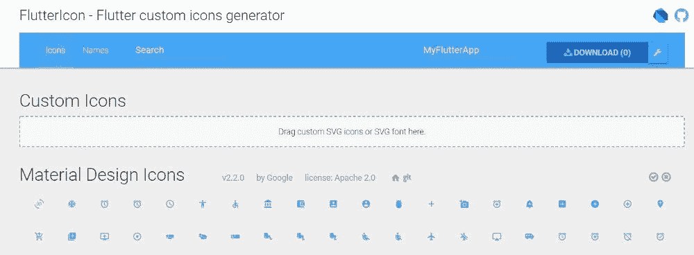
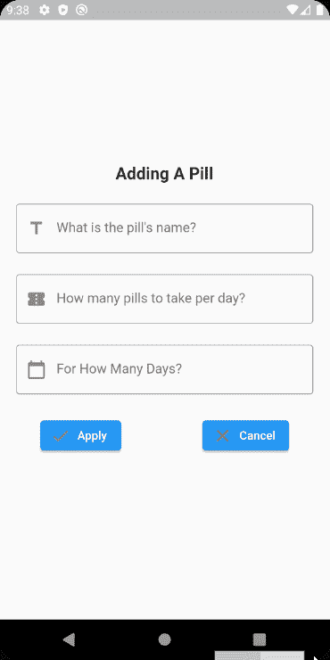
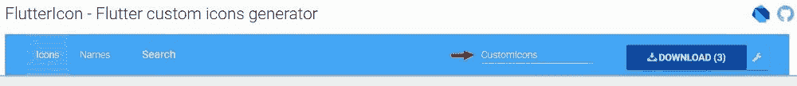
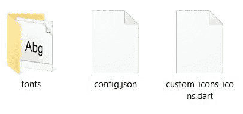
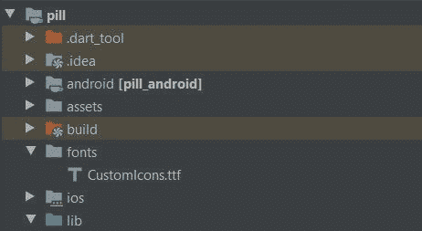
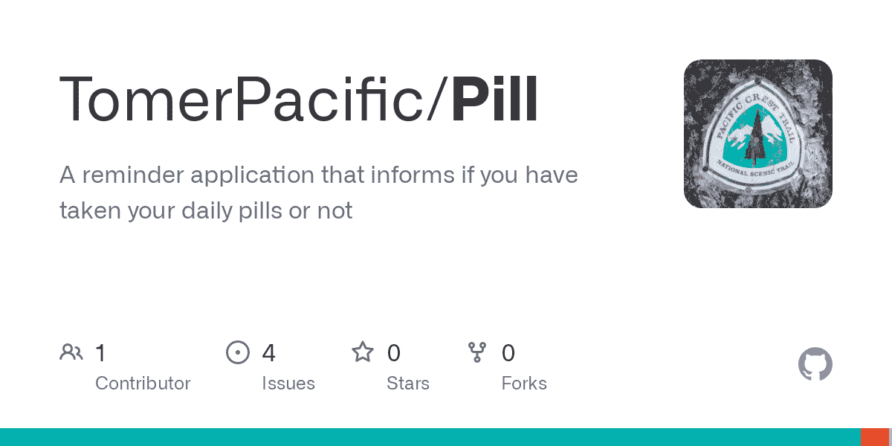

# 如何给你的 Flutter 应用程序添加自定义图标

> 原文：<https://www.freecodecamp.org/news/how-to-add-custom-icons-to-your-flutter-application/>

当你想给你的应用程序增加一些风格时，你可能会想办法让你的用户界面脱颖而出。

无论是使用特定的字体还是不同的颜色，你都想让用户感觉被你的用户界面所吸引。

定制的一个方法是更新你的图标。如果你是一个移动开发者，不管你开发的平台是什么，都有一个简单的过程来为你的应用程序添加图标。

在 Flutter 中，并没有那么复杂，但是有些事情是你应该意识到的，这样你才不会犯耗时的错误。

## 如何自定义应用程序启动器图标

除了使用 Flutter 提供的通用应用程序图标，您还可以创建自己的图标。为此，我们需要使用一个名为 [Flutter Launcher Icons](https://pub.dev/packages/flutter_launcher_icons) 的包。我们将一步一步地创建一个。

这是您的启动器图标的默认外观:


假设我们希望这个图像成为我们的应用程序启动器图标:


首先，将您想要用作图标的图像添加到项目中的资产文件夹下(如果您没有资产文件夹，请创建一个):



Our icon’s location inside the project

然后将依赖项添加到您的 pubspec.yaml 文件中的 **dev_dependencies** 下:

```
dev_dependencies:
  flutter_launcher_icons: "^0.9.2"
```

将此配置添加到您的 pubspec.yaml 文件中:

```
flutter_icons:
  android: "launcher_icon"
  ios: true
  image_path: "assets/doughnut.png"
```

`flutter_icons`配置有几个键来改变将要渲染的内容和平台。

*   Android/iOS–指定要为哪个平台生成图标。也可以写文件名代替 true。
*   image _ path–您希望制作成应用程序启动器图标的资产的路径。比如**“assets/doughton . png”。**

还有更多的配置可用，但我们不会在这里深入探讨。你可以点击[这里](https://github.com/fluttercommunity/flutter_launcher_icons/tree/master/example)了解更多信息。

现在，在终端中运行`flutter pub get`或者在 ide 中点击 Pub get。

在终端中运行以下命令:

```
flutter pub run flutter_launcher_icons:main
```

This will generate the application launcher icons

运行您的应用程序，您应该会看到启动器图标已经改变。



## 如何在 Flutter 中生成自定义图标

我们将能够通过[FlutterIcon.com](https://www.fluttericon.com/)生成自定义图标。它允许我们:

*   上传一个转换成图标的 SVG
*   从一组不同的图标包中选择大量的图标



☝️:有一个名为 [FlutterIcon](https://pub.dev/packages/fluttericon) 的包，里面有所有显示的图标，但是由于它很大，我建议只选择你需要的图标，不要使用它。

让我们演示如何使用这个网站将自定义图标导入到您的应用程序中。

假设我们的应用程序中有以下形式:



您可以看到我们为每个 TextFormField 使用了图标。下面是第一个 TextFormField 的代码:

```
TextFormField(
  controller: pillNameTextEditingController,
  decoration: const InputDecoration(
      border: OutlineInputBorder(),
      hintText: 'What is the pill\'s name?',
      prefixIcon: Icon(Icons.title)
  ),
  validator: (value) {
    if (value == null || value.isEmpty) {
      return 'Please enter a pill name';
    }
    return null;
  }
)
```

我们把第一个 TextFormField 的图标改成更相关的怎么样？

在 FlutterIcon.com 上:

*   选择您想要使用的图标/上传 SVG 文件
*   给你的图标类取一个有意义的名字(我们称我们的类为 **CustomIcons**
*   按下载



在。zip 文件夹，有几个文件:

*   包含 TTF 文件的 fonts 文件夹，该文件以您选择的类的名称命名
*   一个 config.json 文件，用来记住你选择的图标
*   具有您选择的类的名称的 dart 类



在项目内部，导入。ttf 文件放入**根目录下名为 fonts 的文件夹**。它应该是这样的:



放置。lib 文件夹中的 dart 类。如果您查看一下 dart 文件，您会看到类似的内容(如果您选择下载多个图标，您可能会看到更多 IconData 对象):

```
import 'package:flutter/widgets.dart';

class CustomIcons {
  CustomIcons._();

  static const _kFontFam = 'CustomIcons';
  static const String? _kFontPkg = null;

  static const IconData pill = IconData(0xea60, fontFamily: _kFontFam, fontPackage: _kFontPkg);
}
```

将以下内容添加到 pubspec.yaml 文件中:

```
fonts:
      - family: CustomIcons
        fonts:
          - asset: fonts/CustomIcons.ttf
```

在终端中运行`flutter pub get`或者在 ide 中点击 Pub get。

转到您想要使用自定义图标的位置，并像这样使用它:

```
n.dart
TextFormField(
  controller: pillNameTextEditingController,
  decoration: const InputDecoration(
      border: OutlineInputBorder(),
      hintText: 'What is the pill\'s name?',
      prefixIcon: Icon(CustomIcons.pill)
  ),
  validator: (value) {
    if (value == null || value.isEmpty) {
      return 'Please enter a pill name';
    }
    return null;
  }
)
```


## Flutter 中自定义图标的故障排除

如果你的自定义图标显示为带有 X 的方块，那就有问题了。您还可能在记录器中看到以下警告:

```
Warning: No fonts specified for font CustomIcons
Warning: Missing family name for font.
```

这可能有几个原因:

*   确保您的 pubspec.yaml 文件有效。这意味着没有多余的空格、缩进等等。你可以用[这个](http://yaml-online-parser.appspot.com/)工具来代替它。
*   确保在 pubspec.yaml 文件中正确引用了您的字体。
*   确保您已将您的。ttf 文件位于项目根目录下的 **fonts** 目录中(不在 assets 目录中)。
*   卸载您的应用程序，并在您的设备上重新安装。

如果你想看看使用这两种图标的真实应用程序，你可以在这里查看:

[Pill - Apps on Google PlayThe Pill application is the one thing you need to manage all of the pills you are taking. Clearly see:- What pills you have to take for today- How many pills per typetomerpacificApps on Google Play](https://play.google.com/store/apps/details?id=com.tomerpacific.pill)

你可以在这里看到源代码:

[GitHub - TomerPacific/Pill: A reminder application that informs if you have taken your daily pills or notA reminder application that informs if you have taken your daily pills or not - GitHub - TomerPacific/Pill: A reminder application that informs if you have taken your daily pills or notTomerPacificGitHub](https://github.com/TomerPacific/Pill)

感谢您的阅读！