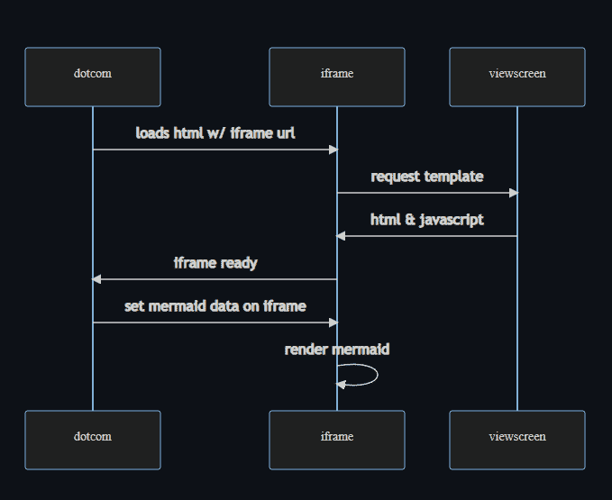
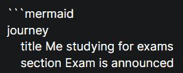
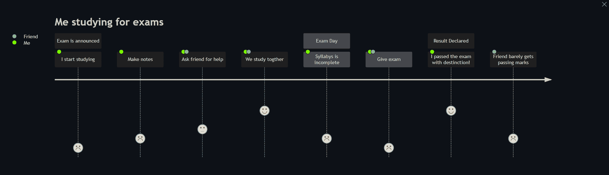

# 如何向 GitHub Markdown 文件添加图表

> 原文：<https://www.freecodecamp.org/news/how-to-add-diagrams-to-github-readme/>

以前，如果您想在 GitHub 自述文件中包含一个图表，您需要像用第三方软件创建的图像一样添加它。

这很有效，并且让我们完成了我们的任务——但是当您可以在自述文件中创建图表时，为什么要降低要求呢？现在你可以了。

2 月 14 日，GitHub 向所有*开发者*赠送了一个新功能。GitHub Markdown 现在默认支持 Mermaid 语法。这意味着我们现在可以在本地 markdown 文件中创建和编辑图表。

但首先，什么是美人鱼？

## 美人鱼是什么？🧜‍♀️

[Mermaid](https://mermaid-js.github.io/) 是一个基于类似 markdown 的文本内容呈现图表的工具。它帮助我们可视化文档，并通过在浏览器中动态地创建和修改图表来跟上开发的步伐。

Mermaid 支持各种类型的图，比如 UML 图、甘特图、Git 图和用户旅程图。

## 美人鱼是怎么工作的？🤔

根据 GitHub 官方博客，当遇到一个标记为`mermaid`的代码块时，该块中的原始美人鱼语法被传递给 Mermaid.js，并生成一个 iframe。iframe 被注入到页面中，将`src`指向 Viewscreen 服务。Viewscreen 是 GitHub 的内部文件渲染服务，部分负责整个过程。

整个过程在官方公告博客里解释的很好。下面是如何在浏览器中动态呈现美人鱼代码块的图示:



rendering Mermaid code

## 美人鱼演示🧐

要在你的自述文件中集成美人鱼，你不需要添加任何外部的东西！你只需要用`mermaid`语言设计一个代码块。

但是不要担心——你不需要学习一门新的语言或文字。如果你有一个关于 markdown 和支持图的想法，你不会发现它太难开始。

听起来很简单？做一个我为了考试而学习的用户旅程图吧。

在你的 GitHub 网站上，打开任何 markdown 文件。将下面的代码粘贴到 write 部分，然后点击 preview。

```
```
journey
	title Me studying for exams
	section Exam is announced
		I start studying: 1: Me
		Make notes: 2: Me
		Ask friend for help: 3: Me, Friend
		We study togther: 5: Me, Friend
	section Exam Day
		Syllabys is incomplete: 2: Me
		Give exam: 1: Me, Friend
	section Result Declared
		I passed the exam with destinction!: 5: Me
		Friend barely gets passing marks: 2: Friend
```
```

别忘了用代码块把它括起来，并在开头加上`mermaid`。
像这样:



渲染时，它看起来会像这样:



User Diagram created with Mermaid in GitHub README

> 有趣的事实:上面描述渲染美人鱼语法的序列图也是用新特性渲染的。你可以在这里找到代码[。](https://gist.github.com/martinwoodward/8ad6296118c975510766d80310db71fd)

## 最后的话👋

Mermaid 集成允许您将图表放在文档附近，节省了管理单独软件的时间和精力。

你可以在这里阅读 GitHub 博客[原文](https://github.blog/2022-02-14-include-diagrams-markdown-files-mermaid/)或者看看[美人鱼](https://mermaid-js.github.io/)的官方文档。

## 在我们结束✨之前

我之所以写这篇文章，是因为我一听说这个特性发布了，就迫不及待地想尝试一下。我希望这篇文章对你有所帮助。我有自己的[个人博客](https://clumsycoder.hashnode.dev/)，在那里我谈论网络开发和我的经历。

如果你想打招呼的话，我的 DMs 永远是开着的。我在 [Twitter](https://twitter.com/clumsy_coder) 、 [LinkedIn](https://www.linkedin.com/in/7JKaushal/) 和 [Showwcase](https://www.showwcase.com/) 上最活跃。那里见！

直到那时，快乐记录！📃