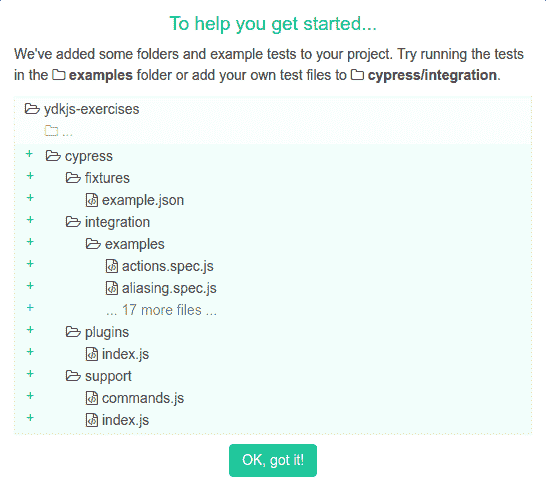

# 如何使用 Cypress 为您的项目添加端到端测试

> 原文：<https://www.freecodecamp.org/news/how-to-add-end-to-end-tests-to-your-project-with-cypress-a74437f6df6e/>

在这篇文章中，我将介绍向现有项目添加 Cypress 端到端测试的过程。

### 为什么要进行端到端测试？

所有的测试方法都有利弊。端到端测试是最接近实际用户测试的，这是它的主要优势之一。测试越接近模拟用户，就越有可能捕捉到用户可能遇到的问题。

如果你想让用户在 Twitter 上测试推文，你可以告诉他们这样的话:

> 前往[https://twitter.com](https://twitter.com,)并登录。单击带有占位符文本“发生了什么事？”的文本框，然后键入“这是一条测试推文”。单击带有文本“Tweet”的按钮。现在，去你的个人资料页面，看看第一条推文。文本应该等于“这是一个测试推文”。

理想情况下，您可以向您的端到端测试运行人员发出类似的指令。

相反，您可以让它通过类名或 id 来查找元素，但是如果类名或 id 故意改变了呢？或者文字不小心变了怎么办？如果您告诉测试运行人员按类名点击按钮，测试可能会错误地通过。你可能会争辩说:

> 想故意改文字怎么办？也许你想把按钮文字从“Tweet”改成“Send”？

这也许是一个有效的论点，但你也可以说，如果文本改变，你实际上希望测试失败。最终，你必须问自己，“如果这段文字改变了，我希望我的测试失败吗？”在“发送”vs“推文”的情况下，也许你不希望测试中断，但也许如果文本被意外删除或拼写错误，那么你会希望它们中断。你不可能两者兼得，所以你需要做出对你和你的应用最好的决定。

端到端测试的一些缺点是:

*   它们是“昂贵的”，也就是说它们需要很长时间来运行。每个测试都需要用实际的浏览器事件实例化一个完整的浏览器，这比单元测试或集成测试花费更多的时间。
*   它在发现问题方面做得很好，但在帮助你解决那些问题方面做得不好。您的端到端测试可能会发现支付系统出现故障，但它不会告诉您 10 个微服务中的哪一个导致了问题。

### 选择哪种端到端测试框架

有很多端到端的测试框架，很难选择“正确的”一个。我将非常简短地分享我的想法，尽管我承认只使用了 Cypress:

**测试咖啡馆**—这是最新的端到端测试框架，看起来很不错。它与浏览器堆栈集成，具有良好的浏览器支持，支持所有前端框架，支持 ES2015+语法，也支持 typescript。看起来你必须有付费版本才能获得测试记录。

木偶师——这是谷歌的开源解决方案。它看起来很轻便，很容易上手。它是开源的，运行在 Chromium 上(不管是否无头)。Puppeteer 被定位为一个功能丰富的测试框架，比没有端到端测试但没有完整的解决方案要好。他们最近还分享说他们正在[试验 Firefox](https://twitter.com/ChromiumDev/status/1070790759937269761) 。

**Cypress —** 这是一个开发者友好的开源测试框架。Cypress 记录测试的快照和视频，有一个测试运行控制台，并且是免费的。对于开发者和 QA 工程师来说，入门很容易。它目前只支持 Chrome 版本，但在路线图上[有跨浏览器支持](https://github.com/cypress-io/cypress/issues/310)。它没有本地的 [iframe 支持](https://github.com/cypress-io/cypress/issues/136)，尽管有变通办法。Cypress 有自己的基于承诺的系统，你必须使用(不能使用 ES6 承诺)。

这里有一个深入比较 Cypress 和 Test Cafe 的好资源:[https://medium . com/yld-engineering-blog/evaluating-Cypress-and-Test Cafe-for-end-to-end-testing-fcd 0303d 2103](https://medium.com/yld-engineering-blog/evaluating-cypress-and-testcafe-for-end-to-end-testing-fcd0303d2103)


Photo by [chuttersnap](https://unsplash.com/photos/cY-SXZp6TUY?utm_source=unsplash&utm_medium=referral&utm_content=creditCopyText) on [Unsplash](https://unsplash.com/search/photos/options?utm_source=unsplash&utm_medium=referral&utm_content=creditCopyText)

### 入门指南

我要用的项目是[https://ydkjs-exercises.com](https://ydkjs-exercises.com)。这是一个单页的网络应用程序，提供练习来帮助用户在阅读[你不知道的 JavaScript](https://github.com/getify/You-Dont-Know-JS) 时测试他们的知识。它使用 React、React 路由器和 React 上下文 API。有使用 jest 和 react-testing-library 的单元/集成测试。现在我将使用 Cypress 添加端到端测试！

我将通过标签跟踪进度，从`cypress-0`开始，并在每一步增加整数。[这里是起点](https://github.com/austintackaberry/ydkjs-exercises/tree/cypress-0)。

第一步是安装 Cypress 作为`devDependency`:

```
npm install cypress --save-dev
```

Cypress 的当前版本是 3.1.1。文档提到 Cypress npm 包是 Cypress 二进制文件的包装器。从版本 3.0 开始，二进制文件被下载到一个全局缓存目录中，以便跨项目使用。

现在，让我们打开柏树。如果您使用的是 npm 版本> 5.2，可以使用以下方式打开它:

```
npx cypress open
```

这用一个欢迎模式打开了 Cypress，告诉我们他们向我们的项目添加了一堆文件:



点击关闭模态后，我们看到有一堆示例测试，我们看到可以在 Chrome 70 中运行它们。如果你点击“跑步”,你会看到你可以设置一个 Cypress 仪表盘来查看以前的跑步记录。我们不担心这个，但是你可以试试这个功能。

我选择在 git 中跟踪所有这些示例文件，因为我希望未来的贡献者在派生项目时能够访问它们。

这是目前为止的进展。

### 写柏树剧本

我们几乎准备好编写我们的第一个测试了。我们需要创建一个目录来存储我们的 Cypress 测试:`cypress/integration/ydkjs`

现在我们需要编写脚本来启动我们的开发服务器，运行我们的 Cypress 测试，然后停止我们的开发服务器。这个项目是用 Create React App 引导的，这意味着它有一个用于启动服务器的`scripts/start.js`文件。我将从那里复制代码，粘贴到一个新的`scripts/cypress.js`文件中，并做一些修改。

下面的代码片段是我们新的`scripts/cypress.js`文件的主要部分。

```
return devServer.listen(port, HOST, err => {
    if (err) {
        return console.log(err);
    }
    if (isInteractive) {
        clearConsole();
    }
    console.log(chalk.cyan('Starting the development server...\n'));
    return cypress
        .run({
            spec: './cypress/integration/ydkjs/*.js',
        })
        .then(results => {
            devServer.close();
        });
});
```

它做的正是我们所说的。它启动开发服务器，运行`cypress/integration/ydkjs`中的所有测试文件，然后停止开发服务器。

现在，在`cypress.json`中，我们可以添加我们的`baseUrl`:

```
{
    "baseUrl": "http://localhost:3000"
}
```

现在我们可以编写我们的第一个测试了！姑且称之为`cypress/integration/ydkjs/sidebar.js`，我们将用它来测试侧边栏功能。现在，让我们编写一个虚拟测试:

```
/* globals context cy */
/// <reference types="Cypress" />
context('Sidebar', () => {
    beforeEach(() => {
        cy.visit('/');
    });

    it('does something', () => {
        cy.contains('YDKJS Exercises');
    });
});
```

我们在这里所做的只是访问基本 url 并找到一个包含“YDKJS 练习”的元素。注意，我只在第一行添加了注释，这样`eslint`就不会抱怨未定义的 Cypress 变量。

我还在我的`package.json`中添加了一个新的脚本:

```
"scripts": {
    ...
    "cypress": "node scripts/cypress.js",
    ...
},
```

所以现在当我想运行我的端到端 Cypress 测试时，我可以调用`npm run cypress`。现在，当我在终端中执行该命令时，我看到我的服务器启动，测试运行并通过，然后服务器停止。呜哇！

以下是到目前为止的代码。

### 让我们写一些真正的测试！

现在我们已经设置了 Cypress 脚本来启动服务器、运行测试和停止服务器，我们可以开始编写一些测试了！

我们已经创建了一个`sidebar.js`测试文件，所以让我们围绕侧边栏特性编写一些测试。也许，我们的第一个测试应该是确保当我们点击 X 按钮时工具条关闭，当我们点击汉堡包时工具条重新打开。

在我们找到 X 按钮并单击它之前，让我们确保侧栏在加载主页时可见。我可以在导航到主页后将它放在`beforeEach`方法中，因为我总是想确保当我第一次进入主页时侧边栏是可见的。

```
beforeEach(() => {
    cy.visit('/');
    cy.contains('Progress').should('exist');
});
```

现在让我们开始编写测试。因为 X 实际上是一个 SVG，我们不能轻易地告诉 Cypress 去寻找它。所以我们将使用一个`data-testid`属性或者`cy.get("[data-testid=closeSidebar]").click()`来找到它。我知道你在想什么…

> 好的，我知道在这种情况下你不能使用文本。但是为什么要使用数据属性呢？为什么不直接使用类名或 id 呢？

最佳实践是使用数据属性。您可以使用类名，但它们可能会发生变化，最好是针对样式进行优化。

至于 ids，主要问题是每页只能有一个，这很烦人。如果你想得到页面上所有的 X 按钮并断言应该有 2 个呢？使用 ids 无法轻松做到这一点。

我们完成的测试可能如下所示:

```
it('closes when X is clicked and reopens when hamburger is clicked', () => {
    cy.get('[data-testid=closeSidebar]').click();
    cy.contains('Progress').should('not.exist');
    cy.get('[data-testid=openSidebar]').click();
    cy.contains('Progress').should('exist');
});
```

我转到主页，确保侧边栏是打开的，然后点击 X 按钮，确保它是关闭的，然后点击汉堡，确保侧边栏是重新打开的。当我们运行它时，它通过了！

并且可以在`cypress/ydkjs/sidebar.js.mp4`看到一段测试的视频！相当整洁。当你的测试失败了，而你不知道为什么的时候，这是非常有用的。

你需要小心的一件事是 Cypress 是一个基于承诺的系统。当您执行`cy.contains('Progress').should('not.exist')`时，Cypress 不会移动到下一行代码，直到该行为真。如果它看到一个包含“Progress”的 DOM 元素，它将等待，直到它消失，或者直到它超时，测试失败。

这个系统很好，因为它使得编写这些测试非常快速和容易。但是，当您处理异步操作时，它有时会伤害您。也许您想确保 DOM 元素不会因为单击按钮而显示出来。你可以点击按钮，然后检查 DOM 元素是否存在，对吗？但是如果 DOM 元素是在点击按钮后一秒钟创建的呢？你的测试在本该失败的时候会通过。

让我们再写一个测试。

当我们点击侧边栏上的一本书时，我们希望导航到与该书相关的页面。

```
it('navigates to /up-going when Up & Going is picked', () => {
    cy.contains(/Up & Going \(/).click({ force: true });
    cy.url().should('include', '/up-going');
    cy.contains('Chapter 1: Into Programming').should('exist'); 
    cy.contains('Chapter 2: Into JavaScript').should('exist');
});
```

关于这个测试，有一些事情需要注意。在 ydkjs-exercises 主页上，文本“上升和前进”位于两个位置。一次在侧边栏，一次在页面中间。在侧边栏上，全文是“Up & Going (0/41)”，这意味着用户已经回答了 41 个问题中的 0 个。在主页上，文字只是“上升&前进”。因此，为了确保我们单击侧边栏中的 Up & Going，我使用 regex 单击包含“Up & Going(。我不希望它包含 0 或 41，因为这些数字可能会改变。这可能是使用数据属性比使用文本更好的情况之一，就像我在上面的代码片段中所做的那样。

我需要强制 click 事件，因为锚标记有文本，但它被一个列表项元素所包装。之后，我进行测试以确保 url 是正确的，并且页面上的内容是正确的。

这是代码的最终状态。

### 结论

正如你所看到的，一旦你安装了 Cypress，你就有了启动你的开发服务器的合适的脚本，并且你开始写测试，使用 Cypress 是非常快速和容易的。

一旦你熟悉了它，你甚至可以通过定制 Cypress 命令来重用你的测试代码！

您可以在提交前或者在 CI 环境中运行这些测试，以确保没有回归进入生产环境。

总的来说，如果您想通过一些端到端的测试将您的测试提升到一个新的水平，Cypress 是一个非常可靠的选择！

编码快乐！