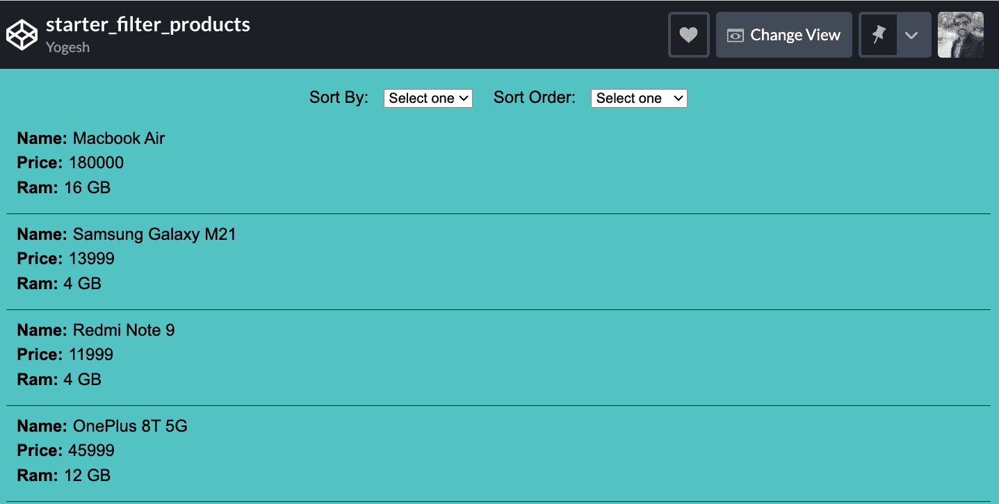
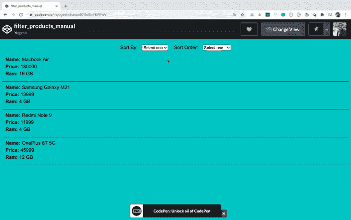

# 如何在应用程序中添加过滤功能

> 原文：<https://www.freecodecamp.org/news/how-to-add-filtering-functionality-to-your-application/>

假设您有一个应用程序，您想根据一些标准过滤数据，比如`size`、`color`、`price`等等。

在本文中，我们将看到如何做到这一点。

所以让我们开始吧。

## 初始设置

假设我们有以下产品列表:

```
const products = [
  { name: 'Macbook Air', price: '180000', ram: 16 },
  { name: 'Samsung Galaxy M21', price: '13999', ram: 4 },
  { name: 'Redmi Note 9', price: '11999', ram: 4 },
  { name: 'OnePlus 8T 5G', price: '45999', ram: 12 }
];
```

对于筛选，我们有两个下拉菜单——一个用于按各种标准排序，如`price`和`ram`,另一个下拉菜单用于排序顺序，如`descending`或`ascending`,如下所示:

```
<div class="filters">
  <div>
    Sort By:
    <select class="sort-by">
      <option value="">Select one</option>
      <option value="price">Price</option>
      <option value="ram">Ram</option>
    </select>
  </div>
  <div>
    Sort Order:
    <select class="sort-order">
      <option value="">Select one</option>
      <option value="asc">Ascending</option>
      <option value="desc">Descending</option>
    </select>
  </div>
</div>

<div class="products"></div>
```

## 如何在用户界面上显示产品

让我们添加一个`displayProducts`函数，它将在 UI 上显示产品。

```
const container = document.querySelector(".products");

const displayProducts = (products) => {
  let result = "";

  products.forEach(({ name, price, ram }) => {
    result += `
     <div class="product">
      <div><strong>Name:</strong><span>${name}</span></div>
      <div><strong>Price:</strong><span>${price}</div>
      <div><strong>Ram:</strong><span>${ram} GB</div>
     </div>
    `;
  });

  container.innerHTML = result;
};

displayProducts(products);
```

上面代码中的`displayProducts`函数使用数组`forEach`方法遍历`products`数组。它生成将使用 ES6 模板文字语法显示的 HTML，并将其插入到`products` div 中。

当我们将对象数组传递给`displayProducts`函数时，我们对`forEach`循环回调函数使用 ES6 析构语法来获得`name`、`price`和`ram`。

这里有一个[码笔演示](https://codepen.io/myogeshchavan97/pen/LYZaaqQ)。

您的初始屏幕将如下所示:



## 如何添加过滤功能

现在，让我们添加过滤功能。

为了处理`Sort By`下拉列表的 onchange 事件，我们将为其添加一个事件处理程序。

```
sortByDropdown.addEventListener('change', () => {
  // some code
};
```

我们已经在上面的代码笔的顶部定义了所有必需元素的引用，如下所示:

```
const sortByDropdown = document.querySelector(".sort-by");
const sortOrderDropdown = document.querySelector(".sort-order");
const container = document.querySelector(".products");
```

现在，让我们添加排序逻辑:

```
sortByDropdown.addEventListener("change", () => {
  const sortByValue = sortByDropdown.value; // price or ram value
  const sortOrderValue = sortOrderDropdown.value; // asc or desc value

  const sorted =
    sortOrderValue === "desc"
      ? descendingSort(sortByValue)
      : ascendingSort(sortByValue);

  displayProducts(sorted);
});
```

这里，我们检查第二个下拉列表的值。如果是`desc`，我们就调用`descendingSort`函数(我们还没有定义)。否则，我们将通过传递第一个下拉值来调用`ascendingSort`函数，无论是按`price`还是`ram`排序。

然后我们将结果传递给`displayProducts`函数，这样它将使用排序后的产品更新 UI。

## 如何添加排序功能

现在，让我们添加`descendingSort`和`ascendingSort`函数。

```
const ascendingSort = (sortByValue) => {
  return products.sort((a, b) => {
    if (a[sortByValue] < b[sortByValue]) return -1;
    if (a[sortByValue] > b[sortByValue]) return 1;
    return 0;
  });
};

const descendingSort = (sortByValue) => {
  return products.sort((a, b) => {
    if (a[sortByValue] < b[sortByValue]) return 1;
    if (a[sortByValue] > b[sortByValue]) return -1;
    return 0;
  });
};
```

这里，我们将比较器函数用于数组排序函数。

如你所知，如果我们有一个这样的物体:

```
const product = { name: 'Macbook Air', price: '180000', ram: 16 };
```

然后我们可以通过两种方式访问它的属性:

1.  使用`product.name`
2.  使用`product['name']`

因为我们有一个动态值`sortByValue`变量，所以我们在`sort`函数中使用第二种方法来获得乘积值(`a[sortByValue]`或`b[sortByValue]`)。

### 升序排序的工作原理

*   如果要比较的第一个值按字母顺序在第二个值之前，则返回负值。
*   如果要比较的第一个值按字母顺序排在第二个值之后，则返回正值。
*   如果第一个和第二个值相等，则返回零，这将自动按升序对数组进行排序。

### 降序排序的工作原理

*   如果要比较的第一个值按字母顺序在第二个值之前，则返回正值。
*   如果要比较的第一个值按字母顺序排在第二个值之后，则返回负值。
*   如果第一个和第二个值相等，则返回零，这将自动按降序对数组进行排序。

> 如果你不熟悉 comparator 函数的排序工作方式，请查看本文以更好地理解 JavaScript 中关于排序的一切。

现在，我们希望在更改排序顺序下拉列表时触发排序功能。因此，让我们也为它添加一个事件处理程序。

```
sortOrderDropdown.addEventListener("change", () => {
  const event = new Event("change");
  const sortByValue = sortByDropdown.value;

  if (sortByValue) {
    sortByDropdown.dispatchEvent(event);
  }
});
```

这里，我们添加了`if`条件，因为我们不想在没有选择排序依据下拉菜单时对产品进行排序。

这里有一个[码笔演示](https://codepen.io/myogeshchavan97/pen/vYKPPwV)。

查看下面的工作功能演示:



## 如何使用 Lodash 简化排序代码

如果不想自己编写排序逻辑，可以使用 [lodash](https://lodash.com/) 提供的`orderBy`方法，这是一个非常流行的实用程序库。

> 如果您不熟悉 lodash 和该库提供的强大函数，请查看本文了解其各种有用方法的介绍。

让我们添加`orderBy`方法来改变排序方式下拉列表，如下所示:

```
sortByDropdown.addEventListener("change", () => {
  const sortByValue = sortByDropdown.value; // price or ram value
  const sortOrderValue = sortOrderDropdown.value; // asc or desc value

  const sorted = _.orderBy(products, [sortByValue], sortOrderValue);

  displayProducts(sorted);
});
```

并移除`ascendingSort`和`descendingSort`功能。

对于`orderBy`方法，我们提供了

*   作为第一个参数排序的数组
*   我们需要排序的对象的属性(`price`或`ram`)作为第二个参数
*   排序顺序(`asc`或`desc`)作为第三个参数

这里有一个[码笔演示](https://codepen.io/myogeshchavan97/pen/MWexdJP?editors=0010)。

使用 lodash 的这个`orderBy`方法，功能与以前完全一样。唯一的问题是，我们不必编写排序逻辑。

### **感谢阅读！**

想详细了解 ES6+的所有特性，包括`let`和`const`、承诺、各种承诺方法、数组和对象析构、箭头函数、异步/等待、导入和导出等等吗？

查看我的《掌握现代 JavaScript》一书。这本书涵盖了学习 React 的所有先决条件，并帮助您更好地掌握 JavaScript 和 React。

另外，查看我的**免费**[React 路由器简介](https://yogeshchavan1.podia.com/react-router-introduction)课程，从头开始学习 React 路由器。

****想要了解关于 JavaScript、React、Node.js 的最新常规内容吗？[在 LinkedIn 上关注我](https://www.linkedin.com/in/yogesh-chavan97/)。****