# 如何将 Flexbox 回退添加到 CSS 网格

> 原文：<https://www.freecodecamp.org/news/how-to-add-flexbox-fallback-to-css-grid/>

我在[上一篇文章](https://zellwk.com/blog/calendar-with-css-grid)中分享了如何用 CSS Grid 构建日历。今天，我想分享如何为同一个日历建立一个 Flexbox 后备。

## 如何提供支持

一般来说，对于 CSS 有三种方法可以提供支持。

**第一种方法:**写回退代码。覆盖回退代码。

```
.selector {
  property: fallback-value;
  property: actual-value;
} 
```

**第二种方法:**编写回退代码。覆盖 CSS 特征查询中的回退代码(`@supports`)。如果需要，重置`@supports`内的属性。

```
.selector {
  property: fallback-value;
}

@supports (display: grid) {
  property: actual-value;
} 
```

**第三种方法:**把一切都写在`@supports`里。

```
@supports not (display: grid) {
  .selector {
    property: fallback-value;
  }
}

@supports (display: grid) {
  .selector {
    property: actual-value;
  }
} 
```

这三种方法按复杂度递减的顺序列出。(如果需要覆盖代码，就比较复杂了)。这意味着在`@supports`中写所有东西是三者中最简单的。

您选择如何支持您的项目取决于浏览器对以下方面的支持:

1.  该功能
2.  回退功能
3.  支持功能查询

## 检查支持

检查支撑的最佳位置是[can use](https://caniuse.com "Can I use")。在这里，我看到对 CSS 网格的支持是体面的。我要担心的浏览器有:

1.  Opera Mini:全球使用率 1.42%
2.  安卓浏览器 2.1 到 4.4.4: 0.67%的全球使用率
3.  黑莓浏览器:全球使用率 0.02%(不会担心这个)。


对后备(Flexbox)的支持也很好。

但我们有一个问题:Flexbox fallback 不适用于 Android 2.1 到 4.3(它不支持包装)。Android 2.1 到 4.3 的全球使用率为 0.37%。

在这里，我必须决定:

1.  为 Opera Mini (1.42%)、Android 4.4.4 (0.3%)和黑莓(0.02%)提供 Flexbox 回退值得吗？
2.  我是否应该将 fallback 从 Flexbox 更改为较旧的功能，以支持 Android 2.1 到 4.3(另一个 0.37%)。

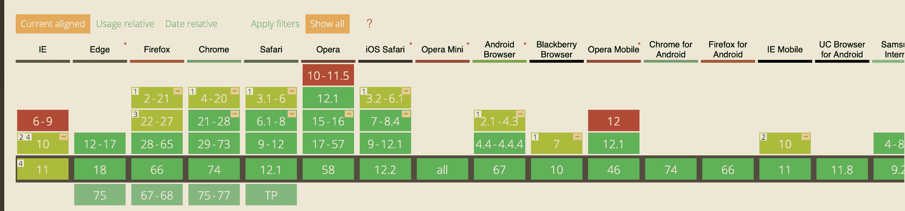

让我们假设，对于这个项目，我决定 Flexbox 回退就足够了。我不打算担心 Android 2.1 到 4.3。

接下来我想检查一下浏览器是否支持 CSS 特征查询。

在这里，我看到:

1.  Opera Mini 支持特性查询
2.  Android 4.4.4 支持功能查询
3.  Blackberry 浏览器不支持功能查询
4.  IE 11 不支持功能查询


## 决定如何编写回退代码

之前，我提到过有三种方法可以为 CSS 编写回退代码:

1.  编写回退代码。覆盖回退代码。
2.  编写回退代码。覆盖`@supports`中的回退代码。
3.  把一切都写在`@supports`里。

如果我把所有东西都写在`@supports`里面，我可以支持:

1.  迷你歌剧(1.43%)
2.  安卓系统 4.4.4 (0.3%)

但是我失去了支持:

1.  IE 11 (2.3%)
2.  黑莓手机(0.02%)

我不想放弃 2.3%的 IE 用户，这意味着方法 3(把所有东西都写在`@supports`里)已经过时了。

如果我用方法 2(写回退代码。覆盖`@supports`中的回退代码)，我可以提供以下支持:

1.  IE 11 (2.3%)
2.  迷你歌剧(1.43%)
3.  安卓系统 4.4.4 (0.3%)
4.  黑莓浏览器(0.02%)

这就是我需要的一切。所以我要用第二种方法。

注意:如果你想跟着编码，你可以从我的前一篇文章中的[演示](https://codepen.io/zellwk/pen/xNpKwp "Codepen: Building a Calendar with CSS Grid")开始。

## 禁用网格代码

首先，我们将 CSS 网格代码放在`@supports`下(就像我们上面讨论的那样)。

```
@supports (display: grid) {
  .day-of-week,
  .date-grid {
    display: grid;
    grid-template-columns: repeat(7, 1fr);
  }

  .date-grid button:first-child {
    grid-column: 6;
  }
} 
```

我们可以通过将`display`设置为无效值(不是`grid`)来禁用 CSS 网格代码。这将禁用整个代码块。

(感谢瑞秋·安德鲁这个巧妙的技巧。我相信我是从她那里学来的？).

```
@supports (display: gridx) {
  /*...*/
} 
```

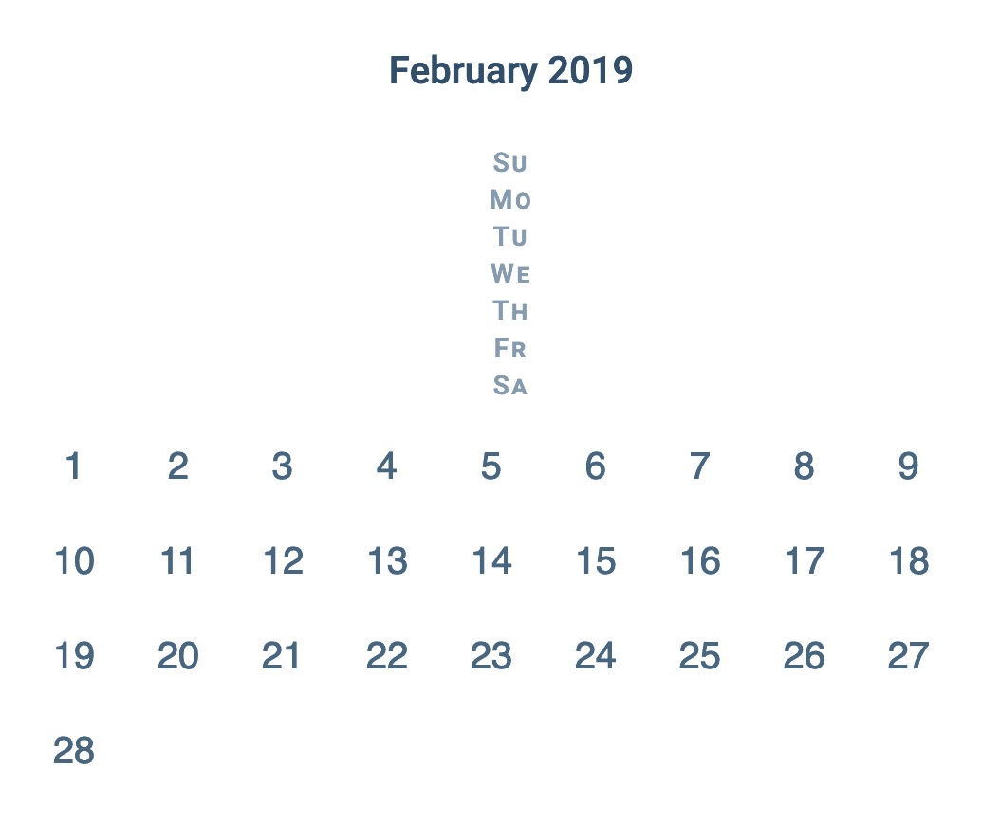

## 编写 Flexbox 代码

我们需要用 Flexbox 构建相同的七列网格。我们需要做的第一件事是承认 Flexbox 和 Grid 的工作方式不同。我们不可能得到一个完美的复制品，但我们可以接近它。

第一件事是将`display`设置为`flex`。

```
.day-of-week,
.date-grid {
  display: flex;
} 
```

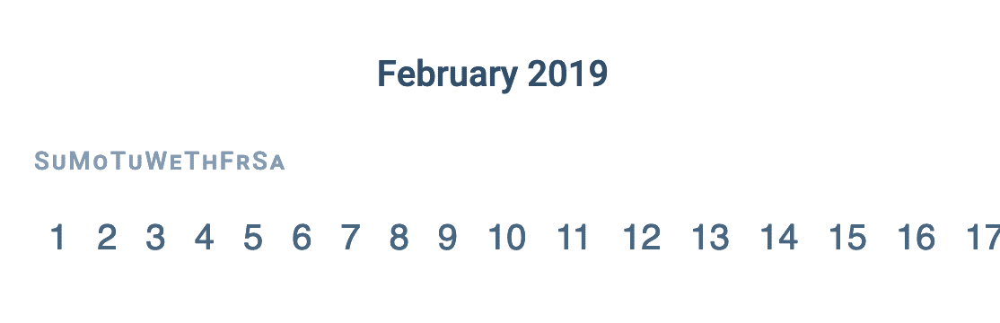

我们需要将`.date-grid`中的按钮换行，所以我们将`flex-wrap`设置为`wrap`。

```
.date-grid {
  flex-wrap: wrap;
} 
```

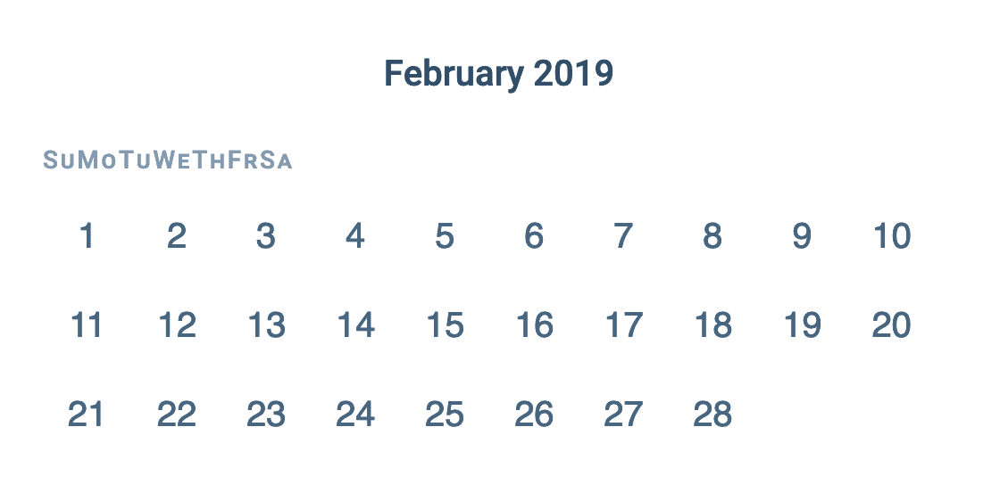

我们需要复制七列网格。一个简单的方法是根据每个按钮的宽度来计算网格的宽度。在这里，我已经将每个按钮设置为 4.5 通道。这意味着网格的宽度应该是`7 x 4.5ch`。

(我们可以使用 CSS Calc 来帮我们计算)。

```
.day-of-week,
.date-grid {
  max-width: calc(4.5ch * 7);
} 
```

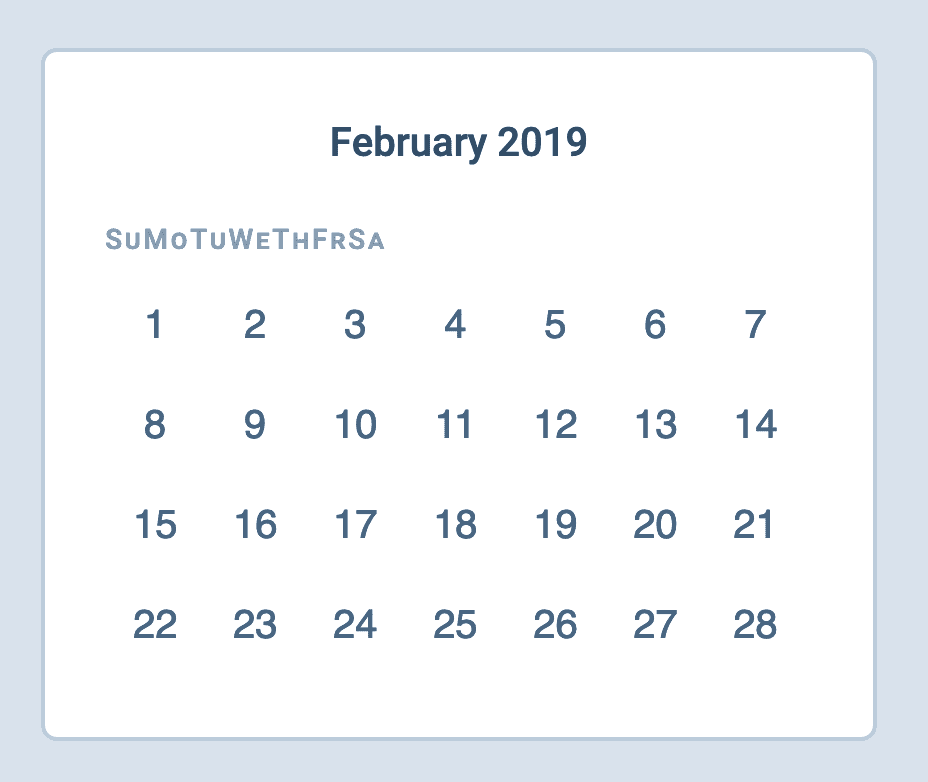

我们需要`.day-of-week`中的元素在可用的宽度上展开。一个简单的方法是将`justify-content`设置为`space-between`。

```
.day-of-week {
  justify-content: space-between;
} 
```

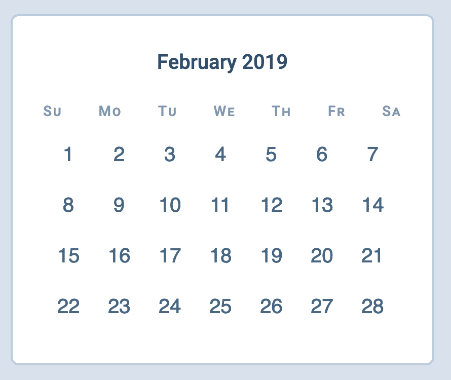

在这里，我们可以看到`.day-of-week`中的元素扩展到了网格之外。这种扩展的发生是因为我们让 Flexbox 为我们计算了`flex-basis`。如果我们希望`.day-of-week`中的每个元素都有相同的宽度，我们需要自己设置`flex-basis`。

在这种情况下，最简单的方法是将`flex-basis`设置为一个网格项的宽度(或`4.5ch`)。注:我将`.day-of-week`中每一项的`font-size`调整为`0.7em`(为了视觉美观)。我们必须考虑这种变化。

```
.day-of-week > * {
  flex-basis: calc(4.5ch / 0.7);
} 
```

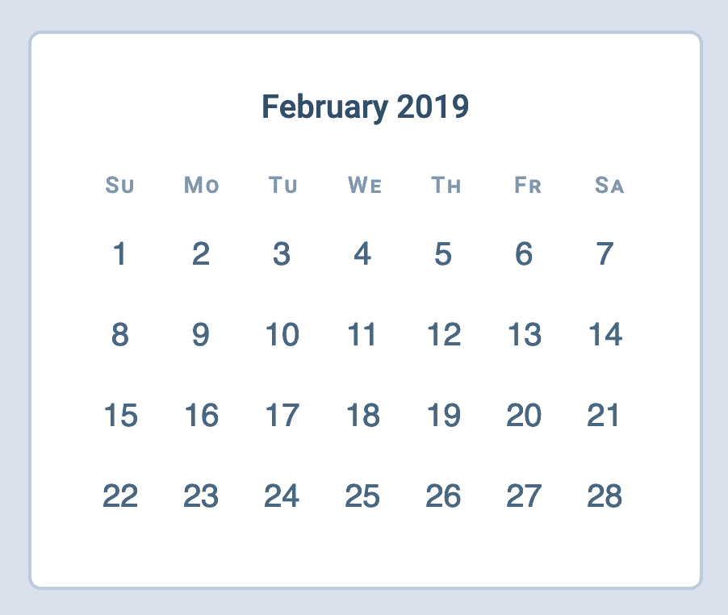

最后，我们需要把 2 月 1 日推到星期五。(五列)。由于列是`4.5ch`，我们简单地用`4.5ch x 5`推它。

(同样，我们可以使用 CSS Calc 来帮助我们)。

```
.date-grid button:first-child {
  margin-left: calc(4.5ch * 5);
} 
```

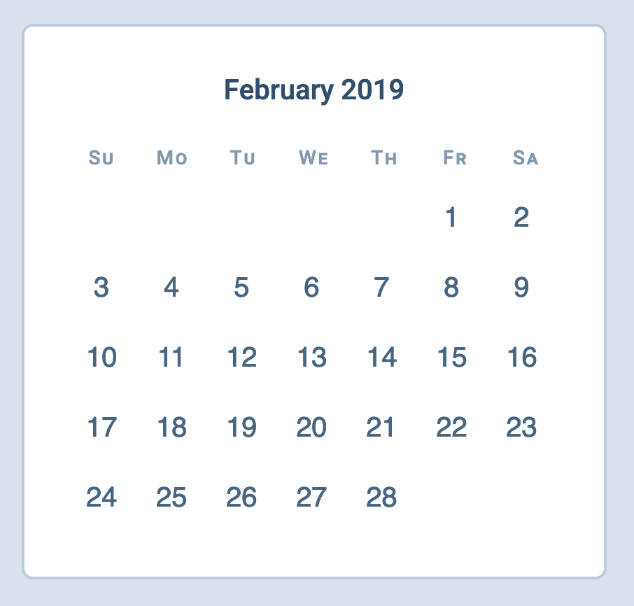

## 修复 CSS 网格版本

我们现在可以重新激活 CSS 网格代码，并进行任何必要的更改。

```
@supports (display: grid) {
  /* ... */
} 
```

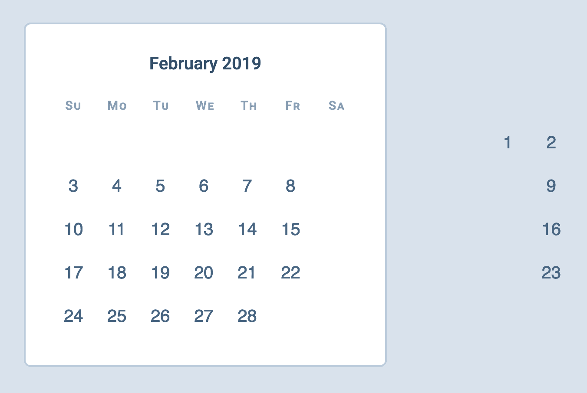

在这里，我们看到一些值向右飞出很远。这是因为我们向第一个网格项添加了`margin-left`。我们需要重新设置增加的边距。

```
@supports (display: grid) {
  /* ... */
  .date-grid button:first-child {
    grid-column: 6;
    margin-left: 0;
  }
} 
```

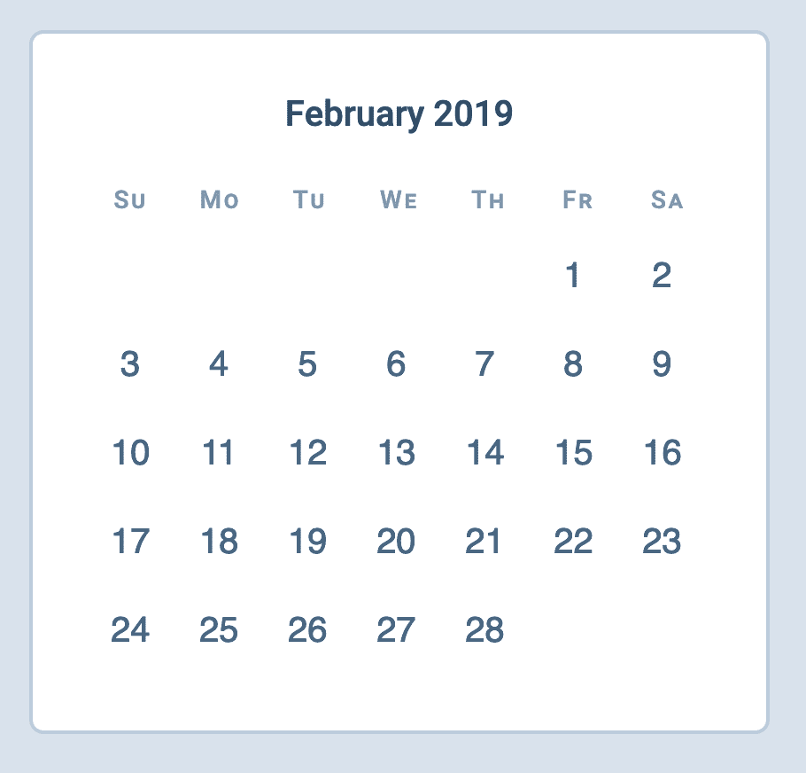

另一件事:我们可以删除`max-width`，因为我们在 CSS 代码中不需要它。(即使这不影响 CSS 代码，我们还是想把它去掉。属性越少越好)。

```
@supports (display: grid) {
  .day-of-week,
  .date-grid {
    display: grid;
    grid-template-columns: repeat(7, 1fr);
    max-width: initial;
  }

  /* ... */
} 
```

这是 Flexbox 和 CSS 网格版本之间的视觉差异。不算太差！

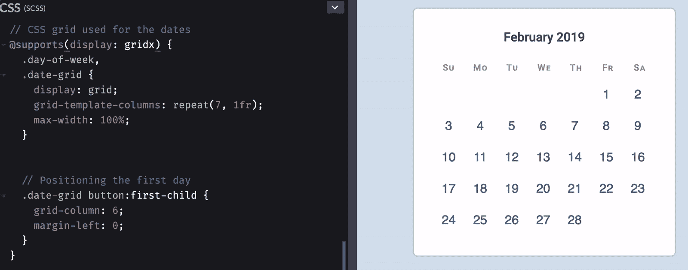

## 一件有趣的事

CSS 网格很酷，因为它遵循书写方向。我们可以很容易地将流向从左到右改为从右到左。

注意:我不知道在 rtl 语言中日历是否是从右向左读的。我只是觉得提这件事会很有趣？).

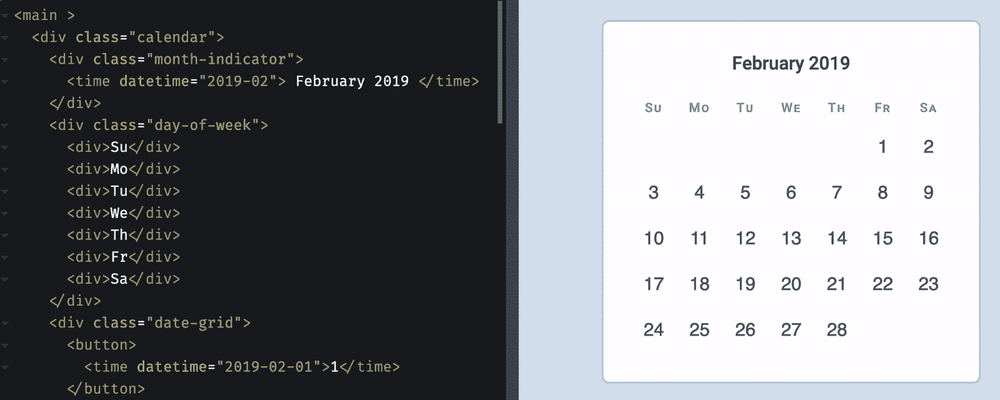

我们的 CSS 网格代码自然支持这种行为。如果你想用 Flexbox 支持同样的行为，你需要使用 [CSS 逻辑属性](https://css-tricks.com/css-logical-properties/ "CSS Logical Properties")。

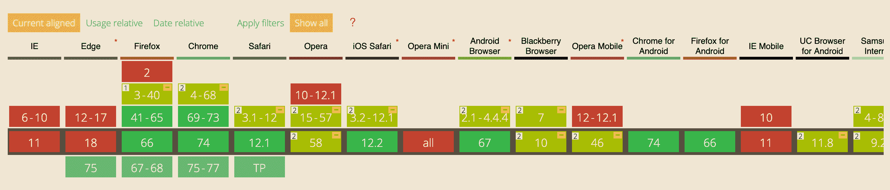

由于对 CSS 逻辑属性的支持不是很好，我们需要为它提供后备。(最好的办法是通过方法 1:写回退；覆盖回退)。

```
.date-grid button:first-child {
  margin-left: calc(4.5ch * 5);
  margin-inline-start: calc(4.5ch * 5);
}

@supports (display: grid) {
  /* ... */
  .date-grid button:first-child {
    grid-column: 6;
    margin-left: 0;
    margin-inline-start: 0;
  }
} 
```

就是这样！这是最终代码的代码笔:

参见 [CodePen](https://codepen.io) 上 Zell Liew ( [@zellwk](https://codepen.io/zellwk) )的[用 CSS Grid 构建日历(以及用 Flexbox 回退)](https://codepen.io/zellwk/pen/ZNrezV/)。