# 如何将 Google AdMob 整合到 Flutter 中

> 原文：<https://www.freecodecamp.org/news/how-to-add-google-admob-to-flutter/>

Flutter 移动应用程序开发框架正迅速成为当今领先的跨平台应用程序开发工具之一。

许多公司和开发者都选择使用 Flutter 来开发他们的应用，你可以在[市场](https://flutter.dev/showcase)看到那些应用。Flutter 还提供了很多定制的 app 模板来帮助你入门。

但如今，一旦你开发了一款应用，你可能会想把它变现。还有什么比谷歌的 AdMob 更好的方法呢？AdMob 是将你的应用货币化的最简单的方法之一，我们将在本文中看到如何实现。

在这里，我们将学习如何将 Google AdMob 与您的 Flutter 应用程序的开发生态系统相集成。

这个想法是首先学习如何一步一步地设置 Firebase 应用程序以及 AdMob。之后，我们将它们配置到 Flutter 环境。最后，我们将展示一个简单的横幅广告作为演示，以便您可以看到 AdMob 是如何工作的。

## 如何将 Firebase 配置与颤振相结合

首先，我们将把 Firebase 服务与我们的 Flutter 项目集成起来。但是首先，我们需要创建一个 Firebase 项目。你可以在官方 [Firebase 文档](https://firebase.google.com/docs/flutter/setup?platform=android)中找到颤振的设置指南。

要创建一个 Firebase 项目，我们需要登录到 [Firebase](https://firebase.google.com/) 并导航到 Firebase 控制台。在那里，我们只需点击“添加项目”即可开始我们的项目。

首先，会出现一个窗口，要求您输入项目名称。在这里，我保持了简单的项目名称—`FlutterAdmob`—如下面的截图所示:

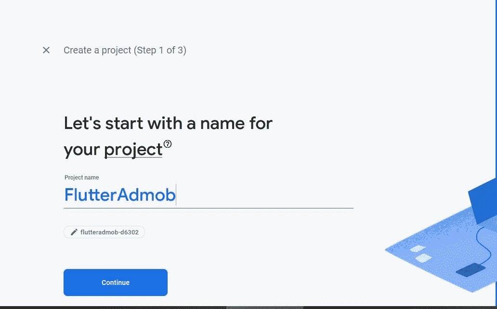

让我们继续下一步，直到创建了项目。项目设置完成后，我们将得到一个项目控制台，如下图所示:

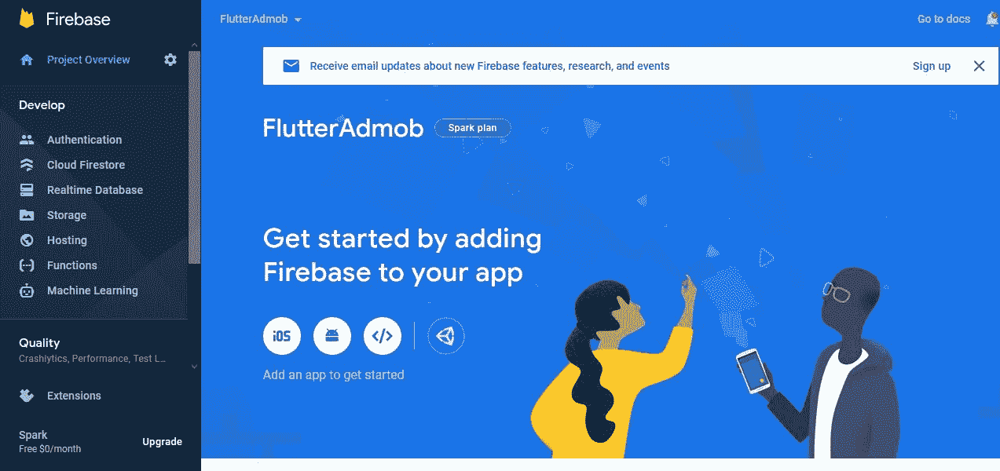

在这里，我们将为 Android 平台设置 Firebase。所以只要像上面截图看到的那样点击 Android 图标就可以了。这将带我们到界面注册 Firebase 到我们的 Flutter 应用程序。

### 第一步:将 Firebase 注册到你的 Android 应用程序

注册过程是特定于平台的，因此我们将注册 Android 平台。在你点击了 Android 图标之后，你会被引导到一个界面，询问 Android 包的名字。

为了添加我们的 flutter 项目的包名，我们需要首先定位它。包名将在**中显示。你的 Flutter 项目的/android/app/build.gradle** 文件。您将看到类似这样的内容:

```
com.example.backgroundSolution 
```

我们只需要将它复制并粘贴到 Android 包名输入字段，如下图截图所示:

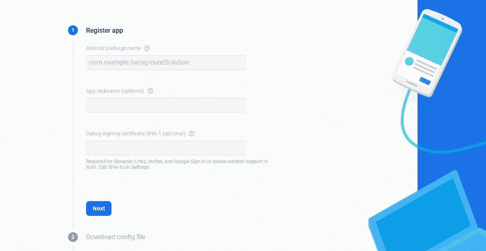

之后，您只需点击“注册应用程序”按钮。它将把我们带到一个界面，在那里我们可以获得 **google-services.json** 文件，该文件将把我们的 Flutter 应用程序链接到 Firebase Google 服务。

我们需要下载文件并将其移动到**。我们颤振项目的/android/app** 目录。说明也显示在下面的截图中:

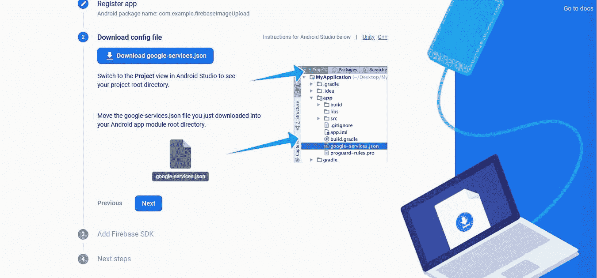

### 步骤 2:将 Firebase 配置添加到 Flutter 项目的本地文件中

现在，为了在我们的 Android 应用中启用 Firebase 服务，我们需要将 [google 服务插件](https://developers.google.com/android/guides/google-services-plugin)添加到我们的 Gradle 文件中。

首先，在我们的**根级(项目级)** Gradle 文件( **android/build.gradle** )中，我们需要添加规则来包含 Google Services Gradle 插件。我们需要检查以下配置是否可用:。

```
buildscript {
  repositories {
    // Check that you have the following line (if not, add it):
    google()  // Google's Maven repository
  }
  dependencies {
    ...
    // Add this line
    classpath 'com.google.gms:google-services:4.3.4'
  }
}

allprojects {
  ...
  repositories {
    // Check that you have the following line (if not, add it):
    google()  // Google's Maven repository
    ...
  }
} 
```

如果没有，我们需要添加配置，如上面的代码片段所示。

现在在我们的模块(应用级)Gradle 文件( **android/app/build.gradle** )中，我们需要应用 **Google Services Gradle** 插件。

为此，我们需要将下面代码片段中突出显示的那段代码添加到**中。我们项目的/android/app/build.gradle** 文件:

```
// Add the following line:
apply plugin: 'com.google.gms.google-services'  // Google Services plugin

android {
  // ...
} 
```

现在，我们需要运行以下命令，以便进行一些自动配置:

```
flutter packages get 
```

现在，我们已经成功地将 Firebase 配置与我们的颤振项目相结合。

## 如何创建 AdMob 帐户

现在，我们需要一个谷歌 AdMob 帐户，以便将广告输入我们的应用程序。为此，我们需要注册并登录到 [AdMob](https://admob.google.com/home/?subid=WW-EN-ET-firebase-docs) 。然后，我们需要导航到 Google AdMob 控制台，如下图所示:

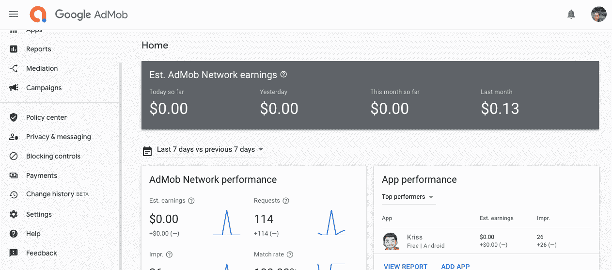

现在，我们需要设置一个 AdMob 应用程序，这将使我们能够访问广告单元。为此，我们需要点击上面截图中显示的“添加您的第一个应用程序”按钮。

然后，我们将被定向到设置应用程序的屏幕，如下面的屏幕截图所示:

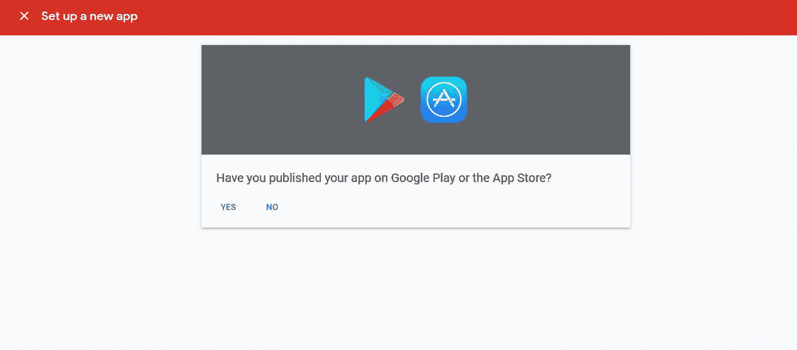

在这里，它询问我们的应用程序是否已经在 Google play 或 App Store 中可用。由于我们正在做测试广告演示，我们没有发布应用程序。因此，只需选择“否”,这将引导您进入另一个屏幕，如下图所示:

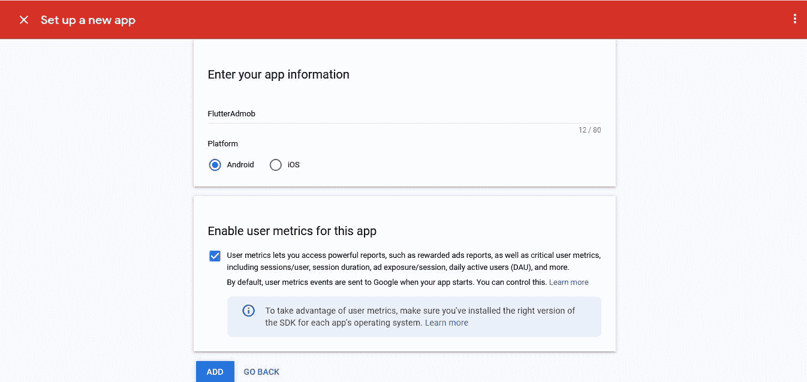

这里，我们需要输入我们的应用程序名称以及平台。你可以给出你选择的名字。然后，由于我们正在与 Android 的 Flutter 合作，我们需要选择 Android，然后单击“添加”按钮。

之后，我们需要导航回 AdMob 控制台。我们将在应用程序控制台中获得 AdMob 应用程序，如下图所示:

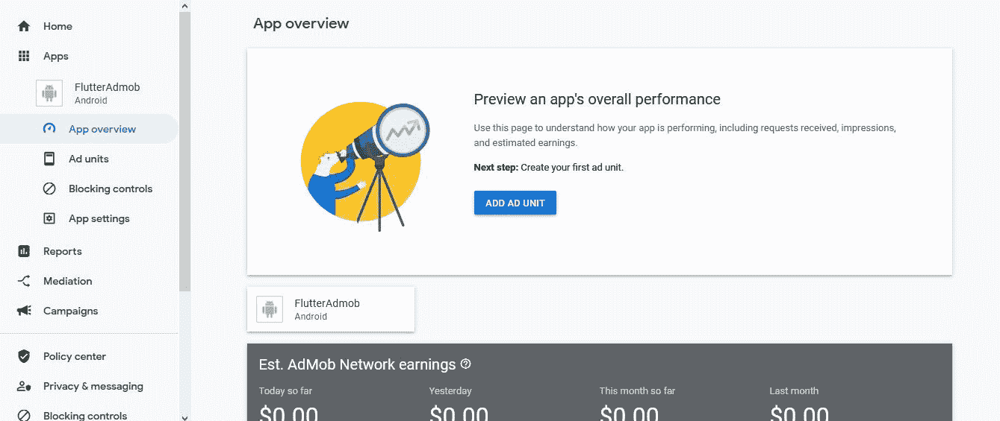

现在，我们需要点击“添加广告单元”,以便创建一个广告单元来提供测试广告。点击后，您将看到一个显示不同广告单元的屏幕，如下图所示:

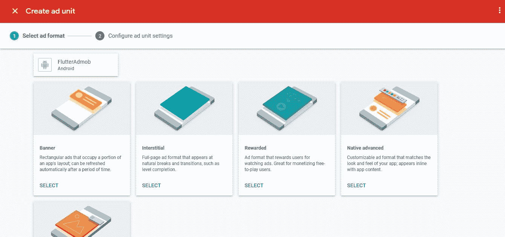

在这里，我们有不同的广告选择。对于简单的实现，我们将选择横幅广告。

因此，我们需要点击“横幅”广告，然后选择广告单元名称，如下图所示:

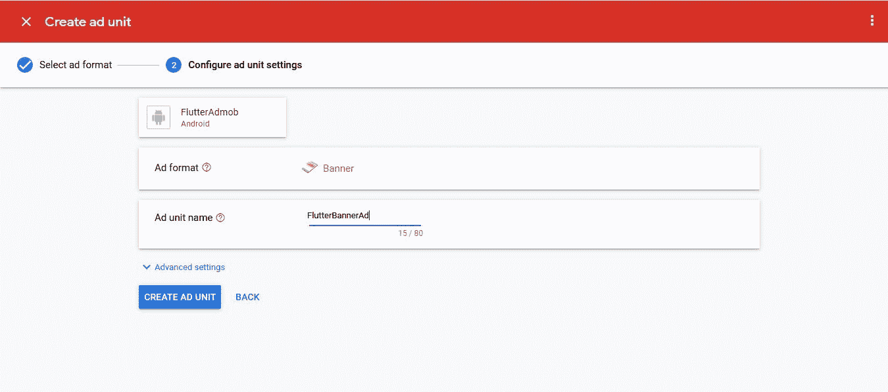

最后，点击“创建广告单元”,然后点击“完成”,成功创建一个广告单元，如下图所示:

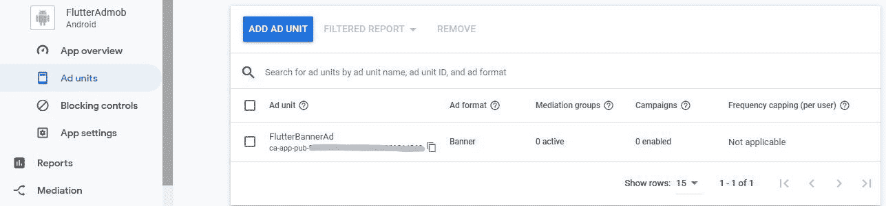

这里，我们有广告单元(请记住，广告单元 ID 在提供实际广告时会很有用)。

## 如何在 Flutter 项目中配置 AdMob

现在我们已经准备好了 AdMob 应用程序和 AdMob 应用程序广告单元，我们可以在我们的 Flutter 项目中设置 AdMob 了。

为此，我们需要首先安装 Firebase 插件，如下面的代码片段所示:

```
firebase_admob: ^0.10.2 
```

现在，我们需要将 AdMob 应用程序连接到我们的本机平台。为此，我们需要向 **[AndroidManifest 添加一个元。](http://androidmanifest.java) xml** 文件如下面的代码片段所示:

```
<meta-data
    android:name="com.google.android.gms.ads.APPLICATION_ID"
    android:value="[ADMOB_APP_ID]"/> 
```

这个文件可以在路径“**中找到。/Android/app/src/main/Android manifest . XML**”。我们需要输入实际的 AdMob **应用 ID** ，而不是**【ADMOB _ APP _ ID】**。

我们可以从 AbMob 控制台中的**应用程序设置**控制台中获取，如下图所示:

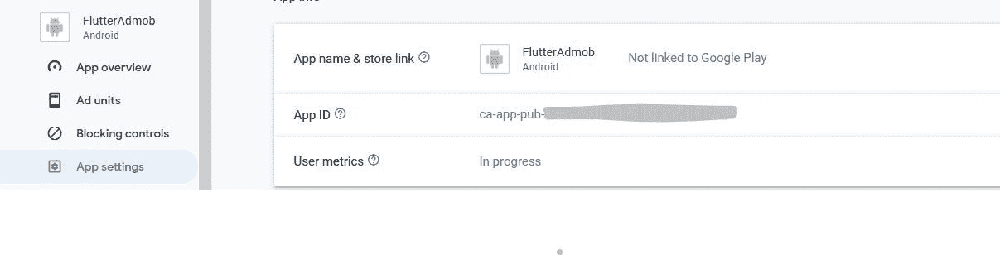

我们只需要复制应用 ID 并粘贴到`value`参数中。

## 如何创建横幅广告

现在，我们的 AdMob 应用程序连接到了我们的 Flutter 项目。在这里，我们将创建一个横幅广告。这个想法是在应用程序屏幕底部显示一个测试横幅广告。

请注意，我们使用的是我们在之前的教程中创建的同一个 Flutter Wallpaper 应用程序项目。在每个项目中设置 AdMob 的过程都是相同的。我们只是用这个项目作为一个演示。

但是首先，我们需要在`main.dart`文件中导入一些必要的 Firebase 依赖项，如下面的代码片段所示:

```
import 'package:firebase_core/firebase_core.dart';
import 'package:firebase_admob/firebase_admob.dart'; 
```

然后，我们需要初始化测试设备。我们也可以从日志中获得测试设备 ID:

```
const String testDevice = 'Kris'; 
```

现在，我们将创建一个返回横幅广告的函数。为此，我们将使用 Firebase AdMob 库提供的`BannerAd`实例，它将 Ad 单元 ID、大小和侦听器函数作为参数。

我们可以使用之前在 AdMob 应用程序的`adUnitId`属性中创建的横幅广告单元 ID。下面的代码片段提供了该函数的整体实现:

```
Future<void> main() async{
  WidgetsFlutterBinding.ensureInitialized();
  BannerAd createBannerAd() {
    return BannerAd(
      adUnitId: BannerAd.testAdUnitId,
      size: AdSize.banner,
      listener: (MobileAdEvent event) {
        print("BannerAd event $event");
      },
    );
  }
  runApp(MyApp());
} 
```

因为我们将在这里显示一个测试广告横幅，所以我们将使用由`BannerAd`实例提供的`testAdUnitId`。但是我们可以粘贴之前在这里创建的实际广告单元 ID。

现在，我们需要在我们的`main`函数中触发横幅广告功能。但是首先，我们需要启动 Firebase 实例。

然后，我们需要用从 AdMob 控制台的**应用程序设置**控制台获得的**应用程序 ID** 初始化`FirebaseAdMob`实例。

最后，我们需要调用`createBannerAd`函数，然后调用`load`广告和`show`广告。下面的代码片段提供了整体实现:

```
 Future<void> main() async{
  .
	.
	.
  await Firebase.initializeApp();
  FirebaseAdMob.instance.initialize(appId: FirebaseAdMob.testAppId);
  createBannerAd()
    ..load()
    ..show();
  runApp(MyApp());
} 
```

因此，我们将在应用程序屏幕的底部看到横幅广告，如下面的模拟器截图所示:


正如你所看到的，在模拟器屏幕的底部有一个测试广告横幅。

恭喜你——你已经成功地在一个 Flutter 应用程序中设置了 AdMob！

*请注意，如果我们使用实际的应用 ID 和广告单元 ID，我们将能够在横幅中获得实际的广告源。*

## 结论

Flutter 是一个不断发展的跨平台移动应用开发框架，引起了许多开发者和公司的关注。所以了解它的一些最有用的特性是很重要的。

在本文中，我们将 AdMob 集成到一个 Flutter 项目中。这个过程有点漫长，但很简单。

AdMob 是将你的应用程序货币化的最佳方式之一——但要充分利用它，你需要知道如何在屏幕上恰当地整合它。

本教程的主要目的是展示如何在您的 Flutter 项目中配置 AdMob，然后显示一个简单的横幅广告。这个过程对于任何一个 Flutter app 都是一样的。

现在，面临的挑战是展示其他类型的广告单元，如间隙广告，原生广告，奖励广告，等等，这些都是当今流行的。我们可以使用实际的 AbMob 应用程序 ID 以及单元 ID 来显示真实的广告提要，而不是测试广告。

你可以在市场上的一些优秀的[应用程序中看到成熟的应用程序，它们拥有最先进的用户界面和功能。](http://www.instaflutter.com)