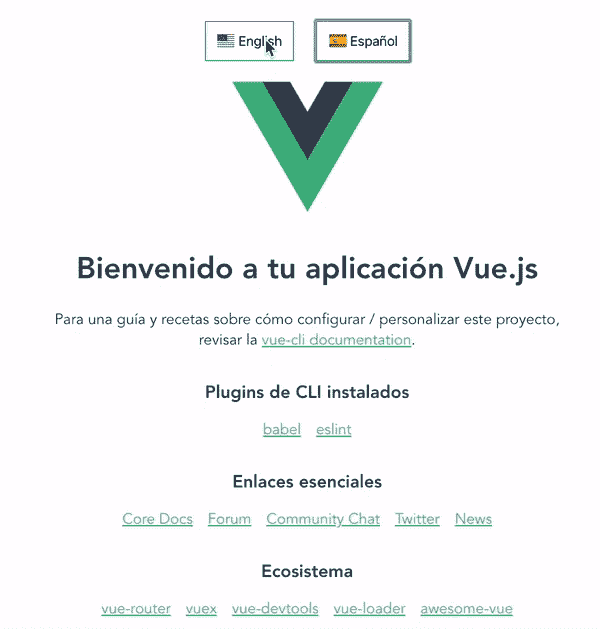
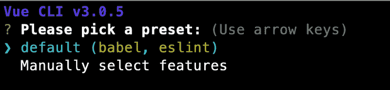
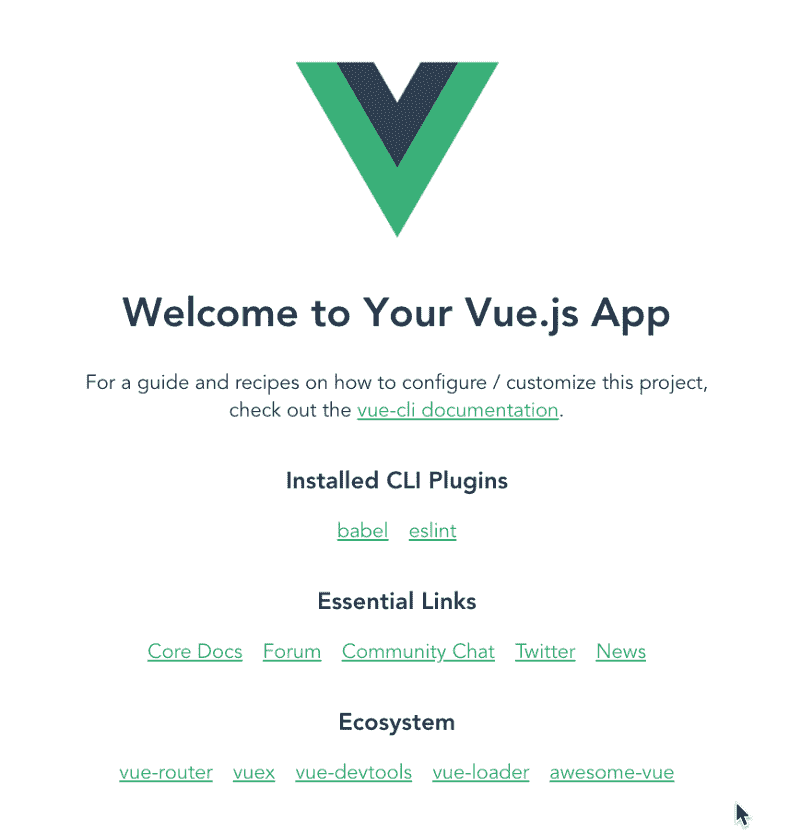
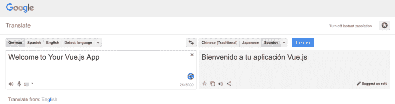
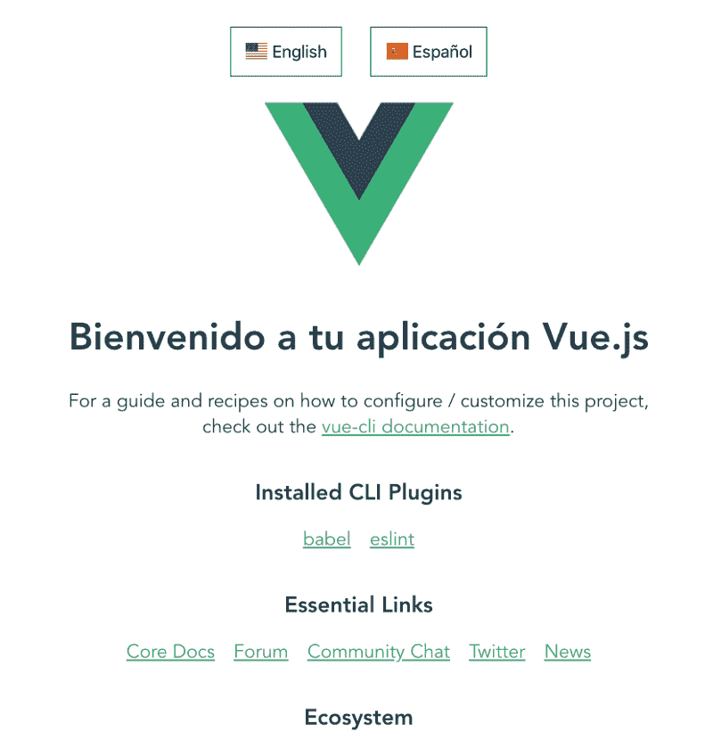

# 如何向 Vue 应用程序添加国际化

> 原文：<https://www.freecodecamp.org/news/how-to-add-internationalization-to-a-vue-application-d9cfdcabb03b/>



Adding Internationalization to Vue

你好。你好。再见。你好。以下是如何将国际化添加到 Vue 中。

我的公司在 37 个国家都有工厂。我们为这些工厂的员工写申请。我们的申请必须被翻译成他们的母语。您可以轻松地将国际化添加到您的 Vue 应用程序中。让我向您展示如何向默认的 Vue 应用程序添加国际化。

#### 创建我们的应用程序

我们将使用 Vue CLI 创建一个应用程序。如果您没有安装它，您可以使用以下命令进行安装:

```
npm install @vue/cli -g
```

`-g`标志将全局安装 Vue CLI。现在我们已经安装了 CLI，我们可以创建一个新的应用程序。输入以下命令创建应用程序:

```
vue create vue-internationalization
```

Vue CLI 将提示您选择一个预设。您可以选择默认预设或手动选择功能。我选择了`default`。



这将在一个名为`vue-internationalization`的文件夹中搭建出一个 Vue 应用程序，因为这是我们在创建时给的名字。现在，使用以下命令切换到该目录:

```
cd vue-internationalization
```

进入目录后，您需要使用以下命令安装所有依赖项:

```
npm install
```

要验证一切运行正常，请输入以下命令:

```
npm run serve
```

现在打开浏览器到 localhost:8080，您应该看到以下内容:



Default vue application

接下来，我们将为此应用程序提供国际翻译。

### view-i18n 插件

我们将使用 vue-i18n 插件进行国际化。让我们将这个插件添加到应用程序中。如果您的服务器仍在运行，请停止它。然后在终端输入以下命令:

```
npm install vue-i18n --save
```

由于这是一个插件，我打算把它配置成一个插件。在 src 文件夹中创建一个名为`plugins`的文件夹。在 plugins 文件夹中创建一个名为`i18n.js`的文件。

为了提供国际化，你必须告诉 Vue 使用 vue-i18n 插件，并为它提供一个消息对象。messages 对象将包含应用程序支持的每种语言的翻译。

第一步是告诉 Vue 使用插件。在`i18n.js`文件中输入以下内容:

```
import Vue from 'vue';
import VueI18n from 'vue-i18n';

Vue.use(VueI18n);
```

现在 Vue 知道使用我们的国际化插件了。下一步是为我们支持的每种语言创建翻译。出于演示目的，我将只添加两种语言:英语和西班牙语。一旦你理解了这是如何工作的，继续向你的应用程序添加越来越多的语言是非常容易的。

要添加语言，我们必须创建一个消息对象。JavaScript 中的对象由键值对组成。消息对象的关键字将是我们支持的语言。让我们使用英语和西班牙语来创建我们支持的语言。在`i18n.js`文件中的`Vue.use`行下面添加以下代码。

```
const messages = {
    'en': {},
    'es': {}
};
```

接下来，我们必须创建一个新的国际化对象，并告诉 Vue 使用它。在 messages 对象后添加以下代码:

```
const i18n = new VueI18n({
    locale: 'en', // set locale
    fallbackLocale: 'es', // set fallback locale
    messages, // set locale messages
});
```

当我们创建国际化对象时，我们必须告诉它我们最初将显示的默认语言环境。如果显示这种语言有问题，我们可以设置一个备用语言环境。然后我们告诉它有我们翻译的消息对象。最后一行导出这个对象。

Vue 需要被告知使用国际化。我们在`main.js`文件中这样做。打开`main.js`文件。使用以下命令导入我们的国际化文件:

```
import i18n from '@/plugins/i18n';
```

> 注意:如果您不熟悉在导入行中使用@,默认情况下，Vue 知道这指向 src 目录。这可以让你避免尝试使用插件目录的相对路径。

我们必须告诉 Vue 使用它，所以我们将`i18n`添加到 Vue 对象中。您的`main.js`文件应该是这样的:

```
import Vue from 'vue';
import App from './App.vue';
import i18n from '@/plugins/i18n';

Vue.config.productionTip = false;

new Vue({
    i18n,
    render: h => h(App),
}).$mount('#app');
```

#### 添加国际翻译

打开`i18n.js`文件。我们将创建我们的第一个翻译。我们将以短语“欢迎使用您的 Vue.js 应用程序”开始消息对象中每种语言的翻译是一个对象。

只是提醒一下，对象是一个键值对。关键是我们将使用什么，价值是在那种语言的短语的翻译。

所以让我给你展示一下这是如何与英语一起工作的。更新文件以包括以下内容:

```
const messages = {
    'en': {
        welcomeMsg: 'Welcome to Your Vue.js App'
    },
    'es': {}
};
```

现在我们必须提供这个短语的西班牙语翻译。由于我不会流利地说西班牙语，我将使用谷歌翻译。



Google Translate

我将复制谷歌翻译提供的西班牙语翻译。然后我会把它添加到西班牙语部分。每种语言都必须使用相同的密钥。因此，我们更新后的消息对象现在看起来像这样:

```
const messages = {
    'en': {
        welcomeMsg: 'Welcome to Your Vue.js App'
    },
    'es': {
        welcomeMsg: 'Bienvenido a tu aplicación Vue.js'
    }
};
```

现在我们有了这个翻译，我们需要替换默认应用程序中的英文文本，以使用我们的国际化文本。打开`App.vue`文件。在模板中，它将一个名为`msg`的道具传递给 HelloWorld 组件。我们希望用我们的国际文本替换此文本。为了简单起见，我将删除这个属性，并将文本放在 HelloWorld 组件中。

打开`HelloWorld`组件。在`h1`标签中，显示了 prop 消息。让我们用下面的代码替换它:

```
<h1>{{ $t('welcomeMsg') }}</h1>
```

$t 指定我们正在使用国际化插件。我们希望显示的文本是消息对象中 welcomeMsg 键的值。如果您已经停止了服务器，可以使用以下命令启动它:

```
npm run serve
```

然后转到您的浏览器，您将看到显示的国际文本。

#### 改变语言

如果我们将 local 设置为西班牙语，我们希望能够看到文本更改为西班牙语。问题是我们如何做到这一点？最简单的方法是提供一个下拉菜单，显示应用程序中提供语言支持的国家的国旗。用户可以选择他们的语言，这将导致所有文本都以该语言呈现。所以我们需要一种方法来允许用户改变语言。

为了在下拉菜单中显示标志，我们可以使用一个`.png`图形文件。这显然会奏效。让我告诉你一个更好的方法。`vue-flag-icon`包提供了 SVG 中所有国家国旗的集合。让我们用这个命令安装它:

```
npm install vue-flag-icon --save
```

现在我们已经安装了它，我们必须告诉 Vue 使用它。打开 main.js 文件。我们必须导入刚刚安装的包，并告诉 Vue 使用它。您的 main.js 文件现在应该是这样的:

```
import Vue from 'vue';
import App from './App.vue';
import i18n from '@/plugins/i18n';
import FlagIcon from 'vue-flag-icon';

Vue.use(FlagIcon);
Vue.config.productionTip = false;

new Vue({
    i18n,
    render: h => h(App),
}).$mount('#app');
```

接下来，我们需要为用户创建按钮来选择他们的语言。打开`App.vue`组件。我们将为两种语言显示一个按钮。用户可以点击按钮以他们的语言显示文本。

在这个演示中，我只支持两种语言。在现实世界的应用程序中，你可能会支持更多的语言。在这种情况下，您将拥有所有受支持语言的数组。现在让我们在我们的应用程序中这样做，这样您可以看到转移到更大的应用程序是多么容易。

我们需要在脚本中添加数据。我们将有一个名为`languages`的条目，它将是一个对象数组。该对象将包含一个标志，语言和一个标题。数据应该是这样的:

```
data() {
    return {
        languages: [
            { flag: 'us', language: 'en', title: 'English' },
            { flag: 'es', language: 'es', title: 'Español' }
        ]
    };
}
```

在我们的模板中，我们需要为我们的`languages`数组中的每种语言创建一个按钮。我们将使用一个`v-for`指令来遍历所有条目，并为每个条目创建一个按钮。下面是您应该在`img`之前添加到模板中的代码。

```
<div>
    <button v-for="entry in languages" :key="entry.title" @click="changeLocale(entry.language)">
        <flag :iso="entry.flag" v-bind:squared=false /> {{entry.title}}
    </button>
</div>
```

在上面的代码中，我们遍历了`languages`数组中的所有条目。在按钮内部，我们显示了国家的国旗和标题。当您最初运行它时，我们会得到您的浏览器提供的按钮的默认样式。让我们来设计按钮的样式，因此在样式部分添加以下 CSS:

```
button {
    padding: 15px;
    border: 1px solid green;
    font-size: 18px;
    margin: 15px;
}
```

我在文本周围提供填充，并在按钮周围放置绿色边框。字体大小使文本在屏幕上可读。边距只是用来设置两个按钮之间的空间以及按钮和图像之间的空间。

当我们创建按钮时，我们告诉它如果用户点击按钮就调用方法`changeLocale`。该方法将把区域设置更改为用户单击的按钮上的语言。要更改语言环境，我们首先需要导入我们的 i18n 插件。您可以使用以下命令导入它:

```
import i18n from '@/plugins/i18n';
```

现在我们可以创建我们的`changeLocale`方法了。它看起来是这样的:

```
methods: {
    changeLocale(locale) {
        i18n.locale = locale;
    }
}
```

启动您的服务器。您将看到两个按钮。单击西班牙语按钮。欢迎消息应该立即变成西班牙语。



Text changed to Spanish

### 完成翻译

到目前为止，我们只翻译了屏幕上的一个项目。我们可以对页面上的剩余文本重复我们所做的。打开`i18n.js`文件。这是我对这一页上的章节标题的翻译。

```
const messages = {
    'en': {
        welcomeMsg: 'Welcome to Your Vue.js App',
        guide: 'For a guide and recipes on how to configure / customize this project,',
        checkout: 'check out the',
        plugins: 'Installed CLI Plugins',
        links: 'Essential Links',
        ecosystem: 'Ecosystem'
    },
    'es': {
        welcomeMsg: 'Bienvenido a tu aplicación Vue.js',
        guide: 'Para una guía y recetas sobre cómo configurar / personalizar este proyecto,',
        checkout: 'revisar la',
        plugins: 'Plugins de CLI instalados',
        links: 'Enlaces esenciales',
        ecosystem: 'Ecosistema'
    }
};
```

现在我们需要用这些翻译来更新 HelloWorld 组件。以下是翻译后的模板:

```
<template>
    <div class="hello">
        <h1>{{ $t('welcomeMsg') }}</h1>
        <p>
            {{ $t('guide') }}<br>
            {{ $t('checkout') }}
            <a href="https://cli.vuejs.org" target="_blank" rel="noopener">vue-cli documentation</a>.
        </p>
        <h3>{{ $t('plugins') }}</h3>
        <ul>
            <li><a href="https://github.com/vuejs/vue-cli/tree/dev/packages/%40vue/cli-plugin-babel" target="_blank"
                   rel="noopener">babel</a></li>
            <li><a href="https://github.com/vuejs/vue-cli/tree/dev/packages/%40vue/cli-plugin-eslint" target="_blank"
                   rel="noopener">eslint</a></li>
        </ul>
        <h3>{{ $t('links') }}</h3>
        <ul>
            <li><a href="https://vuejs.org" target="_blank" rel="noopener">Core Docs</a></li>
            <li><a href="https://forum.vuejs.org" target="_blank" rel="noopener">Forum</a></li>
            <li><a href="https://chat.vuejs.org" target="_blank" rel="noopener">Community Chat</a></li>
            <li><a href="https://twitter.com/vuejs" target="_blank" rel="noopener">Twitter</a></li>
            <li><a href="https://news.vuejs.org" target="_blank" rel="noopener">News</a></li>
        </ul>
        <h3>{{ $t('ecosystem') }}</h3>
        <ul>
            <li><a href="https://router.vuejs.org" target="_blank" rel="noopener">vue-router</a></li>
            <li><a href="https://vuex.vuejs.org" target="_blank" rel="noopener">vuex</a></li>
            <li><a href="https://github.com/vuejs/vue-devtools#vue-devtools" target="_blank"
                   rel="noopener">vue-devtools</a></li>
            <li><a href="https://vue-loader.vuejs.org" target="_blank" rel="noopener">vue-loader</a></li>
            <li><a href="https://github.com/vuejs/awesome-vue" target="_blank" rel="noopener">awesome-vue</a></li>
        </ul>
    </div>
</template>
```

启动服务器并在浏览器中查看应用程序。在两个按钮之间单击。你会看到文本自动翻译成你点击的语言。看这张 gif。


Switching languages in Vue

### 获取代码

我在 GitHub 上有完成的代码[。请帮助我，当你得到代码的时候**开始回购**。](https://github.com/ratracegrad/vue-internationalization)

### 结论

如果你的 app 被全世界的客户使用，你就需要添加国际化。为了增加对多种语言的支持，你必须安装`Vue-i18n`插件。然后将应用程序中的文本翻译成您支持的所有语言。最后一步是为用户提供一种在不同语言之间切换的方式。

我希望你喜欢这篇文章。感谢阅读！