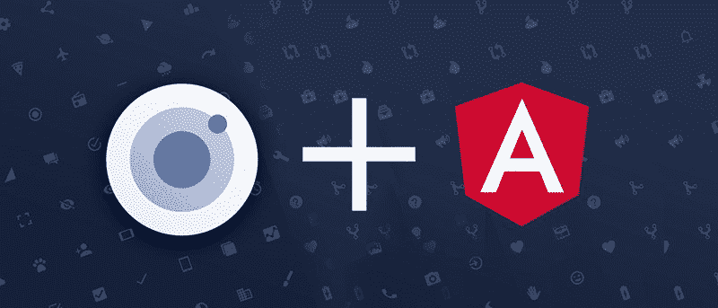
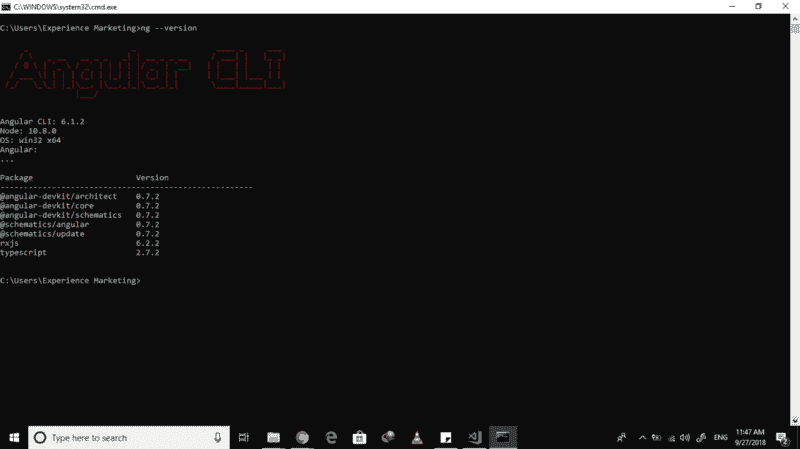
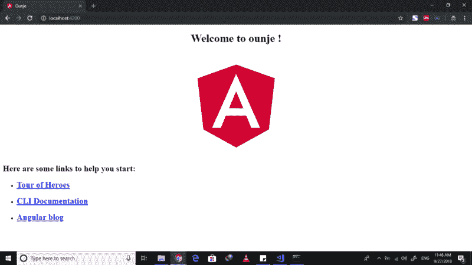

# 如何将 Ionicons 添加到 Angular 6 应用程序

> 原文：<https://www.freecodecamp.org/news/how-to-add-ionicons-to-your-angular-6-apps-7ee5a7b85dc2/>

由 Adedamola 决定

# 如何将 Ionicons 添加到 Angular 6 应用程序



Ionicons and Angular

最近我不得不开发很多[](https://angular.io/)**的应用程序，字体牛逼已经让我筋疲力尽了。所以我决定使用 [**Ionicons**](http://ionicons.com/) 脱离流行的 Ionic 框架。**

**这篇文章展示了如何在你的 Angular 项目上设置[](http://ionicons.com/)**。我们将采取以下步骤:****

*   ****安装角形 CLI v6****
*   ****创建新的 Angular v6 应用程序****
*   ****安装 Ionicons****
*   ****设置 Ionicons 以便在 Angular v6 应用程序上使用****

#### ****安装角形 CLI v6****

****这非常简单——你只需通过 npm 安装最新的 Angular 版本。****

```
**`npm install -g @angular/cli@latest`**
```

****完成之后，你可以运行一个`ng --version`来检查你已经安装的 Angular 版本。确保是 Angular CLI 版本 6.0.0 及以上，如下图。****

****

Angular version check using ng — version**** 

#### ****创建新的 Angular v6 应用程序****

****至此，您已经在 PC 上全局安装了 Angular CLI。现在你可以创建一个新的 Angular 应用程序。我们使用`ng new name-of-my-incredible-app`命令，它允许我们创建一个角度应用程序。****

```
**`ng new my-ionicons-angular-app --style=scss`**
```

****SCSS 位允许我们使用 SCSS。这需要一点时间。完成后，我们导航到新创建的应用程序。****

```
**`cd my-ionicons-angular-app`**
```

****一旦我们进入项目目录，我们就可以启动开发服务器。****

```
**`ng serve`**
```

****这将返回以下内容:****

```
**`** Angular Live Development Server is listening on localhost:4200, open your browser on http://localhost:4200/ **`**
```

****运行网址 [http://localhost:4200/](http://localhost:4200/) 向你展示你全新的应用。如果你看到下面的屏幕。你可以走了。****

****

Default Angular Homepage**** 

#### ****安装 Ionicons****

****像前面一样，我们再次使用 npm 来安装 Ionicons。****

```
**`npm install ionicons`**
```

#### ****设置 Ionicons 以便在 Angular v6 应用程序上使用****

****一旦安装完毕，我们需要告诉 angular 在哪里以及如何加载它。最好的方法是在我们的 styles.scss 文件中，通过添加以下几行来实现:****

```
**`$ionicons-font-path: "~ionicons/dist/fonts";@import "~ionicons/dist/scss/ionicons.scss";`**
```

****此时应该设置正确。您可以编辑您的主页文件—app.component.html，并使用字体图标添加一个新图标，如下所示:`<i class="icon ion-md-heart"&g`t；< /i >。你也可以有一个 [**看看**](https://ionicons.com/) 的 Ionicons 页面那里的图标列表。下面是我的主页和我的 app.component.html 文件的样子。****

****

Angular 6 homepage with an Ionicon**** 

#### ****就是这样！！****

****很简单。我希望你坚持到最后。如果你有任何问题或者你看到了一些错误或者可以做得更好的地方，请在下面留下评论或者你可以在 twitter 上给我发消息[**@ trusdamola**](https://twitter.com/TrussDamola)**。******

****干杯！****