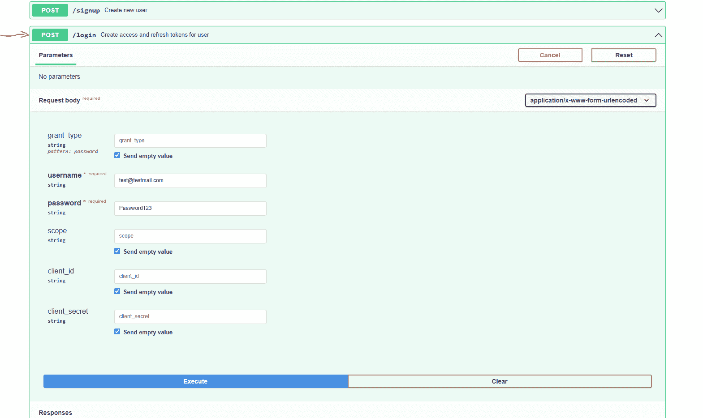
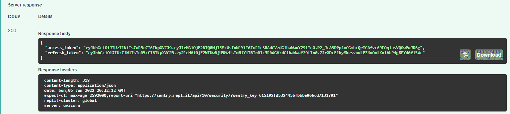
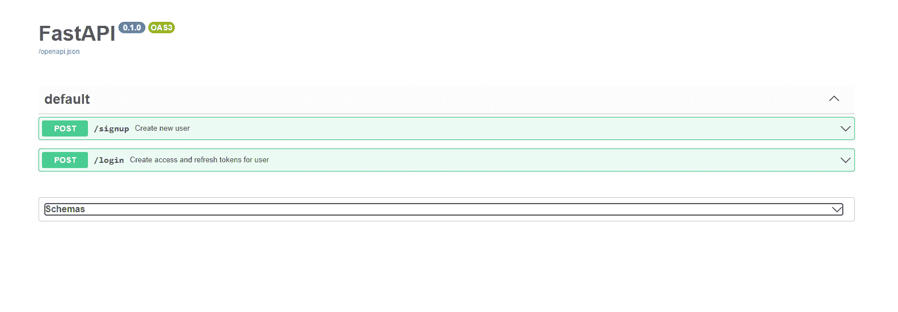
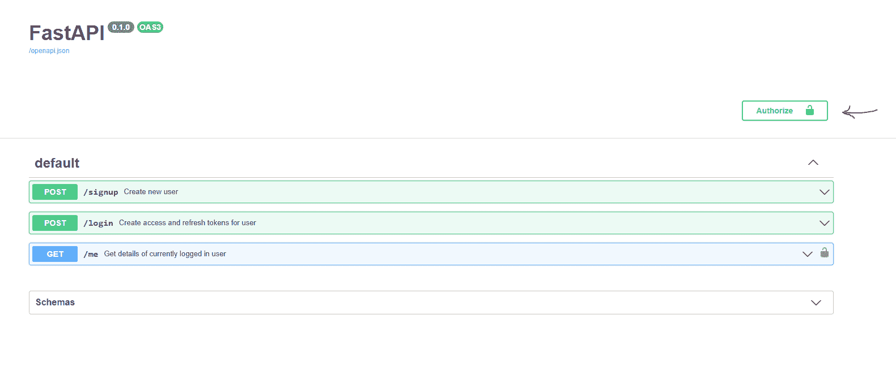
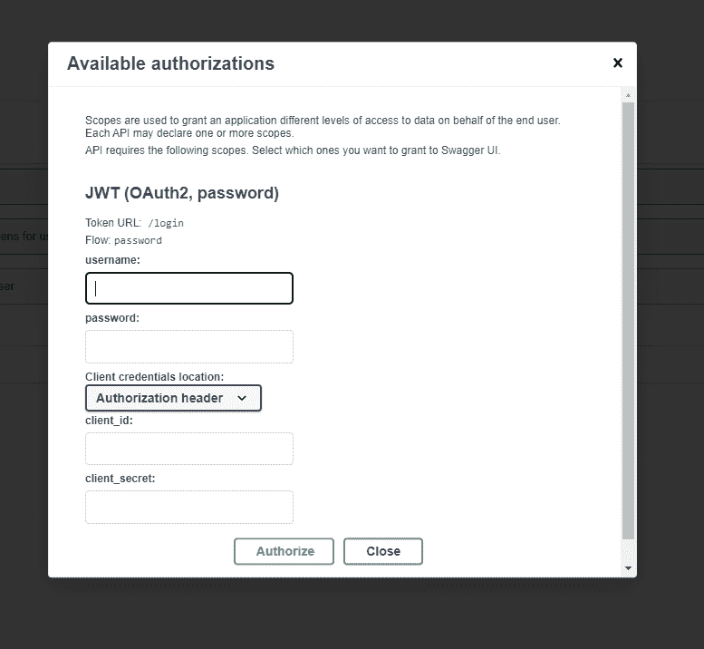
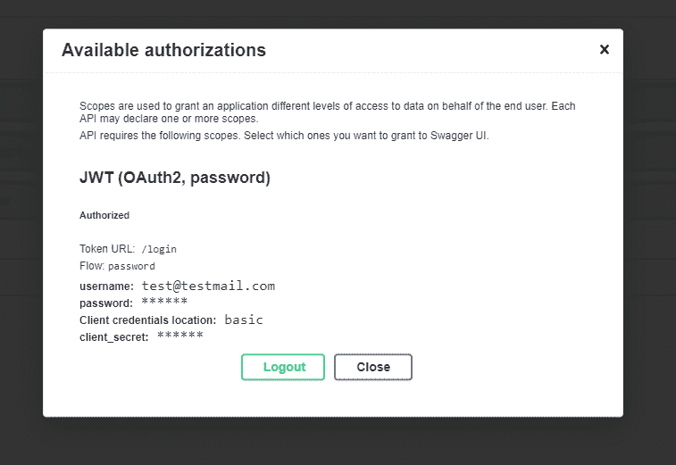

# 如何在 FastAPI 中添加 JWT 认证——实用指南

> 原文：<https://www.freecodecamp.org/news/how-to-add-jwt-authentication-in-fastapi/>

FastAPI 是一个现代、快速、经过实战检验的轻量级 web 开发框架，用 Python 编写。其他流行的选择还有[姜戈](https://www.djangoproject.com/)、[烧瓶](https://flask.palletsprojects.com/en/2.1.x/)和[瓶子](https://bottlepy.org/docs/dev/)。

由于它是新的，FastAPI 既有优点也有缺点。

积极的一面是，FastAPI 实现了所有现代标准，充分利用了最新 Python 版本支持的特性。它有异步支持和类型提示。而且它也很快(因此得名 FastAPI)、非个人化、健壮且易于使用。

不利的一面是，FastAPI 缺少一些复杂的特性，比如 Django 自带的开箱即用的用户管理和管理面板。社区对 FastAPI 的支持很好，但不如其他框架好，这些框架已经存在多年，有数百个甚至数千个针对不同用例的开源项目。

这是对 FastAPI 的一个非常简短的介绍。在本文中，您将通过一个实例了解如何在 FastAPI 中实现 JWT (JSON Web Token)认证。

## 项目设置

在这个例子中，我将使用 [**replit**](https://replit.com) (一个伟大的基于网络的 IDE)。或者，你可以简单地通过遵循文档的[在本地设置你的 FastAPI 项目，或者通过分叉使用这个](https://fastapi.tiangolo.com/tutorial/) [replit starter 模板](https://replit.com/@abdadeel/FastAPIstarter)。此模板已经安装了所有必需的依赖项。

如果您在本地环境中安装了项目，下面是您需要为 JWT 身份验证安装的依赖项(假设您有一个正在运行的 FastAPI 项目):

```
pip install "python-jose[cryptography]" "passlib[bcrypt]" python-multipart
```

**注:**为了存储用户，我准备用 replit 的内置数据库。但是，如果您使用任何标准数据库，如 PostgreSQL、MongoDB 等，也可以应用类似的操作。

如果你想看完整的实现，我有[这个完整的视频教程](https://www.youtube.com/watch?v=G8MsHbCzyZ4&)，它包含了一个生产就绪的 FastAPI 应用程序可能拥有的一切。

[https://replit.com/@abdadeel/FastAPIwithJWTauth?lite=true](https://replit.com/@abdadeel/FastAPIwithJWTauth?lite=true)

FastAPI app with JWT authentication

## 使用 FastAPI 进行身份验证

一般来说，身份验证可能有许多活动部分，从处理密码哈希和分配令牌到验证每个请求上的令牌。

FastAPI 利用[依赖注入](https://en.wikipedia.org/wiki/Dependency_injection#:~:text=In%20software%20engineering%2C%20dependency%20injection,leading%20to%20loosely%20coupled%20programs.)(一种软件工程设计模式)来处理认证方案。以下是该过程中的一些常规步骤:

*   密码哈希
*   创建和分配 JWT 令牌
*   用户创建
*   验证每个请求上的令牌以确保身份验证

## 密码哈希

当使用用户名和密码创建用户时，您需要在将密码存储到数据库之前对其进行哈希运算。让我们看看如何轻松地散列密码。

在`app`目录中创建一个名为`utils.py`的文件，并添加以下函数来散列用户密码。

```
from passlib.context import CryptContext

password_context = CryptContext(schemes=["bcrypt"], deprecated="auto")

def get_hashed_password(password: str) -> str:
    return password_context.hash(password)

def verify_password(password: str, hashed_pass: str) -> bool:
    return password_context.verify(password, hashed_pass)
```

我们使用`passlib`来创建密码散列的配置上下文。在这里，我们将其配置为使用`bcrypt`。

`get_hashed_password`函数接受一个简单的密码，并返回可以安全存储在数据库中的散列值。`verify_password`函数获取普通密码和散列密码，并返回一个表示密码是否匹配的布尔值。

## 如何生成 JWT 代币

在本节中，我们将编写两个助手函数来生成带有特定有效负载的访问和刷新令牌。稍后，我们可以使用这些函数通过传递与用户相关的有效负载来为特定用户生成令牌。

在您之前创建的`app/utils.py`文件中，添加以下导入语句:

```
import os
from datetime import datetime, timedelta
from typing import Union, Any
from jose import jwt
```

imports for creating access and refresh tokens

添加以下将在创建 jwt 时传递的常量:

```
ACCESS_TOKEN_EXPIRE_MINUTES = 30  # 30 minutes
REFRESH_TOKEN_EXPIRE_MINUTES = 60 * 24 * 7 # 7 days
ALGORITHM = "HS256"
JWT_SECRET_KEY = os.environ['JWT_SECRET_KEY']   # should be kept secret
JWT_REFRESH_SECRET_KEY = os.environ['JWT_REFRESH_SECRET_KEY']    # should be kept secret
```

constants for creating access and refresh tokens

`JWT_SECRET_KEY`和`JWT_REFRESH_SECRET_KEY`可以是任何字符串，但是一定要保密，并将其设置为环境变量。

如果您正在跟踪 replit.com，您可以从左侧菜单栏上的`Secrets`选项卡设置这些环境变量。

在`app/utils.py`文件的末尾添加以下函数:

```
def create_access_token(subject: Union[str, Any], expires_delta: int = None) -> str:
    if expires_delta is not None:
        expires_delta = datetime.utcnow() + expires_delta
    else:
        expires_delta = datetime.utcnow() + timedelta(minutes=ACCESS_TOKEN_EXPIRE_MINUTES)

    to_encode = {"exp": expires_delta, "sub": str(subject)}
    encoded_jwt = jwt.encode(to_encode, JWT_SECRET_KEY, ALGORITHM)
    return encoded_jwt

def create_refresh_token(subject: Union[str, Any], expires_delta: int = None) -> str:
    if expires_delta is not None:
        expires_delta = datetime.utcnow() + expires_delta
    else:
        expires_delta = datetime.utcnow() + timedelta(minutes=REFRESH_TOKEN_EXPIRE_MINUTES)

    to_encode = {"exp": expires_delta, "sub": str(subject)}
    encoded_jwt = jwt.encode(to_encode, JWT_REFRESH_SECRET_KEY, ALGORITHM)
    return encoded_jwt
```

functions for generating access and refresh tokens

这两个函数之间的唯一区别是刷新令牌的到期时间比访问令牌的到期时间长。

这些函数只是将有效载荷包含在 JWT 中，它可以是任何东西。通常，您会希望在这里存储像 USER_ID 这样的信息，但是这可以是从字符串到对象/字典的任何内容。这些函数以字符串形式返回令牌。

最后，您的`app/utils.py`文件应该是这样的:

```
from passlib.context import CryptContext
import os
from datetime import datetime, timedelta
from typing import Union, Any
from jose import jwt

ACCESS_TOKEN_EXPIRE_MINUTES = 30  # 30 minutes
REFRESH_TOKEN_EXPIRE_MINUTES = 60 * 24 * 7 # 7 days
ALGORITHM = "HS256"
JWT_SECRET_KEY = os.environ['JWT_SECRET_KEY']     # should be kept secret
JWT_REFRESH_SECRET_KEY = os.environ['JWT_REFRESH_SECRET_KEY']      # should be kept secret

password_context = CryptContext(schemes=["bcrypt"], deprecated="auto")

def get_hashed_password(password: str) -> str:
    return password_context.hash(password)

def verify_password(password: str, hashed_pass: str) -> bool:
    return password_context.verify(password, hashed_pass)

def create_access_token(subject: Union[str, Any], expires_delta: int = None) -> str:
    if expires_delta is not None:
        expires_delta = datetime.utcnow() + expires_delta
    else:
        expires_delta = datetime.utcnow() + timedelta(minutes=ACCESS_TOKEN_EXPIRE_MINUTES)

    to_encode = {"exp": expires_delta, "sub": str(subject)}
    encoded_jwt = jwt.encode(to_encode, JWT_SECRET_KEY, ALGORITHM)
    return encoded_jwt

def create_refresh_token(subject: Union[str, Any], expires_delta: int = None) -> str:
    if expires_delta is not None:
        expires_delta = datetime.utcnow() + expires_delta
    else:
        expires_delta = datetime.utcnow() + timedelta(minutes=REFRESH_TOKEN_EXPIRE_MINUTES)

    to_encode = {"exp": expires_delta, "sub": str(subject)}
    encoded_jwt = jwt.encode(to_encode, JWT_REFRESH_SECRET_KEY, ALGORITHM)
    return encoded_jwt
```

## 如何处理用户注册

在`app/app.py`文件中，创建另一个端点来处理用户注册。端点应该将用户名/电子邮件和密码作为数据。然后，它检查以确保不存在另一个具有该电子邮件/用户名的帐户。然后，它创建用户并将其保存到数据库。

在`app/app.py`中，添加以下处理函数:

```
from fastapi import FastAPI, status, HTTPException
from fastapi.responses import RedirectResponse
from app.schemas import UserOut, UserAuth
from replit import db
from app.utils import get_hashed_password
from uuid import uuid4

@app.post('/signup', summary="Create new user", response_model=UserOut)
async def create_user(data: UserAuth):
    # querying database to check if user already exist
    user = db.get(data.email, None)
    if user is not None:
            raise HTTPException(
            status_code=status.HTTP_400_BAD_REQUEST,
            detail="User with this email already exist"
        )
    user = {
        'email': data.email,
        'password': get_hashed_password(data.password),
        'id': str(uuid4())
    }
    db[data.email] = user    # saving user to database
    return user
```

## 如何处理登录

FastAPI 有一种处理登录的标准方式，以符合 OpenAPI 标准。这将自动在 swagger 文档中添加身份验证，而无需任何额外的配置。

为用户登录添加以下处理函数，并为每个用户分配访问和刷新令牌。别忘了包括进口。

```
from fastapi import FastAPI, status, HTTPException, Depends
from fastapi.security import OAuth2PasswordRequestForm
from fastapi.responses import RedirectResponse
from app.schemas import UserOut, UserAuth, TokenSchema
from replit import db
from app.utils import (
    get_hashed_password,
    create_access_token,
    create_refresh_token,
    verify_password
)
from uuid import uuid4

@app.post('/login', summary="Create access and refresh tokens for user", response_model=TokenSchema)
async def login(form_data: OAuth2PasswordRequestForm = Depends()):
    user = db.get(form_data.username, None)
    if user is None:
        raise HTTPException(
            status_code=status.HTTP_400_BAD_REQUEST,
            detail="Incorrect email or password"
        )

    hashed_pass = user['password']
    if not verify_password(form_data.password, hashed_pass):
        raise HTTPException(
            status_code=status.HTTP_400_BAD_REQUEST,
            detail="Incorrect email or password"
        )

    return {
        "access_token": create_access_token(user['email']),
        "refresh_token": create_refresh_token(user['email']),
    }
```

这个端点与其他 post 端点略有不同，在其他 post 端点中，您定义了用于过滤传入数据的模式。

对于登录端点，我们使用`OAuth2PasswordRequestForm`作为依赖项。这将确保从请求中提取数据，并将 is 作为一个`form_data`参数传递给`login`处理函数。`python-multipart`用于提取表单数据。所以请确保您已经安装了它。

端点将通过用户名和密码输入反映在 swagger 文档中。



成功响应后，您将获得如下所示的令牌:



## 如何添加受保护的路由

现在，由于我们已经添加了对登录和注册的支持，我们可以添加受保护的端点。在 FastAPI 中，使用依赖注入来处理受保护的端点，FastAPI 可以从 OpenAPI 模式中推断出这一点，并将其反映在 swagger 文档中。

让我们看看依赖注入的威力。在这一点上，我们无法从文档中进行验证。这是因为目前我们没有任何受保护的端点，所以 OpenAPI 模式没有足够的关于我们正在使用的登录策略的信息。



No button in swagger docs to login.

让我们创建我们的自定义依赖项。它只是一个在实际的处理函数之前运行的函数，用来获取传递给 hander 函数的参数。我们用一个实际的例子来看看。

创建另一个文件`app/deps.py`并在其中添加包括以下功能:

```
from typing import Union, Any
from datetime import datetime
from fastapi import Depends, HTTPException, status
from fastapi.security import OAuth2PasswordBearer
from .utils import (
    ALGORITHM,
    JWT_SECRET_KEY
)

from jose import jwt
from pydantic import ValidationError
from app.schemas import TokenPayload, SystemUser
from replit import db

reuseable_oauth = OAuth2PasswordBearer(
    tokenUrl="/login",
    scheme_name="JWT"
)

async def get_current_user(token: str = Depends(reuseable_oauth)) -> SystemUser:
    try:
        payload = jwt.decode(
            token, JWT_SECRET_KEY, algorithms=[ALGORITHM]
        )
        token_data = TokenPayload(**payload)

        if datetime.fromtimestamp(token_data.exp) < datetime.now():
            raise HTTPException(
                status_code = status.HTTP_401_UNAUTHORIZED,
                detail="Token expired",
                headers={"WWW-Authenticate": "Bearer"},
            )
    except(jwt.JWTError, ValidationError):
        raise HTTPException(
            status_code=status.HTTP_403_FORBIDDEN,
            detail="Could not validate credentials",
            headers={"WWW-Authenticate": "Bearer"},
        )

    user: Union[dict[str, Any], None] = db.get(token_data.sub, None)

    if user is None:
        raise HTTPException(
            status_code=status.HTTP_404_NOT_FOUND,
            detail="Could not find user",
        )

    return SystemUser(**user)
```

这里我们将`get_current_user`函数定义为一个依赖项，它又将`OAuth2PasswordBearer`的一个实例作为一个依赖项。

```
reuseable_oauth = OAuth2PasswordBearer(
    tokenUrl="/login",
    scheme_name="JWT"
)
```

`OAuth2PasswordBearer`需要两个参数。`tokenUrl`是应用程序中处理用户登录和返回令牌的 URL。`scheme_name`设置为`JWT`将允许前端 swagger docs 从前端调用`tokenUrl`并将令牌保存在内存中。然后，对受保护端点的每个后续请求都将令牌作为`Authorization`头发送，以便``OAuth2PasswordBearer`` 可以解析它。

现在让我们添加一个受保护的端点，它返回用户帐户信息作为响应。为此，用户必须登录，端点将使用当前登录用户的信息进行响应。

在`app/app.py`中创建另一个处理函数。确保也包括进口。

```
from app.deps import get_current_user

@app.get('/me', summary='Get details of currently logged in user', response_model=UserOut)
async def get_me(user: User = Depends(get_current_user)):
    return user
```

一旦您添加了这个端点，您将能够在 swagger 文档和一个🔒受保护端点`/me`前的图标。



这就是依赖注入的力量和 FastAPI 生成自动 OpenAPI 模式的能力。

点击`Authorize`按钮将打开授权表单，其中包含登录所需的字段。在成功的响应中，令牌将被保存并在标头中发送给后续请求。



Swagger integrated login form



successfully logged in

此时，您可以访问所有受保护的端点。要使一个端点受到保护，您只需要添加`get_current_user`函数作为依赖项。这就是你需要做的！

## 结论

如果您一直这样做，您应该有一个带有 JWT 认证的工作的 FastAPI 应用程序。如果没有，你可以随时运行[这个 repl](https://replit.com/@abdadeel/FastAPI-with-JWT-authentication) 并使用它或者访问[这个部署版本](https://fastapi-with-jwt-authentication.abdadeel.repl.co/docs)。你可以在这里找到这个项目[的 GitHub 代码。](https://github.com/mabdullahadeel/fcc-fastapi-jwt)

如果你觉得这篇文章有帮助，请在[Twitter](https://twitter.com/abdadeel_)[@ abdadeel _](https://twitter.com/abdadeel_)关注我。别忘了，你可以随时观看[这段视频](https://www.youtube.com/watch?v=G8MsHbCzyZ4&ab_channel=ABDLogs)，通过一个实际例子获得详细解释。

谢谢；)