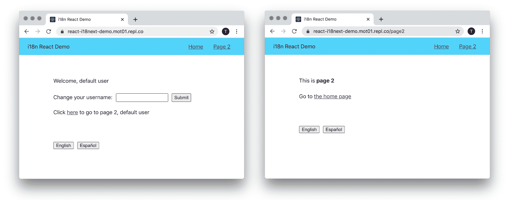

# 如何使用 React-i18 将本地化(l10n)添加到您的 React 应用程序接下来

> 原文：<https://www.freecodecamp.org/news/how-to-add-localization-to-your-react-app/>

当您将本地化添加到网站时，您就使它可以在多种语言中使用。本教程旨在教你如何使用`react-i18next`在一个小的 react 应用程序上做到这一点。

它的工作方式很简单。不是将想要显示的文本放在组件中，而是全部放在一个 JSON 文件中。

然后，使用组件中文件的密钥来获取文本。您可以为每种语言添加具有相同关键字和翻译值的额外 JSON 文件。无论设置什么语言，都将决定哪个 JSON 文件用作应用程序的文本。

遵循以下步骤，了解如何将此功能添加到 React 应用程序中。

## 复制样板文件

如果你想跟着编码，你可以[从 GitHub](https://github.com/moT01/react-i18next-demo) 克隆样板文件或者[在 replit](https://repl.it/github/moT01/react-i18next-demo) 上打开样板文件。这是一个小型的 React 应用程序，有两个页面和几个组件:



我们的目标是让这个应用程序有英语和西班牙语版本。

如果您正在学习，我建议您快速浏览一下组件和文件结构，以便熟悉代码。`src`文件夹中的 JS 文件是您将要更改的重要文件。`Nav`、`Home`和`Page2`组件包含所有需要翻译的文本。

## 添加依赖项

`react-i18next`基于`i18next`，所以你需要两个包作为依赖来翻译应用。您可以通过以下方式添加它们:

```
npm install --save react-i18next i18next 
```

如果你正在跟进，用`npm start`启动应用程序，这样你就可以浏览两个页面。

## 创建文件结构

在`src`文件夹中，创建一个`i18n`文件夹来保存所有与翻译应用程序相关的信息。下面是我使用的非常常见的结构:

```
src
+-- i18n
    +-- locales
    |    +-- en
    |        +-- translations.json
    |    +-- es
    |        +-- translations.json
    +-- config.js 
```

`config.js`文件包含对`i18n`实例的设置。这两个 JSON 文件将保存应用程序中的文本。`en`代表英语，`es`代表西班牙语。如果您正在跟进，请在样板文件中创建文件结构。

## 配置 i18n 实例

`i18n`实例将保存您所有的翻译、当前语言以及其他需要的信息和方法。您可以在`config.js`文件中这样配置它:

```
import i18n from 'i18next';
import { initReactI18next } from 'react-i18next';

i18n.use(initReactI18next).init({
  fallbackLng: 'en',
  lng: 'en',
  resources: {
    en: {
      translations: require('./locales/en/translations.json')
    },
    es: {
      translations: require('./locales/es/translations.json')
    }
  },
  ns: ['translations'],
  defaultNS: 'translations'
});

i18n.languages = ['en', 'es'];

export default i18n; 
```

在顶部，导入必要的依赖项。接下来，`use(initReactI18next)`将把`react-i18next`绑定到`i18n`实例。

`init`对象参数的前两个属性是后备语言(`fallbackLng`)和默认语言(`lng`)。我将这两个都设置为英语(`en`)。

`resources`是 JSON 文件，包含您在上一步中创建的翻译。名称空间(`ns`)和默认名称空间(`defaultNS`)是来自`resources`对象的键。

如果您有一个大型应用程序来简化文件，您可以将翻译分成多个文件(名称空间)。在这种情况下，您可以在`resources`对象中添加不止一个文件，并将其添加到名称空间数组中。这个应用程序很小，所以所有的翻译可以放在一个文件中。

## 将 i18n 实例添加到您的应用程序

在包含整个应用程序的样板文件的`index.js`文件中，导入您创建的`i18n`实例，如下所示:

```
import './i18n/config'; 
```

接下来，将一个空对象添加到两个`translations.json`文件中，这样就不会出现任何错误。稍后您将填写密钥。

## 用 useTranslation 钩子翻译一个功能组件

`Nav.js`文件是第一个要翻译的组件。它是一个功能组件，所以你可以使用`useTranslation`钩子。用`import { useTranslation } from 'react-i18next'`在顶部导入。

接下来，不在组件中使用隐式 return，而是添加花括号和 return 语句，这样就可以声明一个变量。用`const { t } = useTranslation();`从钩子中获取`t`函数。

总之，它看起来应该是这样的:

```
import { useTranslation } from 'react-i18next';

const Nav = () => {
  const { t } = useTranslation();

  return (
    …
  );
} 
```

这个组件中你要翻译的文本是`Home`和`Page 2`。在您的英文`translations.json`文件中，向对象添加两个属性:

```
{
  "home": "Home",
  "page2": "Page 2"
} 
```

现在，您可以将这些键传递给`t`函数来获取文本。在`Nav.js`组件中，使用`t`函数将`Home`和`Page 2`翻译成英文文本，如下:`t('key-from-json-file')`。

这些线条应该是这样的:

```
import { useTranslation } from ‘react-i18next;

const Nav = () => {
  const { t } = useTranslation();

  return (
    …

    <Link to="/">{t('home')}</Link>
    <Link to="/page2">{t('page2')}</Link>
  );
} 
```

## 西班牙语预览

两个导航按钮应该适用于英语。将同样的两个键添加到西班牙语 JSON 文件中，这样您就可以看到它在西班牙语中的样子。以下是翻译:

```
{
  "home": "Casa",
  "page2": "Página 2"
} 
```

之后，转到`config.js`文件，将`lng`(默认语言)设置为`es`并重新加载页面。导航链接应该以西班牙语显示。完成后，您可以将默认语言设置回`en`。

## 使用 withTranslation 翻译类组件

在`Home.js`文件中，有三个句子和一个按钮需要翻译。对于大多数组件，您可以再次使用`t`函数，但这是一个类组件，因此您需要使用`withTranslation`高阶组件(HOC)。用`import { withTranslation } from 'react-i18next';`在顶部导入。

然后在文件底部用`export default withTranslation()(Home);`导出。现在`t`函数将被传递到组件的 props 中使用。

在 render 方法中，用`const { t } = this.props`获取函数。代码应该如下所示:

```
import { withTranslation } from 'react-i18next';

class Home extends Component {
  …

  render() {
    const { t } = this.props;

    …
  }
}

export default withTranslation()(Home); 
```

要翻译的第一行`Welcome, {username}`，有一个变量。你可以像这样用你的变量将一个对象传递给`t`函数:`t('key-from-json-file', { variable: value })`。在组件中看起来应该是这样的:

```
<p>{t('welcome', { username: username })}</p> 
```

把“欢迎”一行加进去。然后，在英文 JSON 文件中，添加新的键:`"welcome": "Welcome, {{username}}"`。传递给`t`函数的`username`变量将被放入字符串中。

另外，将属性添加到西班牙文文件:`"welcome": "Bienvenido {{username}}"`。如果你想用西班牙语预览，请按照前面的说明操作。

### 挑战自我

你现在应该能自己翻译一些东西了。试着像其他人一样做下面两行，`Change your username:`和`Submit`。

以下是英文 JSON 文件的属性:

```
"change-username": "Change your username:",
"submit": "Submit" 
```

和西班牙语翻译:

```
"change-username": "Cambia tu nombre de usuario:",
"submit": "Enviar" 
```

将上述内容添加到两个 JSON 文件中。然后，用`t`功能翻译`label`和`button`文本。

当你完成后，`Home.js`的渲染部分应该是这样的:

```
render() {
  const { username } = this.state;
  const { t } = this.props;

  return (
    <div className='body'>
      <p>{t('welcome', {username: username})}</p>

      <div>
        <label>{t('change-username')}</label>
        <input type='text' onChange={this.updateUsername.bind(this)} />
        <button onClick={this.setUsername.bind(this)}>
          {t('submit')}
        </button>
      </div>

      <p>Click <Link to='/page2'>here</Link> to go to page 2, {username}</p>
    </div>
  );
} 
```

将`config.js`中的`lng`改为`en`或`es`，重新加载应用程序测试语言。

## 用 Trans 组件翻译基本嵌套元素

暂时保留主页上的最后一行，转到`Page2.js`文件。要翻译的两个句子包含其他元素——一个`strong`标签和一个`Link`组件。

一般规则是尽可能使用前面例子中的`t`函数，但是如果文本中有元素或其他组件，就需要使用`Trans`组件。

首先，从`react-i18next`进口`Trans`和`withTranslation`。然后，再次使用`withTranslation`导出组件。它应该是这样的:

```
import { Trans, withTranslation } from 'react-i18next';

const Page2 = () => (
  …
);

export default withTranslation()(Page2); 
```

如果您的文本中有基本的 HTML 标签，您可以在 JSON 文件中的关键字周围包装`Trans`组件，标签将被添加到文本中。

将组件中的第一个`<p>`改为:

```
<p><Trans>this-is-page2</Trans></p> 
```

然后，将密钥添加到两个`translation.json`文件中。对于英语:

```
"this-is-page2": "This is <strong>page 2</strong>" 
```

还有西班牙的 JSON:

```
"this-is-page2": "Esta es la <strong>página 2</strong>" 
```

以上将翻译`Page2.js`的第一行。这个方法可以使用的默认基本标签是`br`、`strong`、`i`和`p`，但是这个列表可以在 config 中扩展。将配置中的语言设置为西班牙语，以确保它正常工作。

## 用 Trans 翻译复杂的嵌套元素

下一行有一个嵌套的`Link`组件，所以有点复杂。您需要再次使用`Trans`，但是将它的道具中的键作为`i18nKey`传递，并将`Link`作为它的子对象。`Link`不需要任何文本。这是它的样子:

```
<Trans i18nKey='go-to-home'>
  <Link to='/'></Link>
</Trans> 
```

请务必保存好`<p>`标签。将关联的属性添加到英文 JSON:

```
"go-to-home": "Go to <0>the home page</0>" 
```

西班牙语版本:

```
"go-to-home": "Ir a la <0>pagina principal</0>" 
```

`<0>`标签表示`Trans`组件的第一个子组件，在本例中是`Link`。如果有另一个孩子，它会使用`<1>`标签，以此类推。

如果您想查看两种不同的语言环境，请在配置中更改语言。

## 用变量翻译复杂的嵌套元素

还有一行要翻译。`Home.js`文件的最后一行包含一个嵌套的`Link`元素和一个变量。你需要再次使用`Trans`,所以将其添加到顶部的现有导入中。

如果需要使用带`Trans`的变量，可以放在元素内部。所以最后一行:

```
<p>Click <Link to='/page2'>here</Link> to go to page 2, {username}</p> 
```

可以这样翻译:

```
<Trans i18nKey='go-to-page2'>
  <Link to='/page2'></Link>
  {{username}}
</Trans> 
```

钥匙像以前一样作为道具传给`Trans`。嵌套的`Link`元素和`{{ username }}`变量需要在组件中的某个地方，在哪里并不重要。

确保将这些值添加到 JSON 文件中。对于英语:

```
"go-to-page2": "Click <0>here</0> to go to page 2, {{username}}" 
```

和西班牙语:

```
"go-to-page2": "Haga clic <0>aquí</0> para ir a la página 2, {{username}}" 
```

## 如何改变语言

所有想要的文本现在都应该有英文和西班牙文。最后要做的是让语言之间的切换变得容易。

`Footer.js`文件有几个按钮和一个`changeLanguage`功能。从文件顶部的`react-i18next`导入`useTranslation`钩子。在`Footer`组件的顶部，像这样从中获取`i18n`实例:`const { i18n } = useTranslation();`。

最后，在`changeLanguage`函数中，使用`i18n.changeLanguage()`方法，将`e.target.value`传递给它，以改变语言。

总的来说，看起来是这样的:

```
import { useTranslation } from 'react-i18next';

const Footer = () => {
  const { i18n } = useTranslation();

  function changeLanguage(e) {
    i18n.changeLanguage(e.target.value);
  }

  return(
    <div className='footer'>
      <button onClick={changeLanguage} value='en'>English</button>
      <button onClick={changeLanguage} value='es'>Español</button>
    </div>
  )
} 
```

现在，您应该能够通过单击每个页面上的按钮来切换语言。

## 如何添加语言

从这里开始，应用程序可以很容易地被翻译成任何语言。您只需要在配置中添加另一种语言，以及带有翻译文本的 JSON 文件。

## 结论

希望这能让您对如何将 React 应用程序快速扩展成多种世界语言有所了解。

这些工具有更多的特性和细节。有关更多信息，请参见下面的链接。

### 有用的链接

*   查看已完成项目的[演示](https://react-i18next-demo.mot01.repl.co/)
*   查看已完成项目的[源代码](https://github.com/moT01/react-i18next-demo/tree/solution)
*   react-i18next 文档详细介绍了 react 的一些翻译方法、服务器端渲染、测试和其他用途。
*   下一篇文档有关于附加配置、API、翻译复杂文本和附加特性的有用信息。