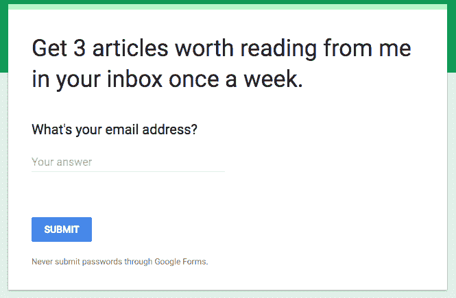
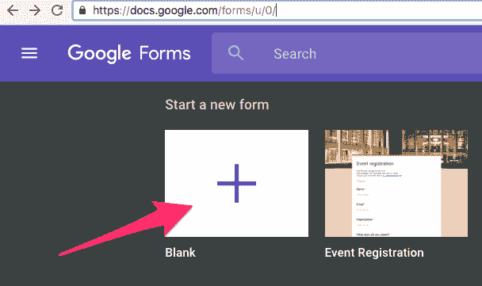
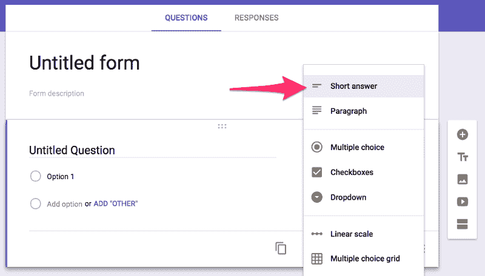
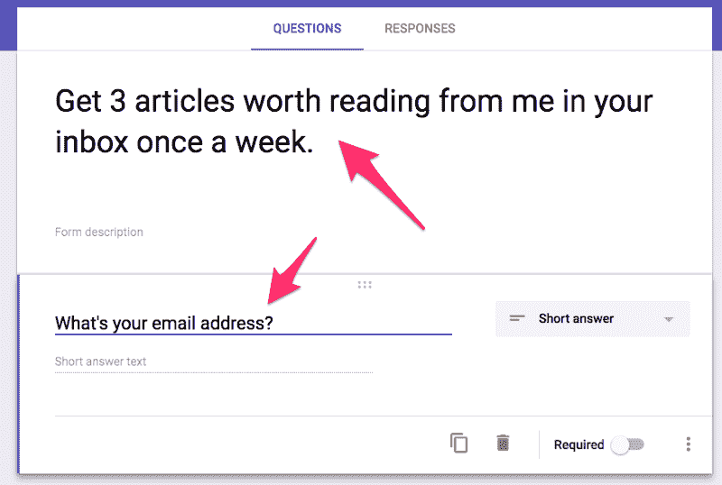
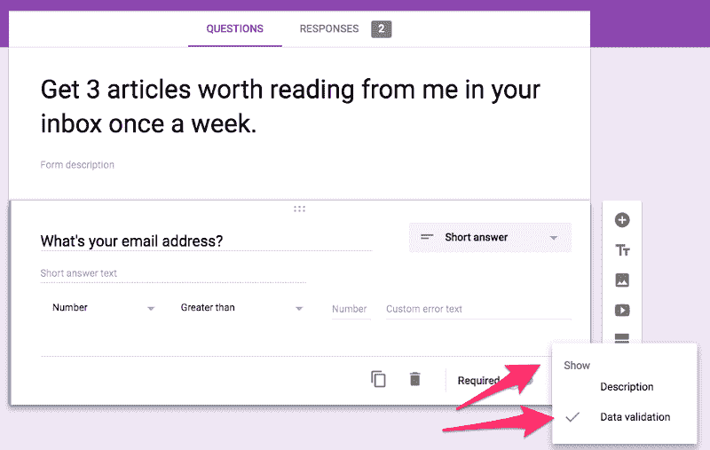
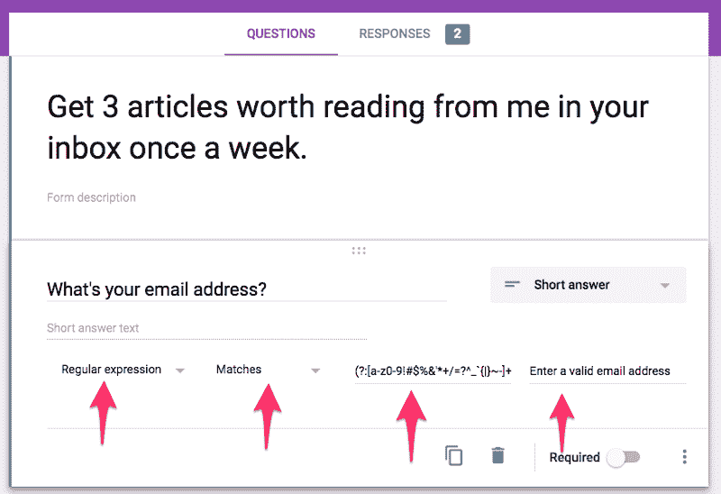
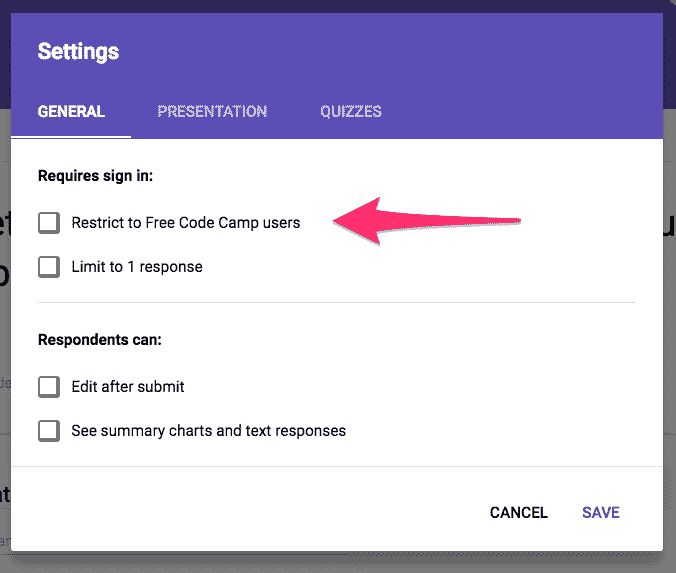
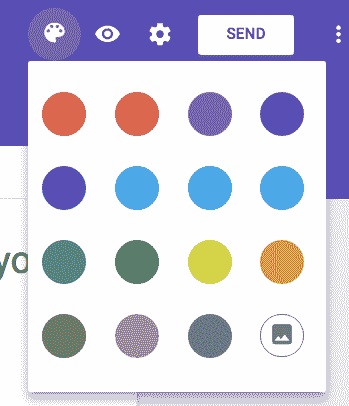
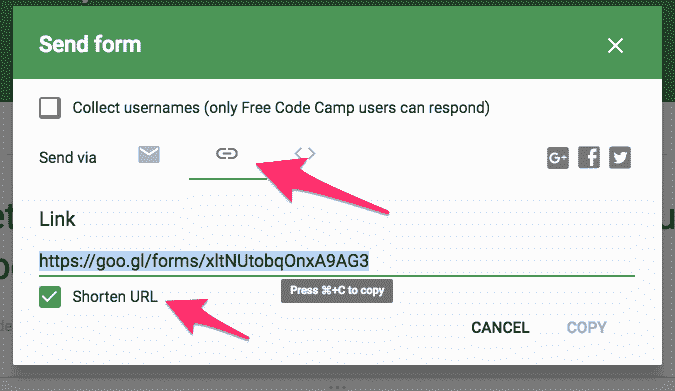
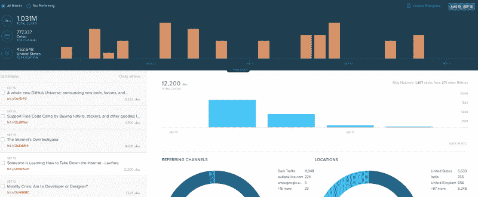

# 我如何使用 Google Forms 在 Medium 中构建邮件列表注册表单

> 原文：<https://www.freecodecamp.org/news/how-to-add-mailing-list-signup-to-your-medium-stories-using-google-forms-c717393b2f6/>

在 Medium 上有很多收集电子邮件地址的付费工具。好家伙，他们提供了很多功能。

但是如果你不在乎那些特性呢？

如果你只是想要你的读者的电子邮件地址，仅此而已呢？

这就是 Google Forms 的用武之地。很简单，免费，直接导出 CSV。

与付费工具不同，Medium 本身支持 Google Forms 嵌入。因此，如果你的读者正在浏览器中浏览你的故事，他们将会看到嵌入在 Medium post 中的表单。

如果你的读者正在中等 Android 或 iOS 应用程序中查看你的故事，他们将无法看到嵌入的内容。因此，我建议还包括一个链接，他们可以按照你的形式。

让我们一起构建一个邮件列表注册表单，然后将它嵌入到一个媒体故事中。



This is what the end result will look like. I’ll embed the live form at the bottom of this article.

### 如何用谷歌表单构建你的注册表单

#### 步骤 1:创建表单

转到[https://forms.google.com](https://forms.google.com)并点击



#### 步骤 2:创建输入字段

第一个问题将默认为“多项选择”。改成“简答”



#### 第三步:给你的表格和问题添加标题



#### 第 4 步:添加数据验证

首先，让我们在表单上启用数据验证，方法是单击右下角的“…”，然后单击“数据验证”



现在让我们启用正则表达式匹配来确保您的读者输入有效的电子邮件地址。



这是我使用的正则表达式，emailregex.com 称它在 99.99%的情况下都能识别出有效的电子邮件地址。只需将其复制并粘贴到正则表达式字段中:

```
(?:[a-z0-9!#$%&'*+/=?^_`{|}~-]+(?:\.[a-z0-9!#$%&'*+/=?^_`{|}~-]+)*|"(?:[\x01-\x08\x0b\x0c\x0e-\x1f\x21\x23-\x5b\x5d-\x7f]|\\[\x01-\x09\x0b\x0c\x0e-\x7f])*")@(?:(?:[a-z0-9](?:[a-z0-9-]*[a-z0-9])?\.)+[a-z0-9](?:[a-z0-9-]*[a-z0-9])?|\[(?:(?:25[0-5]|2[0-4][0-9]|[01]?[0-9][0-9]?)\.){3}(?:25[0-5]|2[0-4][0-9]|[01]?[0-9][0-9]?|[a-z0-9-]*[a-z0-9]:(?:[\x01-\x08\x0b\x0c\x0e-\x1f\x21-\x5a\x53-\x7f]|\\[\x01-\x09\x0b\x0c\x0e-\x7f])+)\])
```

如果你好奇正则表达式是如何工作的，并想了解更多，这里有一个互动的课程。

我不建议把这个问题做成必问，因为会加一个很吓人的红色星号，写着“必问”。这可能会让你的读者误以为你在索要他们的电子邮件地址。事后你可以很容易地过滤掉空白的回答。

#### 第五步:确保它是公开的

点按顶部的齿轮，并验证您的电子邮件不仅限于与您的电子邮件地址共享同一个域的人。



#### 第六步:加点颜色。为什么不呢？

单击右上角的托盘图标。如果你愿意，你也可以上传一张图片。



### 现在让我们将您的注册表单添加到介质中

点击谷歌表单右上角的“发送”按钮。



点按链状链接图标，然后点按“缩短 URL”复制网址，然后回到媒体，粘贴它，并点击输入。

过一会儿，Medium 会显示你的表单的缩略图。点击“发布”按钮后，您的表单将被嵌入到您的媒体出版物中，并且将完全可用。

瞧啊。这是我的样子:

每周一次在你的收件箱里从我这里获得 3 篇值得一读的文章。[在这里报名](https://goo.gl/forms/dsvfK1dRz5zePih02)。

### 额外部分:我如何发送电子邮件

以下是我目前用来向大约 35 万人发送每周电子邮件的脚本:

[**FreeCodeCamp/massification**](https://github.com/FreeCodeCamp/massification)
[*massification——一个建立在亚马逊 SES 和 Node*github.com](https://github.com/FreeCodeCamp/massification)上的电子邮件服务

这个脚本使用 AmazonSES 来获得高投递率。每 100 封邮件的费用是 0.01 美元，这意味着我每周的邮件发送只需要 35 美元。

目前，该脚本需要大约 18 个小时来发送 35 万封电子邮件。但是它是完全开源的，所以如果有人发现了一种使它更有效的方法，拉请求是受欢迎的。

如果你很好奇，下面是我的一封邮件的样子:


这是生成这封邮件的 JSON:

```
{ “subject”: “Someone’s learning how to take down the internet.”, “text”: “Here are this week’s three links that are worth your time:\n\n1\. Someone is learning how to take down the internet (3 minute read): http://bit.ly/2cbR5um\n\n2\. For 25 years this man has been fighting to make public information public. Now he’s being sued for it (25 minute read): http://bit.ly/2cZzkM4\n\n3\. GitHub announced a ton of new collaboration features (6 minute read): http://bit.ly/2cfZrPZ\n\nBonus: I just added new Free Code Camp gear to our community’s shop, including t-shirts, hoodies, and recommended books: http://bit.ly/2cz8Wai\n\n\nHappy Coding,\n\n- Quincy Larson\n\nTeacher at https://www.FreeCodeCamp.com\n\n\n\n\n\nIf this email bothers you, you can manage your email settings here: https://www.freecodecamp.com/settings\n\nOr you can one-click unsubscribe: https://www.freecodecamp.com/unsubscribe/<%= email %>”}
```

你会注意到底部的奖励链接将读者引向[自由代码营的商店](https://www.freecodecamp.com/shop)。这让读者更容易支持我们的开源社区，并帮助我抵消发送所有这些电子邮件的成本。

您还会注意到，我编写了一个简单但可靠的退订函数。这背后的所有逻辑都运行在自由代码营的服务器上，我在那里维护这个列表。

你需要自己想出某种退订解决方案。

如果你的列表不是很大，你可以告诉读者，如果他们不想要你的任何邮件，就回复“退订”，然后在谷歌文档电子表格中手动将它们从你的列表中删除。

你可能注意到的另一件事是，我以纯文本格式发送电子邮件，而不是 HTML 格式。

很多设计师写信给我，提议为我创建一个 HTML 模板。他们没有意识到的是，比起 HTML 邮件，人们更喜欢文本邮件。

我的理论是，朋友不会给你发 HTML 格式的邮件——他们只是写文本。所以你更有可能把文本邮件理解为友好的，而把 HTML 邮件理解为垃圾邮件。

此外，HTML 电子邮件引起了可访问性和移动响应性问题，这是您必须处理的问题。尝试过编写电子邮件模板吗？一点都不好玩。

所以我的建议是只用文字。

是的，我自己对此进行了 A/B 测试，并得出结论，我自己的文本邮件比我的 HTML 邮件表现得更好。

所以我感谢这些设计师的提议，然后问他们是否可以帮助为我们的社区创建知识共享许可的[资产。](https://github.com/FreeCodeCamp/assets)

最后，你会注意到我使用 bit.ly 来处理分析。这不会给我已接收/已打开的统计数据，但会给我点击统计数据:



My Bit.ly dashboard for the past 30 days.

如果有人知道用明文跟踪接收/打开统计数据的可靠方法，请在评论部分告诉我。

### 当然，你还得请人报名？

每周一次在你的收件箱里从我这里获得 3 篇值得一读的文章。[在这里报名](https://goo.gl/forms/dsvfK1dRz5zePih02)。

此外，单击？所以更多的人会在媒体上看到这篇文章。

