# 如何使用 Firebase 云消息向 Flutter 应用程序添加推送通知

> 原文：<https://www.freecodecamp.org/news/how-to-add-push-notifications-to-flutter-app/>

Flutter 已经迅速成为跨平台移动应用程序开发最流行的框架之一。它帮助开发人员构建支持不同设备大小、像素密度和方向的原生 UI，创建一个漂亮的像素完美的 UI/UX。

在本教程中，我们将学习如何使用 Firebase 云消息向 Flutter 应用程序添加推送通知。本教程将只讨论 Android 平台的配置。

### 一、什么是推送通知？

推送通知是一种弹出消息媒介，提醒应用程序用户应用程序中正在发生的事情。它们也是增强用户参与你的应用的重要方式。

例如，假设用户在安装了应用程序后忘记了它。然后，您可以使用推送通知作为一种机制来重新获得并保持他们的兴趣。推送通知也有助于增加你的应用流量。

Firebase Cloud Messaging 是 Firebase 提供的一项服务，可以让您将这些通知发送给用户。您可以设置各种配置，根据时间和常规向不同的受众发送不同的通知。

由于所有这些好处，我们将使用它向我们的 Flutter 应用程序发送通知。

## 步骤 1:创建一个 Flutter 项目

首先，我们将创建一个 flutter 项目。为此，我们必须在系统中安装 Flutter SDK。你可以在官方[文档](https://flutter.dev/docs/get-started/install)中找到颤振安装的简单步骤。

成功安装 Flutter 后，只需在所需的目录下运行以下命令，就可以建立一个完整的 Flutter 项目:

```
flutter create pushNotification 
```

建立项目后，在项目目录中导航。在终端中执行以下命令，在可用的仿真器或实际设备中运行项目:

```
flutter run 
```

成功构建后，您将在模拟器屏幕中获得以下结果:


## 步骤 2:将 Firebase 配置与颤振相结合

在这一步中，我们将把 Firebase 服务与我们的 Flutter 项目集成起来。但是首先，我们需要创建一个 Firebase 项目。官方 [firebase 文档](https://firebase.google.com/docs/flutter/setup?platform=android)中也提供了颤振设置指南。

要创建一个 Firebase 项目，我们需要登录到 [Firebase](https://firebase.google.com/) 并导航到控制台。在那里，我们只需点击“添加项目”即可开始我们的项目。

然后会出现一个窗口，要求输入项目名称。在这里，我将项目名称保留为`FlutterPushNotification`，如下图所示:

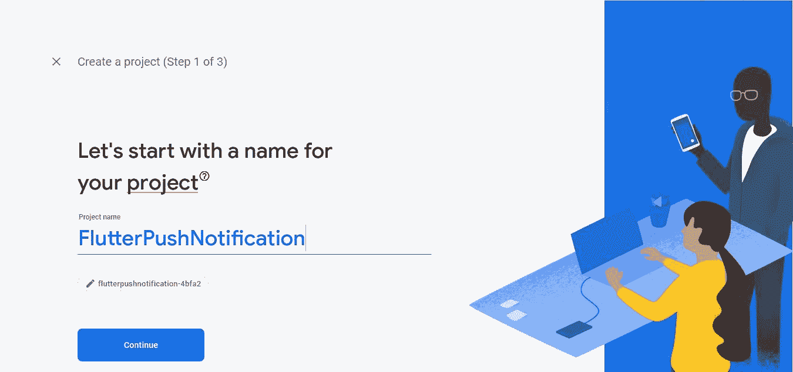

项目创建完成后，我们可以继续下一步。项目设置完成后，我们将得到一个项目控制台，如下图所示:

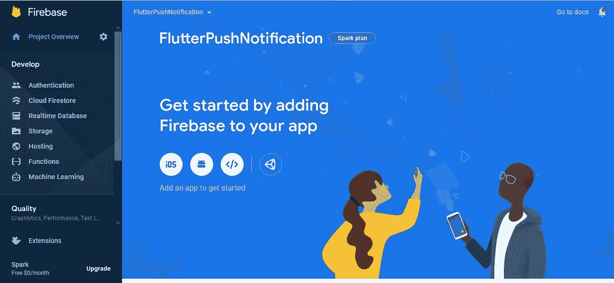

在这里，我们将为 Android 平台设置 Firebase。所以我们需要点击上面截图中显示的 Android 图标。这将把我们带到用我们的 Flutter 应用程序项目注册 Firebase 的界面。

## 第三步:将 Firebase 注册到你的 Android 应用程序

由于注册过程是特定于平台的，我们将为 Android 平台注册我们的应用程序。点击 Android 图标后，我们会被引导到一个界面，要求输入 Android 包名。

为了添加我们的 Flutter 项目的包名，我们需要首先定位它。包名将在**中显示。你的 Flutter 项目的/android/app/build.gradle** 文件。您将看到类似这样的内容:

```
com.example.pushNotification 
```

我们只需要将它复制并粘贴到 Android 包名输入字段，如下图截图所示:

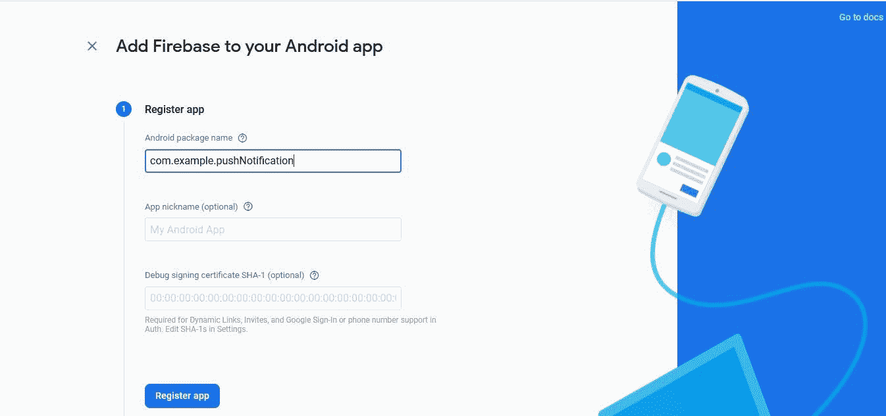

之后，我们只需点击“注册应用程序”按钮。这将把我们带到一个界面，在那里我们可以获得 **google-services.json** 文件，该文件将把我们的 Flutter 应用程序链接到 Firebase Google 服务。

我们需要下载文件并将其移动到**。我们颤振项目的/android/app** 目录。说明也显示在下面的截图中:

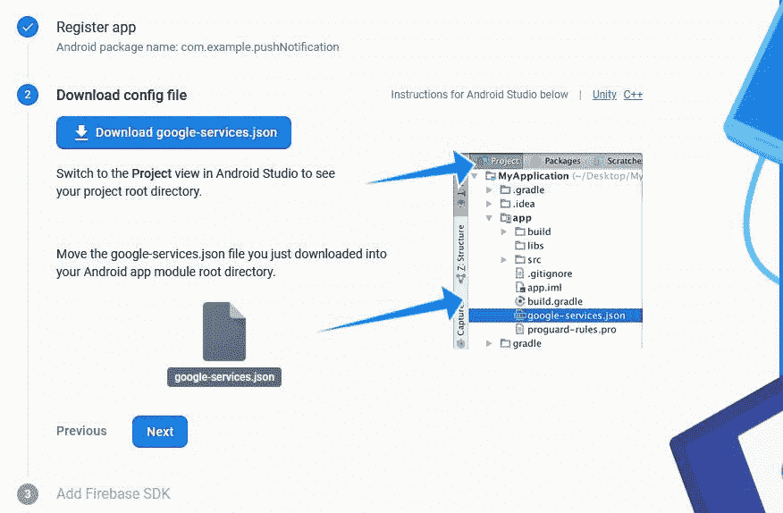

## 步骤 4:将 Firebase 配置添加到 Flutter 项目的本地文件中

现在，为了在我们的 Android 应用中启用 Firebase 服务，我们需要将 [google 服务插件](https://developers.google.com/android/guides/google-services-plugin)添加到我们的 Gradle 文件中。

首先在我们的**根级(项目级)** Gradle 文件( **android/build.gradle** )中，我们需要添加规则来包含 Google Services Gradle 插件。我们需要检查以下配置是否可用:

```
buildscript {
  repositories {
    // Check that you have the following line (if not, add it):
    google()  // Google's Maven repository
  }
  dependencies {
    ...
    // Add this line
    classpath 'com.google.gms:google-services:4.3.4'
  }
}

allprojects {
  ...
  repositories {
    // Check that you have the following line (if not, add it):
    google()  // Google's Maven repository
    ...
  }
} 
```

如果没有，我们需要添加配置，如上面的代码片段所示。

现在在我们的模块(应用级)Gradle 文件( **android/app/build.gradle** )中，我们需要应用 **Google Services Gradle** 插件。

为此，我们需要将下面代码片段中突出显示的那段代码添加到**中。我们项目的/android/app/build.gradle** 文件:

```
// Add the following line:
**apply plugin: 'com.google.gms.google-services'**  // Google Services plugin

android {
  // ...
} 
```

现在，我们需要运行以下命令，以便进行一些自动配置:

```
flutter packages get 
```

因此，我们成功地将 Firebase 配置与我们的颤振项目相结合。

## 步骤 5:将 Firebase 消息传递与 Flutter 集成

首先，我们需要将 firebase-messaging 依赖项添加到**中。/android/app/build.gardle** 文件。在文件中，我们需要添加以下依赖项:

```
dependencies {
    implementation "org.jetbrains.kotlin:kotlin-stdlib-jdk7:$kotlin_version"
    implementation 'com.google.firebase:firebase-messaging:20.1.0'
} 
```

接下来，我们需要在**的`activity`标签中添加一个`action`和一个`category`作为`intent-filter`。/Android/app/src/main/Android manifest . XM**l 文件:

```
<intent-filter>
    <action android:name="FLUTTER_NOTIFICATION_CLICK" />
    <category android:name="android.intent.category.DEFAULT" />
</intent-filter> 
```

现在，我们需要在路径**/Android/app/src/main/Java/<app-organization-path>**中创建一个名为**Application.java**的 Java 文件。

然后，我们需要在其中添加以下代码片段中的代码:

```
package io.flutter.plugins.pushNotification;

import io.flutter.app.FlutterApplication;
import io.flutter.plugin.common.PluginRegistry;
import io.flutter.plugin.common.PluginRegistry.PluginRegistrantCallback;
import io.flutter.plugins.GeneratedPluginRegistrant;
import io.flutter.plugins.firebasemessaging.FirebaseMessagingPlugin;
import io.flutter.plugins.firebasemessaging.FlutterFirebaseMessagingService;

public class Application extends FlutterApplication implements PluginRegistrantCallback {
    @Override
    public void onCreate() {
        super.onCreate();
        FlutterFirebaseMessagingService.setPluginRegistrant(this);
    }

    @Override
    public void registerWith(PluginRegistry registry) {
        FirebaseMessagingPlugin.registerWith(registry.registrarFor("io.flutter.plugins.firebasemessaging.FirebaseMessagingPlugin"));
    }
} 
```

现在，我们需要将这个`Application`活动分配给 **AndroidManifest.xml** 文件的`application`标签，如下面的代码片段所示:

```
<application
        android:name=".Application" 
```

这就完成了我们在原生 Android 代码中对 Firebase 消息插件的设置。现在，我们将进入颤振项目。

## 步骤 6:安装 Firebase 消息传递包

在这里，我们将使用`[firebase_messaging`包，你可以在这里找到[。为此，我们需要将插件添加到 pubspec.yaml 文件的依赖选项中。](https://pub.dev/packages/firebase_messaging/)

我们需要将下面一行代码添加到依赖项选项中:

```
firebase_messaging: ^7.0.3 
```

## 步骤 7:实现一个简单的 UI 屏幕

现在，在 **main.dart** 文件的`MyHomePage` stateful widget 类中，我们需要初始化`FirebaseMessaging`实例和一些常量，如下面的代码片段所示:

```
String messageTitle = "Empty";
String notificationAlert = "alert";

FirebaseMessaging _firebaseMessaging = FirebaseMessaging(); 
```

变量`messageTitle`将接收通知消息标题，一旦通知出现，`notificationAlert`将被分配已完成的动作。

现在，我们需要将这些变量应用于`Scaffold`小部件主体内的构建函数，如下面的代码片段所示:

```
Widget build(BuildContext context) {
    return Scaffold(
      appBar: AppBar(
        title: Text(widget.title),
      ),
      body: Center(
        child: Column(
          mainAxisAlignment: MainAxisAlignment.center,
          children: <Widget>[
            Text(
              notificationAlert,
            ),
            Text(
              messageTitle,
              style: Theme.of(context).textTheme.headline4,
            ),
          ],
        ),
      ),
    );
  } 
```

接下来，我们需要通过在项目终端中执行以下命令来运行 Flutter 应用程序:

```
flutter run 
```

我们将得到您在下图中看到的结果:

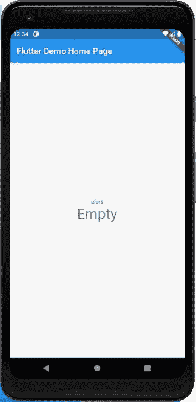

目前，通知标题是空的，警报也是已定义的。一旦收到通知消息，我们需要给它们分配一个合适的值。

所以我们需要配置代码来接收通知，并使用通知消息将其显示在屏幕上。

为此，我们需要将以下代码片段中的代码添加到`initiState`函数中:

```
@override
  void initState() {
    // TODO: implement initState
    super.initState();

    _firebaseMessaging.configure(
      onMessage: (message) async{
        setState(() {
          messageTitle = message["notification"]["title"];
          notificationAlert = "New Notification Alert";
        });

      },
      onResume: (message) async{
        setState(() {
          messageTitle = message["data"]["title"];
          notificationAlert = "Application opened from Notification";
        });

      },
    );
  } 
```

这里，我们使用了由`_firebaseMessaging`实例提供的`configure`方法，该实例反过来提供了`onMessage`和`onResume`回调。这些回调提供通知`message`作为参数。`message`响应将通知对象保存为地图对象。

当我们运行应用程序时收到通知，就会触发`onMessage`功能。当我们在设备通知栏中收到通知提醒，并通过推送通知本身打开应用程序时，就会触发`onResume`功能。在这种情况下，应用程序可以在后台运行，也可以根本不运行。

现在我们都配备了 Flutter app。我们只需要在 Firebase Cloud Messaging 中配置一条消息，并将其发送到设备。

## 步骤 8:从 Firebase 云消息控制台创建消息

首先，我们需要回到 Firebase 站点中的云消息控制台，如下图所示:

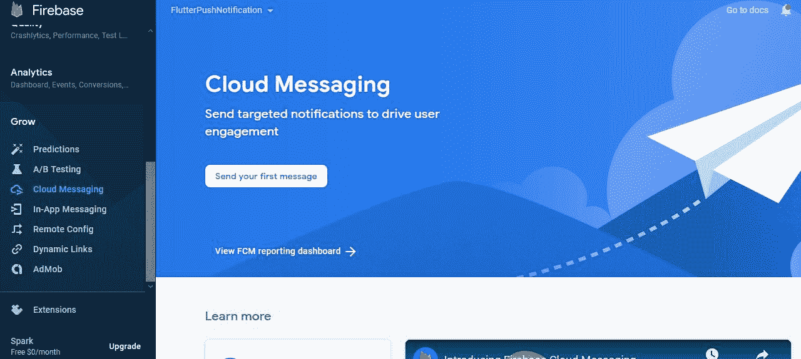

这里，我们可以在窗口中看到“发送您的第一条消息”选项，因为我们之前没有配置任何消息。我们需要单击它，这将引导我们进入以下窗口:

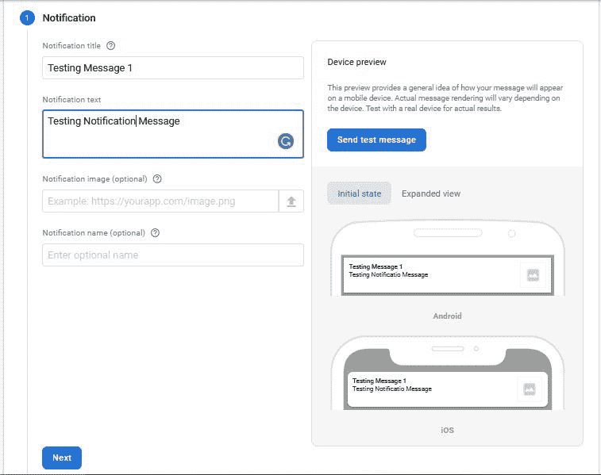

在这里，我们可以输入通知的标题、文本、图像和名称。我们在这里设置的标题将作为之前在 Flutter 项目中设置的回调上的`message`对象中的标题提供。

设置必填字段后，我们可以单击“下一步”,这将引导我们进入以下窗口:

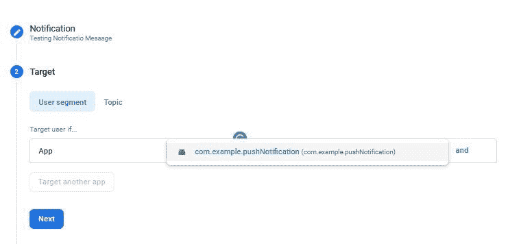

在这里，我们需要提供我们的目标应用程序，然后单击“下一步”。

对于调度，我们可以保留默认选项:


接下来，将出现转换窗口，我们也可以将其保留为默认窗口，然后单击“下一步”按钮。

最后，将出现一个需要输入自定义数据的窗口，我们可以在其中设置`title`和`click_action`。每当我们单击出现在设备通知栏中的通知时，就会触发此单击操作事件。

点击通知栏中的通知消息后，应用程序将打开，并触发`onResume`回调，将`title`设置为在下面截图中的自定义数据中分配的值:

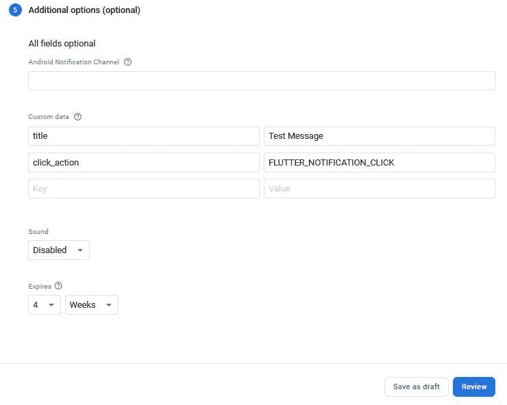

现在，我们准备向设备发送第一条通知消息。首先，让我们用运行在模拟器中的设备来尝试一下。

当我们点击“查看”按钮并发送消息时，我们将在云消息控制台和模拟器中获得以下结果:

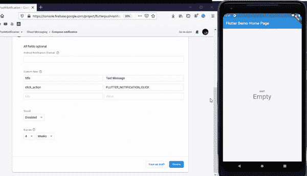

在这里，我们可以看到，只要我们从控制台发送消息，模拟器屏幕上的标题和通知警报就会更新。我们可以确定`onMessage`回调是在收到通知消息后在 app 中触发的。

现在，让我们尝试在后台运行应用程序。当我们从控制台发送消息时，我们将得到如下演示所示的结果:

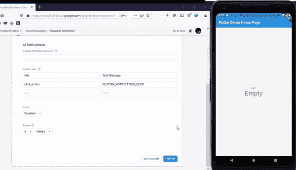

在这里，我们一发送消息，就会在设备的通知栏中收到推送通知。然后，当我们向下拖动通知栏时，我们可以看到通知消息的标题和文本。并且，通过单击通知消息，我们可以启动应用程序并在屏幕上显示自定义数据。这确保了我们的`onResume`回调被触发。

我们完事了。我们已经使用 Firebase 云消息成功地在我们的 Flutter 应用程序中添加了推送通知功能。

## 结论

推送通知在任何 app 中都是必不可少的。它们可以用来提醒用户应用程序中正在发生的事情，并有助于将用户的兴趣重新吸引到应用程序上。

此外，Firebase 云消息使发送通知警报变得更加简单和容易。

在本教程中，我们从配置 Firebase 应用程序开始，然后继续在 Flutter 应用程序中设置和实现 Firebase 消息传递配置。最后，我们能够使用 Firebase 云消息向应用程序发送通知警报。

本教程旨在简单易懂。希望它能帮助你将推送通知添加到你的 Flutter 应用程序中。想看看如何实现这一切的一些例子吗？看看这些强大的[颤振模板](http://instaflutter.com)。