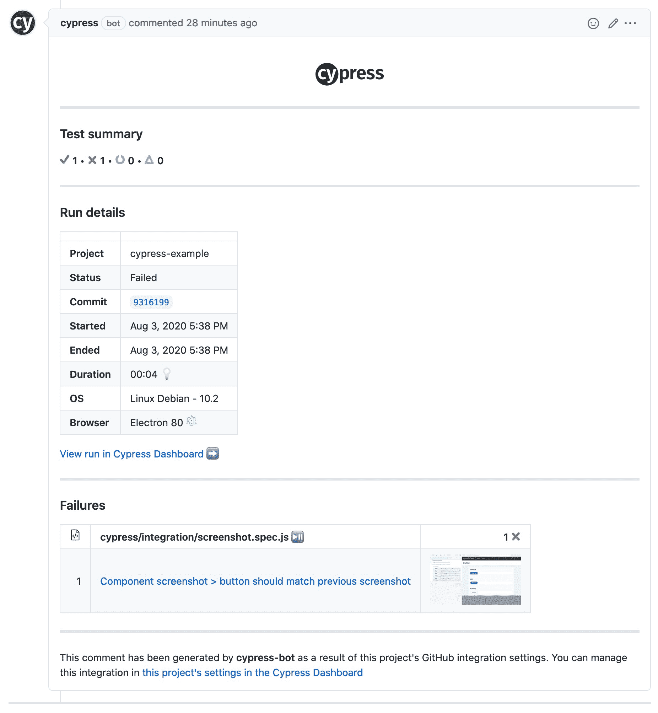
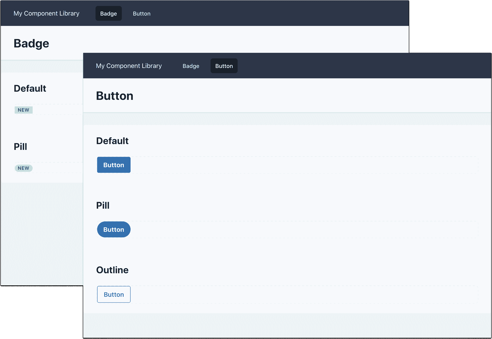
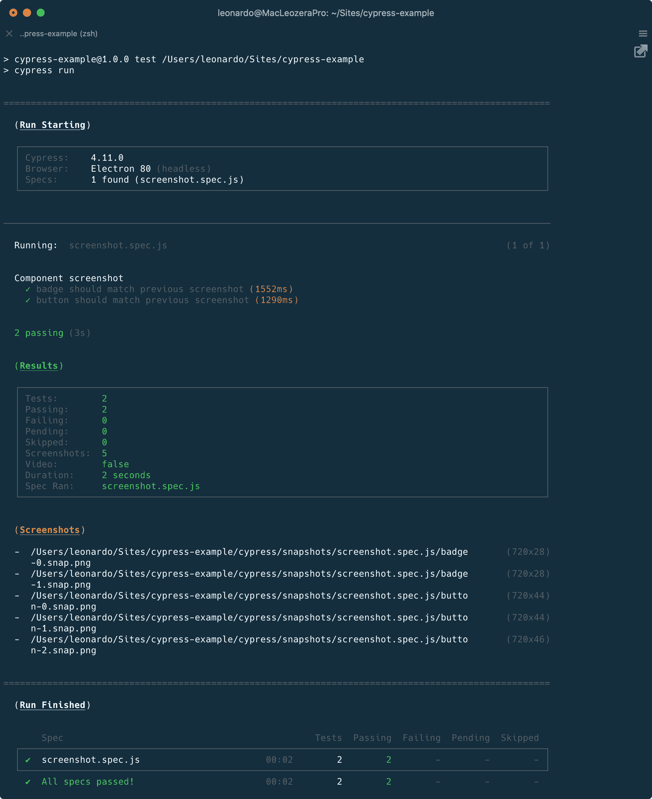
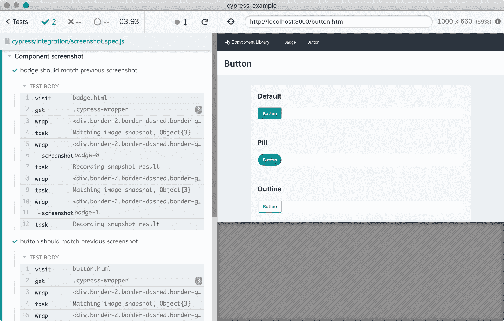
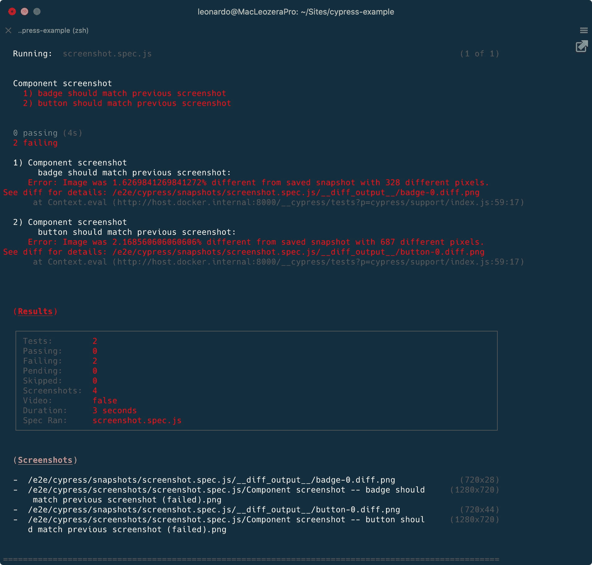

# 如何将 Cypress 的截图测试添加到您的项目中

> 原文：<https://www.freecodecamp.org/news/how-to-add-screenshot-testing-with-cypress-to-your-project/>

开发人员通常关心他们代码的质量。有不同种类的测试可以帮助我们避免在项目中添加新特性时破坏代码。但是，我们能做些什么来确保组件不会随着时间的推移而发生变化呢？

在这篇文章中，你将学习如何使用 Cypress 来捕获网站页面的一部分。之后，您将在 CI 中集成测试工具，以确保将来没有人会对您的项目进行不必要的更改。

我创建这个测试策略的动机来自于工作。在[thinkfic](https://www.thinkific.com)我们有一个内部设计系统，我们添加了 Cypress 以避免在 CSS/JS 文件中工作时出现意外。

在这篇文章的结尾，我们将会有带有 Cypress 测试的 PRs:



## 开始之前

我创建了一个[样本网站](https://cypress-example.vercel.app/)来模仿组件库。这是一个用 TailwindCSS 创建的非常简单的网站，托管在 Vercel 中。它记录了 2 个组件:[徽章](https://cypress-example.vercel.app/badge.html)和[按钮](https://cypress-example.vercel.app/button.html)。

你可以在 GitHub 查看[的源代码](https://github.com/leonardofaria/cypress-example)。网站是静态的，它位于`public`文件夹中。运行`npm run serve`，在浏览器[中查看 http://localhost:8000](http://localhost:8000) ，就可以在本地看到网站。



## 添加柏树和柏树图像快照

从克隆[范例库](https://github.com/leonardofaria/cypress-example)开始。接下来，创建一个新的分支并安装 [Cypress Image Snapshot](https://www.npmjs.com/package/cypress-image-snapshot) ，这个包负责捕获/比较截图。

```
git checkout -b add-cypress
npm install -D cypress cypress-image-snapshot 
```

在添加包之后，需要一些额外的步骤来在 Cypress 中添加 Cypress 图像快照。

用以下内容创建一个`cypress/plugins/index.js`文件:

```
const { addMatchImageSnapshotPlugin } = require('cypress-image-snapshot/plugin');

module.exports = (on, config) => {
  addMatchImageSnapshotPlugin(on, config);
}; 
```

接下来，创建一个包含以下内容的`cypress/support/index.js`文件:

```
import { addMatchImageSnapshotCommand } from 'cypress-image-snapshot/command';

addMatchImageSnapshotCommand(); 
```

## 创建屏幕截图测试

是时候创建屏幕截图测试了。计划是这样的:

1.  赛普拉斯将访问该项目的每一页(徽章和按钮)。
2.  Cypress 将对页面中的每个示例进行截图。[徽章页面](https://cypress-example.vercel.app/badge.html)有 2 个示例(默认和药丸)，而[按钮页面](https://cypress-example.vercel.app/badge.html)有 3 个示例(默认、药丸和大纲)。所有这些例子都在带有`cypress-wrapper`的`<div>`元素中。添加这个类的唯一目的是识别需要测试的内容。

第一步是创建 Cypress 配置文件(`cypress.json`):

```
{
  "baseUrl": "http://localhost:8000/",
  "video": false
} 
```

`baseUrl`是本地运行的网站。正如我之前提到的，`npm run serve`将提供`public`文件夹的内容。第二个选项，`video`禁用 Cypress 视频记录，我们不会在这个项目中使用它。

是时候创建测试了。在`cypress/integration/screenshot.spec.js`中，添加:

```
const routes = ['badge.html', 'button.html'];

describe('Component screenshot', () => {
  routes.forEach((route) => {
    const componentName = route.replace('.html', '');
    const testName = `${componentName} should match previous screenshot`;

    it(testName, () => {
      cy.visit(route);

      cy.get('.cypress-wrapper').each((element, index) => {
        const name = `${componentName}-${index}`;

        cy.wrap(element).matchImageSnapshot(name);
      });
    });
  });
}); 
```

在上面的代码中，我动态地创建了基于`routes`数组的测试。该测试将为页面中的每个`.cypress-wrapper`元素创建一个图像。

最后，在`package.json`中，让我们创建触发测试的命令:

```
{
  "test": "cypress"
} 
```

从这里，有两个选择:用`npm run cypress run`以无头模式运行 Cypress 或者用`npm run cypress open`使用 Cypress 测试运行程序。

### 无头选项

使用`npm run cypress run`，输出应该类似于下图:



测试将通过，并将在`/snapshots/screenshot.spec.js`文件夹下创建 5 个图像。

### 测试转轮选项

使用`npm run cypress open`，Cypress Test Runner 将被打开，您可以一步一步地进行测试。



我们的第一个里程碑已经完成，现在让我们将这个分支合并到 master。如果您想查看到目前为止完成的工作，请进入我的[拉动请求](https://github.com/leonardofaria/cypress-example/pull/1)。

## 在 Docker 中使用 Cypress

如果您在 headless 和 Test Runner 之间交替运行上面的测试，您可能会注意到屏幕截图会有所不同。

将 Test Runner 与 retina 显示计算机一起使用，您可能会获得 retina 图像(2 倍)，而无头模式不会给你高质量的截图。

此外，重要的是，屏幕截图可能会因您的操作系统而异。

例如，Linux 和 Windows 的应用程序可以看到滚动条，而 macOS 隐藏滚动条。

如果截图中的内容不适合某个组件，那么你可能有滚动条，也可能没有。如果你的项目依赖于 OS 默认字体，截图也会因环境不同而不同。

为了避免这些不一致，测试将在 Docker 内部运行，这样开发者的计算机就不会影响截图。

让我们从创建一个新分支开始:

```
git checkout -b add-docker 
```

Cypress 提供了不同的 Docker 图片——你可以在他们的文档和博客中查看细节。

对于这个例子，我将使用`cypress/included`图像，它包括电子，并随时可以使用。

我们需要做两处修改:修改`cypress.json`文件中的`baseUrl`:

```
{
  "baseUrl": "http://host.docker.internal:8000/",
} 
```

和`package.json`文件中的`test`命令:

```
{
  "test": "docker run -it -e CYPRESS_updateSnapshots=$CYPRESS_updateSnapshots --ipc=host -v $PWD:/e2e -w /e2e cypress/included:4.11.0"
} 
```

运行`npm run test`会给我们带来一个问题:



图像略有不同，但为什么呢？让我们看看`__diff_output__`文件夹里有什么:


正如我前面提到的，排版不一致！按钮组件使用操作系统默认字体。由于 Docker 是在 Linux 中运行的，呈现的字体不会和我在 macOS 上安装的一样。

由于现在我们搬到了 Docker，这些截图已经过时了。更新快照的时间:

```
CYPRESS_updateSnapshots=true npm run test 
```

请注意，我在测试命令前添加了环境变量`CYPRESS_updateSnapshots`。

第二个里程碑完成了。如果您需要帮助，请查看我的[拉动请求](https://github.com/leonardofaria/cypress-example/pull/2)。

让我们合并这个分支，继续前进。

## 添加配置项

我们的下一步是在 CI 中添加测试。市场上有不同的 CI 解决方案，但是对于本教程，我将使用 Semaphore。我与他们没有关系，我在工作中使用他们的产品，所以这对我来说是一个自然的选择。

这种配置很简单，可以适用于 CircleCI 或 Github Actions 等其他解决方案。

在我们创建我们的信号量配置文件之前，让我们准备我们的项目在 CI 中运行。

第一步是安装[启动服务器和测试](https://www.npmjs.com/package/start-server-and-test)。正如包名所示，它将启动一个服务器，等待 URL，然后运行一个测试命令:

```
npm install -D start-server-and-test 
```

第二，编辑`package.json`文件:

```
{
  "test": "docker run -it -e CYPRESS_baseUrl=$CYPRESS_baseUrl -e CYPRESS_updateSnapshots=$CYPRESS_updateSnapshots --ipc=host -v $PWD:/e2e -w /e2e cypress/included:4.11.0",
  "test:ci": "start-server-and-test serve http://localhost:8000 test"
} 
```

在`test`脚本中，我们添加了`CYPRESS_baseUrl`环境变量。这将允许我们动态地改变 Cypress 使用的基本 URL。此外，我们正在添加`test:ci`脚本，它将运行我们刚刚安装的包。

我们准备好了旗语。创建包含以下内容的`.semaphore/semaphore.yml`文件:

```
 1 version: v1.0
 2 name: Cypress example
 3 agent:
 4   machine:
 5     type: e1-standard-2
 6     os_image: ubuntu1804
 7 blocks:
 8   - name: Build Dependencies
 9     dependencies: []
10     task:
11       jobs:
12         - name: NPM
13           commands:
14             - sem-version node 12
15             - checkout
16             - npm install
17   - name: Tests
18     dependencies: ['Build Dependencies']
19     task:
20       prologue:
21         commands:
22           - sem-version node 12
23           - checkout
24       jobs:
25         - name: Cypress
26           commands:
27             - export CYPRESS_baseUrl="http://$(ip route | grep -E '(default|docker0)' | grep -Eo '([0-9]+\.){3}[0-9]+' | tail -1):8000"
28             - npm run test:ci 
```

详细分解配置:

*   第 1-6 行定义了我们将在他们的环境中使用哪种实例
*   第 8 行和第 16 行创建了 2 个块:第一个块，“构建依赖项”将运行`npm install`，下载我们需要的依赖项。第二个块“Tests”将运行 Cypress，但有一些不同。
*   在第 27 行，我们根据 Docker 当前使用的 IP 动态设置了`CYPRESS_baseUrl`环境变量。这将取代`http://host.docker.internal:8000/`，后者可能不适用于所有环境。
*   在第 28 行，我们最后使用`start-server-and-test`运行测试:一旦服务器准备好连接，Cypress 将运行测试套件。

又一个里程碑完成了，是时候合并我们的分公司了！您可以检查包含该部分所有文件的[拉请求](https://github.com/leonardofaria/cypress-example/pull/6/files)，并检查[构建内部信号量](https://leonardofaria.semaphoreci.com/workflows/061f6c9f-8f2d-4351-8a25-e5bc1568f67e)。

## 在 cypress.io 中记录测试

在 CI 中读取测试的输出不是很友好。在这一步，我们将把我们的项目与 [cypress.io](https://www.cypress.io/) 集成。

以下步骤基于 [Cypress 文档](https://docs.cypress.io/guides/dashboard/projects.html#Setup)。

让我们从获取项目 ID 和记录键开始。在终端中，创建一个新分支并运行:

```
git checkout -b add-cypress-recording
CYPRESS_baseUrl=http://localhost:8000 ./node_modules/.bin/cypress open 
```

前面我提到过我们将在 Docker 中使用 Cypress。但是在这里，我们在本地打开 Cypress，因为这是与网站仪表板集成的唯一方式。

在 Cypress 中，让我们转到 Runs 选项卡，点击“设置项目记录”，选择名称和可见性。我们将获得一个自动添加到`cypress.json`文件中的`projectId`和一个私有记录密钥。以下是这些步骤的视频:

 <https://leonardofaria.net/wp-content/uploads/2020/08/cypress-adding-integration.mp4> 

在 Semaphore 中，我添加了 record 键作为名为`CYPRESS_recordKey`的环境变量。接下来，让我们更新我们的测试脚本以使用变量:

```
{
  "test:ci": "start-server-and-test 'serve' 8000 'npm run test -- run --record --key $CYPRESS_recordKey'"
} 
```

这几乎是所有需要做的事情。在[拉请求](https://github.com/leonardofaria/cypress-example/pull/8)中，我们可以在注释中看到 cypress.io 集成。甚至有一个深层链接，带我们到他们的仪表板，显示所有的截图。看看下面的视频:

 <https://leonardofaria.net/wp-content/uploads/2020/08/cypress-io-test-dashboard.mp4> 

是时候合并我们的工作了，这就是我们整合的结束。

## 现实生活中的测试

假设我们正在进行一项影响按钮填充的更改:是时候测试 Cypress 是否能捕捉到差异了。

在示例网站中，让我们将水平填充从 16px 加倍到 32px。这种改变非常简单，因为我们使用了 Tailwind CSS: `px-4`被`px-8`取代。这里是那个[拉请求](https://github.com/leonardofaria/cypress-example/pull/9)。

正如我们所料，Cypress 捕获到按钮与截图不符。访问页面，我们可以查看破测试的截图:

 <https://leonardofaria.net/wp-content/uploads/2020/08/cypress-io-broken-test.mp4> 

diff 文件左边显示原始截图，右边显示当前结果，它们被组合在中间。我们还可以选择下载图像，以便更好地了解问题:


如果这不是问题，请更新截图:

```
CYPRESS_updateSnapshots=true npm run test 
```

## 结束了

今天到此为止。我希望您已经了解了 Cypress 是如何确保没有人会对项目进行意想不到的更改。

也发布在[我的博客](https://bit.ly/30ncCYj)上。如果你喜欢这些内容，请在 [Twitter](https://twitter.com/leozera) 和 [GitHub](https://github.com/leonardofaria) 上关注我。