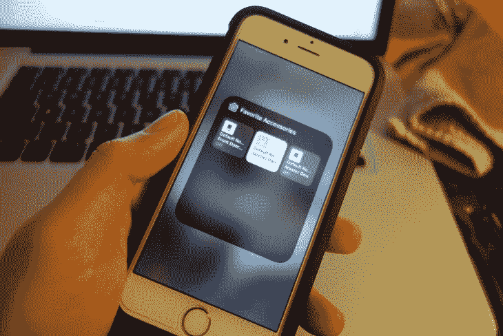
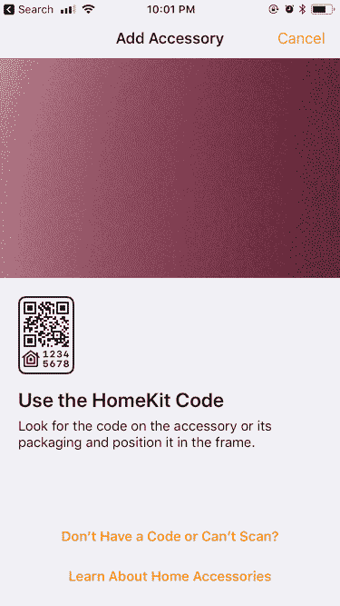
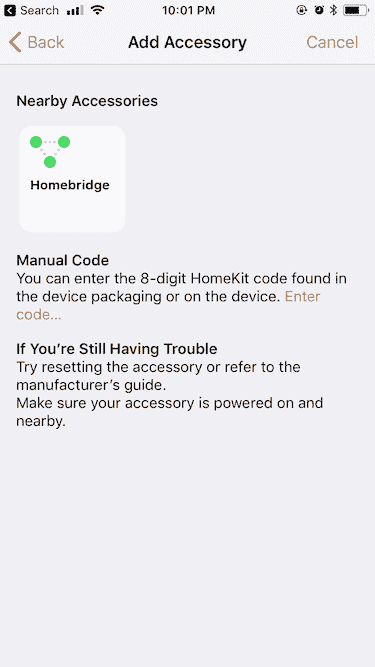
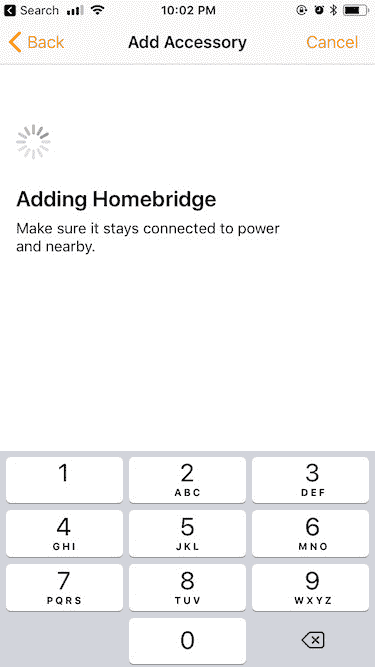
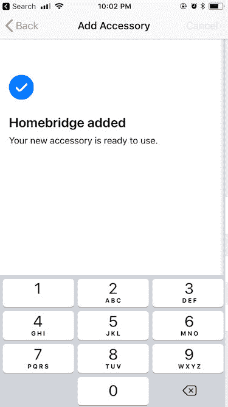
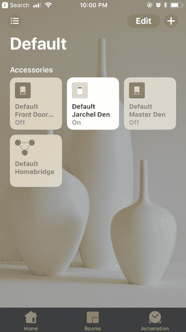

# 如何使用这个强大的工具将 Wemo 添加到 Homekit 中

> 原文：<https://www.freecodecamp.org/news/how-to-add-wemo-to-homekit-with-this-powerful-tool/>

**本帖最初来自[www.jaredwolff.com](https://www.jaredwolff.com/how-to-deploy-homebridge-on-raspberry-pi-w-resin/)**

我一直很紧张。有时候我就是停不下来。

最近致力于让我们的家变得更加互联高效。这项工作的一部分是用我大约一个月前从易贝购买的一些 Wemos 进行实验。Wemo 应用程序运行良好，但肯定还有更多需要改进的地方。(此外，想到每个 Wemo 都在运行 DDWRT，我就不寒而栗)

主要问题？Wemo 不支持苹果 Homekit。

所以我开始研究，发现 [Homebridge](https://github.com/nfarina/homebridge) 项目正是我一直在寻找的。基本上，它模拟了一个运行在苹果为 Homekit 支持的 HAP 协议上的设备。在 Homebridge 中，您可以通过您能想象到的许多不同的界面来配置许多设备。将它部署到 Raspberry Pi 或类似的程序中可能会很麻烦，而且会出错。那么，为什么不采取不同的方法呢？

*进入树脂操作系统。*

树脂 OS 的一些优点是:

*   为 Yocto 平台部署预优化的映像
*   没有任何 Linux 的配置(除了 config.json)
*   几分钟后启动并运行(主要是闪烁和容器初始化)

我最初玩树脂的在线平台，这显示了一些承诺。对于那些不想花时间为 OTA 更新编写代码和手动构建 Yocto 映像的开发人员来说，你绝对应该看看 Resin.io。

(顺便说一句，我与 Resin 没有任何关系，我认为他们做得很好，他们通过他们的开源工具为社区做出了重大贡献: [http://resinos.io](http://resinos.io/) ， [https://etcher.io](https://etcher.io/) ， [https://www.balena.io](https://www.balena.io/) )



那么，我如何让 Wemo 与 Homekit 一起工作呢？

树脂本身有一些奇妙的文件。在 Docker 容器上开发我的第一个破解时，当错误消息出现时，我几乎不需要查看任何地方。(我最初使用的是 *slim* 映像，它没有 Homebridge 所需的所有实用程序，使用*最新的*映像更容易)

说明如下:

1.  安装依赖项。在 Mac 上，*节点*可能是您唯一需要安装的东西。自制啤酒在这里效果最好。

    ```
    brew install node 
    ```

2.  下载并安装 resin-cli:

    ```
    npm install —global —production resin-cli 
    ```

3.  如果您还没有，请从[下载链接](https://resinos.io/#downloads)下载您的图像。

4.  使用 cli 根据您的喜好修改图像。

    ```
    $ sudo resin local configure ~/Downloads/resin.img
    ? Network SSID Wolff Den
    ? Network Key This is not our password.
    ? Do you want to set advanced settings? Yes
    ? Device Hostname resin
    ? Do you want to enable persistent logging? no
    Done! 
    ```

5.  将图像“闪存”到 SD 卡中。确保你有一个免费的设备来写！

    ```
    $ sudo resin local flash ~/Downloads/resin.img
    Password:
    ? Select drive (Use arrow keys)
    ❯ /dev/disk1 (32 GB) - RESIN 
    ```

6.  等待该过程完成，然后弹出卡。将它放入您配置了图像的设备中。

7.  启动后，您应该能够 ping 通该设备。

    ```
    ping resin.local
    PING resin.local (192.168.7.45): 56 data bytes
    64 bytes from 192.168.7.45: icmp_seq=0 ttl=64 time=9.004 ms
    64 bytes from 192.168.7.45: icmp_seq=1 ttl=64 time=6.411 ms
    64 bytes from 192.168.7.45: icmp_seq=2 ttl=64 time=4.337 ms
    64 bytes from 192.168.7.45: icmp_seq=3 ttl=64 time=4.374 ms 
    ```

8.  根据您的喜好修改 config.json 文件。强烈建议将 pin 更改为不同的名称，因为这是 Homebridge 在他们的示例中使用的名称。

9.  此外，请随意修改 docker 文件以满足您的需求。在本例中，您可能想要更改的唯一内容是图像名称。默认情况下，我把 hummingboard-node:latest 作为主图像。

10.  现在，您可以将包含的 Homebridge Docker 文件和相关文件直接推送至您的嵌入式设备。

    ```
    sudo resin local push resin.local —source . 
    ```

    *注意:这将需要几分钟时间，因为这会在嵌入式设备上构建 docker 映像。使用 Resin.io 平台花费的时间要少得多，因为它在本地机器上构建，然后作为完整的映像发送到嵌入式设备*

11.  等待 Homebridge 的输出表明它正在运行。
    rdt 推送成功完成！

    ```
    Streaming application logs..
    *** WARNING *** The program ‘node’ uses the Apple Bonjour compatibility layer of Avahi.
    *** WARNING *** Please fix your application to use the native API of Avahi!
    *** WARNING *** For more information see <http://0pointer.de/avahi-compat?s=libdns_sd&e=node>
    *** WARNING *** The program ‘node’ called ‘DNSServiceRegister()’ which is not supported (or only supported partially) in the Apple Bonjour compatibility layer of Avahi.
    *** WARNING *** Please fix your application to use the native API of Avahi!
    *** WARNING *** For more information see <http://0pointer.de/avahi-compat?s=libdns_sd&e=node&f=DNSServiceRegister>
    [2017-11-2 02:09:43] Loaded plugin: homebridge-platform-wemo
    [2017-11-2 02:09:43] Registering platform ‘homebridge-platform-wemo.BelkinWeMo’
    [2017-11-2 02:09:43] —
    [2017-11-2 02:09:43] Loaded config.json with 0 accessories and 1 platforms.
    [2017-11-2 02:09:43] —
    [2017-11-2 02:09:43] Loading 1 platforms…
    [2017-11-2 02:09:43] [WeMo Platform] Initializing BelkinWeMo platform…
    Scan this code with your HomeKit App on your iOS device to pair with Homebridge:

        ┌────────────┐
        │ 031-45-154 │
        └────────────┘

    [2017-11-2 02:09:43] Homebridge is running on port 51826.
    [2017-11-2 02:09:43] [WeMo Platform] Found: Master Den [123456789ABC]
    [2017-11-2 02:09:43] [WeMo Platform] Found: Jarchel Den [123456789BAC]
    [2017-11-2 02:09:43] [WeMo Platform] Found: Front Door Light [123456789CBA]
    [2017-11-2 02:09:44] [WeMo Platform] Jarchel Den - Get state: On 
    ```

12.  打开手机，在 HomeKit 中寻找可用的配件。你可能需要点击“没有代码或无法扫描？”然后手动输入号码。

    

    

13.  通过输入之前显示的密码来添加您的配件。

    

    

恭喜你。你所有的 Wemo 设备现在都应该出现了。享受在 Wemo 设备上使用 Siri 的乐趣。



觉得这个教程有用？这里是我其他一些与树莓派相关的帖子。