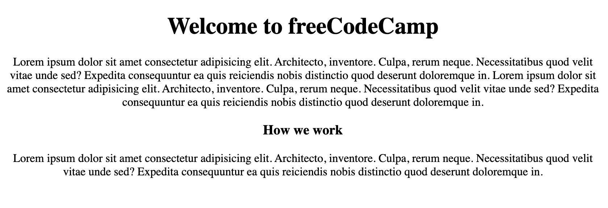
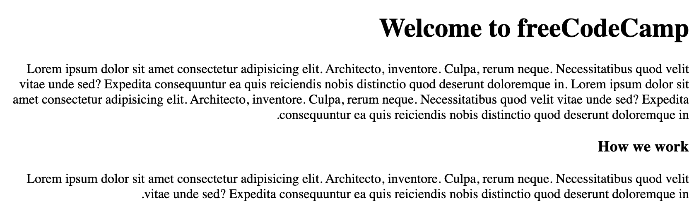
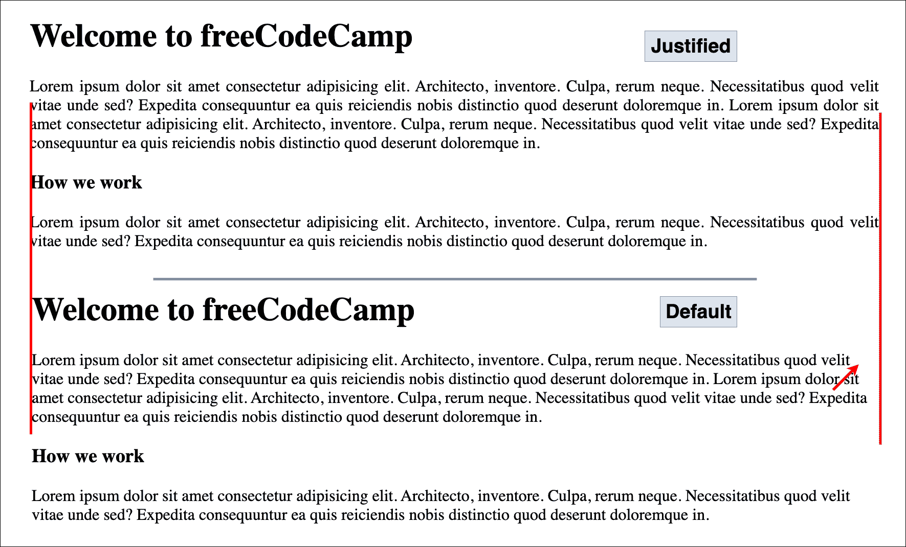

# 如何在 HTML 中对齐文本——文本对齐、居中和两端对齐示例

> 原文：<https://www.freecodecamp.org/news/how-to-align-text-in-html/>

文本在网页上是必不可少的，因为它告诉用户你的网页是关于什么的。

当你在网页上添加文字时，它会根据你的语言来决定网页的方向和感觉。

例如，默认情况下，英语从左向右移动(LTR)，而阿拉伯语从右向左移动(RTL)。

但是大多数情况下，你不希望所有的文本只停留在屏幕或容器的一个位置。你会希望有些在中间，有些在左边，有些在右边。您甚至可能希望文本填满您的页面或容器。

这类似于在 Microsoft Word 或 Google Docs 中编辑文本时，使用左对齐、右对齐、居中和两端对齐按钮。

您也可以使用代码在网页上做同样的事情。

## 如何在 HTML5 之前将文本居中对齐

在引入 HTML5 之前，开发人员使用 HTML 标签执行特定的样式。例如，您可以使用 center 标签将文本居中对齐，但是在 HTML4 中，这个标签被弃用了。尽管这在一些主流浏览器上仍然有效，但它可能会在任何时候被丢弃。

它看起来是这样的:

```
<center>
  <h1> Welcome to freeCodeCamp </h1>

  <p>Lorem ipsum dolor sit amet consectetur adipisicing elit. Architecto, inventore. Culpa, rerum neque. Necessitatibus quod velit vitae unde sed? Expedita consequuntur ea quis reiciendis nobis distinctio quod deserunt doloremque in.

    Lorem ipsum dolor sit amet consectetur adipisicing elit. Architecto, inventore. Culpa, rerum neque. Necessitatibus quod velit vitae unde sed? Expedita consequuntur ea quis reiciendis nobis distinctio quod deserunt doloremque in.</p>

  <h3>How we work</h3>

  <p>Lorem ipsum dolor sit amet consectetur adipisicing elit. Architecto, inventore. Culpa, rerum neque. Necessitatibus quod velit vitae unde sed? Expedita consequuntur ea quis reiciendis nobis distinctio quod deserunt doloremque in.</p>
</center> 
```

这将在页面中心或应用它的任何容器中输出所有文本:



但是现在有了 HTML5，就不再用这种方法了。请记住，始终用 CSS 处理所有样式是非常重要的。您应该只使用 HTML 向网页添加标记。

## 如何在 HTML5 中对齐文本

使用 CSS，您有许多选项可以用来对齐文本。适合文本对齐的主要 CSS 属性是`text-align`属性。您使用该属性来指定元素中文本的水平**对齐方式**。

假设您的网页上有一些文本，例如:

```
<h1> Welcome to freeCodeCamp </h1>

<p>Lorem ipsum dolor sit amet consectetur adipisicing elit. Architecto, inventore. Culpa, rerum neque. Necessitatibus quod velit vitae unde sed? Expedita consequuntur ea quis reiciendis nobis distinctio quod deserunt doloremque in.

  Lorem ipsum dolor sit amet consectetur adipisicing elit. Architecto, inventore. Culpa, rerum neque. Necessitatibus quod velit vitae unde sed? Expedita consequuntur ea quis reiciendis nobis distinctio quod deserunt doloremque in.</p>

<h3>How we work</h3>

<p>Lorem ipsum dolor sit amet consectetur adipisicing elit. Architecto, inventore. Culpa, rerum neque. Necessitatibus quod velit vitae unde sed? Expedita consequuntur ea quis reiciendis nobis distinctio quod deserunt doloremque in.</p> 
```

您可以使用`text-align`属性将文本移动到左边、右边、中间，甚至对齐您的内容，以便它水平地填充元素或网页**。**

```
// Syntax

text-align: start;
text-align: end;
text-align: left;
text-align: right;
text-align: center;
text-align: justify; 
```

如果要对齐网页上的整个文本，可以将该属性应用于包含文本的任何标记，如 div 标记、标题、段落或正文标记。

在查看示例之前，让我们探索一下该属性的可用选项/值。

*   **`start`** :这个是基于方向的。当方向是从左到右时，`start`将意味着`left`。如果方向是从右向左，那么`start`将意味着`right`。
*   **`end`** :这也是基于方向。当方向是从左向右时，那么`end`将意味着向右。如果方向是从右向左，那么`end`就意味着向左。
*   **`left`** :您可以使用它将文本与页面或容器的`left`边缘对齐。
*   **`right`** :您可以使用它将文本与页面或容器的`right`边缘对齐。
*   **`center`** :你用这个来对齐文本到页面或者容器的完美`center`。
*   **`justify`** :你用这个来调整文本内容来触碰你的页面或者容器的左右边缘。

一般语法是:

```
selector {
  text-align: value;
} 
```

### 如何向左对齐文本

如果文本原本在右侧，您可能需要将文本的对齐方式切换到左侧。您可以通过定位选择器并使用`text-align`属性和`left`作为它的值来实现这一点。

```
// HTML
<p> Welcome to freeCodeCamp </p>

// CSS
p {
  text-align: left;
} 
```

例如，如果您使用 RTL 方向将内容显示在屏幕右侧:

```
<html dir="rtl">
  <body>
    <h1> Welcome to freeCodeCamp </h1>
      <p>Lorem ipsum dolor sit amet consectetur adipisicing elit. Architecto, inventore. Culpa, rerum neque. Necessitatibus quod velit vitae unde sed? Expedita consequuntur ea quis reiciendis nobis distinctio quod deserunt doloremque in.

        Lorem ipsum dolor sit amet consectetur adipisicing elit. Architecto, inventore. Culpa, rerum neque. Necessitatibus quod velit vitae unde sed? Expedita consequuntur ea quis reiciendis nobis distinctio quod deserunt doloremque in.</p>

      <h3>How we work</h3>
      <p>Lorem ipsum dolor sit amet consectetur adipisicing elit. Architecto, inventore. Culpa, rerum neque. Necessitatibus quod velit vitae unde sed? Expedita consequuntur ea quis reiciendis nobis distinctio quod deserunt doloremque in.</p>
  </body>
</html> 
```

这将输出:



您可以设置 body 标签的样式，使页面文本与`left`对齐:

```
body{
  text-align: left;
} 
```

### 如何将文本右对齐

默认情况下，容器中的网页或内容以及其他元素从左侧开始。您可能希望将这些内容向右对齐，这可以使用值为`right`的`text-align`属性来访问。

```
// HTML
<p> Welcome to freeCodeCamp </p>

// CSS
p {
  text-align: right;
} 
```

### 如何将文本居中对齐

您现在可以使用`text-align`属性和`center`值将文本移动到中心，而不是使用`center`标签将文本内容移动到中心。

```
// HTML
<p> Welcome to freeCodeCamp </p>

// CSS
p {
  text-align: center;
} 
```

### 如何对齐文本

如果您知道如何使用任何基于文本的工具，如 Microsoft Word 或 Google Docs，或者 Photoshop、Figma 等处理内容的工具，您就会知道对齐文本图标是如何工作的。

你可以用它来帮助你的文本到达页面/容器的边缘，而不是在末尾留下一些不必要的不均匀的空格。

这并不总是显而易见的，但当你深入观察边缘时，你会注意到不同之处，当你有这么多文本和更长的段落时，这更有意义。



您可以通过使用`text-align`属性和`justify`作为它的值来实现这一点:

```
// HTML
<p>Lorem ipsum dolor sit amet consectetur adipisicing elit. Architecto, inventore. Culpa, rerum neque. Necessitatibus quod velit vitae unde sed? Expedita consequuntur ea quis reiciendis nobis distinctio quod deserunt doloremque in.</p>

// CSS
p {
  text-align: center;
} 
```

## 包扎

在本文中，你已经学习了如何使用`text-align` CSS 属性来对齐 HTML 网页的文本。

您可以通过发表在 freeCodeCamp 上的其他类似文章了解更多信息:

*   [CSS 文本对齐–居中、两端对齐、右对齐的文本样式示例](https://www.freecodecamp.org/news/css-text-align-centered-justified-right-aligned-text-style-example/)
*   [CSS 中的文本对齐–如何将文本居中对齐 HTML](https://www.freecodecamp.org/news/text-align-in-css-how-to-align-text-in-center-with-html/)