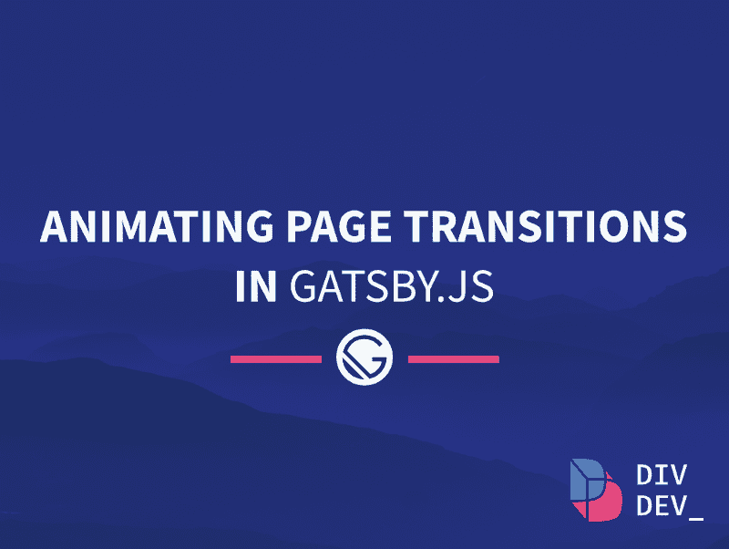
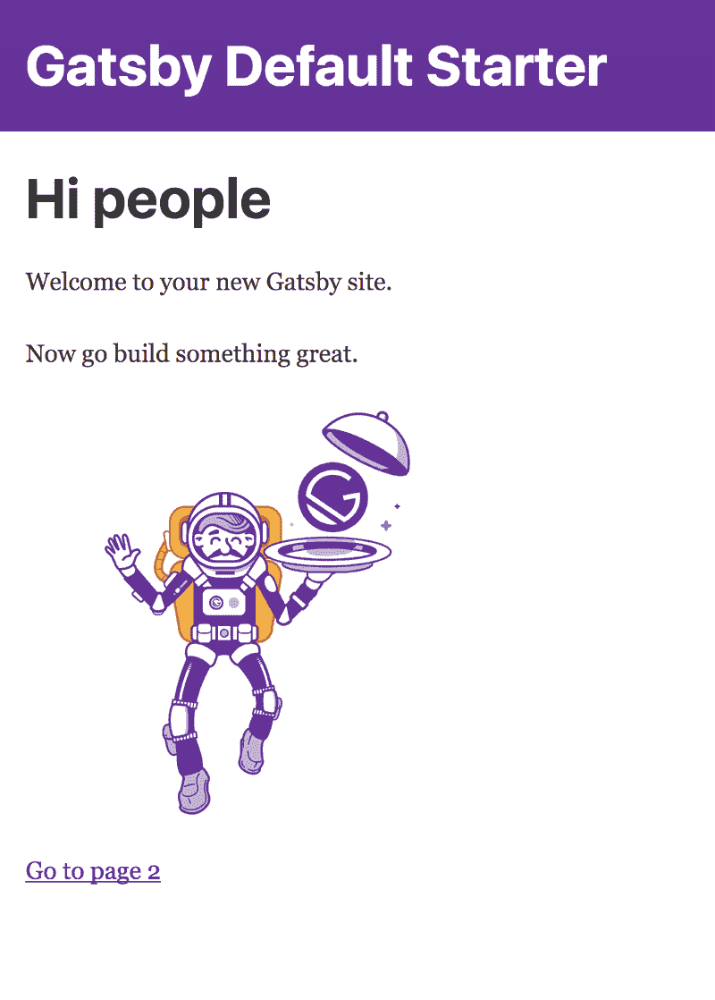
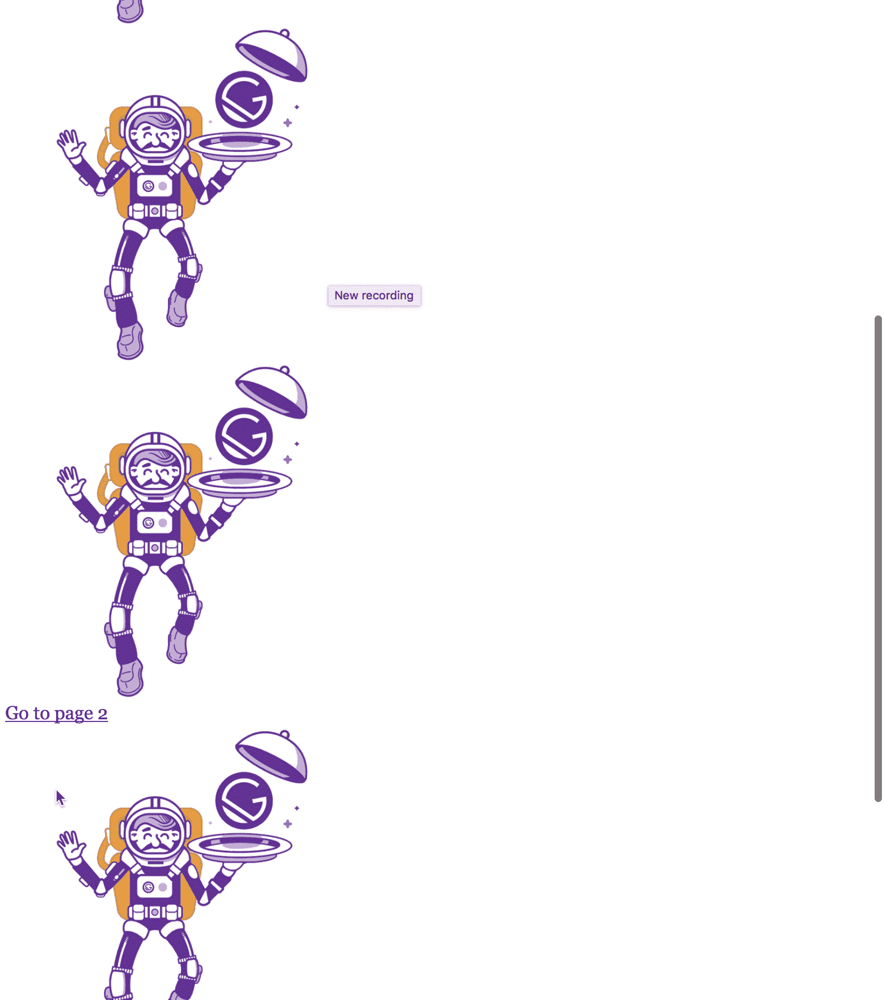
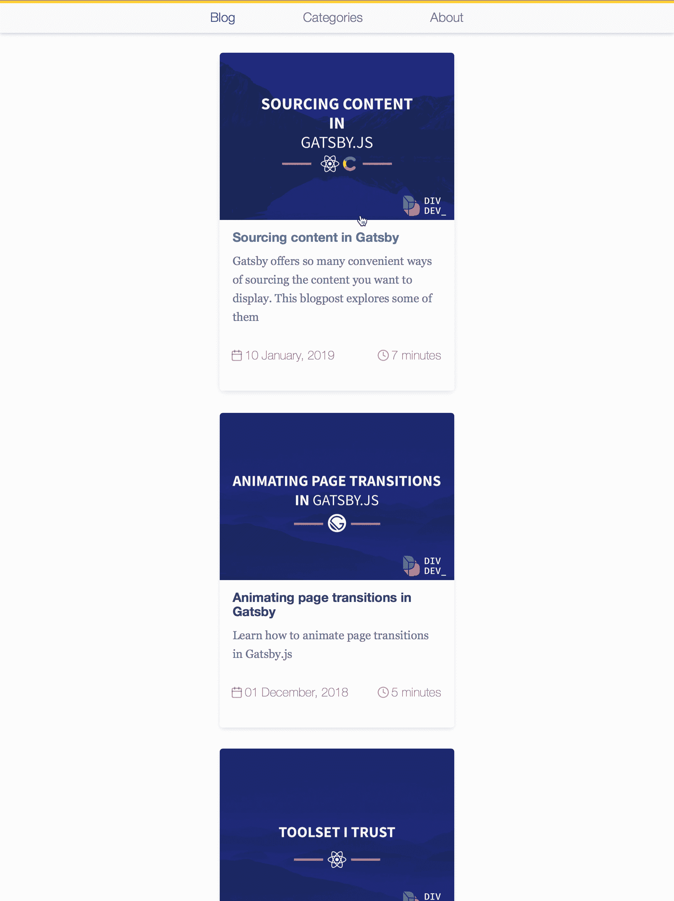

# 如何在 Gatsby.js 中制作页面过渡动画

> 原文：<https://www.freecodecamp.org/news/how-to-animate-page-transitions-in-gatsby-js-b36e3ae14c29/>

作者:迪米特里·伊瓦什丘克

# 如何在 Gatsby.js 中制作页面过渡动画

banner by [Artur Didenko](https://www.freecodecamp.org/news/how-to-animate-page-transitions-in-gatsby-js-b36e3ae14c29/undefined)

出于各种原因，我非常喜欢《盖茨比》,在这篇文章中，我想分享给你的网站添加定制的页面过渡是多么容易，让它变得更加生动和流畅。

我们将使用 [Gatsby](https://www.gatsbyjs.org/) default starter 来使这个例子尽可能的孤立，但是你可以肯定它也将适用于更复杂的 starter 和你从头开始创建的项目。

作为一个引子，我们将建立一些类似于你在这个网站上点击链接时看到的东西。？

### 入门？️

如果您是 Gatsby 的新手，并且想要跟随本教程，请确保安装 Gatsby 的命令行界面( [Gatsby CLI](https://www.gatsbyjs.org/docs/) )，这样您就可以在将来快速启动新项目。

`npm install --global gatsby-cli`

通过在终端中运行以下命令，导航到您的项目文件夹，并在其中创建一个新的 Gatsby 项目:

`gatsby new .`

它将用最简单的设置创建一个项目，它看起来应该是这样的:(它可能会因 starter 设计的进一步迭代而变化)

Gatsby-default-starter

### 正在安装必要的依赖项⚙️

首先，我们需要安装 [react-transition-group](https://github.com/reactjs/react-transition-group) ，它负责监视进入和离开 DOM 的元素，并对它们应用动画。

`npm install react-transition-group`

我们还将安装 [gatsby-plugin-layout](https://www.gatsbyjs.org/packages/gatsby-plugin-layout/) ，在我们的例子中，它提供了过渡工作所需的位置属性，并将我们的布局注入到每个页面中。

`npm install gatsby-plugin-layout`

为了让插件按预期工作，我们需要将布局组件移动到项目根目录下的 layouts 文件夹中，并将其重命名为`index.js`。让我们也将`transition.js`添加到我们的组件文件夹中，在那里我们将提供所有的转换逻辑。现在让它空着，因为我们还有一些要配置。

最后一步是将我们的`gatsby-plugin-layout`添加到位于项目根目录下的`gatsby-config.js`文件中

### 过渡成分？

这包含了当用户决定跟随一个链接到我们站点上的另一个页面时所应用的转换的全部逻辑。

在`transition.js`中添加以下代码，我将在评论中解释:

现在我们可以将`Transition`组件导入到布局组件中，并将代表我们页面的子组件包装在其中。

此时，当您的一些页面元素被渲染两次时，您可能会遇到一个 bug。要解决这个问题，只需检查一下`pages`文件夹中的文件，确保它们没有导入`<Layo` ut >组件并在 return 语句中使用它。

Jerky animation that we want to fix

现在，一切都按预期运行，您正在享受新添加的页面过渡，您可能会注意到当您的页面向下滚动并开始播放动画时，会出现轻微的抖动错误。请注意，当页面上有更多内容并且您可以滚动时，就会发生这种情况。

通过在我们的`gatsby-browser.js`中包含下面的代码，我们可以很容易地解决这个问题，你可以在我们项目的根目录中找到它。我们在这里所做的实际上是为动画设置一个超时，并等待它被执行，直到页面滚动到顶部。

在你的网站上应该是这样的

我希望你喜欢这个小帖子，并在需要的时候使用你的新知识。在这里你可以找到 GitHub repo 的[链接，里面有本教程的工作代码。在 twitter 上订阅](https://github.com/d-ivashchuk/animating-gatsby-pt)[我](https://twitter.com/DivDev_)不要错过下一篇关于 Gatsby.js 和你可以用它做的有趣事情的帖子！

*最初发表于* [https://divdev.io](https://divdev.io) 其中 btw 使用了我们在本帖中学到的动画技术！