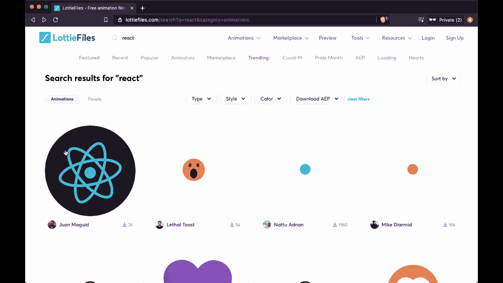
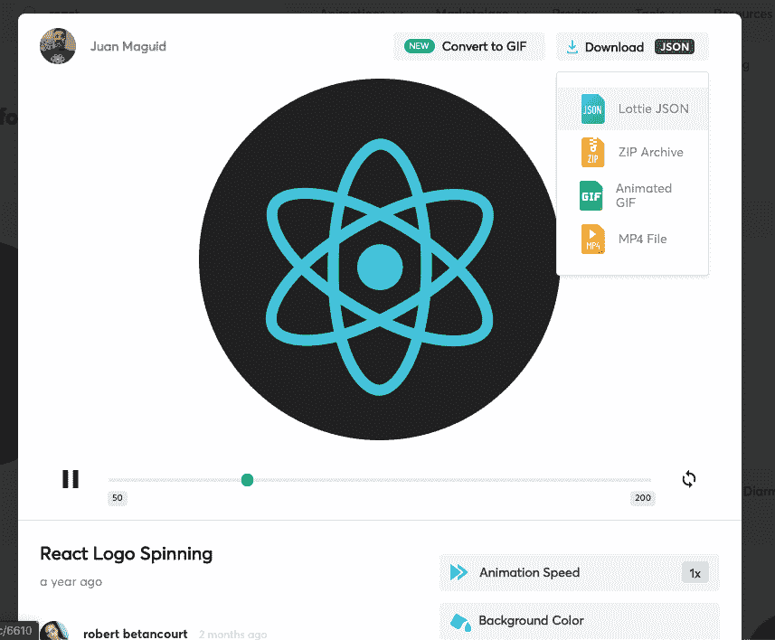
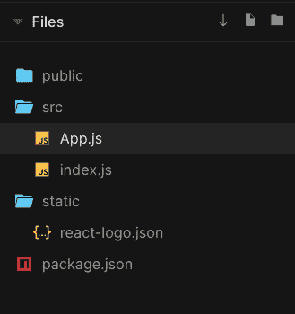
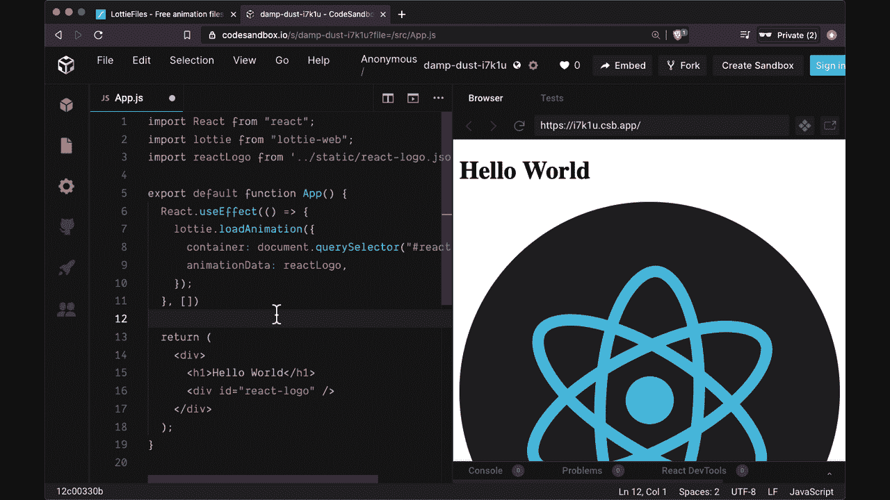

# 如何用 Lottie 制作 React 应用程序动画

> 原文：<https://www.freecodecamp.org/news/how-to-animate-react-apps/>

在我们的 React 应用中，动画可以带来更吸引人的用户体验。

然而，要制作好看的动画，可能需要大量的工作和代码。

我将向您展示如何使用一个非常强大的 React 库来制作令人惊叹的、像素完美的动画来增强您的应用程序，而不需要做很多工作。

> 想要使用 React 创建令人惊叹的真实应用程序的完整指南吗？看看 React 训练营。

## 介绍 React 的 Lottie 库

我说的图书馆叫洛蒂。Lottie 提供了一种完全不同的方式来创建令人印象深刻的动画，方法是使用在流行的程序 Adobe After Effects 中制作的动画，这些动画作为 JSON 文件导入和导出。



最重要的是，要找到并使用这些动画，你不需要安装 Adobe After Effects 程序。

## 如何使用 LottieFiles

你所需要做的就是使用一个名为 [LottieFiles](https://lottiefiles.com) 的完全免费的资源。这是一个托管大量免费和付费洛蒂动画的网站。

假设我们希望在应用程序中使用动画 React 徽标(注意，您可以使用他们提供的任何动画)。

我个人会从 LottieFiles 中选择以下 React 动画，其中[React logo 在旋转](https://lottiefiles.com/6610-react-logo-spinning)。从那里，我们可以预览它，并改变的东西，如背景颜色。

当我们准备好使用它时，我们可以通过选择 Lottie JSON 下载动画的 JSON 文件:



不管您是如何创建 React 项目的，您都可以将它放在您喜欢的任何文件夹中。您可以将它放在项目根目录的静态文件夹中，也可以将其放在 src 文件夹的 animations 文件夹中。

这取决于您，因为我们将从任何文件路径导入 JSON 数据。

我选择将我的 JSON 文件(名为 react-logo.json)放在静态文件夹中:



## 如何安装洛蒂网

一旦完成，我们将通过引入包`lottie-web`来安装洛蒂。

```
npm i lottie-web
```

请注意，有一个名为`react-lottie`的替代洛蒂包可用，但它在引擎盖下使用`lottie-web`，可以很容易地直接使用，你马上就会看到。

一旦安装了`lottie-web`,我们就可以把我们的动画放在任何 JSX 元素中，通过给出一个我们希望它存在于某个选择器中的指示。

最好的方法是使用 id 属性，因为它应该只在应用程序的元素中使用一次。

在我们的例子中，我们可以给它一个 id 值`react-logo`:

```
// src/App.js
import React from "react";

export default function App() {
  return (
    <div>
      <h1>Hello World</h1>
      <div id="react-logo" />
    </div>
  );
}
```

要使用 Lottie，我们可以从`lottie-web`导入它，我们将从放置它的任何地方导入 JSON:

```
// src/App.js
import React from "react";
import lottie from "lottie-web";
import reactLogo from "../static/react-logo.json";

export default function App() {
  return (
    <div>
      <h1>Hello World</h1>
      <div id="react-logo" />
    </div>
  );
}
```

## 如何将 Lottie 与 useEffect 挂钩一起使用

使用洛蒂本身很简单。我们需要获取一个对 JSX/DOM 元素的引用，我们希望将动画放入其中，并为其提供 JSON 数据。

为了与 DOM 本身交互，我们需要确保组件已经挂载，所以我们将使用`useEffect`来执行一个副作用，并传入一个空的依赖数组。

在`useEffect`中，我们现在可以调用`lottie.loadAnimation`来运行我们的动画，通过给它传递一个对象。在这个对象上，我们需要提供的第一件事是容器，我们希望动画在其中运行的 DOM 节点。

我们将可以使用任何我们想要的方法来引用 DOM 节点；我个人用`document.getElementById('react-logo')`。

```
// src/App.js
import React from "react";
import lottie from "lottie-web";
import reactLogo from "../static/react-logo.json";

export default function App() {
  React.useEffect(() => {
    lottie.loadAnimation({
      container: document.querySelector("#react-logo"),
    });
  }, []);

  return (
    <div>
      <h1>Hello World</h1>
      <div id="react-logo" />
    </div>
  );
} 
```

有了这个容器，我们只需要在一个名为`animationData`的属性上提供 JSON 数据本身。

```
// src/App.js
import React from "react";
import lottie from "lottie-web";
import reactLogo from "../static/react-logo.json";

export default function App() {
  React.useEffect(() => {
    lottie.loadAnimation({
      container: document.querySelector("#react-logo"),
    });
  }, []);

  return (
    <div>
      <h1>Hello World</h1>
      <div id="react-logo" />
    </div>
  );
} 
```

之后，您应该会看到动画自动运行:



如果你有和我一样的代码，并且让你的动画在一个空的 div 中运行，它看起来会很大。

您可以通过提供一些样式并为容器 div 添加固定的宽度和高度来解决这个问题:

```
<div id="react-logo" style={{ width: 200, height: 200 }} />
```

## Lottie.loadAnimation 属性

除了容器和动画数据，还有一些其他重要的属性可以传递给`loadAnimation`来改变动画的外观和功能。

```
lottie.loadAnimation({
  container: document.querySelector("#react-logo"),
  animationData: reactLogo,
  renderer: "svg", // "canvas", "html"
  loop: true, // boolean
  autoplay: true, // boolean
}); 
```

在上面，我已经包含了`loadAnimation`的所有默认设置。动画的默认呈现方式是 SVG，带有`renderer`属性。这是最具特色的，但是 HTML 选项更具性能并支持 3D 图层。

默认情况下，动画会无限循环或重复，因为`loop`设置为 true。您可以通过将其设置为 false 来关闭此行为。

默认情况下，动画的`autoplay`设置为 true，这意味着动画将在加载时自动播放。如果您想要有条件地运行动画，您可以通过使用状态变量将其设置为 true 或 false(例如，如果您想要仅在动画可见时播放动画)。

## 如何添加洛蒂光

最后，我要提到的关于洛蒂的最后一件事是`lottie-web`是一个相当大的依赖。

如果您想使用它的所有特性，但是担心在最终的包中引入太多代码，您可以导入 Lottie 的轻量级版本，如下所示:

```
import lottie from "lottie-web/build/player/lottie_light";
```

## 最终代码

希望这篇文章能帮助你开始使用 Lottie，当你在 web 应用程序中寻找一些特别的东西时，它是一个添加到 React 项目中的简洁功能。

如果你想自己尝试最终代码，请查看 [CodeSandbox 链接](https://codesandbox.io/s/damp-dust-i7k1u?file=/src/App.js:174-292)。

## 喜欢这篇文章吗？加入 React 训练营

**[React 训练营](http://bit.ly/join-react-bootcamp)** 将你应该知道的关于学习 React 的一切打包成一个全面的包，包括视频、备忘单，外加特殊奖励。

获得数百名开发人员已经使用的内部信息，以掌握 React、找到他们梦想的工作并掌控他们的未来:

[](http://bit.ly/join-react-bootcamp) 
*打开时点击此处通知*