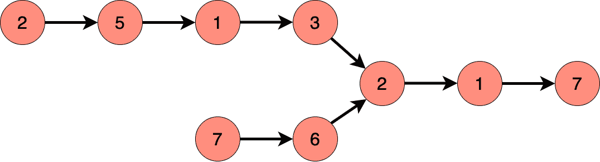
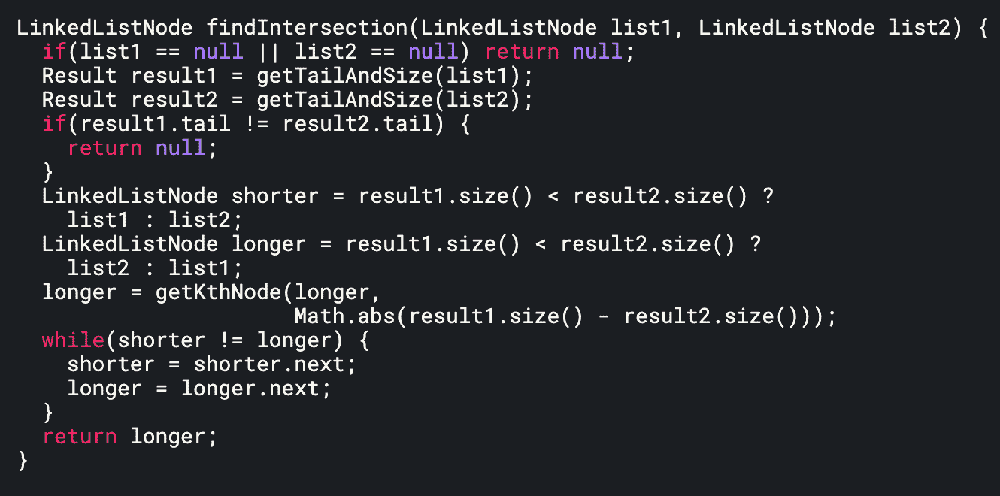
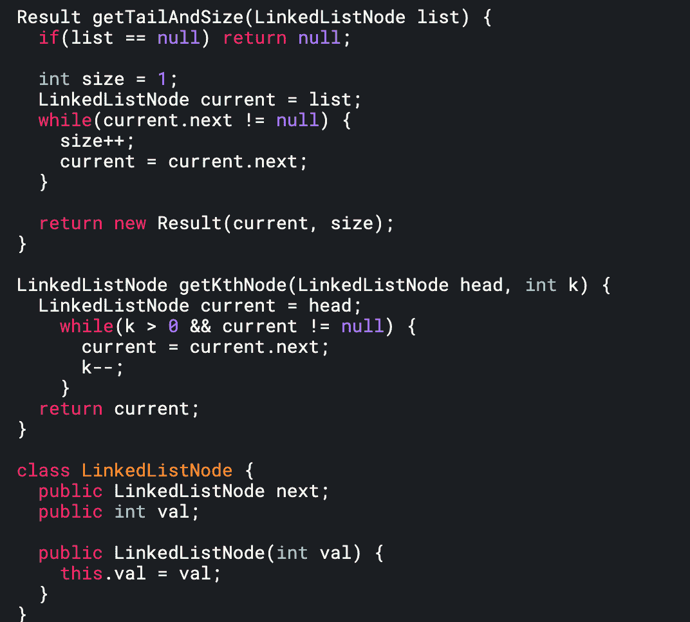

# 如何回答任何技术面试问题–包括示例

> 原文：<https://www.freecodecamp.org/news/how-to-answer-any-technical-interview-question-with-example/>

技术面试可能会非常令人生畏。从每个问题的开始到结束，知道预期会发生什么，并意识到你可能会被问到的领域是很重要的。

幸运的是，有一种方法可以为你可能遇到的任何问题做好准备。它包括四个部分:

1.  **理解问题**
2.  **讨论解决方案的权衡**
3.  **编写代码**
4.  **测试代码**

让我们用涉及 LinkedLists 的示例问题来尝试这种技术。

## 问题是

**问题:**给定两个单独链接的 lists，判断这两个列表是否相交。返回相交节点。请注意，交集是基于引用而不是值来定义的。如果第一个链表的第 k 个节点与第二个链表的第 j 个节点是完全相同的节点(通过引用)，则它们是相交的。

## 第一步:理解问题。

确切知道这个问题问的是什么真的很重要。我们可以问面试官一些问题:

1.  我们到底想要回报什么？ *(A:相交节点)。*
2.  这是否意味着我们可以假设链表总是相交的？*(答:是)*

在考虑解决问题的方法之前，对问题有所了解总是很重要的。

## 第二步:讨论不同解决方案的利弊。

一个直接的解决方案是同时遍历两个链表，直到到达一个交叉点。对于这个例子，我们将在节点 2 和 7 处制作一个**指针**，并且**逐个遍历它们中的每一个，直到我们到达一个公共节点。**

但是，正如您可能已经注意到的那样，这是行不通的，因为两个链接列表的长度可能不同。我们本质上想要做的是“砍掉”较长的 LinkedListNode 的开始部分，然后重复迭代。

这应该是你和面试官应该进行的对话。

## 第三步:写代码。

下面是实现这一点的方法。

我们在这里使用了**助手方法**。我们使用`getKthNode()`来获取给定链表的第 k 个节点。这在遍历较长的链表以“砍掉”额外的节点时很有帮助。

我们还使用`getTailAndSize()`来捕获给定列表的长度和最后一个节点。这很有帮助，因为我们确实需要大小来比较列表的长度。我们还需要尾部，因为如果两个列表的尾部不相等，那么它们根本不会相交。

注意，当我们说“不相等”时，我们指的是两个节点不引用同一个**对象**。即使它们可能具有相同的值并且看起来相同，它们也必须引用相同的 LinkedListNode 才能算作相等。(你可以在这里找到更多关于这个[的信息。)](http://shortn/_xLxPLI0JXV)

回到问题，如果我们遇到尾部不相等的情况，我们返回一个失败的值(null)。

## 步骤 4:测试代码。

下面是我们可以添加的一些好的测试案例。测试用例的一个有用的经验法则如下:

*   空箱
*   考虑中间/开头/结尾的选择
*   尺寸相同或不同

这个策略不仅仅适用于链表问题——它也适用于数组、字符串和其他任何数据结构。

对于这个问题，我们的 LinkedList 测试如下:

*   在开头/中间/结尾相交的两个链表
*   两个/一个链接列表为空(应返回空)
*   链表大小相同/不同

我们完了！

**更多问题:**

*   [循环链表](https://leetcode.com/problems/linked-list-cycle/)
*   [反转链表](https://leetcode.com/problems/reverse-linked-list/)
*   [回文链表](https://leetcode.com/problems/palindrome-linked-list/)

*对闯入计算机科学感兴趣？渴望扩大你的知识面和学习新事物？享受解决问题？*

如果是这样， [SWEPrep](http://sweprep.com) 可能就是你的简讯。订阅获取工程面试中通常给出的全面解释的面试提示，从数组到动态编程。问题每周出一次，也按主题和难度分类。以上帖子是作者 Sameer Khoja 的客座帖子。

*[订阅](http://sweprep.com)获取全部简讯。从不错过更新。*