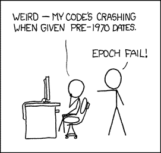
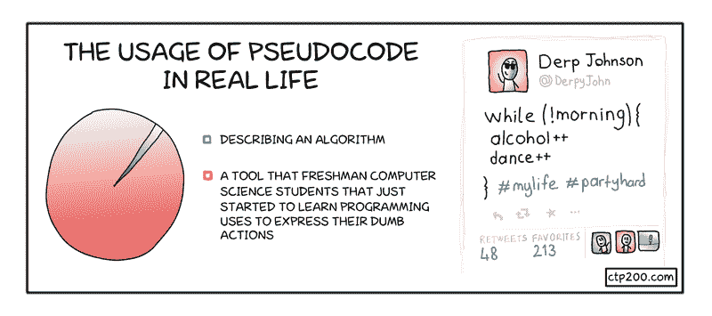

# 如何不慌不忙地接近任何算法面试

> 原文：<https://www.freecodecamp.org/news/how-to-approach-any-algorithm-interview-without-panicking-b6d7ae5c050/>

作者:孙李贝蒂

# 如何不慌不忙地进行任何编码面试


老实说，算法问题仍然是求职过程中非常重要的一部分。虽然有一个[不断扩大的公司列表](https://github.com/poteto/hiring-without-whiteboards)不会让你跳过编码圈，但普通开发人员在找工作时会遇到实时算法挑战。尤其是如果你想为四大或老牌初创公司工作。所以我们穿过铁圈。

我不需要谈论技术面试的压力有多大。我敢肯定，我们大多数人都知道，从一个刚刚搞砸的面试中走出来，然后骑着自行车走完所有我们本可以扭转局面的路，会有多么沮丧。这不是一种有趣的感觉。

这就是我写这个的原因。对于那些最终面临算法挑战的人来说，你如何应对会有很大的不同。你是那种一头扎进去，然后一路琢磨出来的人吗？或者你有没有一个过程可以将问题分解成可管理的部分？虽然前一种方法可能对某些人有用，但我使用的是后者。

对我来说，拥有一套分解问题的步骤至关重要。虽然它不能保证给我一个解决方案或工作机会，但它能让我管理我的压力反应。将我的恐慌保持在可忍受的水平有助于我集中注意力。毕竟，技术面试应该是展示你解决问题的能力，而不是你在不晕过去的情况下应付多人默默评价你的能力。

在这篇文章中，我想向你展示我通过几次技术筛选和几十次模拟面试磨练出来的过程。它深受[发射学校的 PEDAC 系统](https://medium.com/launch-school/solving-coding-problems-with-pedac-29141331f93f)的影响。我每次都用它，它对我很有帮助。

> “爱上过程，结果就来了。”—埃里克·托马斯

展示我的过程的最好方式是在行动中演示。所以让我们一起解决一个问题。为了尽可能的真实，我将选择一个我从未解决过的问题。尽管你不得不相信我的话。

根据 [Leetcode](https://leetcode.com/) 的说法，[字符串到整数](https://leetcode.com/problems/string-to-integer-atoi/)的算法是一个很流行的面试问题。它也是所有中等排名问题中完成率最低的。这应该是个不错的挑战。

我也挑了这个问题，因为它有点实际。这是一个已经在大多数编程语言中实现的实际算法。与其他很多面试挑战(看你[硬币找零](https://leetcode.com/problems/coin-change/))不同，工程师们其实已经在现实生活中使用了这种算法。

说到这里，让我们开始吧。你想用什么语言都可以。我会用 JavaScript。你可以尝试我的方法或者使用你自己的方法。在这篇文章的最后，看看你是否能在我之前解决它。你可能离创造我们自己的语言又近了一步。

### 第一步:用你自己的话重新表述这个问题


对我来说，这是最重要的一步。这是我向面试官提问的机会，以澄清要求并解析出所有关键信息。此外，将问题改写成我的话，让我有机会形成一个心理模型，并消化这个问题。

对于这个问题，我想问的一个问题是我是否可以使用类型转换。虽然描述中没有具体说明，但我将只使用 JavaScript 的本机类型转换，一次转换一个字符。这就是我期望在实际面试中发现的那种限制。

看了描述，这些是我想出来的关键细节。

```
// Given a string, return its appropriate number value.
```

```
// Ignore all white-space at the beginning of the string.
```

```
// Number may begin with a negative or positive.
```

```
// All characters that come after the number should be ignored.
```

```
// String is invalid if a character that is not a white-space or sign comes before the number.
```

```
// If string does not contain any integer values, it is invalid.
```

```
// The return value for any invalid string is 0.
```

```
// Resulting integer cannot be larger than (2^31) — 1 or smaller than -(2^31).
```

仅仅从这些需求，我已经开始设想我将如何创建这个算法。这可能需要一些循环和相当多的条件逻辑。

有些人可能会在这一步之后开始编码。对我来说，制定任何具体的计划还为时过早——但我的齿轮正在转动。

### 步骤 2:输入和输出类型

许多人会认为这是一个毫无意义的步骤，但我总是确保得到算法的输入和输出。无论是作为代码注释还是在白板的角落里。

它有两个功能。首先，它固化了函数的参数和签名。Leetcode 已经为我创建了函数签名，但在实际的面试中不会这样。

第二，我会提醒我将要工作的类型。候选人因为忘记返回一个字符串而不是一个数组而导致所有测试用例失败的情况并不是没有听说过。我可能是也可能不是根据经验来说的…

对于我们的问题，输入和输出在标题中有很好的定义。

```
Input: stringOutput: 32-bit signed integerSignature: myAtoi(str)
```

### 步骤 3:示例和边缘案例



既然我对输入和输出有信心，我想提出一些测试用例。这些例子需要涵盖我能想到的所有边缘案例。我只能想象有多少次，一个候选人创造了一个可行的解决方案，却让面试官提出了一个他们忽略的边缘案例——导致他们的解决方案土崩瓦解。

你的面试官可能会提供一些，但我会提供更多——尤其是如果他们不是详尽无遗的。例如，Leetcode 给了我一些不错的测试案例。

```
In: “4193 with words”Out: 4193
```

```
In: “words and 987”Out: 0
```

```
In: “-91283472332”Out: -2147483648
```

然而，这些例子遗漏了一些可能性。数字以`+`开头怎么办？或者如果一个数字前面有多个符号，比如`-+-50`，该怎么办？

让我们做一些更好的。

```
Input: “+50.890”Output: 50
```

```
Input: “ -+100”Output: 0
```

```
Input: “ !another invalid -10”Output: 0
```

### 步骤 4:数据结构


大多数(如果不是全部的话)算法代码挑战都涉及到使用一个结构来跟踪数据。考虑您将使用哪种数据结构很重要，因为它将影响您的实现。

从问题描述中我知道我将处理字符串和整数。但是我会使用另一种数据结构来帮助从一种转换到另一种吗？

我已经预见到的一个问题是记录每个数字的位置(十、百、千等)。因为我事先不知道整数的长度，所以我将使用一个**数组**来跟踪整数字符。该数组将作为每个字符转换为最终整数之前的临时占位符。

虽然很可能有更节省空间的解决方案，但我可以稍后优化我的解决方案。现在，我只想做对我最有意义的事。得到一个可行的天真的解决方案，总比无所作为要好。

### 第五步:伪代码



我的倒数第二步是花一些时间用伪代码展示我的算法。面试官想看看你是如何思考和处理问题的。伪代码是完美的。

一个额外的好处是面试官会提前知道如何帮助你。有时候，我在一个问题上卡住了，只是为了让我的面试官给我一些微妙的暗示，让我继续下去。如果你没有计划就开始编程，你可能会让你自己和你的面试官都感到困惑。帮你们每个人一个忙，制定一个行动计划。

这是我想出来的。

```
// Start with index = 0
```

```
// While character at current index is white-space  // increment index
```

```
// Check if next character is invalid  // return 0
```

```
// Check if next character is positive or negative sign  // If negative sign, mark number as negative  // increment index
```

```
// Loop through characters starting at current index  // If current character is integer    // Unshift into front of array    // Increment index  // Else, break out of loop
```

```
// Loop through string integer array   // Cast string character into integer  // Multiply integer by (10^index) and add to return value
```

```
// If string contained negative sign, multiply result value by -1// If result value is less than min, reassign to min// If result value is greater than max, reassign to max
```

```
// return value
```

这看起来好像是我凭空想出来的，但在幕后有很多深思熟虑和反复试验。这是最耗时的步骤，因为这是创建算法的地方。

阅读要求、输入/输出和边缘案例。提出问题，澄清概念，隔离不确定的领域来关注。找到你能想到的最简单的解决方案，然后开始工作。

你需要深度优先搜索吗？推拉窗？分而治之？还有别的吗？

如果这是你最纠结的一步，不用担心。通过练习会变得更容易。练习你应该做的。伪代码形式的完整算法设计将使下一步变得快速而简单。

### 第六步:编码！

“**终于！**“你大概在想。”**那要花很长时间！**

的确，我花了很多时间在策划情绪上。如果面试官给我 45 分钟来完成，我会花 15-30 分钟来思考和消化。

> “给我六个小时砍树，我会用前四个小时磨利斧头。”—亚伯拉罕·林肯

其实编码对我来说是最不重要的一步。所有的重活都已经做完了。现在我只需要把我的心智模型翻译成代码。

此外，我在面试环境中编写这个解决方案的方式和我在现实生活中编写的方式是不一样的。见鬼，一个真正的面试解决方案看起来会和我为这篇文章想出的答案不一样。有几个因素会影响我在面试中如何编码，比如时间和面试官的反应。

没有谷歌或者足够的时间来重构，我只想写一些有用的东西。也不能保证我能做到。

但这不是这篇文章的重点。是的，有可能我在面试中没有解决这个问题。但是到目前为止，我已经将这个挑战分解为几个关键部分。我知道我能解决这个问题，而且我已经把自己放在了最好的位置。一个好的面试官会看到这一点。

在技术筛选或现场，这与代码无关。这是你怎么想出来的。

如果你对比较解决方案感兴趣，这里有一个我想到的:

这个解决方案不是最有效的。根据 Leetcode 的说法，它只击败了其他提交的 25%。


然而，它将通过大多数技术面试。面试官可能会问我优化它的空间或时间，但如果时间允许，这些事情可以包含在进一步的迭代中。你不需要第一次就想出来。

使用过程的要点是有一个系统的方法来分解任何挑战。不管你是在日常工作中还是在技术面试中使用它，它都是有效的。在面试中使用它，你可以通过关注挑战而不是你的情绪来避免恐慌。

如果你没有流程，那就开始制定一个。你可以使用 [PEDAC](https://medium.com/launch-school/solving-coding-problems-with-pedac-29141331f93f) 或者自己开发。只要确保它能帮助你创造你有信心的解决方案。

例如，您可能已经注意到在我的解决方案中使用了常量、辅助函数和正则表达式。这些都是我在面试中学会的帮助我隔离复杂性的技巧。我的代码读起来越像英语，我写的时候就越不会感到困惑，工作起来也越快。可能有点啰嗦，但是我喜欢。做对你有用的事。

如果你已经有了一个程序，练习并完善它。不要等到现场面试时才开始微调。在模拟面试中进行实验。Pramp 和[interview . io](https://interviewing.io/)是这方面的完美工具。

记住，如果其他方法都失败了，相信这个过程。

如果这篇文章引起了你的共鸣，请留下一些掌声？！

一如既往，编码快乐！