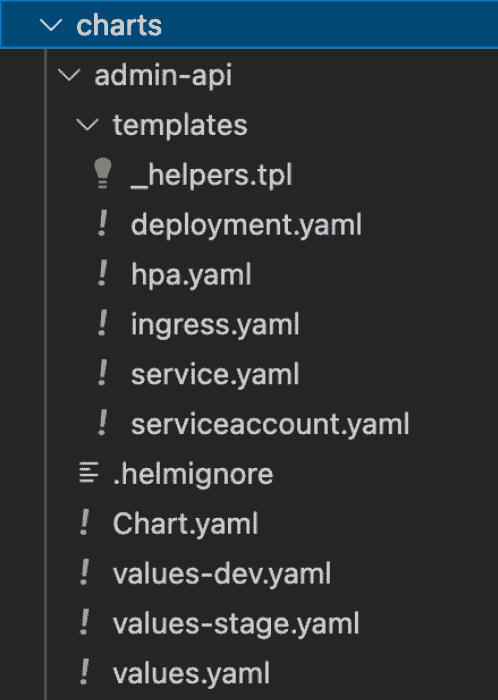

# 如何在 Kubernetes 上架构区块链——K8S 微服务教程

> 原文：<https://www.freecodecamp.org/news/how-to-architect-a-blockchain-on-kubernetes-k8s-microservice-tutorial/>

在本文中，我将描述如何使用微服务架构和 Kubernetes 来构建区块链。

通常用于区块链的技术是目的驱动的，您也可以将它们用于其他项目。

本文中的示例可以轻松处理繁重的负载，并快速响应和执行用户请求。

由于加密货币行业发展迅速，许多国家正在围绕如何管理一切制定规则。因此，我将遵守某些规定并考虑某些细节，例如区块链技术的特点。

例如，区块链技术可能会出现过载和性能问题。随着加密货币和区块链技术市场的扩大，新产品更有可能吸引大量活跃的区块链技术用户。

因此，我必须找到一种方法来防止程序在用户大量增加的情况下过载。

# 教程先决条件

对于本演练，我们将使用以下技术。你应该对它们很熟悉:

*   **Node.js** (具体来说就是 NestJS 框架)进行后端开发。Nest.js 强迫你使用一个模块化的结构，在这个结构中，每一个特性都可以被隔离，并且很容易与其他模块连接/断开。Nest 支持现成的 TypeScript。
*   PostgreSQL 是我们用来收集数据的数据库。
*   **Kafka JS** 为传入的负载提供服务，并在微服务之间建立通信。
*   **舵图和 Kubernetes (k8s)** 进行部署。这些工具将支持在任何云平台上轻松部署可扩展的微服务基础设施(我们将使用 AWS EKS)

另外，本文假设您对 Kubernetes、Helm 和 Node 有一定的了解。让我们开始吧。

# 开发方法

我们第一阶段的主要目标是将我们的应用分成微服务。

除了有助于服务通信之外，Kafka 的负载平衡还支持输入数据的逐个处理。当我们有很多客户时，处理时间可能会增加，但至少服务将会继续并保留下来。

此外，如果集群有足够的资源，我们可以为管理特定事件的组产生额外的消费者。这减少了延迟并加速了任务处理。

在这种情况下，我们将开发六种不同的微服务:

1.  **管理微服务**–我们将为所有管理面板逻辑使用管理微服务，它应该与面向用户的功能相隔离。
2.  **核心微服务**–与用户及其账户相关的逻辑包含在核心微服务中。身份证明、礼品、图表、简介等等。然而，这种微服务并不执行金融服务的职责，例如处理支付和兑换货币。
3.  **支付微服务**–一种被称为“支付微服务”的金融服务，包括交易、兑换和取款交易的逻辑。将有与 CEX 和 DeFi 解决方案的集成。
4.  **电子邮件和通知服务**——这个微服务负责通知用户电子邮件、推送通知和其他类型的警报。它包含一个单独的 Kafka 队列，用于其他微服务向用户发送电子邮件或通知的请求。
5.  **Cron Tasks**——一个名为 Cron Tasks Service 的微服务传输预定的事件进行任务处理。微服务不会自己执行任务。持有这样的微服务有助于防止在处理服务由于部署或故障而关闭时跳过 cron 作业迭代。该事件将保留在队列中等待执行。
6.  **Webhooks 微服务**–web hooks 微服务的目标是防止来自外部 API 的任何事件被遗漏，这些事件可能非常重要，并且包含交易状态或其他重要数据。这种事件在排队之后被处理(基于发送者 API)。

现在我们来看看如何使用 Nest.js 制作这些微服务。

对于 Kafka 消息代理，您需要创建配置选项。为了存储所有微服务的共享模块和配置，我们将建立一个共享资源文件夹。

## 微服务配置选项

生产应用程序必须有配置。在构建微服务应用程序时，配置对于了解生产应用程序的消耗至关重要。开发微服务时，通常建议将配置设置与您的代码区分开来。

```
import { ClientProviderOptions, Transport } from '@nestjs/microservices';

import CONFIG from '@application-config';

import { ConsumerGroups, ProjectMicroservices } from './microservices.enum';

const { BROKER_HOST, BROKER_PORT } = CONFIG.KAFKA;

export const PRODUCER_CONFIG = (name: ProjectMicroservices): ClientProviderOptions => ({

 name,

 transport: Transport.KAFKA,

 options: {

   client: {

     brokers: [${BROKER_HOST}:${BROKER_PORT}],

   },

 }

});

export const CONSUMER_CONFIG = (groupId: ConsumerGroups) => ({

 transport: Transport.KAFKA,

 options: {

   client: {

     brokers: [${BROKER_HOST}:${BROKER_PORT}],

   },

   consumer: {

     groupId

   }

 }

});
```

让我们将管理面板的微服务链接到消费者模式下的 Kafka。多亏了它，我们可以从主题中检测和管理事件。

让应用程序在微服务模式下运行，以便可以像这样使用事件:

```
app.connectMicroservice(CONSUMER_CONFIG(ConsumerGroups.ADMIN));

 await app.startAllMicroservices();
```

我们可以看到 groupId 包含在消费者配置中。这是一个至关重要的选择，它将使来自同一个组的客户能够从主题中获取事件，并相互共享，以便更快地处理它们。

例如，如果我们的微服务接收事件的速度快于处理事件的速度，我们可以使用自动伸缩来启动更多的 pod，以在它们之间分配负载，并将处理速度提高一倍。

消费者必须被包括在该组中才能工作，并且在缩放之后，衍生的 pod 也将被包括在内。他们不必处理来自几个 Kafka 分区的相同主题事件，因为他们可以共享加载。

让我们看一个例子来说明如何使用 Nest 来捕获和处理 Kafka 事件。

## 消费者控制器

```
import { Controller } from '@nestjs/common';

import { Ctx, KafkaContext, MessagePattern, EventPattern, Payload } from '@nestjs/microservices';

@Controller('consumer')

export class ConsumerController {

 @MessagePattern('hero')

 readMessage(@Payload() message: any, @Ctx() context: KafkaContext) {

   return message;

 }

 @EventPattern('event-hero')

 sendNotif(data) {

   console.log(data);

 }

}
```

客户可以在两种模式下操作。它接受事件，处理它们而不发送响应(EventPattern decorator)，或者在处理一个事件后，将响应返回给生产者(MessagePattern decorator)。

因为它不包含任何额外的源代码层来启用请求/响应功能，所以 EventPattern 是更好的，您应该尽可能地选择它。

## 制作人是谁？

我们必须为负责传输事件的模块提供生产者配置，以便链接生产者。

### 生产者联系

```
import { Module } from '@nestjs/common';

import DatabaseModule from '@shared/database/database.module';

import { ClientsModule } from '@nestjs/microservices';

import { ProducerController } from './producer.controller';

import { PRODUCER_CONFIG } from '@shared/microservices/microservices.config';

import { ProjectMicroservices } from '@shared/microservices/microservices.enum';

@Module({

 imports: [

   DatabaseModule,

   ClientsModule.register([PRODUCER_CONFIG(ProjectMicroservices.ADMIN)]),

 ],

 controllers: [ProducerController],

 providers: [],

})

export class ProducerModule {}
```

### 基于事件的生产者

```
import { Controller, Get, Inject } from '@nestjs/common';

import { ClientKafka } from '@nestjs/microservices';

import { ProjectMicroservices } from '@shared/microservices/microservices.enum';

@Controller('producer')

export class ProducerController {

 constructor(

   @Inject(ProjectMicroservices.ADMIN)

   private readonly client: ClientKafka,

 ) {}

 @Get()

 async getHello() {

   this.client.emit('event-hero', { msg: 'Event Based'});

 }

} 
```

### 基于请求/响应的生产者

```
import { Controller, Get, Inject } from '@nestjs/common';

import { ClientKafka } from '@nestjs/microservices';

import { ProjectMicroservices } from '@shared/microservices/microservices.enum';

@Controller('producer')

export class ProducerController {

 constructor(

   @Inject(ProjectMicroservices.ADMIN)

   private readonly client: ClientKafka,

 ) {}

 async onModuleInit() {

   // Need to subscribe to a topic

   // to make the response receiving from Kafka microservice possible

   this.client.subscribeToResponseOf('hero');

   await this.client.connect();

 }

 @Get()

 async getHello() {

   const responseBased = this.client.send('hero', { msg: 'Response Based' });

      return responseBased;

 }

}
```

每个微服务都可以选择以两种模式之一运行——生产者模式或消费者模式——或者同时以两种模式运行(混合模式)。

微服务通常采用混合模式进行负载平衡，为主体生成事件，并在平均分配负载的同时使用它们。

对于每个微服务，我们将使用基于 Helm chart 模板的 Kubernetes 设置。



模板中有几个配置文件:

*   水平吊舱自动定标器
*   入口控制器
*   服务
*   部署

我们将分别检查每个配置文件(没有 Helm 模板)。

### 如何部署管理 API

```
apiVersion: apps/v1

kind: Deployment

metadata:

 name: admin-api

spec:

 replicas: 1

 selector:

   matchLabels:

     app: admin-api

 template:

   metadata:

     labels:

       app: admin-api

   spec:

     containers:

     - name: admin-api

       Image: xxx208926xxx.dkr.ecr.us-east-1.amazonaws.com/project-name/stage/admin-api

       resources:

         requests:

           cpu: 250m

           memory: 512Mi

         limits:

           cpu: 250m

           memory: 512Mi

       ports:

         - containerPort: 80

       env:

         - name: NODE_ENV

           value: production

         - name: APP_PORT

           value: "80"
```

您可以在部署中包含更多的最小配置，如资源限制、运行状况检查配置、更新策略等。

### 管理 API 服务

```
---

apiVersion: v1

kind: Service

metadata:

 name: admin-api

spec:

 selector:

   app: admin-api

 ports:

   - name: admin-api-port

     port: 80

     targetPort: 80

     protocol: TCP

 type: NodePort
```

要使用这项服务，我们必须向公众开放。让我们利用 SSL 设置来利用安全的 HTTPS 连接，并通过负载平衡器公开我们的应用程序。

在我们的集群上，我们必须部署一个负载平衡器控制器。最广泛使用的答案如下:AWS 的负载均衡控制器。

接下来，我们必须使用以下设置来设置入口:

### 管理-API 入口控制器

```
apiVersion: networking.k8s.io/v1

kind: Ingress

metadata:

 namespace: default

 name: admin-api-ingress

 annotations:

   alb.ingress.kubernetes.io/load-balancer-name: admin-api-alb

   alb.ingress.kubernetes.io/ip-address-type: ipv4

   alb.ingress.kubernetes.io/tags: Environment=production,Kind=application

   alb.ingress.kubernetes.io/scheme: internet-facing

   alb.ingress.kubernetes.io/certificate-arn: arn:aws:acm:us-east-2:xxxxxxxx:certificate/xxxxxxxxxx

   alb.ingress.kubernetes.io/listen-ports: '[{"HTTP": 80}, {"HTTPS":443}]'

   alb.ingress.kubernetes.io/healthcheck-protocol: HTTPS

   alb.ingress.kubernetes.io/healthcheck-path: /healthcheck

   alb.ingress.kubernetes.io/healthcheck-interval-seconds: '15'

   alb.ingress.kubernetes.io/ssl-redirect: '443'

   alb.ingress.kubernetes.io/group.name: admin-api

spec:

 ingressClassName: alb

 rules:

   - host: example.com

     http:

       paths:

         - path: /*

           pathType: ImplementationSpecific

           backend:

             service:

               name: admin-api

               port:

                 number: 80
```

应用此配置后，将形成一个新的 alb 负载平衡器。我们必须使用我们在“主机”选项中指定的名称构建一个域，并将流量从此主机定向到我们的负载平衡器。

### 管理-API 自动缩放配置

```
apiVersion: autoscaling/v2beta1

kind: HorizontalPodAutoscaler

metadata:

 name: admin-api-hpa

spec:

 scaleTargetRef:

   apiVersion: apps/v1

   kind: Deployment

   name: admin-api

 minReplicas: 1

 maxReplicas: 2

 metrics:

   - type: Resource

     resource:

       name: cpu

       targetAverageUtilization: 90
```

## 赫尔姆是怎么进来的？

当我们想让我们的 k8s 基础设施不那么复杂时，Helm 相当有帮助。如果没有这个工具，在集群上运行它需要编写大量的 YML 文件。

此外，我们必须考虑应用程序、标签、名称等之间的关系。另一方面，Helm 可以简化事情。它的功能类似于包管理器，允许我们制作一个应用程序模板，使用简短的命令准备它，然后启动它。

让我们使用 Helm 创建模板。

### 管理-API 部署(掌舵图)

```
apiVersion: apps/v1

kind: Deployment

metadata:

 name: {{ .Values.appName }}

spec:

 replicas: {{ .Values.replicas }}

 selector:

   matchLabels:

     app: {{ .Values.appName }}

 template:

   metadata:

     labels:

       app: {{ .Values.appName }}

   spec:

     containers:

     - name: {{ .Values.appName }}

       image: {{ .Values.image.repository }}:{{ .Values.image.tag }}"

       imagePullPolicy: {{ .Values.image.pullPolicy }}

       ports:

       - containerPort: {{ .Values.internalPort }}

       {{- with .Values.env }}

       env: {{ tpl (. | toYaml) $ | nindent 12 }}

       {{- end }}
```

### 管理-API 服务(舵图)

```
apiVersion: v1

kind: Service

metadata:

 name: {{ .Values.global.appName }}

spec:

 selector:

   app: {{ .Values.global.appName }}

 ports:

   - name: {{ .Values.global.appName }}-port

     port: {{ .Values.externalPort }}

     targetPort: {{ .Values.internalPort }}

     protocol: TCP

 type: NodePort
```

### 管理-API 入口(舵图)

```
apiVersion: networking.k8s.io/v1

kind: Ingress

metadata:

 namespace: default

 name: ingress

 annotations:

   alb.ingress.kubernetes.io/load-balancer-name: {{ .Values.ingress.loadBalancerName }}

   alb.ingress.kubernetes.io/ip-address-type: ipv4

   alb.ingress.kubernetes.io/tags: {{ .Values.ingress.tags }}

   alb.ingress.kubernetes.io/scheme: internet-facing

   alb.ingress.kubernetes.io/certificate-arn: {{ .Values.ingress.certificateArn }}

   alb.ingress.kubernetes.io/listen-ports: '[{"HTTP": 80}, {"HTTPS":443}]'

   alb.ingress.kubernetes.io/healthcheck-protocol: HTTPS

   alb.ingress.kubernetes.io/healthcheck-path: {{ .Values.ingress.healthcheckPath }}

   alb.ingress.kubernetes.io/healthcheck-interval-seconds: {{ .Values.ingress.healthcheckIntervalSeconds }}

   alb.ingress.kubernetes.io/ssl-redirect: '443'

   alb.ingress.kubernetes.io/group.name: {{ .Values.ingress.loadBalancerGroup }}

spec:

 ingressClassName: alb

 rules:

   - host: {{ .Values.adminApi.domain }}

     http:

       paths:

         - path: {{ .Values.adminApi.path }}

           pathType: ImplementationSpecific

           backend:

             service:

               name: {{ .Values.adminApi.appName }}

               port:

                 number: {{ .Values.adminApi.externalPort }}
```

### 管理-API 自动缩放配置(舵图)

```
{{- if .Values.autoscaling.enabled }}

apiVersion: autoscaling/v2beta1

kind: HorizontalPodAutoscaler

metadata:

 name: {{ include "ks.fullname" . }}

 labels:

   {{- include "ks.labels" . | nindent 4 }}

spec:

 scaleTargetRef:

   apiVersion: apps/v1

   kind: Deployment

   name: {{ include "ks.fullname" . }}

 minReplicas: {{ .Values.autoscaling.minReplicas }}

 maxReplicas: {{ .Values.autoscaling.maxReplicas }}

 metrics:

 {{- if .Values.autoscaling.targetCPUUtilizationPercentage }}

   - type: Resource

     resource:

       name: cpu

       targetAverageUtilization: {{ .Values.autoscaling.targetCPUUtilizationPercentage }}

 {{- end }}

 {{- if .Values.autoscaling.targetMemoryUtilizationPercentage }}

   - type: Resource

     resource:

       name: memory

       targetAverageUtilization: {{ .Values.autoscaling.targetMemoryUtilizationPercentage }}

 {{- end }}

{{- end }}
```

“values.yml”、“values-dev.yml”和“values-stage.yml”文件包含模板的值。环境会决定使用哪一个。

让我们看几个开发环境值的例子。

### 管理-API 舵值-stage.yml 文件

```
env: stage

appName: admin-api

domain: admin-api.xxxx.com

path: /*

internalPort: '80'

externalPort: '80'

replicas: 1

image:

 repository: xxxxxxxxx.dkr.ecr.us-east-2.amazonaws.com/admin-api

 pullPolicy: Always

 tag: latest

ingress:

 loadBalancerName: project-microservices-alb

 tags: Environment=stage,Kind=application

 certificateArn: arn:aws:acm:us-east-2:xxxxxxxxx:certificate/xxxxxx

 healthcheckPath: /healthcheck

 healthcheckIntervalSeconds: '15'

 loadBalancerGroup: project-microservices

autoscaling:

 enabled: false

 minReplicas: 1

 maxReplicas: 100

 targetCPUUtilizationPercentage: 80

env:

 - name: NODE_ENV

   value: stage

 - name: ADMIN_PORT

   value: "80
```

为了使配置在集群上生效，我们必须升级图表并重新启动部署。

让我们研究一下问题中的 GitHub 操作步骤。

### 如何在 GitHub 动作中应用头盔配置

GitHub 动作是来自 GitHub 的 CI/CD 服务。它们以 Yaml 文件的形式提供简单的工作流程，运行基于 GitHub 事件的可配置代码块。因为它们被集成到 GitHub 中，所以它们大大减少了设置 CI/CD 管道的开销。

```
 - name: Admin image build and push

       run: |

         docker build -t project-admin-api -f Dockerfile.admin .

         docker tag project-admin-api ${{ env.AWS_ECR_REGISTRY }}/project/${{ env.ENV }}/admin-api:latest

         docker push ${{ env.AWS_ECR_REGISTRY }}/project/${{ env.ENV }}/admin-api:latest

     - name: Helm upgrade admin-api

       uses: koslib/helm-eks-action@master

       env:

         KUBE_CONFIG_DATA: ${{ env.KUBE_CONFIG_DATA }}

       with:

         command: helm upgrade --install admin-api -n project-${{ env.ENV }} charts/admin-api/ -f charts/admin-api/values-${{ env.ENV }}.yaml

     - name: Deploy admin-api image

       uses: kodermax/kubectl-aws-eks@master

       env:

         KUBE_CONFIG_DATA: ${{ env.KUBE_CONFIG_DATA }}

       with:

         args: rollout restart deployment/admin-api-project-admin-api --namespace=project-${{ env.ENV }}
```

# 摘要

在本文中，我们研究了微服务的基础设施构建和 Kubernetes 集群部署步骤。通过使用简单明了的例子，避免了完整配置的复杂性，我希望这相对容易理解。

在 [LinkedIn](https://www.linkedin.com/in/kadeniyi/) 和 [Twitter](https://twitter.com/mkbadeniyi) 上与我联系

再见了！