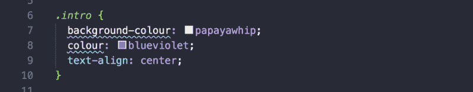
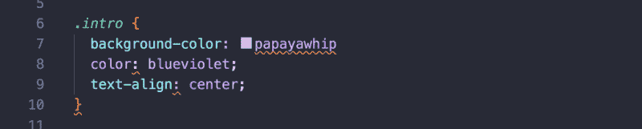
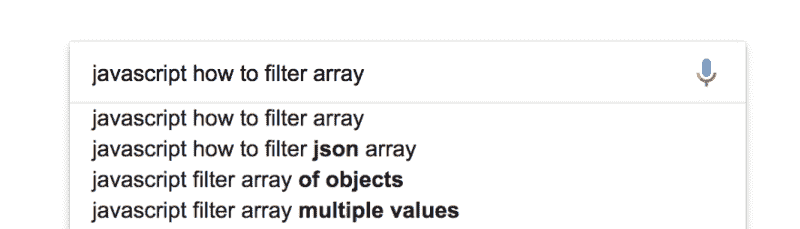
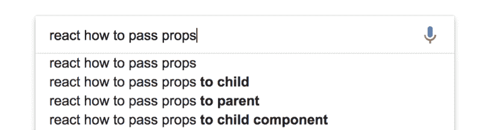

# 作为开发人员如何提出好的问题

> 原文：<https://www.freecodecamp.org/news/how-to-ask-good-questions-as-a-developer-9f71ff809b63/>

总的来说，知道如何以正确的方式提问是生活中的一项关键技能。一个结构良好的问题通常会返回一个有用的、直接的答案。

说到编码，你可以采取一些步骤来增加获得好答案的机会。

因此，我试图在课堂上提高我的学生的技能之一是，当他们遇到问题时，如何提出好的问题。

以下是我教给他们的要点:

### 做最基本的

你的好问题提问(⚔️)的第一项是最基本的。

在面授课程的早期课程中，讲师可能会在修复代码的同时向您讲解解决方案。但是，在网络社区这个糟糕的大世界里，不做最基本的事情通常就像一头公牛的红旗一样。

#### 检查您的代码编辑器中的拼写和语法错误

当发现简单的错别字时，语法高亮是一个强大的盟友。

尤其是对那些英国人来说:

在早期，你的大部分错误是打字错误和语法错误。在您信任的代码编辑器的帮助下，这应该是一个快速的解决方案。

#### 检查书面错误

如果您编写的语言提供了书面错误，请检查控制台/日志。通读错误，查看错误的内容和位置。

### 试着理解发生了什么

一旦你做了基本的工作，你就会对问题有更多的了解。

现在是逐行阅读代码的时候了。使用该语言可用的任何调试工具，深入研究问题。

在这里慢慢来。你对问题的理解越深，你能创造的假设就越多。这又会引出一个更清晰的问题。

如果是用户界面(UI)问题，请使用浏览器的开发工具。打开和关闭样式，看看哪些样式被其他人改写了。

否则，使用调试器并检查变量值。他们是你所期望的吗？当你期望它有一个值时，它会显示为`undefined`吗？

如有必要，注释掉代码块，以关注问题所在。

### 做一些谷歌搜索

现在，你至少应该对这个问题有所了解了。这意味着你应该能够组织一个集中的问题。在向任何人寻求帮助之前，先去谷歌搜索一下。

谷歌是开发者最好的朋友。即使是有经验的开发人员也需要定期使用谷歌来解决问题。优秀的开发人员通常也是优秀的谷歌员工。

构建一个像样的 Google 查询的基本方法如下:

> *列出**语言、库或框架，**然后添加你的**口语问题**或**错误信息***

以下是按照这种结构提问的几个例子:

确保你做一些不同的搜索。通读任何似乎适合您的问题的结果。如果运气好的话，在你之前会有人遇到同样的问题，并且已经解决了他们的问题。

### 在项目之外重新创建问题

如果您仍然没有解决您的问题，请尝试在项目之外重新创建问题。如果你面临一些奇怪的 CSS 问题，这尤其有用。在这种情况下，你可以[去 CodePen 这样的地方，分享你的代码片段](https://codepen.io/)。

能够将破碎的代码与项目的其余部分分开有几个好处:

*   这将有助于你关注这个问题
*   这将有助于其他相关人员更快地解决问题

这又回到了重视他人的时间。他们浏览一个简洁的代码片段比浏览整个代码库花费的时间要少。

### 准备分享你的代码

好吧，所以你还不能自己解决这个问题。别担心！到目前为止，你所做的一切都为你能够提出一个伟大的问题奠定了基础。

但是，在你请别人来帮你之前，有几件事要做:

#### 1)确保您的代码格式良好

如果你是一个训练有素的开发人员，拥有格式良好的代码，那么击掌庆祝✋

如果你不是，那么现在是时候让你的代码看起来像原始的✨.了

考虑使用棉绒。Linters 通过对格式不良的代码发出警告/错误来实施良好的实践。你甚至可以让你不能推送有林挺错误的代码。

至少，[给你的编辑器](https://prettier.io/)添加漂亮的东西，让它为你格式化。

底线是:没有人愿意在开始帮助你之前就整理好你的代码格式。

#### 2)确保您共享的代码重现了错误

在您共享代码之前，请确保它重现了您遇到的问题。这应该是不言而喻的，但是如果您共享的代码没有重现错误，那么帮助您将会非常困难。

如果代码需要几个步骤来启动和运行，那么在共享代码时一定要包括这些步骤。

### 展示你为解决问题所做的努力

在这一点上，你要么在教室里举手，要么去 StackOverflow 或 Slack 频道等地方在线获得答案。

询问时，回顾一下您迄今为止为解决问题所采取的步骤至关重要。尽可能向任何可能帮助您的人提供更多信息，以澄清您的问题。

以下是一些你应该分享的信息:

*   你对问题的理解。现在可能有几种不同的假设。重要的是，你要清楚地说明你认为问题可能是什么，以及你已经做了什么来试图解决它。
*   您的问题/错误的屏幕截图。如果是用户界面的问题，在你的截图上加注释来突出问题。
*   重现问题的代码(最好在沙盒环境中)。

如果你的问题发布在网上，请反复阅读。确保你提供尽可能多的细节来帮助别人帮助你。

一个模糊的问题在网上回答比当面回答要费时得多。

### 让每个人都了解最新情况

如果你在网上发布了这个问题，你可能会在别人有时间回答之前解决你的问题。如果是这种情况，一定要把自己的问题的答案贴出来。

在网上回答自己的问题可能看起来很奇怪。但是，人们一直都在这么做，这可能会在将来帮助其他人。

### 感谢任何试图帮助你的人

**这个。是。至关重要。**

感谢所有试图帮助你的人。即使它们实际上没有帮助解决您的问题。他们从日常工作中抽出时间来帮助修复您损坏的代码。表示欣赏？

你有什么关于问好问题的技巧或诀窍想补充吗？请写在评论里。

想打个招呼吗？[在 Twitter 上关注并发推文给我@ frontend mentor](https://twitter.com/frontendmentor)。