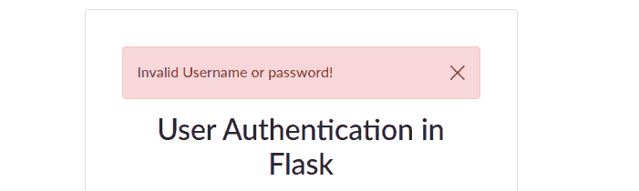

# 如何使用 Flask-Login 认证 Flask 中的用户

> 原文：<https://www.freecodecamp.org/news/how-to-authenticate-users-in-flask/>

当您为公众开发应用程序时，保护用户的凭证和信息非常重要。这意味着您需要了解代码结构以及如何实现各种安全措施。

在本文中，我们将介绍使用微型 web 框架 Flask 创建用户认证 web 应用程序的步骤。对于认证，我们将使用 Python 库`flask_login`。

该应用程序包括表单验证、帐户创建和认证用户的登录/注销功能等功能。

## 应用程序设置和安装

你可以在我的 [GitHub](https://github.com/Dev-Elie/User-Authentication-in-Flask/tree/main#readme) 资源库中找到关于设置和安装项目的全面指南。

### 基本应用程序结构

对于这个应用程序，我们将在它自己的目录中有一个虚拟环境，以及一个包含主要应用程序文件的文件夹。这是该应用程序结构的概述:

**。**
**【auth-app】**
【app . py】
【数据库】。db
【forms . py】
【管理. py】

### 应用工厂

首先，我们将在 app.py 文件中创建一个应用程序工厂函数，并将其命名为`create_app`。这对任何 Flask app 都是至关重要的。

此外，我们需要在项目中使用一些库，因此我们将导入以下内容:

**app.py**

```
from flask import Flask
from flask_sqlalchemy import SQLAlchemy
from flask_bcrypt import Bcrypt
from flask_migrate import Migrate

from flask_login import (
    UserMixin,
    login_user,
    LoginManager,
    current_user,
    logout_user,
    login_required,
)
```

我们导入了 Flask、SQLAlchemy 来帮助我们的 Python 应用程序与数据库通信，Bcrypt 用于密码散列，Migrate 用于数据库迁移，以及 Flask-Login 中的几个其他方法用于会话管理。

```
login_manager = LoginManager()
login_manager.session_protection = "strong"
login_manager.login_view = "login"
login_manager.login_message_category = "info"
```

要使用 flask_login，我们将创建一个如上所示的实例。我们将对 SQLAlchemy、Migrate 和 Bcrypt 做同样的事情。

```
db = SQLAlchemy()
migrate = Migrate()
bcrypt = Bcrypt()
```

我们将在一个函数内创建 Flask 实例，而不是在全局范围内创建，因为随着项目的增长，在全局范围内创建会变得很困难。

在一个函数中这样做的好处是，它允许多个应用程序实例(在测试期间也是如此)。(来源:[flask.palletsprojects.com](https://flask.palletsprojects.com/en/2.0.x/patterns/appfactories/#application-factories))

```
def create_app():
    app = Flask(__name__)

    app.secret_key = 'secret-key'
    app.config['SQLALCHEMY_DATABASE_URI'] = "sqlite:///database.db"
    app.config['SQLALCHEMY_TRACK_MODIFICATIONS'] = True

    login_manager.init_app(app)
    db.init_app(app)
    migrate.init_app(app, db)
    bcrypt.init_app(app)

    return app
```

Flask-Login 还要求我们设置一个秘密密钥才能运行。此外，您会注意到我们在应用程序工厂内部进行了初始化。我们这样做是为了避免扩展最初将自己绑定到应用程序，如这里的[所解释的](https://flask.palletsprojects.com/en/2.0.x/patterns/appfactories/#factories-extensions)。

现在我们已经完成了基本的应用程序工厂，是时候声明我们的用户模型了。在用户表中，我们只需要这个应用程序的 email、username 和 password 列。

**models.py**

```
from app import db
from flask_login import UserMixin

class User(UserMixin, db.Model):
    __tablename__ = "user"

    id = db.Column(db.Integer, primary_key=True)
    username = db.Column(db.String(80), unique=True, nullable=False)
    email = db.Column(db.String(120), unique=True, nullable=False)
    pwd = db.Column(db.String(300), nullable=False, unique=True)

    def __repr__(self):
        return '<User %r>' % self.username
```

在上面的代码片段中，我们从 Flask-Login 导入 db、SQLAlchemy 的一个实例和一个 UserMixin 子类。我们的工作通过使用 UserMixin 得到简化，它允许我们使用诸如 **is_authenticated()** 、 **is_active()** 、 **is_anonymous()** 和 **get_id ()** 等方法。

如果我们不将 UserMixin 包含在我们的用户模型中，我们将会得到类似于`'User' object has no attribute 'is_active'`的错误。

我们目前有一个用户模型，但还没有创建表。要做到这一点，在您的终端上的项目目录中运行`python manage.py`——假设您设置正确，在 requirements.txt 文件中安装了包，并且有一个活动的虚拟环境。

**manage.py**

```
def deploy():
	"""Run deployment tasks."""
	from app import create_app,db
	from flask_migrate import upgrade,migrate,init,stamp
	from models import User

	app = create_app()
	app.app_context().push()
	db.create_all()

	# migrate database to latest revision
	init()
	stamp()
	migrate()
	upgrade()

deploy()
```

`deploy`函数从`app.py`文件、Flask-Migrate 迁移方法和用户模型中导入`create_app`函数。然后，我们确保我们在一个应用程序上下文中工作，从这个上下文中我们现在可以调用`db.create all()`，它将负责我们的表创建。

我们仍然需要设置登录和注册表单。首先，我们需要在将它们呈现在模板上之前准备两个 Flask 表单。表单的配置如下所示。为了保持这篇文章的整洁和精确，我将省略重要的行。对于被排除的导入行，请参见 [GitHub](https://github.com/Dev-Elie/User-Authentication-in-Flask) 库。

### forms.py

**a)。登记表**

```
class register_form(FlaskForm):
    username = StringField(
        validators=[
            InputRequired(),
            Length(3, 20, message="Please provide a valid name"),
            Regexp(
                "^[A-Za-z][A-Za-z0-9_.]*$",
                0,
                "Usernames must have only letters, " "numbers, dots or underscores",
            ),
        ]
    )
    email = StringField(validators=[InputRequired(), Email(), Length(1, 64)])
    pwd = PasswordField(validators=[InputRequired(), Length(8, 72)])
    cpwd = PasswordField(
        validators=[
            InputRequired(),
            Length(8, 72),
            EqualTo("pwd", message="Passwords must match !"),
        ]
    ) 
```

在上面的代码片段中，我们只是对从`wtforms`导入的必填字段进行验证，并将它们分配给表单字段变量名。

```
 def validate_email(self, email):
        if User.query.filter_by(email=email.data).first():
            raise ValidationError("Email already registered!")

    def validate_uname(self, uname):
        if User.query.filter_by(username=username.data).first():
            raise ValidationError("Username already taken!")
```

为了加快验证过程，我们需要减少服务器端验证所需的负载和时间。为了实现这一点，我们将上面的代码行—电子邮件和用户名验证添加到我们的注册表单类中，以便在客户端处理它。

**b)。登录表单**

```
class login_form(FlaskForm):
    email = StringField(validators=[InputRequired(), Email(), Length(1, 64)])
    pwd = PasswordField(validators=[InputRequired(), Length(min=8, max=72)])
    # Placeholder labels to enable form rendering
    username = StringField(
        validators=[Optional()]
    )
```

要使表单域在模板上可见，我们必须通过呈现模板的路径将表单对象传递给它。现在是时候定义我们的应用程序的各种路线了。我还将省去这一部分的导入行。

### routes.py

使用 Flask-Login 时，提供用户加载器回调是很重要的。这将根据存储的 id 保持当前用户对象加载到当前会话中。

```
@login_manager.user_loader
def load_user(user_id):
    return User.query.get(int(user_id))
```

在接下来的代码行中，我们简单地为这个应用程序定义了三个路径:home、login 和 register。注意我们如何创建 Flask 表单实例，然后将它们与函数 return 语句一起传递？我们稍后将修改这些路由来处理我们的登录和注册需求。我们还将添加一个注销路径。

```
app = create_app()

# Home route
@app.route("/", methods=("GET", "POST"), strict_slashes=False)
def index():
    return render_template("index.html",title="Home")

# Login route
@app.route("/login/", methods=("GET", "POST"), strict_slashes=False)
def login():
    form = login_form()

    return render_template("auth.html",form=form)

# Register route
@app.route("/register/", methods=("GET", "POST"), strict_slashes=False)
def register():
    form = register_form()

    return render_template("auth.html",form=form)

if __name__ == "__main__":
    app.run(debug=True) 
```

是时候写一些 HTML 代码了。此时，我们只需要浏览器中的表单。为了保持这篇文章的简洁，我还是会省去几行代码。完整的文件可以在 [GitHub](https://github.com/Dev-Elie/User-Authentication-in-Flask) 上获得，但是现在，让我们集中在感兴趣的主要领域。

**auth.html**

```
<form action="{{ request.path }}" method="POST" class="...">

{{ form.csrf_token }}


<!-- Categories: success (green), info (blue), warning (yellow), danger (red) -->


<div class="alert alert-{{category}} alert-dismissible fade show" role="alert">
{{ message }}
<button type="button" class="btn-close" data-bs-dismiss="alert" aria-label="Close"></button>
</div>





{{ form.username(class_="form-control",placeholder="Username")}}


{{ error }}




{{ form.email(class_="form-control",placeholder="Email")}}


{{ error }}


{{ form.pwd(class_="form-control",placeholder="Password")}}


{{ error }}



{{ form.cpwd(class_="form-control",placeholder="Confirm Password")}}


{{ error }}




<button type="submit" class="btn btn-block btn-primary mb-3">
{{ btn_action }}
</button>

<p>

New here?
<a href="{{url_for('register')}}">Create account</a>

Already have an account?
<a href="{{url_for('login')}}">Login</a>

</p> 
```

上面显示的 HTML 模板是我们的登录和注册表单。我只是用了一些 jinja 模板技巧。

正如您在上面看到的，表单动作被设置为`action="{{request.path}}"`，其中`request.path`检索发出请求的路径，并将其作为表单动作的值。这消除了对特定路径进行硬编码的需要。

我们还设置了一个 csrf 令牌变量，它允许表单验证继续进行，同时防止会话骑行攻击。

它还处理闪烁的消息。Bootstrap 5 警报可以根据不同的消息类别轻松显示不同的消息。下面是一个这样做的例子。



我们只需打印出表单对象中的单个变量名来显示表单字段。下面是上面片段中的一个例子:

`{{ form.username(class_="form-control",placeholder="Username")}}`

另一件要考虑的事情是使用`if...else`语句，比如在下面的代码行中:

``

通过根据请求路径隐藏一些字段，我们可以轻松地在登录和注册表单之间切换。

还记得我们应用于表单字段的验证检查吗？此外，我们想通知用户，如果他们没有提供所需的输入-所以我们将包括一些代码。下面是上面 HTML 表单中的一个例子。

如果违反了对用户名的任何检查，下面的代码行将向用户显示适当的消息。

```

{{ error }}

```

这是一个看起来像什么的例子:


### 如何修改 routes.py

在 Flask 中，向数据库添加新用户很简单。为了完成今天的教程，我们需要注册、登录和注销用户，也就是管理会话。

**a)。报名路线**

首先，仔细看看下面注册新用户的代码片段，我们确认发送数据的表单已经通过了所有的验证检查。所以，`if form.validate_on_submit():`

```
 ...

    if form.validate_on_submit():
        try:
            email = form.email.data
            pwd = form.pwd.data
            username = form.username.data

            newuser = User(
                username=username,
                email=email,
                pwd=bcrypt.generate_password_hash(pwd),
            )

            db.session.add(newuser)
            db.session.commit()
            flash(f"Account Succesfully created", "success")
            return redirect(url_for("login"))

        except Exception as e:
            flash(e, "danger")

      ...
```

如果所有检查都通过了，我们就从表单字段中获取值，然后将这些值传递给用户对象，添加到数据库中，并保存所有的更改。

当使用新值成功更新数据库时，用户会看到一条成功消息。之后，应用程序将用户重定向到登录页面。

任何可能发生的异常都会被捕获并显示给用户。这通过显示更好的警报改善了用户体验(您还可以根据异常修改消息)。

以纯文本格式存储密码是不安全的，因为这增加了用户凭据在遭到破坏时被泄露的风险。

用户密码在保存前经过哈希处理，存储在数据库中的是高度加密的字符组合。我们在 Bcrypt 的帮助下处理了这个问题。哈希是这样生成的:

`pwd=bcrypt.generate_password_hash(pwd)`

**b)。登录路线**

```
 if form.validate_on_submit():
        try:
            user = User.query.filter_by(email=form.email.data).first()
            if check_password_hash(user.pwd, form.pwd.data):
                login_user(user)
                return redirect(url_for('index'))
            else:
                flash("Invalid Username or password!", "danger")
        except Exception as e:
            flash(e, "danger")
```

通过验证后，用户模型将被查询，以查看用户是否存在所提供的电子邮件。如果失败，它会显示一条错误消息。但是如果它通过了验证，第二步是将发布的密码与散列版本的密码进行比较。如果两者匹配，则授予访问权限并将用户重定向到主页。

**c)。注销路线**

```
@app.route("/logout")
@login_required
def logout():
    logout_user()
    return redirect(url_for('login'))
```

上述路由重定向到登录页面，处理活动会话的终止。

就是这样！我们已经用用户认证构建了我们的应用程序。

感谢您的阅读。我希望这篇文章对你有用。继续读，建，祝福。别忘了在推特上关注我 [**@dev_elie**](https://twitter.com/dev_elie) **。**