# 如何在 ASP.NET 核心 2.0 中使用 LinkedIn 认证您的用户

> 原文：<https://www.freecodecamp.org/news/how-to-authenticate-your-users-with-linkedin-in-asp-net-core-2-0-3f84c5cd2f1b/>

作者:安基特·夏尔马

# 如何在 ASP.NET 核心 2.0 中使用 LinkedIn 认证您的用户


Image [source](https://fontmeme.com/linkedin-font/)

### 介绍

有时，我们希望用户使用他们现有的来自第三方应用程序的凭证登录，比如脸书、Twitter、Google、LinkedIn 等等。在本文中，我们将使用 LinkedIn 帐户来研究 ASP.NET 核心应用程序的身份验证。

### 先决条件

*   安装。NET Core 2.0.0 以上 SDK 从[这里](https://www.microsoft.com/net/core#windowscmd)。
*   从[这里](https://www.visualstudio.com/downloads/)安装最新版本的 Visual Studio 2017。

### 创建 MVC Web 应用程序

打开 Visual Studio 并选择文件>>新建>>项目。选择项目后，将会打开一个“新项目”对话框。

选择。NET Core 内的 Visual C#菜单从左侧面板。然后，选择“ASP。NET Core Web Application”从可用的项目类型。

将项目命名为 **LinkdinAuth** 并按 OK。

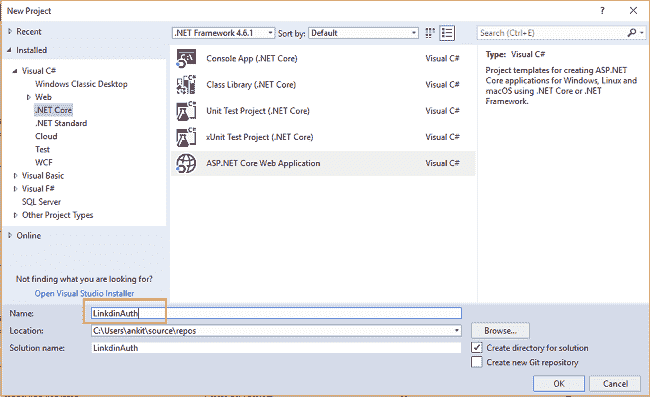

单击 OK 后，将打开一个新对话框，要求您选择项目模板。您可以在模板窗口的左上角看到两个下拉菜单。选择”。NET Core”和“ASP。NET Core 2.0”。

然后，选择“Web 应用程序(模型-视图-控制器)”模板。

单击“更改验证”按钮，将会打开一个“更改验证”对话框。

选择“个人用户帐户”并单击确定。现在，再次单击“确定”创建我们的 web 应用程序。

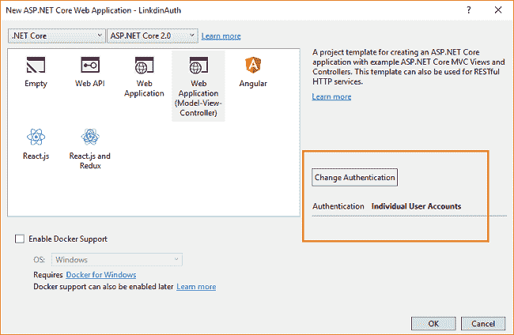

在运行应用程序之前，我们需要将迁移应用到我们的应用程序中。

导航到工具>>获取软件包管理器>>软件包管理器控制台。

它将打开软件包管理器控制台。输入 **Update-Database** 命令，并点击回车。这将使用实体框架代码优先迁移来更新数据库。

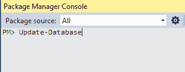

按 F5 运行应用程序。您可以看到如下所示的主页。

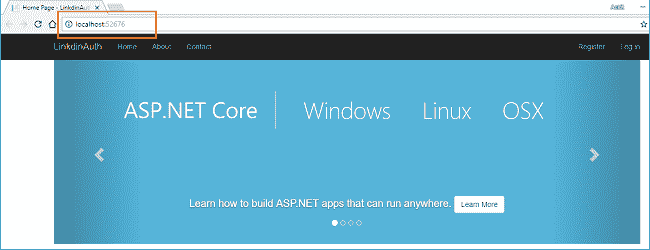

### 创建 LinkedIn 应用

导航至[https://www.linkedin.com/developer/apps](https://www.linkedin.com/developer/apps)，使用您的 LinkedIn 帐户登录。如果您没有 LinkedIn 帐户，您需要创建一个，因为没有帐户您无法继续。

登录后，您将被重定向到与下图类似的**我的应用程序**页面。

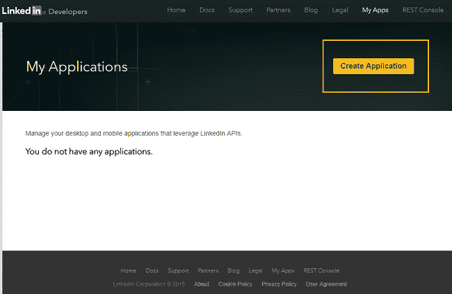

点击**创建应用**按钮，导航到**创建新应用**页面。在这里，您需要填写详细信息来创建一个新的 LinkedIn 应用程序。

*   公司名称:—给出一个合适的名称。这里我们使用的名称是 **DemoCompany** 。
*   应用程序名称:这是您的 LinkedIn 应用程序的名称。给自己选择一个合适的名字。

注意:**不要在你的产品名称**中使用“LinkedIn”字样。您将被提示错误“*应用程序名称不能包含 LinkedIn* ”，并且您将不被允许创建该应用程序。这意味着“LinkedinAuthDemo”是一个无效的名称。参考下图。

*   应用程序描述:给你的应用程序一个适当的描述。
*   应用程序徽标:您需要为您的应用程序上传一个徽标。如果你没有一个标志，只需上传任何图像。请提供 PNG 或 JPEG 格式的应用程序徽标图像。图像必须是正方形，至少 80 x 80 像素，大小不超过 5 MB。
*   应用程序用途:从下拉列表中选择一个合适的值。
*   网站 URL:提供您的公共网站的 URL。对于本教程，我们将使用一个虚拟网址[http://demopage.com。](http://demopage.com.)

注意:如果你使用 URL 格式[*【www.demopage.com】*，](http://www.demopage.com,)你会得到一个错误信息*请输入一个* *有效的 URL* 始终使用 URL 格式，如[*http://demopage.com*。](http://demopage.com.)

*   商务邮箱:给出你的邮箱 id。如果您不想提供您的个人电子邮件 id，那么您也可以使用任何虚拟电子邮件 id，如*xyz@gmail.com*
*   商务电话:提供你的联系电话。对于本教程，我使用一个虚拟电话号码 123456789。

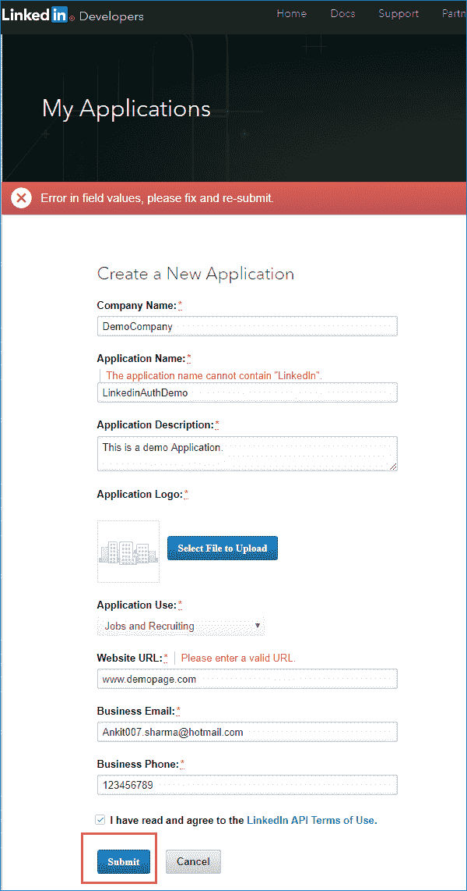

请记住，该表单中的所有字段都是必填的，因此您需要为所有字段提供适当的值。一旦你提供了所有的细节，点击**提交**按钮。如果表单中没有错误，您的 LinkedIn 应用程序将成功创建，您将被重定向到应用程序主页。

在这里，您可以看到认证密钥部分中的**客户端 ID** 和**客户端秘密**字段。请注意这些值，因为我们将需要它们在我们的 web 应用程序中配置 LinkedIn 身份验证。

在 Authorized Redirect URLs 字段中，提供应用程序的基本 URL，并在其后附加 **/signin-linkedin** 。对于本教程，URL 将是[*http://localhost:52676/sign in-LinkedIn*。](http://localhost:52676/signin-linkedin.)输入网址后，按下与其相邻的**添加** 按钮添加数值。请参考下图:

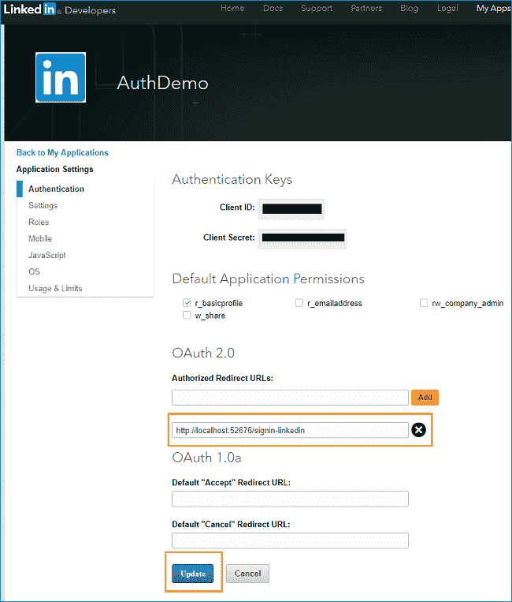

### 将您的 web wpp 配置为使用 LinkedIn 身份验证

我们将使用第三方 Nuget 包 **AspNet。Security.OAuth.LinkedIn** 在我们的 Web 应用程序中实现 LinkedIn 身份验证。打开 NuGet 包管理器(工具> > NuGet 包管理器> >包管理器控制台)，输入以下命令。按回车键安装它。

```
Install-Package AspNet.Security.OAuth.LinkedIn -Version 2.0.0-rc2-final
```

这个 NuGet 包由 aspnet-contrib 维护。你可以在这里阅读更多关于这个包的信息。

我们需要在应用程序中存储**客户端 ID** 和**客户端秘密**字段值。为此，我们将使用 Secret Manager 工具。Secret Manager 工具是一个项目工具，可用于存储密码、API 密钥等秘密。在开发过程中为一个. NET 核心项目。借助秘密管理器工具，我们可以将应用程序秘密与特定项目相关联，并在多个项目之间共享它们。

再次打开我们的 web 应用程序，并在解决方案资源管理器中右键单击该项目。从上下文菜单中选择“管理用户机密”。

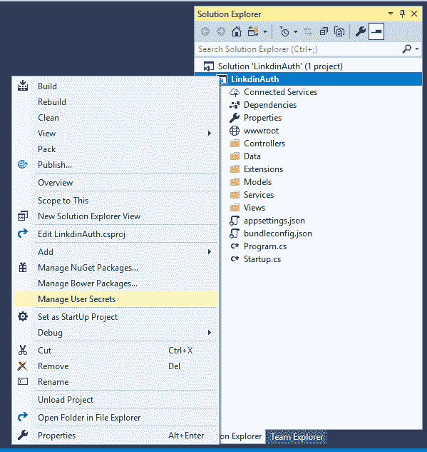

一个 **secrets.json** 文件将会打开。把下面的代码放进去。

```
{    "Authentication:LinkedIn:ClientId": "Your ClientId here",    "Authentication:LinkedIn:ClientSecret": "Your ClientSecret here"  }
```

现在，打开 **Startup.cs** 文件，将下面的代码放到 **ConfigureServices** 方法中。

```
services.AddAuthentication().AddLinkedIn(options =>{    options.ClientId = Configuration["Authentication:LinkedIn:ClientId"];    options.ClientSecret = Configuration["Authentication:LinkedIn:ClientSecret"];    options.Events= new OAuthEvents()    {        OnRemoteFailure = loginFailureHandler =>        {            var authProperties = options.StateDataFormat.Unprotect(loginFailureHandler.Request.Query["state"]);            loginFailureHandler.Response.Redirect("/Account/login");            loginFailureHandler.HandleResponse();            return Task.FromResult(0);        }    };});
```

在这段代码中，我们从 **secrets.json** 文件中读取**客户端 ID** 和**客户端秘密**值，用于身份验证。在这段代码中，我们还处理了“OnRemoteFailure”事件。因此，如果用户拒绝访问他们的 LinkedIn 帐户，那么他们将被重定向回登录页面。

所以最后， **Startup.cs** 会是这个样子。

```
using System;using System.Collections.Generic;using System.Linq;using System.Threading.Tasks;using Microsoft.AspNetCore.Builder;using Microsoft.AspNetCore.Identity;using Microsoft.EntityFrameworkCore;using Microsoft.AspNetCore.Hosting;using Microsoft.Extensions.Configuration;using Microsoft.Extensions.DependencyInjection;using LinkdinAuth.Data;using LinkdinAuth.Models;using LinkdinAuth.Services;using Microsoft.AspNetCore.Http;using Microsoft.AspNetCore.Authentication.OAuth;  namespace LinkdinAuth{    public class Startup    {        public Startup(IConfiguration configuration)        {            Configuration = configuration;        }          public IConfiguration Configuration { get; }          // This method gets called by the runtime. Use this method to add services to the container.        public void ConfigureServices(IServiceCollection services)        {            services.AddDbContext<ApplicationDbContext>(options =>                options.UseSqlServer(Configuration.GetConnectionString("DefaultConnection")));              services.AddIdentity<ApplicationUser, IdentityRole>()                .AddEntityFrameworkStores<ApplicationDbContext>()                .AddDefaultTokenProviders();              services.AddAuthentication().AddLinkedIn(options =>            {                options.ClientId = Configuration["Authentication:LinkedIn:ClientId"];                options.ClientSecret = Configuration["Authentication:LinkedIn:ClientSecret"];                  options.Events= new OAuthEvents()                {                    OnRemoteFailure = loginFailureHandler =>                    {                        var authProperties = options.StateDataFormat.Unprotect(loginFailureHandler.Request.Query["state"]);                        loginFailureHandler.Response.Redirect("/Account/login");                        loginFailureHandler.HandleResponse();                        return Task.FromResult(0);                    }                };              });               // Add application services.            services.AddTransient<IEmailSender, EmailSender>();              services.AddMvc();        }          // This method gets called by the runtime. Use this method to configure the HTTP request pipeline.        public void Configure(IApplicationBuilder app, IHostingEnvironment env)        {            if (env.IsDevelopment())            {                app.UseBrowserLink();                app.UseDeveloperExceptionPage();                app.UseDatabaseErrorPage();            }            else            {                app.UseExceptionHandler("/Home/Error");            }                          app.UseStaticFiles();              app.UseAuthentication();              app.UseMvc(routes =>            {                routes.MapRoute(                    name: "default",                    template: "{controller=Home}/{action=Index}/{id?}");            });        }    }}
```

这样，我们的应用程序就准备好了。

### 执行演示

启动应用程序，然后单击主页右上角的登录。

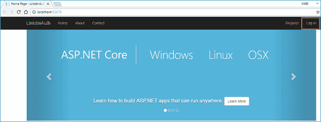

您将被重定向到[*http://localhost:52676/Account/log in*](http://localhost:52676/Account/Login)，在页面右侧您可以看到使用 LinkedIn 登录的选项。

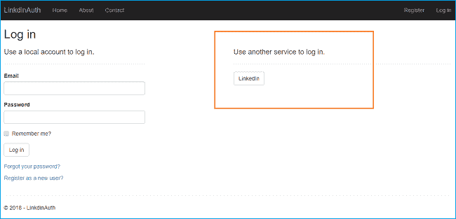

点击 **LinkedIn** 按钮将带您进入 LinkedIn 授权页面。在那里，您将被要求填写您的 LinkedIn 凭据，并授权 LinkedIn 应用程序使用您的 LinkedIn 帐户。

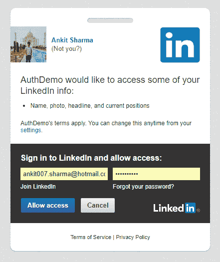

输入您的 LinkedIn 凭据，然后点击**允许访问**按钮。该应用程序需要一些时间来验证您的 LinkedIn 帐户。LinkedIn 认证成功后，您将被重定向到应用程序中的注册页面，您需要填写电子邮件 id 来标记您的帐户。

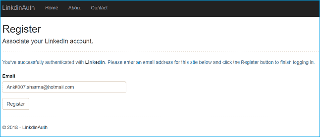

给出一个邮箱 id，点击注册，你会再次被重定向到主页。但是这次，你也可以在右上角看到你注册的邮箱 id。因此，我们已经成功地登录到我们的 ASP。使用 LinkedIn 的 NET 核心应用程序。

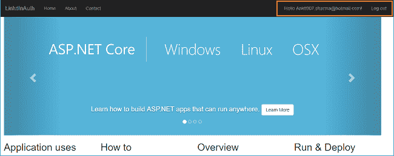

### 结论

我们已经成功创建了一个 LinkedIn 应用程序，并使用它来验证我们的 ASP.NET 核心应用程序。

可以从 [GitHub](https://github.com/AnkitSharma-007/ASPCore.LinkedInAuth) 获取源代码。

请注意 **secrets.json** 文件包含虚拟值。在执行之前，您需要用 LinkedIn 应用程序的键替换这些值。

你也可以在 [C#角](http://www.c-sharpcorner.com/article/authentication-using-linkedin-in-asp-net-core-2-0/)找到这篇文章。

你可以看看我关于 ASP 的其他文章。网芯[这里](http://ankitsharmablogs.com/category/asp-net-core/)。

### 请参见

*   [在 ASP.NET 核心 2.0 中使用谷歌认证](http://ankitsharmablogs.com/authentication-using-google-asp-net-core-2-0/)
*   [在 ASP.NET 核心 2.0 中使用 Twitter 认证](http://ankitsharmablogs.com/authentication-using-twitter-in-asp-net-core-2-0/)
*   [在 ASP.NET 核心 2.0 中使用脸书进行认证](http://ankitsharmablogs.com/authentication-using-facebook-in-asp-net-core-2-0/)
*   [使用 ASP.NET 核心 2.0 进行 Cookie 认证](http://ankitsharmablogs.com/cookie-authentication-with-asp-net-core-2-0/)
*   [ASP.NET 核心—使用谷歌认证器的双因素认证](http://ankitsharmablogs.com/asp-net-core-two-factor-authentication-using-google-authenticator/)

最初发表于