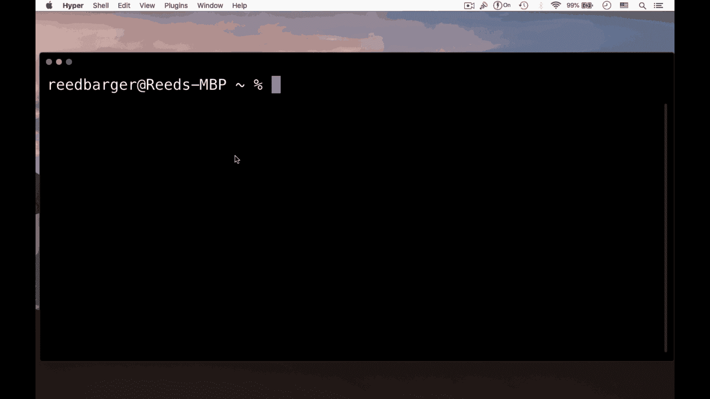
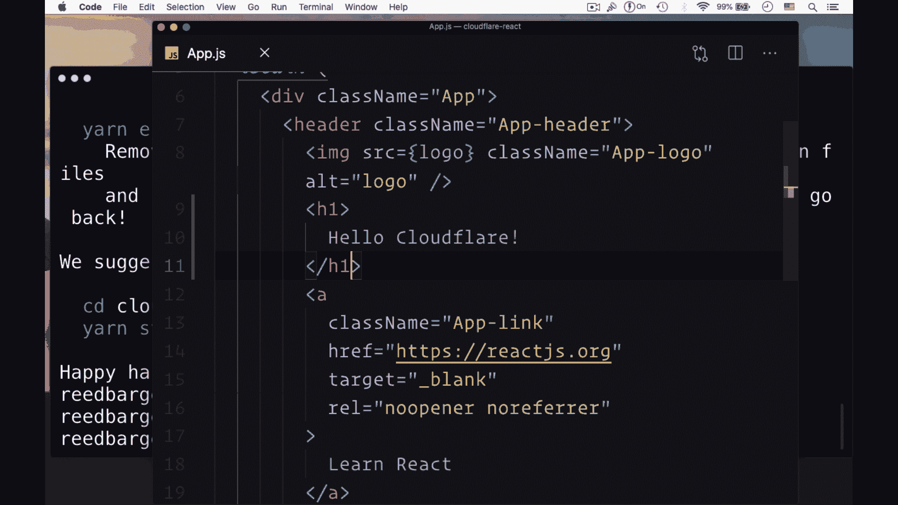
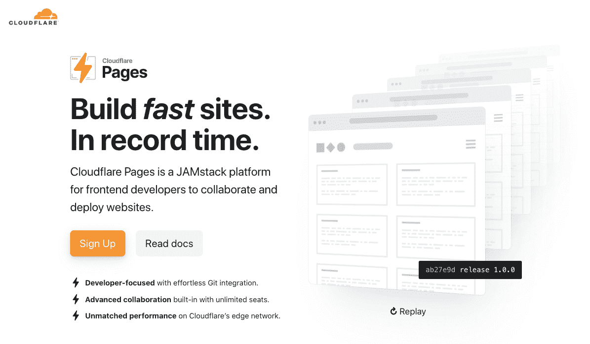
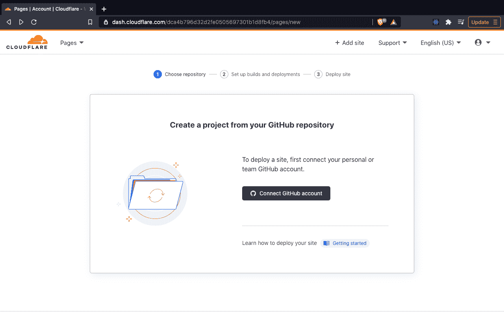
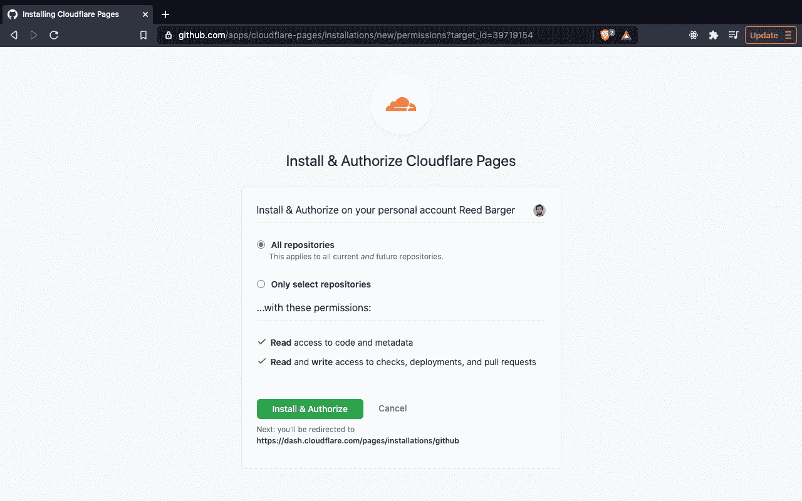
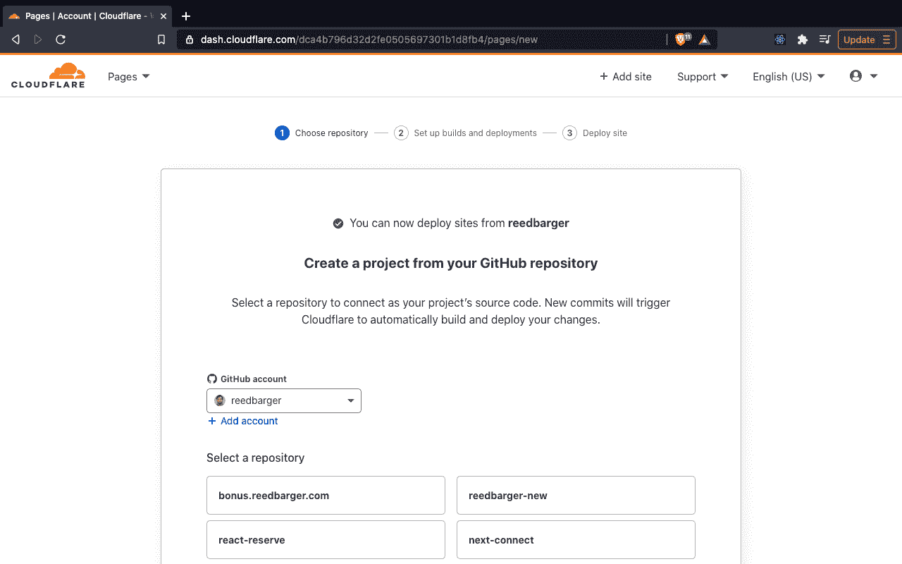
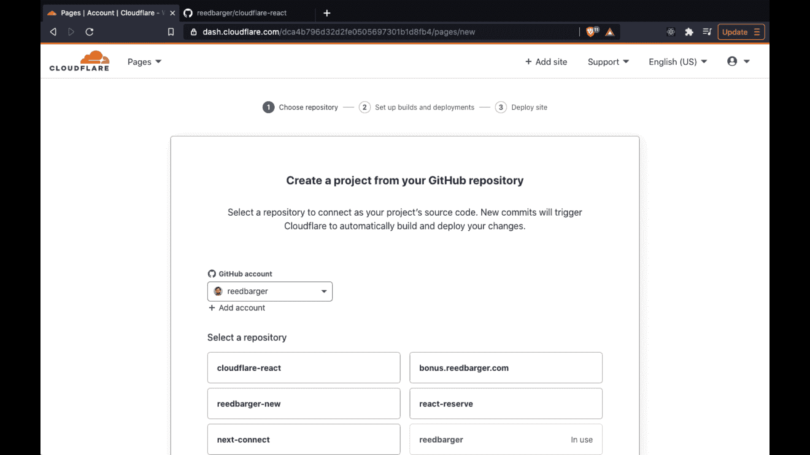

# 如何使用 Cloudflare 页面自动部署 React 应用

> 原文：<https://www.freecodecamp.org/news/how-to-auto-deploy-your-react-apps-with-cloudflare-pages/>

在本文中，我将向您展示如何借助 Cloudflare pages 快速部署任何 React 应用程序。

您不仅会看到如何使用几个工具在几分钟内构建和部署您的应用程序，还会看到如何通过 GitHub 帐户自动部署您未来所做的任何更改。

> 想从开始到部署就开发出令人惊叹的全栈 React 应用吗？查看 [**反应训练营**](https://reactbootcamp.com) 。

## 如何开始

要开始，您需要以下工具:

1.  软件包管理器 npm 和版本控制软件 Git
2.  您自己的(免费)GitHub 帐户和 Cloudflare 帐户

## 创建我们的 React 项目

要部署 React 应用程序，我们首先需要创建一个。

让我们在 Create React app 的帮助下，在电脑上搭建一个 React App。为此，我们可以将其命名为“cloudflare-react”:

```
npx create-react-app cloudflare-react
```



## 创建我们的 Github 资源库

一旦我们的项目成功创建，让我们继续为它创建一个 GitHub 存储库。

我们使用 GitHub 来保持我们个人项目的在线、易于管理的记录。GitHub 还允许其他用户通过 pull 请求对我们的代码进行改进。

Cloudflare 使用 GitHub 来跟踪我们所有的代码，并在我们做出更改时进行跟踪。

为了跟踪我们新的 React 应用程序，我们通过访问[github.com/new](https://github.com/new)创建了一个新的 GitHub 存储库。

接下来，我们可以简单地添加所有文件，并通过一条消息提交它们，这条消息说明我们正在做什么:

```
git add .
git commit -m "Deploy to Cloudflare Pages"
```



接下来，我们需要添加适当的 Git remote，用于将提交的代码推送到新的 GitHub repo。

GitHub 会告诉您需要为新创建的 repo 包含什么命令。它应该是这样的:

```
git remote add origin someurl
```

最后，我们可以简单地运行`git push -u origin master`。

在我们刷新 GitHub repo 页面后，我们应该会看到所有的 React 项目代码都被推送到 GitHub。

这是将应用程序部署到 Cloudflare 页面的第一个主要要求——让 React 应用程序驻留在 GitHub 上。

## 创建 Cloudflare 帐户

接下来，我们去 Cloudflare 部署我们的 React 项目。

如果您还没有免费的 Cloudflare 帐户，您可以前往[pages.cloudflare.com](https://pages.cloudflare.com/)并点击“注册”:



您和大多数其他开发人员对使用 Cloudflare 页面感兴趣的一个主要原因是，Cloudflare 拥有全球 CDN。这允许更快地交付我们部署的应用程序。

Cloudflare 还提供 DNS 管理等资源，如果您希望您的应用程序拥有自己的自定义域，这将非常有用。

## 将 GitHub 链接到 Cloudflare 页面

首次访问 Cloudflare 页面时，系统会提示您从 GitHub 资源库创建项目，因此您需要选择“连接 GitHub 帐户”按钮:



然后，您将被要求安装和授权 Cloudflare 页面。

这一步允许我们选择 Cloudflare 可以访问的内容，即我们是希望授予它访问我们所有存储库的权限，还是仅选择存储库:



如果您想在将来部署多个项目，我建议您选择所有存储库。

因此，Cloudflare 将能够访问我们所做的任何代码和部署，因此它可以部署到 web 上。

## 将我们的 React 项目部署到 Cloudflare 页面

一旦我们授权 Cloudflare 这样做，我们将看到一个屏幕，在这里我们可以从 GitHub 存储库中选择要部署的项目:



在我们的示例中，我们将选择“cloudflare-react”回购，之后我们将点击“开始设置”。

在那里，我们可以选择我们希望 React 应用程序与 Cloudflare 一起使用的项目名称。这个项目名很重要，因为它决定了将要部署到的子域。

由于我们选择了“cloudflare-react”，因此它将被部署到 cloudflare-react.pages.dev:



我们可以选择部署哪个分支，以及构建设置。

请注意，我们真正要做的是选择我们正在使用的框架预设。Cloudflare 为我们的框架提供了一个预设选项—创建 React 应用程序。

当我们选择它时，它将包括任何 Create React App 项目的默认设置:通过运行构建命令“npm run build”来部署项目，并且输出目录(运行此构建命令时 React 代码将构建到的文件夹)被命名为“build”。

对于任何使用 Next.js 或 Gatsby 这样的框架制作的 React 应用程序，还有其他有用的预置。您可以使用 Cloudflare 页面部署几乎任何类型的 React 应用程序。

最后，我们可以点击部署按钮。第一次部署过程大约需要四到五分钟。请耐心等待，但请注意，任何后续部署都将花费更少的时间。

我们确实看到了一些关于正在构建的项目和部署进度的有用日志。如果在这个过程中有错误，我们会在日志中看到它，并得到一些我们需要修复的指示。

然后，要查看我们部署的项目，我们可以点击“继续项目”按钮，点击“访问网站”，我们可以看到我们的应用程序在 URL 上运行:your-project-name.pages.dev。

## 通过自动部署进行更改

虽然在我们将 React 应用程序推送到 GitHub 后，立即将其部署到 web 上是非常容易的，但下一步是对我们的应用程序进行更改并重新部署。

正如您将看到的，这个自动部署(持续集成)功能已经设置好了。

在我的应用程序中，我决定安装 React Router DOM 来添加一个 about 页面。在主页上，我还添加了一个指向“关于”页面的链接:


在我完成了你可以在上面的视频中看到的改变之后，我经历了同样的过程，运行`git add .`、`git commit`和一条关于我所做的改变的消息，然后是`git push`。

这样做之后，如果我们翻回到我们的 Cloudflare 页面控制面板，我们可以看到 Cloudflare 立即选择了这个新部署，因为它链接到我们的 GitHub 帐户，可以查看对我们的 repo 进行的任何部署或拉取请求。

因此，它会根据我们所做的更改立即重新部署我们的应用程序。随着部署的进行，我们可以点击“View build ”,并可以看到有关此部署的特定信息以及任何日志。

正如您将看到的，初始部署后所做的任何更改花费的时间都要少得多(成功完成部署总共只需要大约一分钟)。您还会看到，在我们的 URL 开头，它有自己独特的部署散列。这允许我们唯一地引用每个部署。

如果我们删除哈希，我们会看到我们所做的更改也被部署到我们选择的项目名称:cloudflare-react.pages.dev。

## 结论

我希望本教程向您展示开始使用新的 Cloudflare 页面是多么容易。您现在就可以开始向 it 部门部署 React 应用程序，以利用他们的全球 CDN 和 Cloudflare 提供的所有附加功能。

Cloudflare pages 仍然很新，但它已经提供了许多值得一试的工具。我强烈推荐它作为你想与世界分享的下一个 React 应用的部署服务。

## 喜欢这篇文章吗？加入 React 训练营

**[React 训练营](http://bit.ly/join-react-bootcamp)** 将你应该知道的关于学习 React 的一切打包成一个全面的包，包括视频、备忘单，外加特殊奖励。

获得数百名开发人员已经使用的内部信息，以掌握 React、找到他们梦想的工作并掌控他们的未来:

[](http://bit.ly/join-react-bootcamp) 
*打开时点击此处通知*