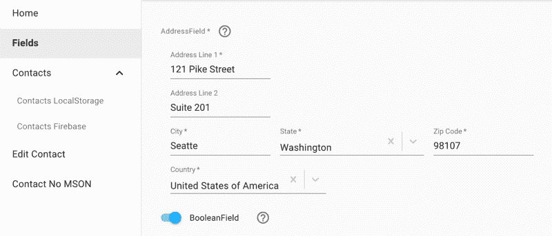

# 如何用 MSON 在 React 和 Material-UI 中自动生成表单

> 原文：<https://www.freecodecamp.org/news/how-to-autogenerate-forms-in-react-and-material-ui-with-mson-5771b1b7e739/>

杰夫·考克斯

# 如何用 MSON 在 React 和 Material-UI 中自动生成表单

[https://redgeoff.github.io/mson-react](https://redgeoff.github.io/mson-react/)

实现好的表单真的很浪费时间。只需几行 JSON 代码，您就可以使用 [MSON](https://github.com/redgeoff/mson) 来生成执行实时验证并具有一致布局的表单。并且， [MSON](https://github.com/redgeoff/mson) 提供了一堆很酷的东西，比如日期采摘器、掩蔽字段和字段集合。

**免责声明**:这篇文章是面向那些希望将 Material-UI 与 React 结合使用的人的。MSON 的未来版本将支持其他渲染层。

#### MSON 到底是什么？

MSON 是一种声明性语言，具有面向对象语言的能力。MSON 编译器允许你从 JSON 生成应用程序。MSON 的最终目标是让任何人都可以可视化地开发软件。你也可以使用 MSON 的作品来加速你的表单开发。

### 用 MSON 生成的基本形式

只需在 JSON 中声明您的表单。然后让 MSON 编译器和 UI 渲染层自动生成您的 UI:

您是否尝试过提交表单时不填写任何值？你注意到实时验证是如何自动嵌入的吗？

现在，让我们仔细看看发生了什么。第一个代码块包含一个 JSON 定义，它描述了表单中的字段:

这段代码将下列字段添加到您的表单中:

1.  *文本*组件显示一些[降价](https://github.com/adam-p/markdown-here/wiki/Markdown-Cheatsheet)
2.  *person name 字段*用于获取一个人的名字和姓氏
3.  *日期字段*允许用户使用灵活的日期选择器选择日期
4.  *PhoneField* 使用输入掩码和国家代码来指导用户输入电话号码
5.  *提交字段*包含一个*发送*图标，允许用户通过点击或按回车键提交表单

现在，让我们看看呈现组件和处理提交事件的代码:

就是这样！？没错。 [mson-react](https://github.com/redgeoff/mson-react) 层**自动**知道如何呈现表单组件。它使用[发布/订阅](https://en.wikipedia.org/wiki/Publish%E2%80%93subscribe_pattern)和[纯组件](https://reactjs.org/docs/react-api.html#reactpurecomponent)来保持渲染最新。

当没有验证错误并且用户单击 submit 按钮时，会发出一个名称与按钮名称相同的事件。在我们的例子中，这个事件被称为*提交。*因此，我们可以使用 *onSubmit* 属性定义一个处理程序。为了简单起见，我们只提醒用户输入的值。通常你想做一些事情，比如联系一个 API，重定向等等…

### 基本表格 2

现在，让我们通过一个不同的例子来更深入地了解 CRUD:

您可能注意到的第一件事是定义中的[验证器](https://github.com/redgeoff/mson#validators):

每个字段都有一组默认的[验证器](https://github.com/redgeoff/mson#validators)，例如*电子邮件字段*确保电子邮件地址的格式有效。您还可以为特定的字段甚至整个表单扩展这些验证器。例如，您可以阻止用户输入【nope@example.com】**。**

*接下来，让我们看一下在安装组件时加载初始值的代码:*

*这段代码可以很容易地被从某个 API 异步检索值的代码所替代。*

*最后，我们使用一个更复杂的事件监听器来处理提交动作。在现实世界的应用程序中，您可能希望向 API 发送保存数据的请求。您将收到来自该 API 的响应。如果您收到错误消息，例如电子邮件地址已被使用，您可以向用户显示此错误消息:*

### *[现场演示](https://redgeoff.github.io/mson-react/)*

*这篇文章只涉及到你可以使用 [MSON](https://github.com/redgeoff/mson) 做的一小部分事情。因为 [MSON](https://github.com/redgeoff/mson) 是一种全功能语言，你可以声明所有类型的酷组件。如果你有兴趣看更多的现场例子，请查看[现场演示](https://redgeoff.github.io/mson-react)。*

*

[https://redgeoff.github.io/mson-react](https://redgeoff.github.io/mson-react/)* 

### *包起来！*

*如果您正在使用 React 和 Material-UI，您可以通过从 JSON 自动生成表单来加速应用程序开发。如果你需要快速启动一个应用程序，并且不想担心从零开始构建一个 UI，这可能特别有用。*

*如果你喜欢这篇文章，请给它一两个掌声。快乐[自动生成](https://github.com/redgeoff/mson)！*

### *关于作者*

*杰夫·考克斯是 MSON 的创造者，这是一种新的声明式编程语言，它将允许任何人可视化地开发软件。在过去 15 年的大部分时间里，他一直是个体经营者。他喜欢承担雄心勃勃但令妻子抓狂的项目，如[创建数据库](https://github.com/delta-db/deltadb)和[分布式数据同步系统](https://github.com/redgeoff/spiegel)。你可以通过 [@redgeoff7](https://twitter.com/redgeoff7) 或者 [github](https://github.com/redgeoff) 联系到他。*