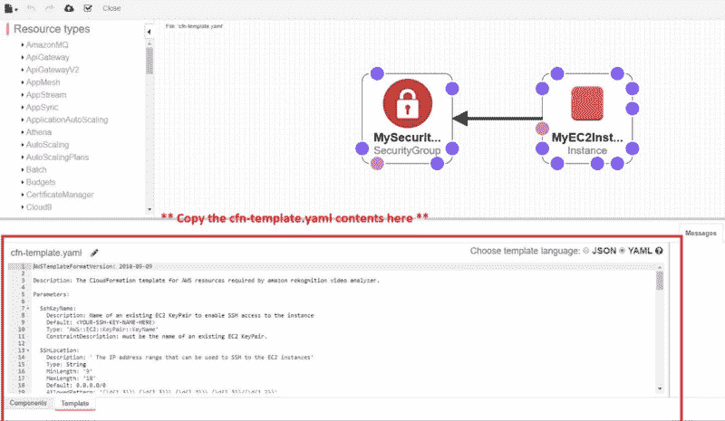
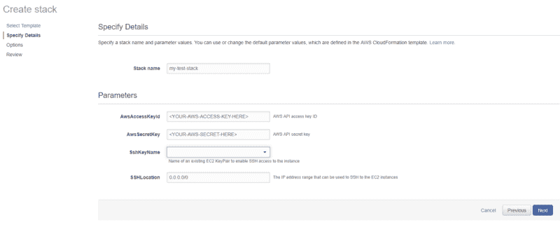
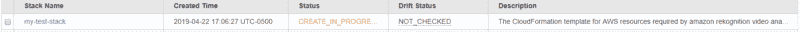

# 如何使用 CloudFormation 在 AWS EC2 上自动安装 Anaconda

> 原文：<https://www.freecodecamp.org/news/how-to-automate-installation-of-anaconda-on-aws-ec2-instances-e9db8aa0570d/>

丹尼尔·巴克

# 如何使用 CloudFormation 在 AWS EC2 上自动安装 Anaconda


#### **TL；博士**

您是否正在努力在 AWS (Amazon Web Services) EC2 实例上自动安装 Anaconda，并为您的项目安装必要的 Python 包？我是——所以我写了一个简单的 bash 脚本来处理它。

*继续阅读快速教程或查看包含脚本和 CloudFormation 模板的 [Github repo](https://github.com/dcbark01/AnacondaInstallEC2) 。*

出于某种我不明白的原因，亚马逊坚持在他们的标准亚马逊 Linux 2 EC2 实例上使用 Python 2。当然，在我最近参与的一个项目中，我需要 Python3。一如往常，虚拟环境的救援。

通常情况下，我只需安装 Anaconda 就可以了。然而，我的项目也大量使用 AWS 的 CloudFormation 工具从模板中自动部署资源栈，所以我需要一种自动化安装的方法。我还希望新创建的 EC2 实例安装 AWS CLI 和 Boto3 Python 包。

幸运的是，AWS 在提供可以运行用户定义的 bash 命令和 shell 脚本的 EC2 实例时提供了一个“UserData”键。

通常情况下，一些我认为很简单的事情最终会花费几个小时，但是希望这个脚本可以帮你解决同样的问题。这里有一个关于如何使用脚本和模板的快速教程，您可以通过以下链接获得:

[** Github 回购链接此处**](https://github.com/dcbark01/AnacondaInstallEC2)

#### **第一步:在 AWS 控制台打开 CloudFormation 模板**

从上面的 repo 链接获取模板文件，并在 CloudFormation designer 中打开它。



点击左上角的“创建堆栈”,输入必要的参数(您的 AWS API 密钥/密码、SSH 密钥名称等)。)



单击“下一步”完成其余提示，然后创建堆栈。您应该会看到如下所示的“创建进度”消息…



…然后在完成时执行“CREATE_COMPLETE”(这可能需要相当长的时间，通常需要 10 分钟，Anaconda 是一个相当大的安装量):


#### **步骤 2: SSH 到您的新实例中以验证安装**

使用您最喜欢的 SSH 客户机，登录到您的新实例。您应该能够通过键入以下命令快速检查 Anaconda 是否成功安装:

```
conda activate python3
```

验证 SSH 客户端上的提示是否更改为显示“python3”激活处于活动状态。此外，您可以通过键入以下命令来验证 AWS CLI 是否已正确安装:

```
cd ~/.awsls
```

您应该会看到在该目录中创建的“凭据”文件。

如果你符合以上检查，你应该完成了。祝你余下的项目好运！