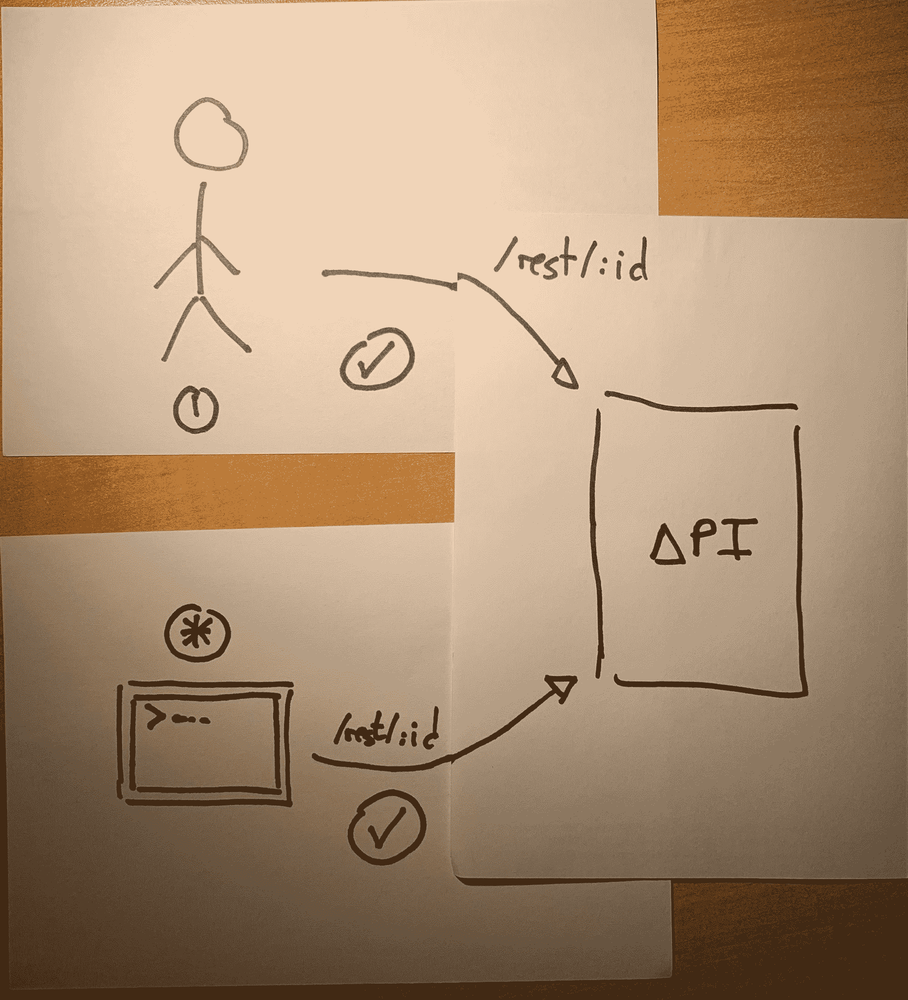
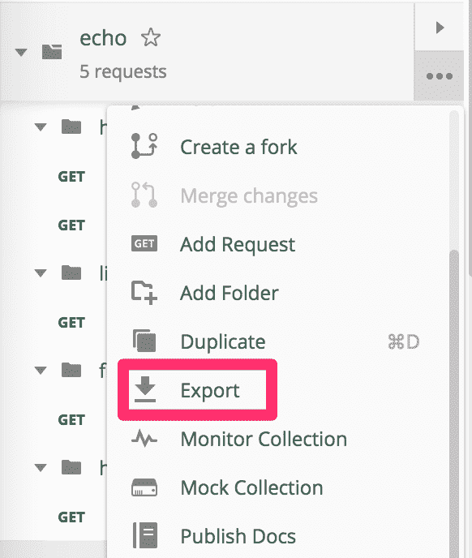
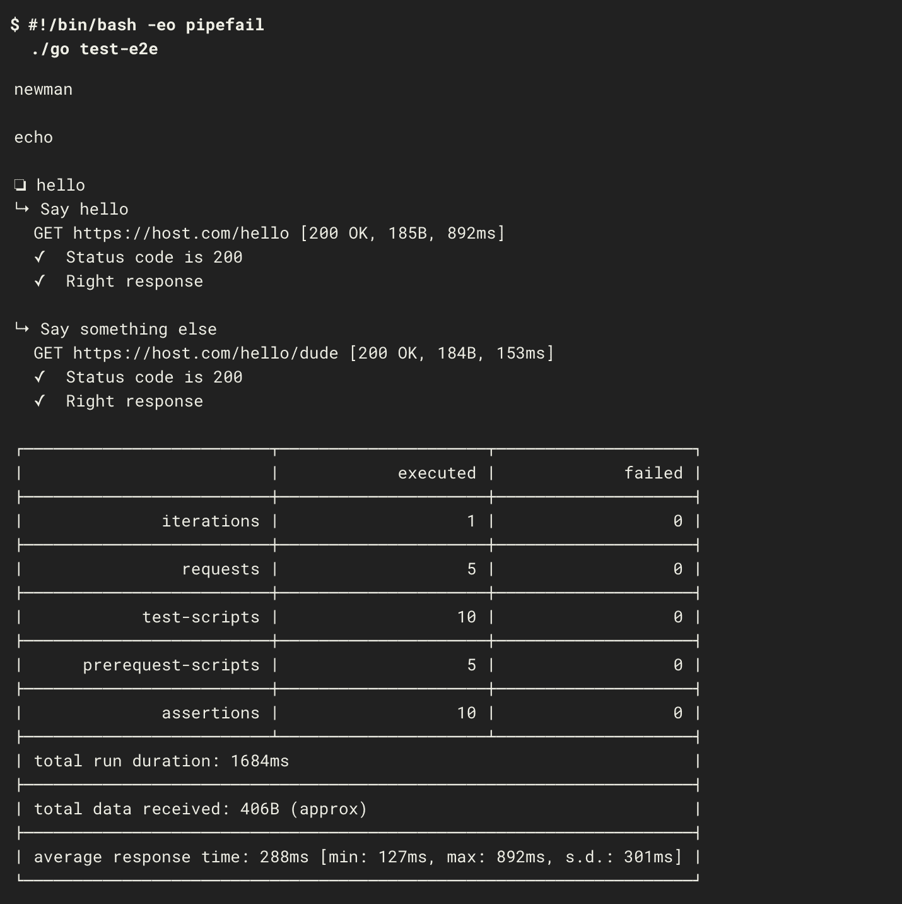

# 如何用 Postman 和 Newman 在 CI 环境中自动化 REST API 端到端测试

> 原文：<https://www.freecodecamp.org/news/how-to-automate-rest-api-end-to-end-tests/>

[Postman](https://learning.getpostman.com/) 是探索 REST APIs 的绝佳工具。您可以建立请求，并尝试获得快速反馈。然后，您可以将它们作为集合持久化，以确保知识不会丢失。

Postman 的 CLI 版本 Newman ，允许您将它带到下一个级别，并将一个集合转换成一套自动化的端到端测试。该套件将在您选择的 CI 工具中运行。在本文中，我将探索这样做的好处，并向您展示如何设置它。



## 什么是 API 上下文中的端到端测试？

测试术语是一件棘手的事情。记住[测试金字塔](https://martinfowler.com/bliki/TestPyramid.html)，我们可以把它们想象成非常高水平的测试。这些测试确认一个特定的 REST API 如预期的那样工作，将内部视为一个黑盒。我们在这个过程中不涉及任何 UI，这有助于减少碎片。


*by 极客&戳/ [CC BY](https://creativecommons.org/licenses/by/3.0/)*

古怪的测试非常令人讨厌，每个开发人员在某个时候都经历过。我们可以通过使用较低层次的测试来减轻问题，而不是用头撞墙来试图修复不可修复的东西。

## 我为什么要做这些测试？

我想介绍两种不同的场景:

首先是测试您自己的 REST APIs。这些测试增加了一层额外的信心。当然，您正在使用不同测试(单元、集成、功能等)的健康混合。端到端测试可以最终确认一切正常。

第二种情况是测试你无法控制的 API。在我最近的项目中，我们消耗的大部分数据来自其他团队提供的 API。不止一次，我花了半天时间调试我的应用程序中的一个错误，却发现一个下游 API 一直被破解。自动化测试涵盖了集成，并有助于隔离问题。

### 活文档

定期执行的测试集合是 API 的最佳文档。你最近在公司的维基上搜索过什么吗？如果你发现了什么，你应该高兴。它可能是不完整的。或者完全错了。有趣的时光。

### 监视

在这两种情况下，这些测试都可以从构建过程中的一个网关变成一个主动的监控工具。通过不断地运行它们，您可以确保 API 仍然如您所期望的那样运行。否则，将会发出正确的警报。你不想在顾客抱怨的时候才意识到出了问题。

### 为什么不使用消费者驱动的契约测试呢？

很好的问题，如果我可以这么说的话。CDC 是确保 API 符合客户期望的极好方法。如果您能够正确地设置它们，它们将几乎完全取代端到端测试。请记住，只要有可能，就继续将测试推到一个较低的水平。

然而，它们并不是在每种情况下都有效。如果你不能同时控制提供者和消费者，你必须依靠另一方。如果他们不履行合同中他们应尽的义务，测试就没有用了。一些团队只是没有能力根据合同连续运行测试。运行您自己的测试可能是您的最佳选择。

无论如何，已经奠定了基本原理，现在是一些**代码**的时候了。

## 创建邮递员收藏

### 该系列

我们正在定义一些调用，这些调用将在我们的 CI 中按顺序执行。每个调用针对 API 执行一个请求。然后，它运行一些测试来检查请求是否成功，同时检查状态代码和主体。

为了创建收藏，我倾向于使用邮差 app。我喜欢将 URL 和参数之类的东西提取到一个[环境](https://learning.getpostman.com/docs/postman/environments_and_globals/manage_environments/)中。那么配置它就变得更容易了，而且您在集合本身中没有任何敏感信息。你的历史是一个[方便的地方开始建立这个集合](https://learning.getpostman.com/docs/postman/collections/creating_collections/#saving-to-a-collection-from-history)。

一旦对集合感到满意，就可以将其导出为 JSON 文件。该文件可以在源代码控制中提交，作为运行测试的管道的基础。有一个专业版和企业版可以帮助管理收藏，我还没有真正尝试过。尽管如此，一个好的知识库足以让它运转起来。



### 运行集合

到目前为止，我们一直使用普通邮递员，没有别的。现在是纽曼大放异彩的时候了。我到底在说什么？我直接引用[官方文件](https://learning.getpostman.com/docs/postman/collection_runs/command_line_integration_with_newman/):

> 纽曼是邮差的命令行收集亚军。它允许您直接从命令行运行和测试 Postman 集合。

很好，我们澄清了这一点！它作为一个 npm 包安装，这可以产生一个简单的`package.json`:

```
{
  "name": "postman-utils",
  "version": "0.0.1",
  "private": true,
  "description": "Postman utilities",
  "scripts": {
    "newman": "node_modules/.bin/newman run"
  },
  "dependencies": {
    "newman": "^4.4.1"
  }
} 
```

如前所述，您不希望在该集合中硬编码变量，如 URL、参数或(但愿不会如此)密码。不灵活，也不安全。相反，我喜欢使用包含所有这些值的配置文件。但是如果我们想要提交那个文件，我们仍然需要想出一个方法来避免把秘密放在那里。我将它用作模板，并在运行时用 envsubst 替换值。配置文件如下所示

```
{
	"id": "425cf4df-d994-4d91-9efb-41eba1ead456",
	"name": "echo",
	"values": [
		{
			"key": "host",
			"value": "${HOST}",
			"enabled": true
		}
	]
} 
```

您可以用一个简单的 bash 脚本对此进行编排。该脚本将变量注入模板，运行 newman，并删除文件以避免泄漏。它与 [gopass](https://hceris.com/storing-passwords-with-gopass/) 配合得非常好，在那里你可以安全地存储你的秘密并通过脚本获取它们。

```
setup-newman() {
  settings=/tmp/settings.json.$
  result=/tmp/variables.json.$

  # shellcheck disable=SC2064
  trap "rm -f \"$settings\" \"$result\"" EXIT
}

run-newman() {
  local service=${1?You need to provide the service to check}

  envsubst < "$service.environment.json.template" > "$settings"

  npx newman run "$service.json" \
      -e "${settings}" \
      --export-environment "${result}"
} 
```

可以用您想要测试的集合来调用该助手。导出的变量将由`envsubst`选择。 [npx](https://www.npmjs.com/package/npx) 让我们在寻找`newman`二进制文件时有了更多的灵活性，以防你不想使用`package.json`，而是在全球范围内安装它。

```
goal_check-service() {
  setup

  export SERVICE_PASSWORD=${SERVICE_PASSWORD:-$(gopass store/service/password)}

  run_newman service
} 
```

### 试验

提出请求只是第一步。记住，我们的目标是构建一个测试套件。我们在 Postman 中有一个方便的测试标签，我们可以用它来编写我们的测试。


我们的测试是用 *JavaScript* 编写的，使用的是 [Chai](https://www.chaijs.com/api/bdd/) 。假设我想测试我的调用是否传递了一个结果列表，我可以这样做:

```
var getResults = function() {
    var jsonData = pm.response.json();
    return jsonData['results'];
};

pm.test("Request was successful", function () {
    pm.response.to.have.status(200);
});

pm.test("There are results", function () {
    pm.expect(getResults().length).to.be.above(0);
}); 
```

更多详情可在[这里](https://blog.getpostman.com/2017/10/25/writing-tests-in-postman/)找到

### 构建流程

集合中的所有调用都按顺序执行。这为我们提供了测试整个流程而不仅仅是单个调用的机会。`/posts`资源的一个这样的流程是:

*   获取所有`posts`的列表
*   获取列表中的第一个`post`
*   更新`post`

我们将构建一套参数化的测试，它将随着时间的推移继续工作，而不仅仅是您第一次运行它。其中一个重要的部分是在请求中修改环境。这是我们在请求之间传递参数的方式。假设我们的第一个请求是成功的，正如我们的测试所证实的。然后，我们将 id 存储在一个变量中，该变量将用于获取特定的实体。

```
// First result in the list
var post = getResults()[0];

// Pass variables to other stages
pm.environment.set("id", post.id) 
```

下一个请求可以使用我们手动设置的任何参数。

#### 基于条件忽略呼叫

流可能还需要一些逻辑来跳过某些请求。假设您有一个通过`POST`创建新实体的请求。您希望有这样的请求，但是您可能不希望在每次提交时都运行它。也许你只是想每天做一次。在这种情况下，我们将基于某个变量跳过测试。

```
// Do not run create request in sequence, unless executeCreate is set to true
if(!pm.environment.get("executeCreate")) {
    postman.setNextRequest('Get other posts')
} 
```

该变量进入配置文件，并被设置为一个通过我们的脚本注入的环境变量，如上面所示。

## 是时候进行一些持续的整合了

此时，您应该有一个在本地运行的集合。运行一次是可以的，但是为什么不在每次提交时都运行一次呢？或者每小时一次，如果你想检查一个你不能控制的 API？

您的 CI 渠道是实现这一目标的绝佳场所。我将使用 [CircleCI](https://circleci.com) 作为我的例子，但是任何 CI 都可以。我在我构建的包含所有必需依赖项的 [docker 镜像](https://cloud.docker.com/repository/docker/sirech/newman-executor)中运行测试。已经有邮递员提供的官方 Docker 图片了。然而，它不包含`envsubst`并且使用旧的 *NodeJS* 版本。

我们在上一步中构建的助手脚本无需在 CircleCI 中做任何更改就可以工作。我们只需要提供所需的秘密[作为变量](https://circleci.com/docs/2.0/env-vars/)。这是工作:

```
 healthcheck:

    docker:
      - image: sirech/newman-executor:12.6

    steps:
      - checkout
      - run: ./go test-e2e 
```

这将生成一个类似如下的报告:



### 替代方案呢？

许多框架都提供了自己的方式来针对正在运行的 API 运行测试。例如，在 [Spring Boot](https://spring.io/projects/spring-boot) 中，你可以使用 [MockMvc](https://docs.spring.io/spring-framework/docs/current/javadoc-api/org/springframework/test/web/servlet/MockMvc.html) 来测试控制器。在我看来，你可以两者都用。可以说，首先是本地测试，然后是顶层的 Postman 测试。

让我们不要忘记好的 ol' [curl](https://curl.haxx.se) 。我有一个巨大的 curl 命令集，我用它来测试我上一个项目所需的 API。然而，随着时间的推移，这种管理变得越来越乏味。如果你想发送复杂的请求，比如证书或 cookies，Postman 使用起来更方便。此外，您可以使用 JavaScript 来代替 bash，这可以使事情更容易阅读和维护。

## 还有什么？

这已经很多了，而这仅仅是个开始。你用 API 做的任何事情都可以自动化。例如，在我之前的项目中，我们有一个运行 [OAuth 流](https://auth0.com/docs/api-auth/which-oauth-flow-to-use)的集合。这为我们提供了一个令牌，我们可以使用它向授权的端点发出请求。

## 以回购为例

这里的是一个 Kotlin 应用程序的存储库，它运行一个 Postman 集合作为 e2e 测试。它可以作为高质量端到端 API 测试的入门工具包。