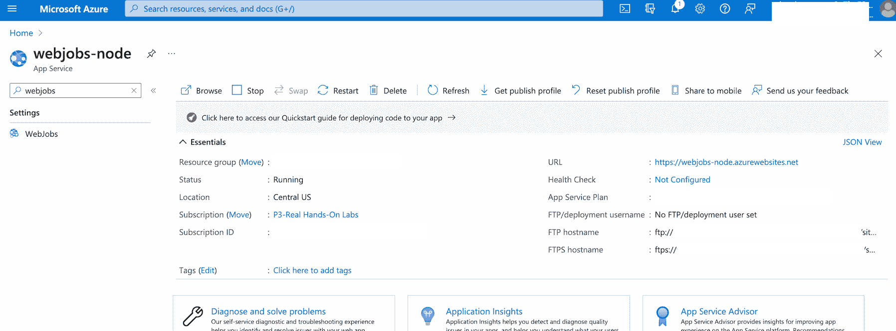
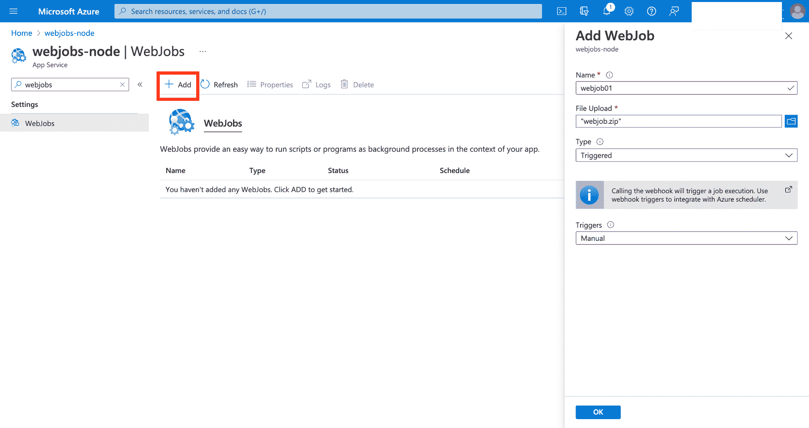
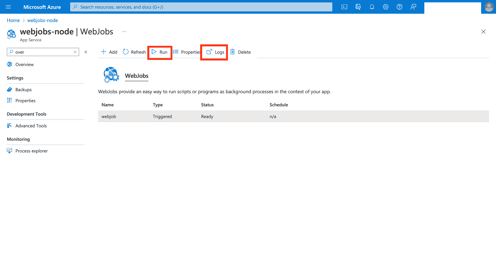
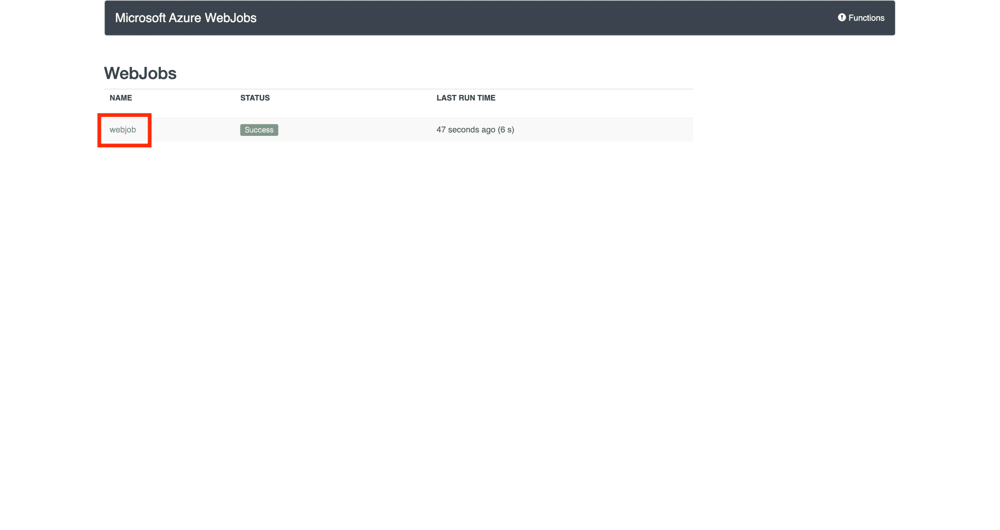
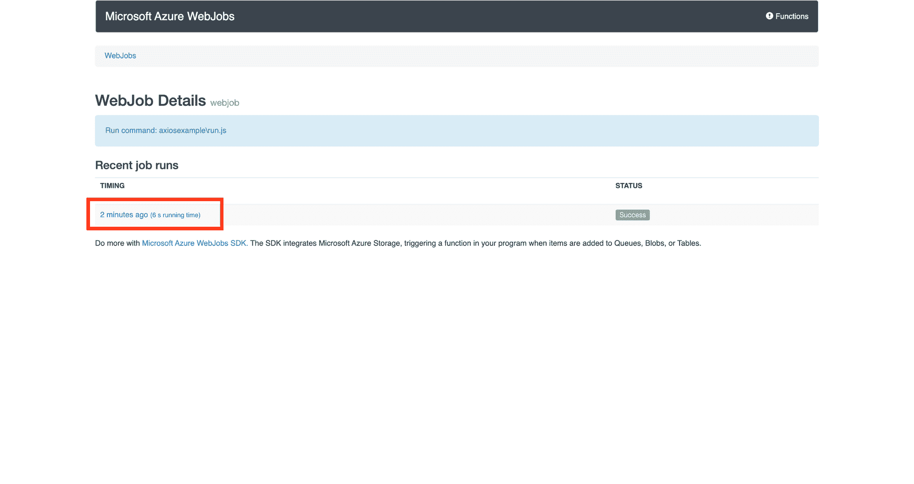
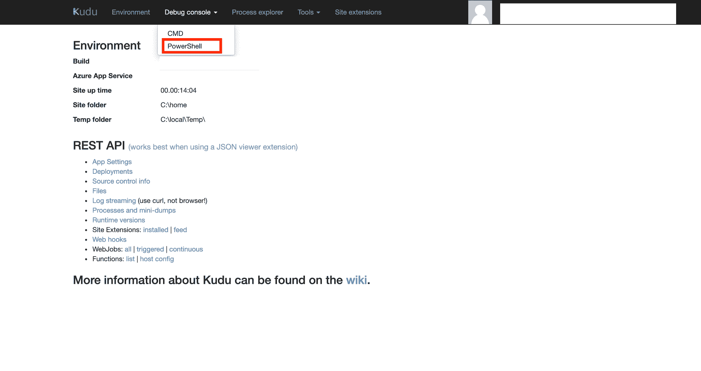
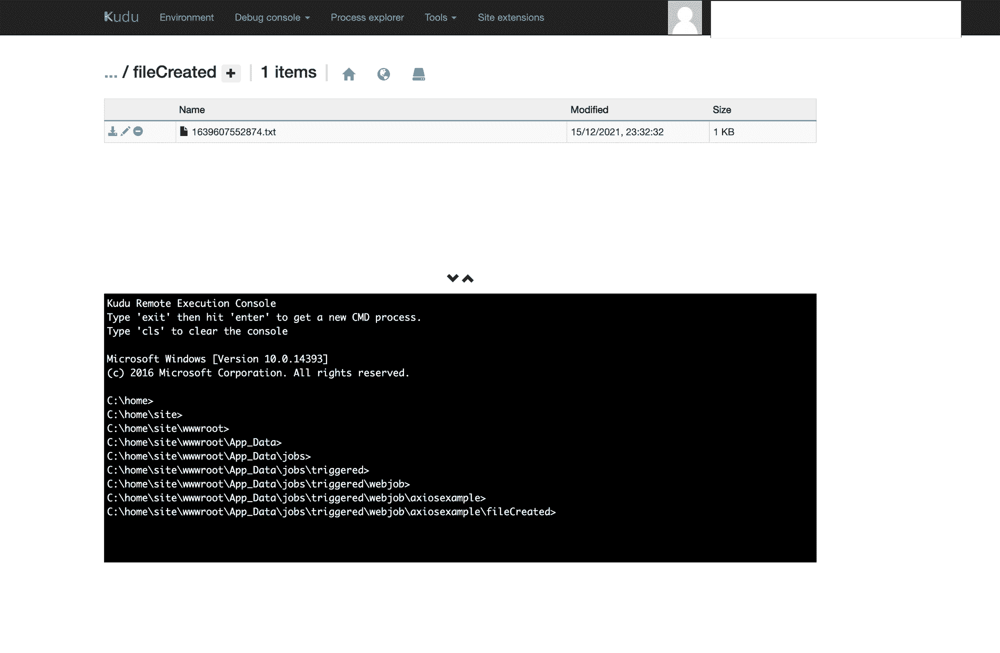

# 如何使用 Azure Webjobs 自动化任务

> 原文：<https://www.freecodecamp.org/news/how-to-automate-tasks-with-azure-webjobs/>

当您在 IT 运营部门工作时，自动化是您工作的关键部分。

您将有各种重复的任务需要处理，并且您不想浪费时间去做一些可以通过脚本来完成的事情。

以下是自动化重复任务的一些好理由:

*   做重复性的工作对你的职业生涯或发展你的技能毫无帮助
*   犯错误的空间很大
*   就像我之前说的，你觉得你在浪费时间。如果你只是要求别人做这些工作，他们也会这样做。

## 什么时候是自动化任务的时候？

嗯，你在职业道路上前进得越多，你就越能理解什么时候可以尝试自动化一个过程。

根据我的个人经验，你需要能够回答这三个问题:

### 1.您多久执行一次这项任务？

记录下上个月你完成这项任务的次数。如果需要每周或更少的时间来完成，您应该尝试自动化它

### 2.这个过程需要多长时间？

试着估计一下你完成任务所需的平均时间。如果等于或者超过 30 分钟，我觉得就值得思考如何自动化。

给你一个概念，假设你每天执行这个任务，需要 30 分钟。也就是每周 2.5 小时，每月 10 小时。假设你每天工作八小时，那么你每个月要花一天多的时间来完成这项任务。说到预算，那可是一大笔钱

### 3.自动化要花多少钱？

你需要一个成本估算:你需要多少小时来开发这个脚本？您是否需要使用任何第三方服务，如库、云服务等等？

如果您认为开发速度快且不贵，您可以考虑继续实施。

## 如何自动化任务

好了，现在让我们看看如何自动化一个简单但频繁的任务。

当您在 IT 运营部门工作时，您需要经常为其他部门生成包含更新信息的报告或文件。假设您被要求生成一个包含特定 GitHub 概要信息的文件。

GitHub 提供了 API，您可以在其中获得关于单个配置文件的信息:

[https://api.github.com/users](https://api.github.com/users)/<用户名>

我们可以使用 Node.js 和 Axios 编写一个快速脚本来调用端点，获取我们需要的信息，并创建一个文本文件来存储在特定的目录中。

这是我们的剧本:

```
const axios = require('axios');
const fs = require('fs');

axios.get('https://api.github.com/users/<USERNAME>')
  .then(response => {
    const file_text = response.data.login + " " + response.data.name
    const nome = Date.now()
    console.log(response.data.login);
    console.log(response.data.name);
    fs.writeFile('./fileCreated/' + nome + '.txt', file_text, err => {
      if (err) {
        console.error(err)
        return
      }
    })

  })
  .catch(error => {
    console.log(error);
  });
```

如您所见，一旦我们调用了端点，我们就将用户名和名称记录到控制台。然后，我们将这些信息打印在一个以时间戳命名的文本文件中，并保存在一个名为“fileCreated”的目录中。

### 如何定期运行脚本

有很多工具可以帮助你在任何时候运行一个脚本。对于本教程，我决定使用 Azure WebJobs。

它是 Azure 的 Pass 解决方案“Web App”中包含的一项服务，它允许您手动或定期运行用世界上最流行的语言编写的脚本，如 Java、Python、.NET，当然还有 NodeJs。

你可以在这里找到完整的列表[。](https://docs.microsoft.com/en-us/azure/app-service/webjobs-create)

### 如何使用 Azure WebJobs

我假设您已经创建了您的 Web 应用程序。想想看，在我写这篇教程的时候，Webjobs 只能在 Windows Web Apps 上使用。

如果你需要帮助入门，我建议你看看微软的这个[教程](https://azure.microsoft.com/en-us/get-started/web-app/)。

在 WebApp 菜单(左侧栏)上，我输入“WebJobs”并点击它来过滤选项:



在 WebJobs 面板上，我点击“添加”来添加我的脚本(我压缩了我的文件及其所有依赖项，并将其命名为“axiosexample”)。然后，

*   我输入了名字
*   我上传了压缩文件
*   我选择了“触发”,因为我不希望这个任务持续执行

在“触发器”选项中，我选择了“手动”,因为我想现在运行它，向您展示本教程的结果。但是您可以通过选择“Scheduled”并指定 CRON 表达式来调度 web 作业。查看微软的这个教程，看看如何写一个 CRON 表达式。

如果您想了解更多关于 CRON 表达式的知识，互联网上有很多关于它的文献。你可以简单地从维基百科[页面](https://en.wikipedia.org/wiki/Cron)开始，查看[关于 freeCodeCamp](https://www.freecodecamp.org/news/cron-jobs-in-linux/) 的教程，然后继续阅读其他有用的内容，如 [Cronitor](https://crontab.guru/) 。

接下来，单击“确定”。



保存后，点击“运行”立即执行任务。然后点击“日志”查看我们网络工作的结果。



进入“日志”页面后，点击 webjobs 获取更多详细信息:



接下来，让我们设置网络工作的“时间”:



我们看到日志消息，就像这样:


现在，通过使用我们的 Web 应用程序中的“Kudu”服务，通过 Powershell 转到您保存文件的目录。

“Kudu”是 Azure 的 Web 应用上提供的一个非常有用的服务，它允许你获得关于 Web 应用本身的许多信息，例如应用设置、运行命令等等。你可以在这里看到完整的列表[。](https://docs.microsoft.com/en-us/azure/app-service/resources-kudu)



您将到达您创建的目录。路径是:

```
\home\site\wwwroot\App_Data\jobs\triggered\webjob\axiosexample\fileCreated
```



一旦你到达文件，只要打开它，这是你应该看到的:


## 包扎

因此，这是一个简单的例子，说明如何用几行 JavaScript 和 Azure Webjobs 简单地自动化一项任务。

看看你周围，看看你发现什么是重复的和耗时的。然后，思考如何将这些动作写入脚本，就这样！

自动化就在你身边！😀不要忘记:你越自动化，你就有越多的时间考虑更多的自动化...随便看看我在 GitHub 上的[回购](https://github.com/mventuri/How-to-Automate-Tasks-with-Azure-Webjobs)。