# 如何使用 Zapier 自动化您的生活和日常任务

> 原文：<https://www.freecodecamp.org/news/how-to-automate-your-life-and-everyday-tasks-with-zapier/>

每天，我们都要完成数百个小任务。就他们自己而言，他们不需要太多时间。但是它们可以累加起来，特别是如果你考虑一整年的时间。

但我们是技术专家，现在是 2020 年。我们如何使用像 Zapier 这样的工具来让机器人为我们做这些事情？

*   [扎皮尔是什么？](#what-is-zapier)
*   我们能用 Zapier Zaps 做什么？
*   Zap 1:和 Zapier 一起收到一条要下雨的短信
*   [Zap 2:用谷歌云打印每周打印一次测试](#zap-2-print-a-test-every-week-with-google-cloud-print)
*   [Zap 3:用 Gmail 粉碎杂志招聘信息](#zap-3-smashing-magazine-job-alerts-with-gmail)

[https://www.youtube.com/embed/12oAIHHEJMw?feature=oembed](https://www.youtube.com/embed/12oAIHHEJMw?feature=oembed)

## 扎皮尔是什么？

Zapier 是一款自动化工具，可以连接您喜爱的所有应用程序，并构建强大的全自动工作流程。无论是自动发送电子邮件，还是确保新的博客文章获得推文，我们都可以去除平凡任务的手动步骤，专注于其他重要的事情。

每次你创建一个新的工作流程，你都在创建一个“Zap”。本质上，这是 Zapier 为您创建的工作流命名的方式。

## 我们能用 Zapier Zaps 做什么？

Zapier 的出色之处在于，每个应用集成都通过 Zapier 将其 API 提供给其他应用集成，从而为您提供大量选项来连接和构建强大的工作流。

特别是，我们将学习如何做一些事情:

*   如果要下雨，每天早上发短信
*   设置每周打印作业以保持墨水新鲜
*   在 Smashing Magazine 的工作论坛上接收新工作的电子邮件

虽然这些任务都很小，但它们最终会节省你很多时间。如果你有创意，你可以在这些工作流程的基础上定制更多。

## 开始使用 Zapier 帐户

在我们开始设置工作流之前，您需要一个帐户。

注册 Zapier 是免费的，你可以免费使用 5 次 Zaps，所以我们不用担心费用。

现在让我们开始吧。

## Zap 1:如果要下雨，就和 Zapier 发短信

为了了解这是如何工作的，我们先从一些简单的事情开始。我们将设置一个 Zap，如果天气预报有雨，它会给我们发短信。

要开始，当你登录到你的帐户时，点击页面左上角的大 **Make a Zap** 按钮。

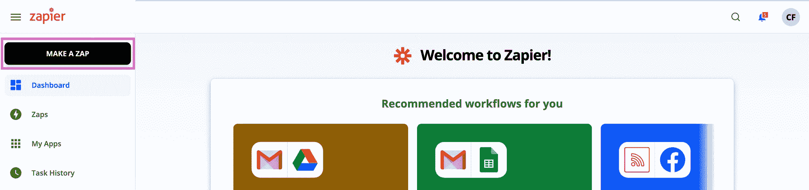

Making a new Zap

在这里，Zapier 想知道我们要连接的第一个 app。因为我们要将我们的 Zap 建立在天气的基础上，搜索“天气”并选择 Zapier 的**天气。**

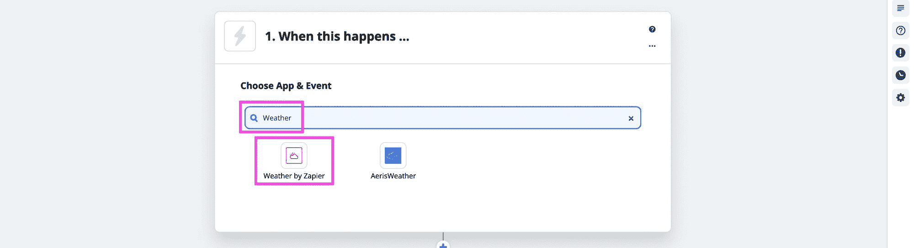

Selecting the Weather by Zapier integration

然后它会让你选择一个**触发事件**，你可以选择“今天会下雨吗？”，然后可以点击**继续**按钮。

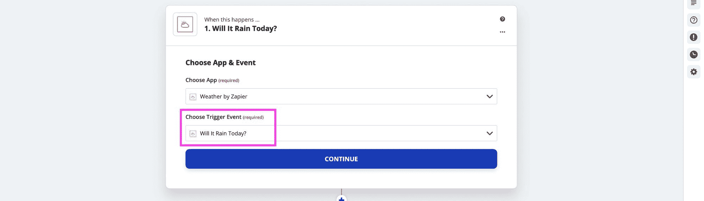

Choosing the Will it Rain Today? event

当选择天气作为一个事件时，它需要一点点信息来给我们一个个性化的预测。特别是，它需要您的纬度和经度，我们可以使用[latlong.net](https://www.latlong.net/)来查找。

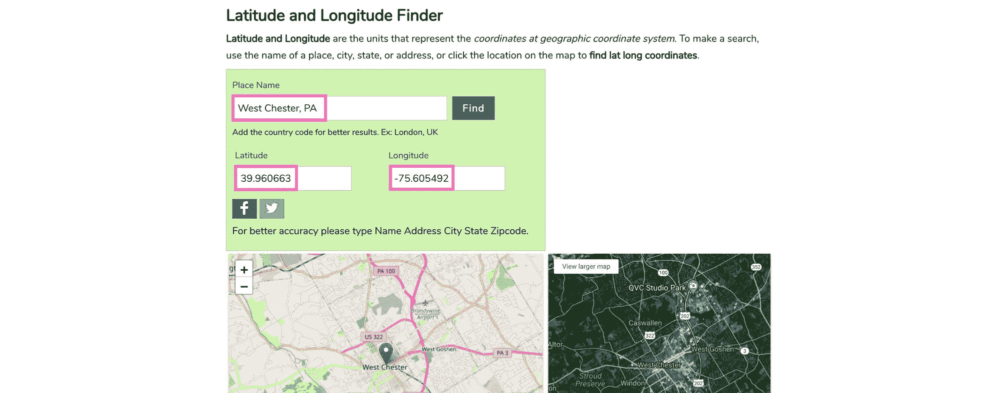

Finding latitude and longitude with latlong.net

然后你可以在 Zapier 的**定制预测**界面中输入你的**纬度**和**经度**，选择你的**单位**，默认为**华氏**，然后点击大**继续**按钮。

Configuring forecast with latitude and longitude

此时，您可以点击**测试触发器**，这只是为了确保它正在工作，并再次点击**继续**。

现在我们要告诉 Zapier，一旦它知道要下雨了，该如何处理这些信息。

在“这样做……”面板，搜索“sms”并选择 Zapier 的 **SMS。**

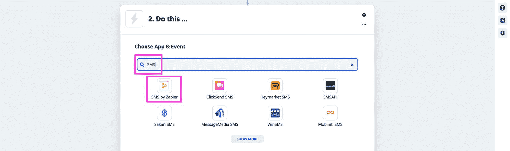

Selecting SMS by Zapier

我们将把**应用**和**事件**保留为默认设置，所以下一个屏幕你只需点击**继续**。

SMS App and Event

现在，要让 Zapier 给你发短信，它需要验证你的电话号码是属于你的，或者该电话号码是有意注册这些短信的。为此，它会向您发送一个需要您输入的一次性 PIN。

所以点击**登录 Zapier** 的短信，会打开一个弹出窗口。

在这里，输入您的电话号码，并选择短信或电话作为验证方法，在这一点上，它会与您联系一个 PIN。

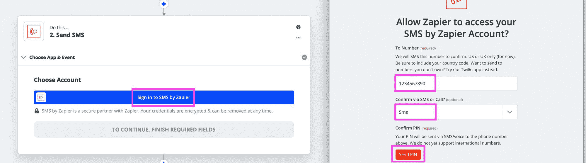

Sign in to SMS by Zapier and send a PIN

使用该 PIN 码，将其输入字段，并点击**继续**。

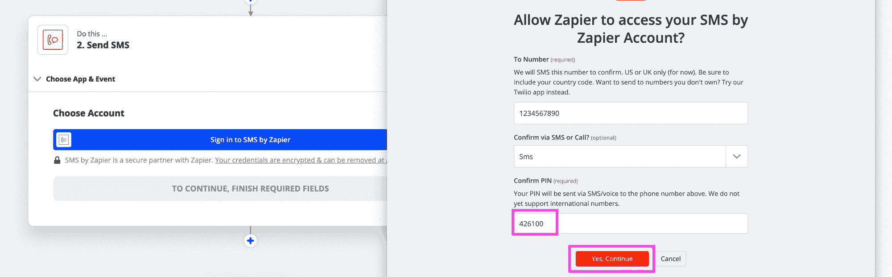

Entering the SMS verification PING

此时，窗口将关闭，并将您移回原始流程。在这里，再次点击**继续**。

现在我们可以定制我们收到的文本。

在 **From Number** 字段，Zapier 给出了一串你可以使用的电话号码。你可以选择一个号码总是发送，你可以设置为联系人，这样你就知道它是 Zapier，或者你可以选择**随机**，每次都会使用一个随机号码。

然后点击**消息**内部，会弹出一些选项。如果要下雨，我想知道所有可能的情况，包括概率、最大温度和总结，所以我们可以选择所有或我们想要的，然后再次点击**继续**。

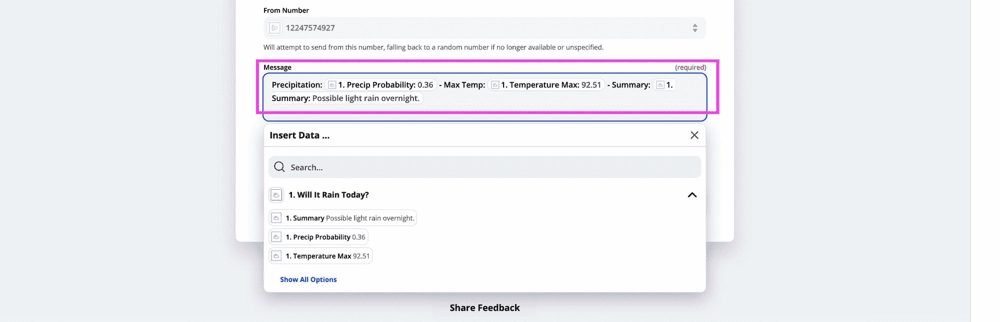

Configuring Weather message

最后我们要测试我们的 Zap 是否有效。至此，一切都应该配置好了，所以单击**测试&审查**按钮，您应该会收到一个样本文本！

注意:如果你选择一个单一的发件人号码，你收到短信的频率可能会受到限制，所以如果你没有马上收到，这可能就是原因。设置随机有助于防止该问题，但数量并不一致。

一旦你对配置满意，你可以点击**打开 Zap** 。

Turning on the SMS Zap

如果天气预报有雨，你将在早上收到短信！

## Zap 2:用谷歌云打印每周打印一份测试

这听起来并不令人兴奋，但是你有没有经历过很长一段时间你没有打印东西，结果只有干涸的打印头，或者更糟的是，现在无法挽救的打印机？

我们可以通过简单地运行每周打印作业来避免这种情况，使我们的打印机墨水保持新鲜。

为此，我们将使用[谷歌云打印](https://www.google.com/cloudprint/learn/)。要做到这一点，你需要在你的谷歌账户中进行配置。

让我们创建一个新的 Zap，这次是为了我们的“当这发生时…”搜索并选择 Zapier 的**时间表。**

Selecting Schedule by Zapier

然后我们可以每周选择**的一个**触发事件**，点击**继续**。**

Setting Trigger Event as Every Week

接下来，您可以选择一周中的**天**和一天中的**时间**来打印。我个人在新的一周开始之前，每周星期天晚上 8 点运行这个任务。配置完成后，点击**继续**。

Configuring Zapier schedule

此时，我们可以点击**测试**触发器，就像之前一样确保它正常工作，然后我们可以点击**继续**。

现在，对于我们的“这样做…”我们想要打印，所以搜索并选择**谷歌云打印**。

Selecting Google Cloud Print

对于该动作，选择**提交打印作业**。

Setting Submit Print Job as Action Event

此时，您需要登录 Google Cloud Print。这将打开一个窗口，让你通过 Google 登录，这样 Zapier 就可以与服务接口。

一旦连接，点击**继续**。

现在我们可以配置打印作业了。在这里，我们想要定义我们打印的内容。

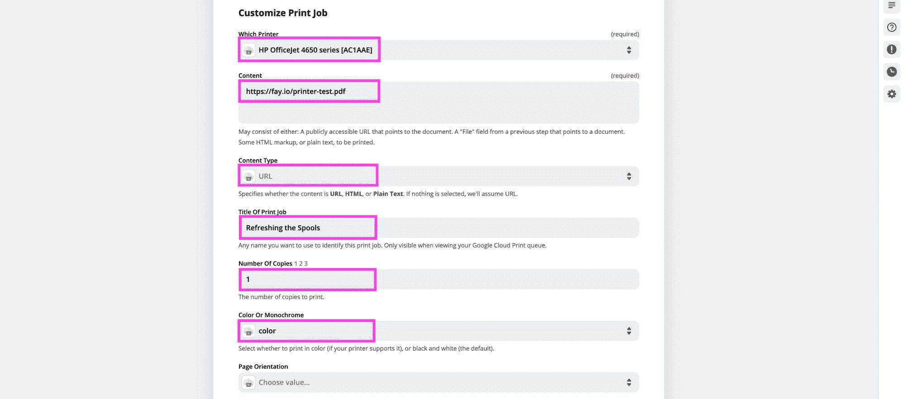

Configuring Print Job in Zapier

在上图中，我们正在配置:

*   **哪台打印机:**我们要打印的打印机连接到谷歌云打印
*   **内容:**这可以是文档的 URL、HTML 或纯文本。我使用了一个 URL，这是一个我制作的简单的测试页面，里面有一些颜色
*   **内容类型:**您需要根据您在内容中的设置来设置。如果你像我一样设置一个 URL，它应该是 URL
*   **打印作业的标题:**作业的名称，以便在打印日志中查看
*   **份数:**大概就是想要 1 份，这样不浪费墨水和纸张
*   **彩色或单色:**如果你想要彩色，你需要明确地设置它。这个想法是刷新所有的墨盒，所以只打印黑色不会有助于彩色墨水，所以在我的情况下，我选择彩色

其余的字段是可选的，可以根据自己的喜好随意定制。

根据我们的配置设置，单击**继续**，与之前类似，我们可以单击**测试**来查看我们的打印工作，如果我们满意，我们可以单击**打开 Zap** ！

Test print from Zapier print job

*如果你想用同样的文档，可以在这里找到:[https://fay.io/printer-test.pdf](https://fay.io/printer-test.pdf)*

## Zap 3:用 Gmail 粉碎杂志招聘信息

如果我们在找工作，每天(或者每小时，我说的对吗)都得浏览每一个求职公告板是一件痛苦的事情。).但是如果工作委员会支持的话，我们可以自动完成这个过程。

幸运的是，像 Smashing Magazine 这样的求职网站和许多其他网站都提供 RSS 订阅源，我们可以直接连接到 Zapier，以便在发布新工作时自动接收电子邮件。

首先，让我们创建一个新的 Zap，这一次，搜索 RSS 并选择 Zapier 的 **RSS。**

Selecting RSS by Zapier

对于我们的**触发事件**，选择**Feed**中的新项目，然后点击**继续**。

Setting New Item in Feed as Trigger Event

此时，我们希望输入一个提要 URL。这将是网站提供的 XML RSS 源的 URL。对于 Smashing Magazine，您可以在这里找到它:

[https://www.smashingmagazine.com/jobs/feed](https://www.smashingmagazine.com/jobs/feed)

因此，将上面 URL 输入到**提要 URL** (您可以将**用户名**和**密码**留空)，并保留**为**选择的不同 GUID** 来触发新的提要条目**。然后点击**继续**。

Setting RSS Feed URL

和往常一样，现在你可以测试触发器，以确保它的工作。如果 RSS 提要是有效的，这将是平滑的，否则您可能会看到一个错误。以上网址应该有效！

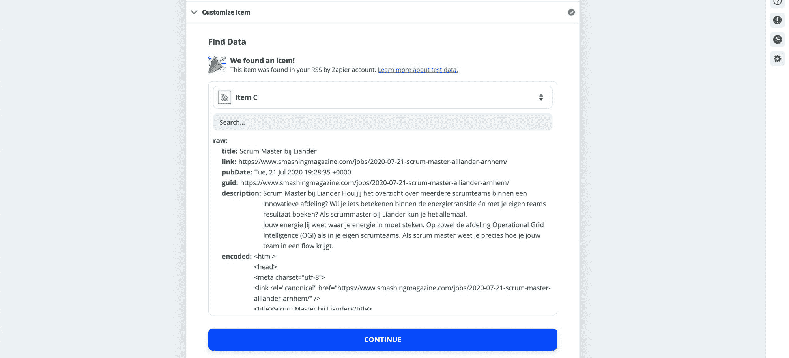

Testing the RSS feed

接下来，我们需要选择如何处理新项目。因为我们希望通过电子邮件发送，我们可以选择我们的电子邮件服务，在我的例子中是 Gmail。

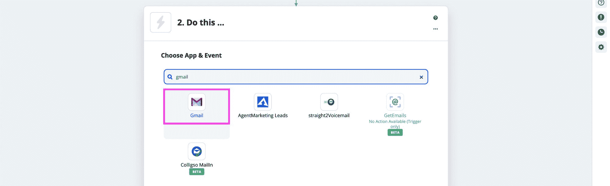

Selecting Gmail in Zapier

对于我们的操作，我们希望**发送电子邮件**。

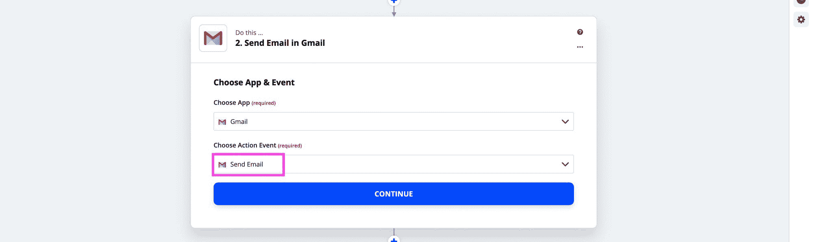

Setting Action Event as Send Email

接下来，您需要登录您的帐户，类似于我们对 Google Cloud Print 所做的操作。这应该是您使用 Gmail 的 Google 帐户。

Sign in to Gmail

现在，当我们自定义电子邮件时，我们希望包括以下内容:

*   **收件人:**无论您想将这些邮件发送到哪里，都可能是您登录 Gmail 时使用的帐户
*   **发件人:**选择您的 Gmail 帐户
*   **From Name:** 可以是你认识的任何东西，比如我将使用 Colbybot
*   主题:可以是你喜欢的任何东西，但是一个有用的主意可以是“新工作提醒:”然后从下拉列表中选择标题
*   **体型:**可以素颜离开
*   **Body:** 我建议包含所有你觉得有用的标记，包括标题、描述和链接

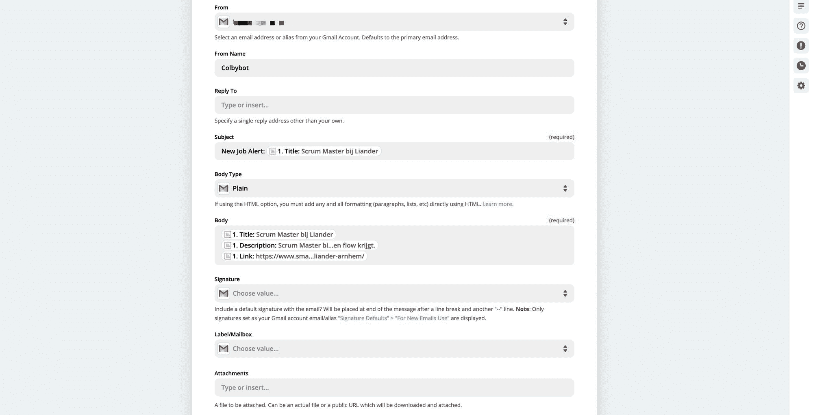

Configuring job notification email

完成配置后，您可以点击继续。然后，和之前一样，点击**测试&复习**，你应该会收到你的测试邮件。

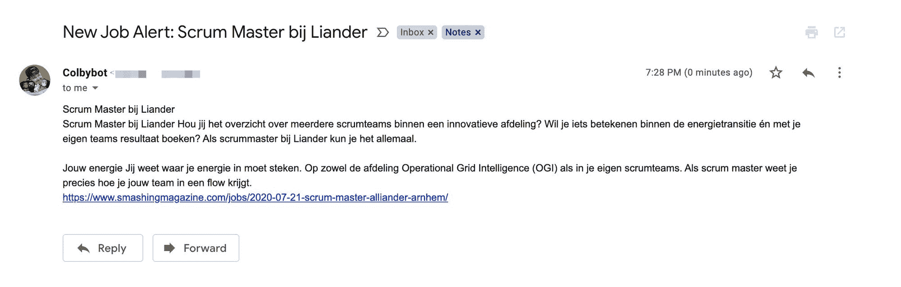

Test job alert email

最后，如果你对配置满意，打开 Zap，享受你的求职吧！

## 你还能做什么？

### 更多想法

以下是让你朝着正确方向前进的更多方法:

*   **向 Slack 发布推文:**每当一个帐户或帐户列表中的某人发布推文时，将该推文发布到 Slack
*   **向吉拉提交 Github bug:**每当有人给 Github 问题贴上“bug”标签时，就在吉拉创建一个包含该问题详细信息的新标签
*   **发布 RSS 条目到 Twitter:** 你自己写内容吗？设置 RSS 订阅源，以便在您的新博客文章中自动发布推文

### 不是谷歌助手

我现在唯一缺少的是谷歌助手，否则我会加入一些 Zap 的想法。IFTTT 支持谷歌助手更简单的流程，但 Zapier 可以变得更强大。

### Webhooks

Zapier 支持网络挂钩——这意味着你真的可以做任何你想做的事情。虽然这个[是一个高级特性](https://zapier.com/apps/webhook/integrations)，但是你可以基于 Zapier 看到的新数据或者接受你发布的请求来设置一些定制的工作流，以触发其他自动化。

## 你最喜欢的频道是什么？

喜欢听到使用 Zapier 的创新方法。在 Twitter 上与我分享！

*   [？在 Twitter 上关注我](https://twitter.com/colbyfayock)
*   [？️订阅我的 Youtube](https://youtube.com/colbyfayock)
*   [✉️注册我的简讯](https://www.colbyfayock.com/newsletter/)