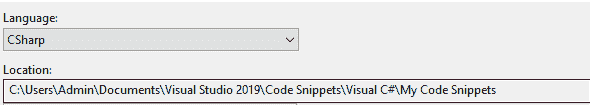

# 如何在 Visual Studio 中自动生成 C#代码段

> 原文：<https://www.freecodecamp.org/news/how-to-automatically-generate-code-snippets-visual-studio/>

当您在 Visual Studio 中使用代码段时，它可以使您的编码过程更加容易和快速。但是什么是代码片段呢？你如何使用它们？

在本文中，我们将看看如何用 C#创建代码片段。请记住，在 Visual Studio 的其他语言中，代码片段也是可用的。

如果你已经知道什么是代码片段，那么你可以跳到**“如何自动生成代码片段”**部分。

## 什么是代码片段？

如果您经常使用 Visual Studio，您可能已经知道什么是代码段。代码段代表一段较大代码的快捷方式。

例如，在 Visual Studio 中打开一个 C#项目，写下“for ”,然后按 tab 键两次。正如你所看到的，我们没有写完整的 for 循环，而是写“for”来创建一个 for 循环。

您可以使用更多预定义的代码片段。例如，如果您写“cw ”,然后按 tab 键两次，您将看到一个自动补全，它写道:

```
Console.WriteLine();
```

您可以在以下文档中查看预定义代码片段的完整列表:

[C# code snippets - Visual Studio (Windows)Learn how to use code snippets to add commonly-used code to your C# code files.TerryGLeeMicrosoft Docs](https://docs.microsoft.com/en-us/visualstudio/ide/visual-csharp-code-snippets?view=vs-2019)

## 如何创建自定义代码段

现在您已经理解了什么是代码片段，我们现在可以看一下如何创建一个代码片段。

要创建您的第一个代码段，请创建一个“.片段”文件。我将我的文件命名为“MySnippet.snippet”，但是您可以随意命名。

创建代码段文件后，在 Visual Studio 中打开该文件，并将以下代码段添加到该文件中。

```
<?xml version="1.0" encoding="utf-8"?>
<CodeSnippets xmlns="">
    <CodeSnippet Format="1.0.0">
        <Header>
            <Title></Title>    
            <Author></Author>
            <Description></Description>
            <Shortcut></Shortcut> 
        </Header>
        <Snippet>
            <Code Language="">
                <![CDATA[]]>
            </Code>
        </Snippet>
    </CodeSnippet>
</CodeSnippets>
```

在上面的例子中，我们使用了代码片段文件的基本结构。现在，我们将编辑它并创建一个将“cr”转换为`Console.ReadLine()`的代码片段。

#### Title Tag

title 标签包含代码段的标题(不是快捷方式名称)。在这个例子中，我们称标题为“ReadLineSnippet”。

#### 作者标签

在作者标签中，您可以插入您的姓名/公司，以获得代码片段创建的荣誉。

#### 描述标签

在 description 标记中，插入一个简短的描述，说明该代码段的确切功能。

#### 快捷标签

快捷方式标记中的名称是调用较大一段代码的名称。例如:

```
cw -> Console.WriteLine();
```

“cw”被指定为快捷方式标签中的名称。

#### 语言

因为我们用 C#工作，所以我们应该在语言中指定:

```
<Code Language = "CSharp">
```

保存我们代码片段的值。在我们的例子中，在方括号内，我们将像这样插入`Console.ReadLine()`:

```
<![CDATA[Console.ReadLine();]]>
```

### 其他代码片段选项

#### 定义变量:

我们也可以定义变量并给它们一个默认值。通过定义一个变量，我们可以在代码片段中多次使用它，并且我们给用户一个选项来一次改变所有出现的默认值。

例如，如果我们的代码片段创建了以下代码:

```
arr -> 
Object[] arr = new Object[100];
for(int i = 0; i < arr.Length; i++)
{   
	arr[i] = default(Object);
}
```

我们将“对象”定义为一个变量，我们可以替换它的所有出现。我们所要做的就是在第一次出现时写一个不同的名称，例如“int”，然后按两次 tab，它会将所有出现的“Object”转换为“int”。

如果我们也将`arr`定义为一个变量，我们可以通过按 tab 键从一个变量移动到另一个变量(当您创建代码片段时，第一个变量将以红色/青色选中——您可以通过按 tab 键移动到另一个变量)。

### 如何定义变量

```
<?xml version="1.0" encoding="utf-8"?>
<CodeSnippets xmlns="">
    <CodeSnippet Format="1.0.0">
        <Header>
            <Title>init array.</Title>    
            <Author>Gilad Bar-Ilan</Author>
            <Description>creates and initializes an array.</Description>
            <Shortcut>myArr</Shortcut> 
        </Header>
        <Snippet>
            <Code Language="CSharp">
                <![CDATA[$typeName$[] $varName$ = new $typeName$[100];
                for(int $i$ = 0; $i$ < $varName$.Length; $i$++)
                {
                  $varName$[$i$] = default($typeName$);
                }]]>
            </Code>
            <Declarations>      
                <Literal>      
                    <ID>varName</ID>      
                    <ToolTip>variable name.</ToolTip>         
                    <Default>arr</Default>        
                </Literal>
                <Literal>      
                    <ID>typeName</ID>      
                    <ToolTip>type name.</ToolTip>         
                    <Default>Object</Default>        
                </Literal>
                 <Literal>      
                    <ID>i</ID>      
                    <ToolTip>iterator name.</ToolTip>         
                    <Default>i</Default>        
                </Literal>
             </Declarations> 	
        </Snippet>
    </CodeSnippet>
</CodeSnippets>
```

正如你在上面的例子中看到的，我们使用的每个变量都需要在`<Declarations>`标签下的`<Literal>`标签中。

*   `<ID>` —我们如何调用`<![CDATA[]]>`中的变量
*   `<ToolTip>` —变量的简短描述。
*   `<Default>` —变量的默认值。

**注意** —当你在`<![CDATA[]]>`中使用一个变量时，你应该按照下面的结构来写:`$<here you put the variable name>$`。

### 如何将代码段添加到项目中

在我们创建了代码片段文件之后，我们希望在我们的项目中使用它。为此，我们应该将文件放在 Visual Studio 的自定义代码片段文件夹中。这将自动将代码片段添加到我们的项目中。

如果要查找文件夹路径:

*   打开一个 C#项目。
*   转到工具->代码片段管理器
*   复制你在盒子顶部看到的写着“位置”的路径。



获得路径后，只需将文件添加到路径中。

**注意—** 您的“我的代码片段”文件夹可能位于您电脑上的不同位置，所以不要依赖图片中的路径。

## 如何自动生成代码片段

现在我们可以回顾一下自动生成代码片段的含义。

我们知道添加”。snippet”文件添加到“My Code Snippets”文件夹中会自动将代码片段添加到我们的项目中。因此，现在我们可以使用该行为来创建代码，该代码将自动创建代码片段文件并将它们添加到我们的项目中。

### 我们需要什么样的代码片段？

在这个项目中，我们将使用默认构造函数为对象创建一个代码片段，其中快捷方式名称将是类型名称。例如:

```
Random + tab twice -> Random random = new Random();
```

该项目的想法是读取我们在项目中使用的名称空间，并为符合条件的每个对象制作一个自定义片段。

我们希望为我们使用的每个名称空间的类型添加代码片段。这意味着，即使我们在“using”中指定了一个名称空间，但没有使用它的任何对象，我们仍然会为它的成员(那些符合条件的成员)包含一个代码片段。

除了名称空间之外，我们还将为我们定义的类型创建一个代码片段。

#### 我们需要注意的事情:

*   移除不再需要的类型的代码片段(如果我们移除了已经创建的类型或者从项目中移除了名称空间)。
*   每次用户运行程序时更新代码片段(我们不在后台更新)。
*   为我们使用的新名称空间/我们创建的类型添加新的代码片段。
*   为类型的代码段创建一个结构。

### 如何获取我们定义的所有对象

如果我们想获得用户定义类型的完整列表，有两种方法可以做到。

第一种方法没有第二种好，那就是使用正则表达式。通过使用正则表达式，我们可以检查项目中的每个文件，并在结构的类/声明中匹配默认构造函数(因为结构总是有一个默认构造函数)。

#### 正则表达式技术的问题

如果用户将文件分开，我们可以在使用正则表达式之前检查文件是否被修改。通过这样做，我们可以避免重复没有被修改的文件。

但是文件中的微小变化将导致我们再次读取该文件，即使对象中没有差异。它还会导致文件杂乱无章，在一个文件中有很多代码，这会导致我们一遍又一遍地阅读文件。(如果整个代码在一个或几个文件中，我们将无法避免从代码中读取未更改的部分。)

#### 第二种技术——反射

我们可以不使用 Regex，而是使用反射，通过读取元数据来获取我们创建的类，而不是将每个文件作为文本读取。

```
 /// <summary>
        /// Returns a list of all the types we created.
        /// </summary>
        /// <returns></returns>
        public static List<Type> GetCustomTypes()
        {
            StackTrace myStackTrace = new StackTrace();

            //contains the name of the namesapce of the project
            //using stackframe we get's the first calling method (main - the bottom of the stack) and then we check the namespace of the type where the method is located.
            //in our case main is located under 'Program' then we check what is the namespace of Program.
            string namespace_ = myStackTrace.GetFrame(myStackTrace.FrameCount - 1).GetMethod().DeclaringType.Namespace;

            Assembly assembly = Assembly.GetExecutingAssembly();

            //holds all the custom types.
            //assembly.GetTypes() => returns all the types.
            //then we remove all the types which is not related to our namesapce.
            //then we remove all the compiler created types.
            //then we remove all the types which doesn't have a default constructor.
            var types = assembly.GetTypes().Where(x => x.Namespace == namespace_).Where(x => !x.Name.Contains("<>c"))
                        .Where(x => x.GetConstructors().Any(x => x.GetParameters().Length == 0));
            return types.ToList();
        } 
```

### 如何获取图书馆的对象

在项目的这一部分，我们会遇到很多问题。让我们看看什么可能会出错。

#### 问题 1

如果我们使用反射来读取项目中使用的程序集，我们将无法选择从我们在“using”中定义的库中获取类型，但我们实际上并不使用这些类型。例如:

```
using System.Linq;
using System.IO;
public static void Main()
{  
	int[] arr = Enumerable.Range(0,100).ToArray(); //Linq's functionallity
}
```

在上面的例子中，我们只使用 Linq 功能，这意味着如果我们要读取项目中使用的程序集，我们将看不到 System。即使我们想展示它。

#### 问题 2

另一个可能的问题发生在我们使用图书馆的时候。这是因为一个命名空间可以有多个程序集，并且为了提高效率，编译器不会在不需要的时候调用所有的程序集。所以即使我们使用了这个库，也不意味着我们将拥有所有的程序集。

#### 怎样才能解决问题？

这个问题很复杂，因为我们不能改变编译器的工作方式。所以如果我们想解决这个问题，我们必须有创造性。

我们的解决方案不会很有效率，但是我们没有太多的选择来解决这个问题。

#### 我们可以使用一种算法

*   我们得到了我们在所有的。cs "文件。
*   然后，我们遍历所有的系统 DLL 文件，并检查那里的类型是否与我们在项目中使用的名称空间相关。
*   我们还向这个列表中添加我们定义的类型，以及我们添加到项目中的引用，如果引用是在“using”中定义的，即使我们在程序本身中不使用他的类型，我们也会添加他的类型。
*   之后，我们检查该类型是否有默认的构造函数。

解决问题的代码相当复杂，所以让我们检查一下。

```
using System;
using System.Reflection;
using System.Linq;
using System.IO;
using System.Collections.Generic;
using System.Diagnostics;
using System.Text.RegularExpressions;

namespace Reader
{
    public class TypeReader
    {
        public static List<Type> GetAllTypes()
        {
            #region GetSystemLibrary Files
            string systemDllPath = typeof(string).Assembly.Location; //gets the dll of the string type.
            systemDllPath = Path.GetDirectoryName(systemDllPath);
            string[] systemLibraries = Directory.GetFiles(systemDllPath); //the list of the system libraies dlls.  
            #endregion

            #region Namespaces in project files.
            string[] namespaces_ = Directory.GetFiles(GetSourceCodePath())
                                      .Where(x => x.EndsWith(".cs")).ToArray();
            namespaces_ = GetNamespaces(namespaces_).ToArray();//we remove the semi colon
            #endregion

            #region Check the system libraries.
            List<Type> types = systemLibraries.Where(x => x.EndsWith(".dll")).Select(x =>
            {
                Assembly asm = null;
                try
                {
                    asm = Assembly.LoadFile(x);

                }
                catch
                {
                    asm = null;
                }

                return asm;
            }).SelectMany(x => x != null ? x.GetTypes() : new Type[] { })
                        .Where(x => x != null && !x.Name.Contains("<>c")).Where(x => namespaces_.Contains(x.Namespace))
                        .Where(x => x.IsPublic && (x.IsClass || x.IsValueType)).ToList();
            #endregion

            #region add assemblies we use in our program.
            types.AddRange(AppDomain.CurrentDomain.GetAssemblies()
                           .SelectMany(x => x.GetTypes().Where(x => !x.Name.Contains("<>c")).Where(x => namespaces_.Contains(x.Namespace)))
                           .Where(x => x.IsPublic && (x.IsClass || x.IsValueType)));
            #endregion

            #region add custom types we created.
            types.AddRange(GetCustomTypes()); //adds our custom created snippets
            #endregion

            #region add types belongs to refrences we didn't use in our project.
            types.AddRange(GetUnUsedRefrenecedTypes(namespaces_)); //adds the refrenced libraries we specify but don't use.
            #endregion

            #region filter types.
            types = types.Where(x => x.IsValueType || x.GetConstructors().Any(x => x.GetParameters().Length == 0)).ToList();
            #endregion

            #region remove duplicated type names.
            types = types.GroupBy(x => x.FullName).Select(x => x.First()).ToList();
            #endregion

            return types;
        }

        //Returns the assembly of the main function.
        public static string GetMainAssemblyLocation()
        {
            StackTrace main = new StackTrace();
            string path = main.GetFrame(main.FrameCount - 1).GetMethod().DeclaringType.Assembly.Location;
            return Path.GetDirectoryName(path);
        }

        public static string GetSourceCodePath()
        {
            string projectPath = GetMainAssemblyLocation();

            try
            {
                while (!Directory.GetFiles(projectPath).Any(x => x.EndsWith(".cs")))
                {
                    projectPath = projectPath.Remove(projectPath.LastIndexOf("\\"));
                }
            }
            catch
            {
                throw new SourceCodeNotFoundException();
            }

            return projectPath;
        }

        public static List<string> GetNamespaces(string[] files)
        {
            List<string> namespaces = new List<string>();

            foreach (string file_ in files)
            {
                StreamReader fileStream = new StreamReader(file_);
                Regex matchUsing = new Regex(@"using([ ]|\t|\n)+\S+;");
                string[] fileNamespaces = matchUsing.Matches(fileStream.ReadToEnd()).Select(x => x.Value)
                                          .Select(x => x.Remove(x.IndexOf("using"), "using".Length).Trim()).ToArray();
                namespaces.AddRange(fileNamespaces);

                fileStream.Close();
            }

            return namespaces.Select(x => x.Remove(x.Length - 1, 1)).Distinct().ToList();
        }

        /// <summary>
        /// This is used in case we have a custom refrenced library (could be a dll we created)
        /// and we specify that in the using, however, we don't use his assemblies.
        /// </summary>
        /// <returns></returns>
        public static List<Type> GetUnUsedRefrenecedTypes(string[] namespaces_)
        {
            string sourceCode = GetMainAssemblyLocation();
            List<Type> otherTypes = new List<Type>();

            string[] fileNames = Directory.GetFiles(Path.GetDirectoryName(sourceCode));

            if (fileNames.Any(x => x.EndsWith(".dll")))
            {
                fileNames = fileNames.Where(x => x.EndsWith(".dll")).ToArray();

                foreach (var file in fileNames)
                {
                    Assembly asm;

                    try
                    {
                        asm = Assembly.LoadFile(file);
                    }
                    catch
                    {
                        continue;
                    }

                    otherTypes.AddRange(asm.GetTypes().Where(x => !x.Name.Contains("<>c"))
                                        .Where(x => x.IsPublic && (x.IsClass || x.IsValueType))
                                        .Where(x => namespaces_.Contains(x.Namespace)).GroupBy(x => x.Name)
                                        .Select(x => x.First()));
                }
            }

            return otherTypes;
        }

        /// <summary>
        /// Returns a list of all the types we created.
        /// </summary>
        /// <returns></returns>
        public static List<Type> GetCustomTypes()
        {
            StackTrace myStackTrace = new StackTrace();
            Type mainType = myStackTrace.GetFrame(myStackTrace.FrameCount - 1).GetMethod().DeclaringType;

            //contains the name of the namesapce of the project
            //using stackframe we get's the first calling method (main - the bottom of the stack) and then we check the namespace of the type where the method is located.
            //in our case main is located under 'Program' then we check what is the namespace of Program.
            string namespace_ = mainType.Namespace;
            Assembly assembly = mainType.Assembly;

            //holds all the custom types.
            //assembly.GetTypes() => returns all the types.
            //then we remove all the types which is not related to our namesapce.
            //then we remove all the compiler created types.
            //then we remove all the types which doesn't have a default constructor.
            var types = assembly.GetTypes().Where(x => x.Namespace == namespace_).Where(x => !x.Name.Contains("<>c")); ;
            return types.ToList();
        }
    }

    internal class SourceCodeNotFoundException : Exception
    {
        public override string Message => "Could not load the '.cs' files, please make sure\n" +
                                    "your files located in the default place / you have a valid project type.";
    }
} 
```

#### **重要提示:**

```
//If I mention in the explanation the words "main function" I mean:

public static void Main()
{   
	TypeReader.GetAllTypes();
}
//Which means that the main function does not located in the 
//TypeReader class it's the main function who calls the class.
```

### 获取系统库文件区域

在这几行中，我们得到了“系统”的所有库文件。

*   我们检查其中一个系统 dll 的程序集在哪里(在我们的例子中是“string”的程序集在哪里)。
*   然后我们从路径中删除文件名，这样我们就只有目录了。
*   然后我们只从目录(")中取出库文件。dll”)。

我们这样做是因为所有系统库文件都位于同一个目录中。

### 项目文件区域中的命名空间

在这几行中，我们得到了在所有项目文件中使用的所有名称空间。

#### 我们在这些行中使用的自定义方法

**GetSourceCodePath —** 这个函数返回我们的源代码的路径。首先，我们得到主函数的 dll 的路径。假设用户在 Visual Studio 中使用默认的目录排序方式，我们将目录从路径中“移除”,直到到达一个带有。cs 文件。

**GetMainAssemblyLocation**—我们使用 StackTrace 来获取主函数的组装位置。“删除”的一个例子是
C:\ Users \ file 1 \ file 2->C:\ Users \ file 1

如果我们找不到任何目录，我们抛出**SourceCodeNotFoundException**。

**GetNamespaces —** 该方法返回我们输入的文件中的所有名称空间。它遍历每个文件，并使用 Regex 读取每个文件中使用的所有名称空间。

对于每个名称空间，我们将得到`using <Something>;`，然后我们将删除所有多余的字符，我们只保留`<Something>`。

#### 获取所有类型

*   我们从源代码目录中读取所有文件
*   我们只保存扩展名为“的文件。cs "
*   我们得到了文件的名称空间。

### 检查“系统库”区域

在这几行中，我们检查系统库。这几行代码解决了我们之前提到的两个问题。

*   我们获取系统 dll 目录中的所有文件，并且只保留那些代表 DLL 的文件(扩展名为“.dll”)。
*   我们尝试加载这些文件中的每一个。
*   如果我们可以加载文件，那么我们就可以得到程序集中的类型。
*   我们删除所有编译器创建的类型"<> c "。
*   我们在项目中只保留与其中一个名称空间相关的类型。
*   那么我们只保留公共类型和那些类或结构类型。

#### 为什么我们要这样做？

我们之前提到的问题是因为我们试图检查程序**在运行时实际使用了什么。但是编译器会进行优化，这就是为什么我们不能真正达到问题中提到的情况。**

因此，为了解决这个问题，我们需要发挥创造力，检查我们在项目文件中使用的名称空间。然后我们加载程序集，最后检查每个类型的名称空间是否是我们在项目中使用的名称空间之一。

### 添加我们在程序区域中使用的程序集

在这几行中，我们添加了程序中使用的程序集。

对于每一个程序集，我们对它包含的类型进行同样的检查。

*   如果类型是公共的
*   如果是结构或类
*   如果它不是编译器创建的类型。
*   如果它与我们在项目中使用的某个名称空间相关。

### 添加我们创建的自定义类型区域

在这一行中，我们添加了已经创建的所有自定义类型。

**GetCustomTypes —** 该函数使用 StackTrace 来获取主函数的名称空间和程序集。

在我们有了程序集之后，我们得到了与 main 的名称空间相关的类型。

### 添加类型属于我们在程序区域中没有使用的引用

在这一行中，我们添加了属于我们在程序中没有使用的引用的类型，这些类型是在“using”中指定的(就像我们对系统类型所做的那样，但是这一次我们是为我们手动添加的引用而不是“system”)添加的。

**获取 nusedr 参考类型**

*   我们查看源代码目录(位于那里的手动添加的引用)。
*   我们试着加载。并添加所有通过我们在 main 中以前检查的条件的类型。

### 过滤器类型区域

在这一行中，我们只保留有默认构造函数的值类型和类(如果它们是值类型，它们肯定有默认的构造函数)。

### 移除重复的类型名称区域

我们通过名称删除重复的类型。

## 如何构建代码片段

我们已经完成了最难的部分，现在是时候构建代码片段了！

```
using System;
using System.IO;
using System.Collections.Generic;
using System.Linq;
using Reader;

namespace SnippetGenerator2
{
    public class CodeSnippetGenerator
    {
        public string SnippetLocation;

        public CodeSnippetGenerator(string snippetLocation)
        {
            this.SnippetLocation = snippetLocation.EndsWith("\\") ? snippetLocation : snippetLocation + "\\";
        }

        public void UpdateSnippets()
        {
            List<Type> allTypes = TypeReader.GetAllTypes();
            Func<Type, string> makeFileName = x => SnippetLocation + x.Name + "-" + x.Namespace + ".snippet";

            DirectoryInfo myCodeSnippets = new DirectoryInfo(SnippetLocation);
            string[] snippetFileNames = allTypes.Select(x => makeFileName(x)).ToArray();
            string[] previous = myCodeSnippets.GetFiles().Where(x => x.Name.EndsWith(".snippet")).Select(x => x.Name).ToArray();

            //we only keep the files that no longer exsisted.
            previous = previous.Where(x => !snippetFileNames.Contains(x)).ToArray();
            previous.ToList().ForEach(x =>
            {
                try
                {
                    File.Delete(SnippetLocation + x);
                }
                catch { }
            });//we remove the files we don't need.

            allTypes.ForEach(x => 
            {
                if (!Directory.GetFiles(SnippetLocation).Contains(makeFileName(x)))
                    CreateSnippet(x);
            }
            ); //we create snippets for the types.
        }

        public List<string> RemoveAllCodeSnippets()
        {
            string[] files = Directory.GetFiles(SnippetLocation).ToArray();
            List<string> notDeleted = new List<string>();

            files.ToList().ForEach(x =>
            {
                StreamReader snippetFile = new StreamReader(x);

                if (snippetFile.ReadToEnd().Contains("<Author>AUTO-GENERATOR</Author>"))
                {
                    snippetFile.Close();

                    try
                    {
                        File.Delete(x);
                    }
                    catch
                    {
                        notDeleted.Add(x);
                    }
                }
            });

            int i = 0;
            while(i < notDeleted.Count)
            {
                i++;
                try
                {
                    File.Delete(notDeleted[i]);
                }
                catch
                {
                    continue;
                }
                notDeleted.Remove(notDeleted[i]);
            }

            return notDeleted;
        }

        /// <summary>
        /// Creates a snippet.
        /// </summary>
        /// <param name="type">The type to make the default create for.</param>
        /// <param name="description">The description of the snippet.</param>
        internal void CreateSnippet(Type type,
                                       string description = "DefaultDescription")
        {

            string snippet_structure = $@"<?xml version=""1.0"" encoding=""utf-8""?>
  <CodeSnippets xmlns = """">  
     <CodeSnippet Format = ""1.0.0"">   
         <Header>    
            <Title>{type.Name}-{type.Namespace}</Title>    
            <Author>AUTO-GENERATOR</Author>
            <Description> {description}</Description>
            <Shortcut> {type.Name} </Shortcut>   
         </Header>   
         <Snippet>  
           <Code Language = ""CSharp"">    
                 <![CDATA[{type.Name} $obj$ = new {type.Name}();]]>     
             </Code>     
             <Declarations>      
                <Literal>      
                    <ID>obj</ID>      
                    <ToolTip>variable name.</ToolTip>         
                       <Default>{type.Name.ToLower()}</Default>        
                   </Literal>       
                </Declarations>         
             </Snippet>        
           </CodeSnippet>
         </CodeSnippets>";

            //write the snippet into the snippets directory.
            File.WriteAllText(SnippetLocation + type.Name + "-" + type.Namespace + ".snippet", snippet_structure);
        }
    }
} 
```

我们来谈谈这段代码:

*   “Reader”是我们之前构建的类的名称空间。
*   TypeReader 是我们之前构建的类的名称。
*   片段的文件名将被写成`<TypeName>-<NamespaceName>.snippet`

#### 构造函数

*   构造函数从用户那里接受“我的代码片段”目录的路径。

#### CreateSnippet 方法

“CreateSnippet”方法创建一个具有通用结构的代码段。

*   标题—`<typeName>-<namespace>`
*   author-AUTO-GENERATOR，我们用同一个名字来称呼它们，这样我们就知道哪些代码片段是由 CodeSnippetGenerator 创建的，哪些是由用户创建的。
*   我们创建了一个结构:

```
TypeName typename(in small letters) = new TypeName();
```

*   我们将“快捷方式”也设置为类型名。

#### RemoveAllSnippets 方法

RemoveAllSnippets 方法删除 CodeSnippetGenerator 创建的所有片段**。**

通过检查 Author 标签是否包含“AUTO-GENERATOR”，我们可以知道文件是否是由代码片段生成器创建的。

我们再次尝试删除第一次没有删除的文件。如果我们第二次不能删除它们，我们返回一个不能删除的文件名列表。

#### UpdateSnippets 方法

UpdateSnippets 方法在每次运行时更新代码段。每次运行时:

*   我们读取我们在主程序中使用的类型的名称(不是在 CodeSnippetGenerator 类中)。
*   我们读了。我们从上一次运行中获得的片段文件。
*   我们为当前运行中的每种类型创建一个文件名数组。
*   通过比较我们在之前运行中拥有的、在当前运行的文件名中不存在的代码片段文件的名称，我们可以看到哪些代码片段文件不再需要。
*   我们删除这些文件。
*   然后我们创造一个”。每种类型的“片段”文件还没有一个。

## 如何使用代码片段自动生成器程序

如果你想使用这个程序，只需打开一个 C#项目，在主函数的开头写下:

```
var csg = new CodeSnippetGenerator("path of 'My Code Snippets'>);
csg.UpdateSnippets(); //to create & update the snippets in 
project.csg.RemoveAllSnippets(); //to remove the created snippets.
```

恭喜你！现在，您已经创建了自己的 CodeSnippetGenerator。

我希望这些能派上用场，并在您编写代码时节省您的时间。感谢阅读:)