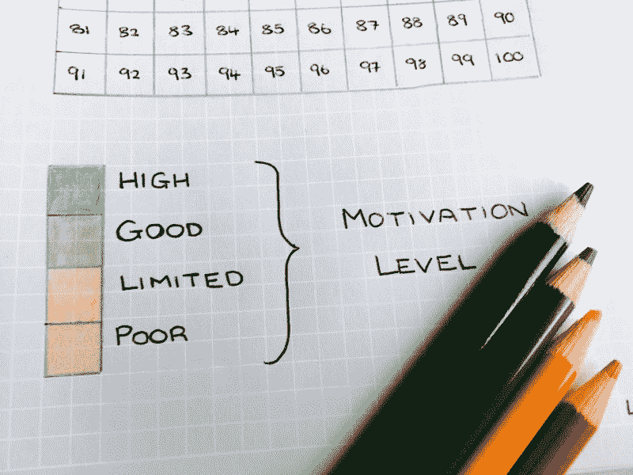
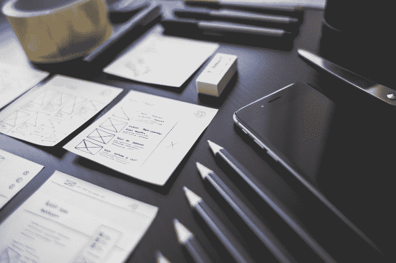
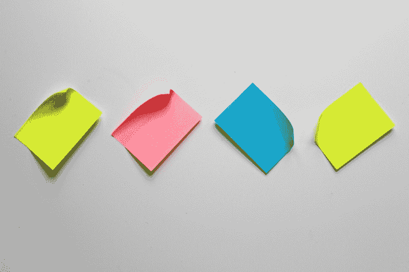

# 如何在# 100 日代码期间避免熔毁

> 原文：<https://www.freecodecamp.org/news/how-to-avoid-a-meltdown-during-100daysofcode-5d18a3cd91b0/>

丹妮尔·奥姆肖

# 如何在# 100 日代码期间避免熔毁

不到 10 天就第一轮#100DaysOfCode 失败了。

我的第二次尝试没那么糟糕，在第 50 天时我失败了。

Alexander Kallaway 设计了#100DaysOfCode 来打破习惯形成的精神障碍。有很多成功的故事——一个露营者找到了一份 React 开发人员的工作。为什么我觉得这么难？

我决定进行尸检。作为一个产品经理，我的工作是了解团队绩效的根本原因，无论是好是坏。这没有什么不同。我需要识别并摆脱我的阻挡者。

经过一定程度的实验，我发现了三个步骤，将推动你征服#100DaysOfCode。

### 跟踪你的动机，以确定你的最佳编码环境

Photo by [Danielle Ormshaw](https://twitter.com/SchnucklePi) on [Twitter](https://twitter.com/SchnucklePi/status/888319652711018496).

当我开始这个挑战时，我的热情高涨。我会提前一个小时开车去上班，利用多余的时间编写代码。我在粉碎挑战，并在推特上分享我的进步。

不幸的是，热情的浪潮消退了。当形成一个习惯时，这个时刻是关键。你如何在没有兴奋感的情况下保持动力？

跟踪你的动机水平可以帮助你保持专注和清晰。目标是找出你低动力的触发因素。然后你可以设计你的工作环境来避免它们。

追踪动机最简单的方法是画一个由 100 个正方形组成的网格。每天结束时，根据你的心情给编号的方块涂上颜色。如果你的动机特别高或特别低，记下为什么会这样。

按照这个方法，我发现:

*   早上 7:00 到 8:00 之间，我编码的动力最大
*   当我没有明确的目标时，我编码的动力是最低的
*   当我只专注于教程时，波动是常见的

这个简单的练习让我适应了我的习惯，并形成了适合我工作方式的常规。这样，跟踪你的心情将帮助你确定你的最佳编码环境

### 在开始挑战之前设定项目目标

Photo made available by [Pexels](https://static.pexels.com/photos/273230/pexels-photo-273230.jpeg).

一个新的程序员第一次有信心说“我可以构建它”，这是一种解放，也是势不可挡的。

在那一刻，项目想法从梦想空间转移到现实。闸门已经打开，可能性似乎无穷无尽。

没有一个清晰的目标，突然意识到你可以发布工作代码是很危险的。以我的经验来看，这会导致不专注的学习和不断的项目跳跃。

这种散弹枪式的方法不利于激励。尽管你正朝着许多令人兴奋的项目努力，但你在任何一个领域都没有取得进展。此时，你开始有挫败感。

在开始#100DaysOfCode 之前设定现实的目标，并以此为锚。

这些目标可以基于技术，也可以基于项目:

*   未来 100 天我想建什么项目？
*   我需要了解哪些技术？
*   哪些学习资源将帮助我实现目标？

当你掌握了一项新技术，记下任何新的想法。承认它们是未来的项目，并继续实现你最初的目标。

### 无论你是成功还是失败，都要进行项目回顾

Photo made available by [Pixabay](https://pixabay.com/en/list-sticky-notes-note-stickies-1925752/).

回顾是敏捷软件开发中的一个关键仪式。这是一个团队聚在一起反思他们工作实践的机会。目的是观察在此工作期间哪些方面进展顺利，并确定下一阶段必须改进的方面。

在挑战结束时，问自己以下问题:

*   这一轮我做得特别好的是什么？
*   我在挑战赛中学到了什么？
*   我最自豪的是什么？
*   在未来几轮中，什么会阻碍我的进步？

花些时间回顾你的答案，并列出你将要采取的行动。

我祝你好运。

### 下一步是什么？

我的下一轮#100DaysOfCode 将在我发表这篇文章后立即开始。你可以在推特上关注我的进展。

如果这些建议帮助你避免了崩溃，请用掌声表达你的感激。编码快乐！