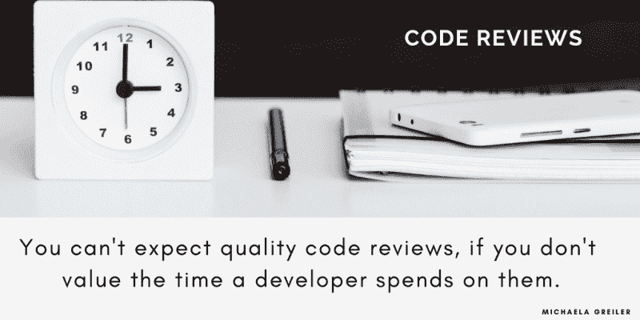

# 如何避免降低生产力的代码审查陷阱

> 原文：<https://www.freecodecamp.org/news/how-to-avoid-code-review-pitfalls-that-slow-your-productivity-down-b7a8536c4d3b/>

代码审查是许多高绩效团队使用的工程实践。尽管这种软件实践有许多优点，但是进行代码评审的团队也会遇到相当多的代码评审陷阱。

在本文中，我解释了您应该知道的主要代码审查陷阱，以确保代码审查不会拖您团队的后腿。知道哪些陷阱和问题会出现，可以帮助您确保一个高效的代码审查体验。这些发现是基于我们在微软进行的有 900 多名参与者的调查。

### 典型的代码评审过程

一个典型的基于工具的代码评审过程看起来大致是这样的:一旦开发人员完成了一段代码，他们就为提交评审准备代码。然后，他们选择收到审核通知的审核者。然后评审者评审代码并给出评论。代码的作者处理这些注释，并相应地改进和更改代码。一旦每个人都满意，或者达成一致，代码就可以被签入代码库。

在另一篇文章中，我描述了微软典型的代码审查过程。

### 代码审查并不总是一帆风顺的

这些步骤看起来像一个平稳的过程。但是，像所有事情一样，在实践中，事情往往比预期的更复杂。在代码评审过程中，有相当多的陷阱会减少整个团队对代码评审的积极体验。如果没有正确地完成，代码审查也会对整个团队的生产力产生负面影响。所以，让我们来看看代码审查的困难和陷阱。

代码评审的两个主要陷阱是关于花在代码评审上的时间，以及代码评审提供的价值。

注意代码审查的陷阱。否则，代码审查会降低团队的速度。点击发微博

### 等待代码评审反馈是一件痛苦的事情

代码作者面临的主要陷阱之一是及时接收反馈。等待评论进来，而不能同时处理代码，这可能是一个巨大的问题。即使开发人员可以从事其他工作，如果代码审查花费的时间太长，就会影响开发人员的工作效率和满意度。

但是，为什么代码评审反馈需要这么长时间？

### 开发人员必须兼顾几项职责

嗯，代码评审并不是代码评审员必须执行的唯一任务。相反，代码审查——尽管它会占用开发人员日常工作的大量时间——只是开发人员职责和任务的一部分。因此，很有可能代码评审员正在从事其他活动，并且在查看代码评审之前必须先停止或完成这些活动。

如果时机不理想，尤其是如果代码评审者没有预料到这种变化的到来，那么很有可能，在他们查看评审之前需要一段时间。远程团队还必须意识到时差。否则，代码审查甚至可能需要更长的时间。

### 如果代码审查没有被算作实际工作，开发人员就会面临问题

时间约束是真实的，它们影响代码评审者和代码作者。进行适当的代码审查需要时间。如果团队希望开发人员进行代码审查，但不重视或计算开发人员在代码审查上花费的时间，这就成了一个真正的问题。

You have to value and plan for the time spent doing code reviews.
Photo by [freestocks.org](https://unsplash.com/photos/vcPtHBqHnKk?utm_source=unsplash&utm_medium=referral&utm_content=creditCopyText) on [Unsplash](https://unsplash.com/?utm_source=unsplash&utm_medium=referral&utm_content=creditCopyText)

如果你不重视开发人员在代码评审上花费的时间，你就不能指望高质量的代码评审。点击发微博

### 没有奖励代码评审的努力和表现

如果你不奖励开发人员在这项任务上花费的努力，声称重视代码评审是没有帮助的。许多公司专注于奖励开发人员编写的代码量或开发的功能。这降低了开发人员互相帮助做好工作(包括代码审查)的动力和能力。代码评审工作和性能应该是性能评估或提升决策的基础。

如果你想让你的团队做好代码审查，奖励他们的工作。点击发微博

### 社会因素和团队动力

但是等待代码审查并不总是与缺少时间或缺少奖励系统有关。由于其社会性，延迟评审可能是由于不安全感或团队动力。特别是如果代码审查是压倒性的，或者如果审查者是代码新手，进行代码审查可能是压倒性的:

> 我被期望参与，但我不太确定如何参与。我会等到别人开始。—研究参与者

### 大型评论很难评论

另一个重要的代码审查陷阱是大型审查。想象你是审核人，你刚拿到这个审核。你会想，好吧，我很快就会看到这一点，但是一旦你打开审查，你会看到这个大的代码变化。几个文件已经被更改，所有的更改都纠缠在整个代码库中。你的第一反应是什么？

大概是:圣牛！

没错。这正是我们在分析数以千计的代码审查时所看到的。不仅审查时间会随着代码大小的变化而增加，而且反馈质量也会降低。嗯，那大概可以理解。

> 10 行代码= 10 期。

> *500 行代码=“看起来不错。”*

> 代码审查。

> *—我是 dev loper(@ iamdevloper)[2013 年 11 月 5 日](https://twitter.com/iamdevloper/status/397664295875805184?ref_src=twsrc%5Etfw)*

大的代码变更是难以置信的难以审查。此外，如果代码评审员对发生变更的那部分代码不太熟悉，评审很快就会变成一场噩梦。

大型代码评审很难评审。审查的质量随着变更的规模而降低，因此限制了团队从代码审查中获得的价值。点击发微博

### 理解代码变更需要一些指导

理解代码变更，尤其是代码变更的动机，是许多评审人员面临的另一个代码评审陷阱。如果没有解释变更目的的描述，代码审查会变得更加困难。我们在研究中看到，如果代码审查者不理解代码变更，或者如果她被变更的数量淹没，她就不能给出有见地的反馈。

> 这只是一个无法理解的大混乱。那么你就不能增加任何价值，因为他们只会向你解释，而你只会鹦鹉学舌。

> *—采访开发人员 13*

### 得不到有价值的反馈会减少开发人员从代码评审中获得的利益和动机

毫无疑问，花时间在代码审查上，却得不到有用的反馈是一个问题。即使团队可能仍然从知识转移中受益，当开发人员没有得到有价值的反馈时，他们进行代码评审的动机和从代码评审中获得的好处会减少。

评审者没有或不能给出有见地的反馈有几个原因。这可能是因为代码审查者没有合适的专业知识。另一个常见的原因是评审者没有足够的时间来彻底检查变更。

也许代码审查者不理解代码。也可能是代码评审者不知道要寻找什么问题。[理解什么是有价值的代码评审反馈](https://docs.microsoft.com/en-us/azure/devops/learn/devops-at-microsoft/boosting-code-reviews-useful-comments)并实施最佳实践可以减少这种缺陷。

### 一旦主要讨论是关于造型，你需要行动起来

在代码审查期间可能发生的另一个问题叫做自行车脱落。Bikeshedding 意味着开发人员关注更小的问题，开始争论小问题，而忽略了严重的问题。

原因是多方面的。导致 bikeshedding 的常见幕后挑战是开发人员不理解代码更改，或者他们没有足够的时间进行代码审查。有时，自行车脱落可能是团队动力有问题的迹象。

如果人们在代码评审期间争论一些小问题，你必须看看潜在的问题。时间压力，太大的评论，竞争？点击发微博

### 达成共识可能需要面对面的讨论

有时很难达成共识。这可能发生在代码评审者和代码作者之间，或者直接发生在几个代码评审者之间。这种情况必须小心处理，因为团队动态与这些事情密切相关。通过工具和书面形式的交流会加剧这个问题。如果看起来有任何紧张或有争议的问题需要讨论，转向面对面(面对面或通过视频通话)可能是个好主意。

### 代码审查的好处超过了付出的努力

我希望这个代码评审缺陷列表没有改变你对代码评审的想法。因为，好消息是，如果你意识到了代码审查的陷阱，并克服它们，代码审查是一种非常有益的工程技术。此外，还有更多经过验证的方法可以有效地进行代码评审。

### 代码评审最佳实践

在这个代码评审系列的下一篇博文[中，我将展示最佳实践，以帮助最小化代码评审的陷阱和挑战，并确保您的团队从代码评审实践中获得最佳收益。所以继续读下去。当我发表下一篇文章时，我会通知你，请在](https://www.michaelagreiler.com/code-review-blog-post-series/) [twitter](https://twitter.com/mgreiler) 上关注我。

我为我的时事通讯订阅者准备了一本独家的代码评审电子书。所以请确保[你订阅了我的邮件列表](https://www.michaelagreiler.com/code-review-e-book/),并保管好你的代码评审电子书，包括一份方便的代码评审最佳实践的备忘单。

*最初发布于[https://www.michaelagreiler.com](https://www.michaelagreiler.com/code-review-pitfalls-slow-down/)2019 年 4 月 6 日。*