# 如何避免你的网站在推特和脸书上显得不光彩

> 原文：<https://www.freecodecamp.org/news/how-to-avoid-the-shaming-look-your-site-has-on-twitter-and-facebook-f2e8f4be568d/>

如果你已经明白什么是脸书公开图和推特卡，这篇文章**不是针对你**。请把它传给不明白那些是什么的人。

### 介绍

根据 Mashable 的数据，Twitter 上 52%的共享链接是文章和图片，其中图片占据了 36%的份额。平均来说，人们每天分享大约[3000 万张独特的图片](https://www.quora.com/How-many-photos-are-shared-on-Twitter-per-day)。

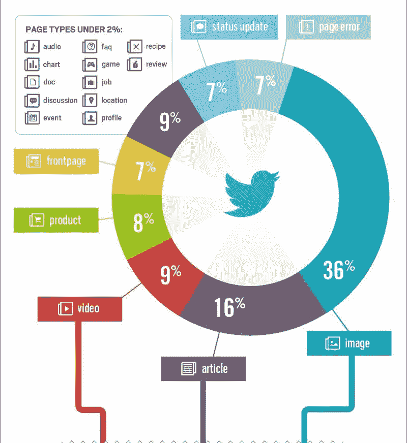

From [Mashable](https://mashable.com/2012/08/16/twitter-day-in-the-life-infographic/#Cscw4XDZ.8qM)

你喘气了吗？

我做到了。

[Buffer](https://blog.bufferapp.com/10-new-twitter-stats-twitter-statistics-to-help-you-reach-your-followers) 说，带有图片链接的推文的参与率是没有图片链接的推文的两倍。

现在，这些数据只是针对 Twitter 的。其他流行社交媒体平台的综合统计数据会让你大吃一惊。

底线是:**人类是视觉生物。**

如果你的网站在社交媒体上被分享，并且看起来像一个无聊的酸炖肉，那么参与度就会很低。分享一个很好地出现在人们时间表中的链接，你更有可能获得你所寻求的那种参与。

建设网站时没有考虑这些因素？你肯定做错了什么。

### 羞愧的表情到底是什么？

不是所有的链接都是平等的。考虑下面的图形。它们代表了 Twitter 上共享的两个不同链接的外观。一个来自媒体，另一个来自我的一个网站。

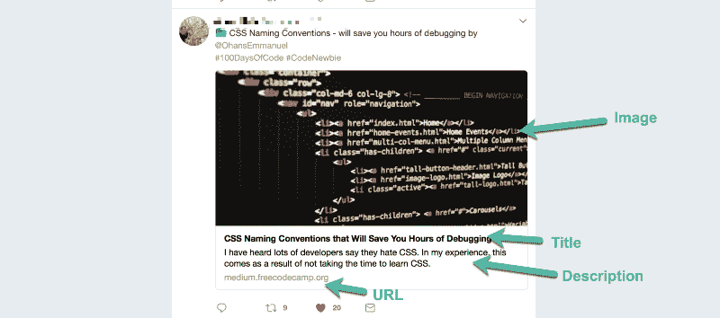

This is a shared medium article, and it definitely looks good!

之前的图形有大图，标题，描述，总体看起来还不错。

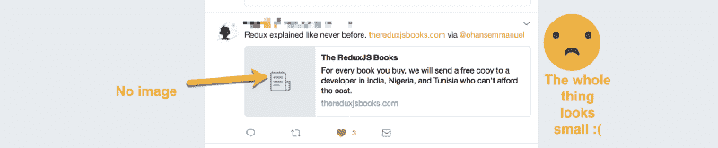

Here’s my own website link shared and this doesn’t look as good. Sad stuff :(

这看起来不太好。那么，Medium 是如何让他们的共享 URL 看起来更棒的呢？

### 从零到英雄

让我们一步一步地把一个网站从“令人羞愧的外观”变成“令人敬畏的”。

出于我们的考虑，我将使用我的一个站点`[TheReduxJSBooks.com](https://thereduxjsbooks.com)`作为实验鼠。

首先，为了预览你的链接预览将如何在 Twitter 和脸书上显示，这两家公司都提供了调试器，你可以粘贴你的链接，自己看看。

这里是脸书分享调试器的链接，T2 分享 Twitter 的链接。

从“零”开始，我们看看`[TheReduxJSBooks.com](https://thereduxjsbooks.com)`现在分享的时候是什么样子。

这是我们在 facebook 上看到的:

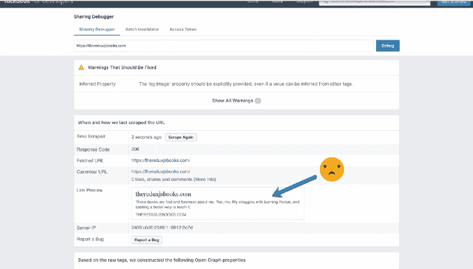

The poor look when shared on Facebook (FB). As simulated on the FB sharing debugger, FB managed to display the URL and the first bit of text on the website

这是推特上的:

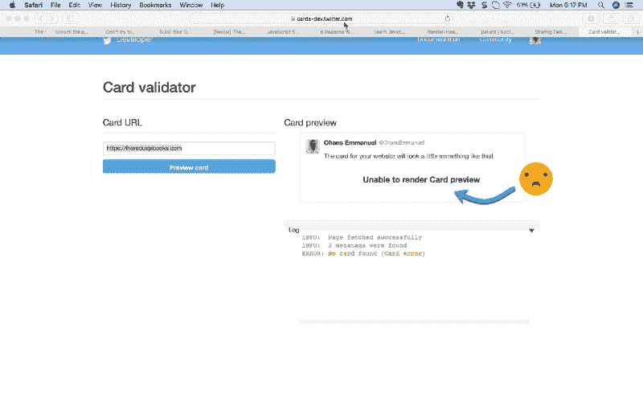

So bad — no previews are shown :( Twitter doesn’t pull out any info from the site. You gotta do the work.

这些目前看起来并不令人印象深刻，但我们将很快修复它。

为了控制你的链接在分享时的外观，脸书开发了名为 **Open Graph** 的技术。这几乎成为了其他服务的标准，不仅仅是 T2，也不仅仅是脸书。推特称他们的东西不同，**推特卡**。

让我们看看这些是如何工作的。

### 脸书开放图


用最简单的术语来说，脸书开放图就是在你的`html`的头部包含某些`meta`标签。

这些元数据将从您的站点中读取，它们会影响您的链接在共享时的预览方式。

现在，看看当链接在脸书上共享时我们将实现的最终结果。


The final result we’re gunning for.

现在有什么不同？

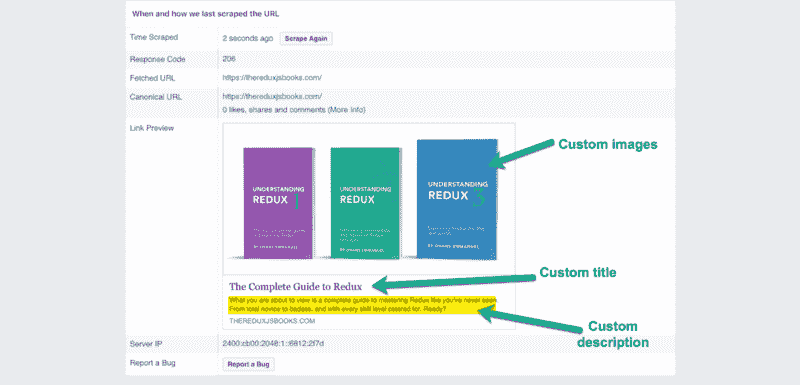

Here’s what is different.

现在，看起来很漂亮。通过自定义图像、标题和描述，您可以完全控制链接预览的显示方式。

现在，下面是生成您在上面看到的预览的代码:

```
<!-- Facebook Opengraph -->
<meta property="og:url" content="https://thereduxjsbooks.com" />
<meta property="og:type" content="website" />
<meta property="og:title" content="The ReduxJS Books" />
<meta property="og:description" content="What you ar about to view is a complete guide to mastering Redux from total novice to badass, and with every skill level catered for. Ready?"/>

<meta property="og:image" content="https://thereduxjsbooks.com/images/redux-trio-1200x630.png" />
<meta property="og:image:alt" content="3 books on ReduxJS. A sequel that takes you from beginner to pro." />
<meta property="og:image:type" content="image/png" />
<meta property="og:image:width" content="1200" />
<meta property="og:image:height" content="630" />
```

我知道这看起来像很多代码，但事实并非如此。

这些都放在你的`html`页面的头部。例如

```
<head>
   <!-- put them here -->
</head>
```

现在，让我们一个接一个地检查每个打开的图形`meta`标签。

这是第一个:

```
<meta property="og:url" content="https://thereduxjsbooks.com" />
```

这里有一个带有两个属性的`meta`标签，`property`和`content`。

`property`定义了相关元标签的**属性**。在本例中，它的值为`og:url`。

您可能已经猜到，`og`是`Open Graph`的缩写，`url`表示这描述了共享链接的`url`。然后，`content`保存`url`的值，即“[https://thereduxjsbooks.com](https://thereduxjsbooks.com)”。

那很容易。

现在，这同样适用于`type`、`title`和`description`标签。你看到了吗？

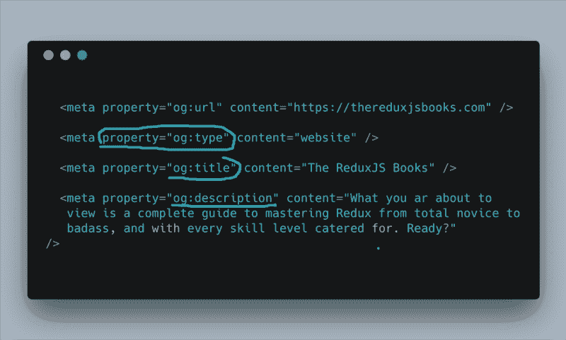

The type, title and description tags.

下一组`meta`标签是那些描述图像预览的标签。第一个有一个属性，`og:image`，`content`是图片的 URL。

```
<meta property="og:image" content="https://thereduxjsbooks.com/images/redux-trio-1200x630.png" />
```

需要注意的一点是，对于脸书开放图，您必须提供图像的`width`和`height`——最好是`1200px by 630px`

其他标签只是进一步描述图像的`alt`文本、`type`、`width`和`height`。

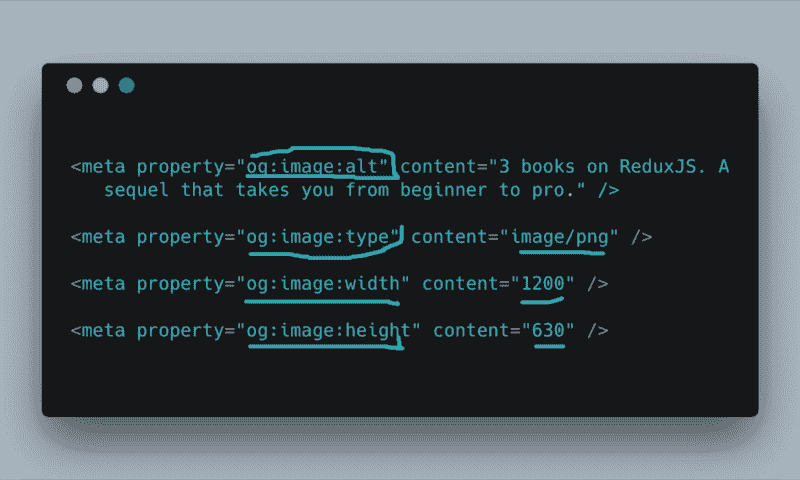

The image’s alt text, type, width and height!

太好了！现在你知道了脸书开放图中最重要的部分。

### 推特卡片


和脸书一样，你也可以完全控制你的链接在 Twitter 上的显示方式。

如果你在 Twitter 上分享你的链接，假设你已经设置了脸书开放图元标签，你实际上会得到一些预览。

它可能看起来像这样:

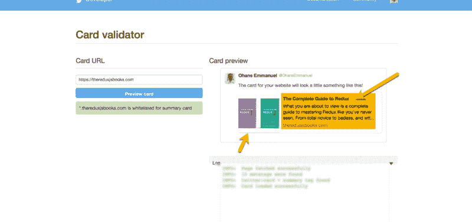

Some basic description is pulled from the Facebook Open Graph meta tags. Not so bad, actually.

不错，但也不太好。

当我们完成后，我们将在 Twitter 上发布以下内容:

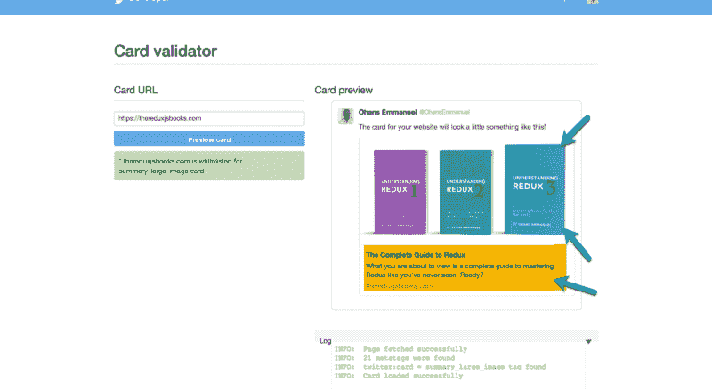

The better result to aim for on Twitter.

如您所见，预览图像要大得多，描述也没有那么冗长。脸书吸纳了更多的角色，但 Twitter 没有。

所以，这里是你需要的基本标签。

```
<!-- Twitter Card -->
    <meta name="twitter:card" content="summary_large_image" />
    <meta name="twitter:image" content="https://thereduxjsbooks.com/images/redux-trio-560x300.png" />
    <meta name="twitter:image:alt" content="3 books on ReduxJS. A sequel that takes you from beginner to pro." />
    <meta name="twitter:description" content="For every book you buy, we will send a free copy to a developer in India, Nigeria, and Tunisia who can't afford the cost."
    />
```

简单！

第一个`meta`标签是**超级重要的**。

```
<meta name="twitter:card" content="summary_large_image" />
```

与具有`property`和`content`属性的脸书开放图不同，Twitter 卡使用`name`和`content`属性。

这里的名字是`twitter:card`，内容是`summary_large_image`。这描述了你想要的 Twitter 卡的类型。有许多不同类型的 Twitter 卡可用，但`summary_large_image`给你之前看到的大图片预览。

不像脸书，你不需要描述图像的`width`和`height`

只要有名字、`twitter:image`和`content`网址就可以了！

```
<meta name="twitter:image" content="https://thereduxjsbooks.com/images/redux-trio-560x300.png" />
```

最后，只需包含图片文本`alt`和一个更短的 Twitter 文本`description`。

```
<meta name="twitter:image:alt" content="3 books on ReduxJS. A sequel that takes you from beginner to pro." />
<meta name="twitter:description" content="For every book you buy, we will send a free copy to a developer in India, Nigeria, and Tunisia who can't afford the cost."
''  />
```

就是这样！

更美妙的是，设置这一点意味着其他服务可以同样地查找这些元数据，并漂亮地显示您的链接！这里有一个链接在 Slack 上共享时的预览。

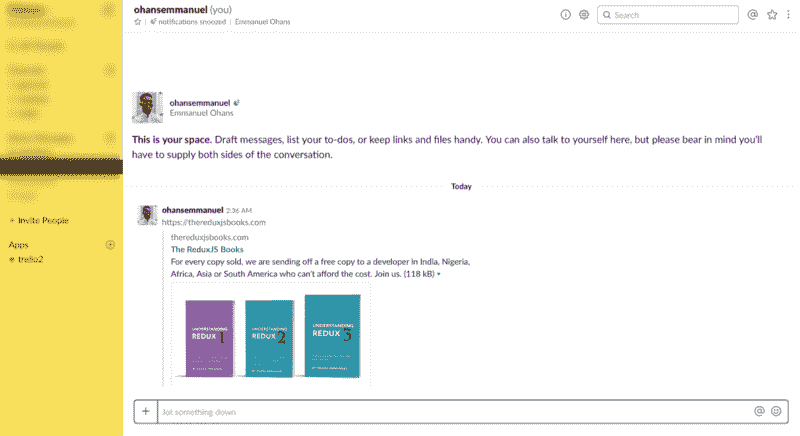

The same link shared on Slack. That looks good!

Slack 只是众多推崇脸书开放图表和 Twitter 卡片技术的服务之一。

### 结论

为了使这篇文章简短，我跳过了许多信息。如需更多技术信息，请务必查看[脸书公开图](https://developers.facebook.com/docs/opengraph/getting-started)和[推特卡](https://developer.twitter.com/en/docs/tweets/optimize-with-cards/overview/abouts-cards.html)的官方文档。

现在你知道了，推特上那些漂亮的链接预览，脸书并不是靠魔法得到的。

有人写了代码，现在你知道怎么做了。

去建立那些在推特和脸书上分享时看起来超级棒的网站吧！