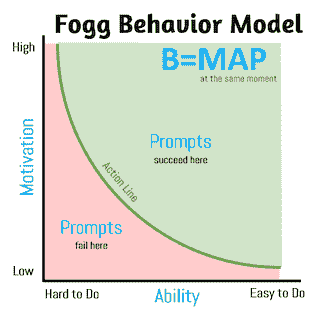
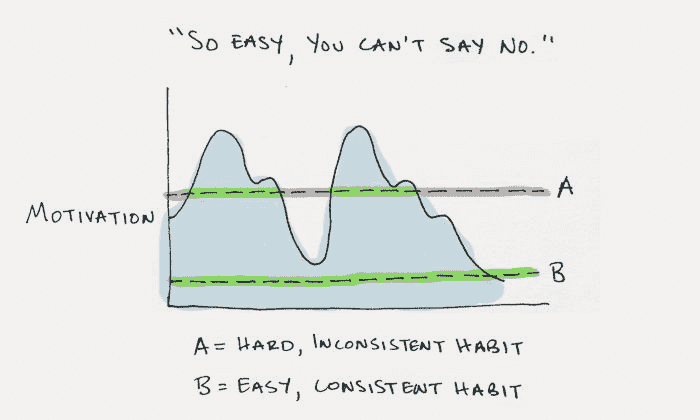
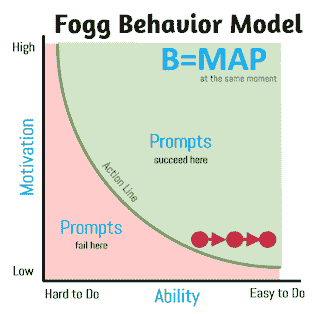

# 如何利用微小的习惯，打造始终如一的学习习惯？

> 原文：<https://www.freecodecamp.org/news/how-to-be-more-consistent-when-learning-to-code/>

如果在一个人开始学习编程之前，我只能教会他一件事，那就是如何保持一致性。

成功的自学成才的开发者，没有任何别人不具备的特殊能力。

他们所拥有的是习惯、惯例和/或生活环境，这使得他们能够坚持不懈地努力学习。

我认为自学编程最难的部分不是材料的难度，而是以一种允许你不断向目标前进的方式建立你的生活。

现有的习惯很难打破。你周围人的期望很难管理。这些因素往往被忽视。

成功自学编程的人和失败的人之间的关键区别在于，一个人在工作完成之前就停止了，而另一个人没有。就这么简单。

一个持续出现的慢学习者将永远胜过一个提前退出的快学习者。

不管你是谁，学习编程是一项需要投入大量时间的大事业。在我们找到一种方法将记忆上传到我们的大脑之前，我们能够度过这一大堆时间的唯一可靠的方法是通过一致性。

捷径和黑客不起作用。喝一箱红牛，连续学习 3 天，是不可能精通编程的。

学习编程就像吃大象一样，一次只能吃一口。

## 微小的习惯

小习惯是我发现的改变你的行为并变得更加一致的最好方法。

微小的习惯是由 BJ·福格博士开发的行为改变框架。BJ·福格是斯坦福大学行为设计实验室的创始人，被公认为世界上行为和习惯改变方面的顶尖专家之一。

在我看来，微小的习惯为行为改变提供了最好的框架。它得到了研究和现实应用的支持。

通过多年的研究，BJ·福格发现了人们改变行为的三种方式。

1.  顿悟
2.  环境变化
3.  一步一步来

在这三个选项中，顿悟是最不可靠的。人们通常不能按需创造顿悟。如果你能，那么，你可能有某种超能力。

如果可以的话，改变环境是一个不错的选择。然而，我遇到的大多数自学成才的开发人员都试图将他们的学习融入他们已经忙碌的生活中。

这使得循序渐进成为最好的选择。每个人都可以循序渐进，一旦掌握了基本知识，就很容易应用到生活中。

《小习惯》是一个以循序渐进为中心的框架。

微小的习惯有三个主要部分。

1.  一个锚
2.  微小的行为
3.  奖励

在本文的剩余部分，我将解释微小习惯的三个部分，并看看如何将它应用到自学开发中。

## 福格行为模型

微小习惯的核心组成部分是福格行为模型。福格行为模型由公式 B = MAP 表示。

行为=动机*能力*提示

**动机—** 希望、恐惧、寻乐、避痛、社会接纳、社会拒绝。

**能力—** 你执行一项任务的能力，包括:时间、金钱、体力、脑力、社交越轨、常规。

**提示—** 提醒你做该行为的内部或外部触发器。

下图直观地展示了 Fogg 行为模型。

当动机、能力和提示同时出现时，行为就发生了。如果这三个变量在作用线上方汇合，那么一个行为就发生了。如果不是，那么什么都不会发生。

如你所见，我们的动机和能力共同作用，使行为成为现实。难做的行为需要高水平的动机，而容易做的行为需要低水平的动机。

我喜欢把福格行为模型想象成运行在我们大脑中的一段代码。

该提示触发了一个代码块，该代码块检查变量“能力”和“动机”。如果任一变量足够高/低，那么它返回一个行为。如果不是，那么它不返回任何东西。

Fogg 行为模型是一个简单但强大的发现，它可以对你学习软件开发的方法产生巨大的影响。

它将作为养成微小习惯的基础，应该作为参考频率。

## 避免动机

只有当一种行为始终保持在行动线之上时，习惯才能形成。

这种情况只有两种可能。

1.  保持高度的动力。
2.  让一个行为容易执行。

长时间保持高水平的动力是可能的。正如奈切兹所说，“有活下去的理由的人几乎可以忍受任何方式。”

但我不会指望它。

我相信我们都经历过，我们的动机来去无踪。前一天，我们为一个新项目而兴奋，第二天，我们又努力寻找离开沙发的能量。

我们经常被欺骗，觉得我们所乘坐的动力之波会永远持续下去。但是从来没有。

我们的外部动机会失去力量或转移。由于恐惧和怀疑的不断攻击，我们的内在动机慢慢减少。

我们失去了曾经拥有的激情，我们又回到了起点。

我们人类是复杂的，我们的动机是不一致的。

由于这些原因，动机是福格行为模型中最不稳定的变量。

作家兼博客作者詹姆斯·克利尔制作了一幅奇妙的图表，展示了动机对我们习惯的影响。

动机应该被认为是酒肉朋友。它的存在很好，但不应该把任何重要的事情托付给它。

安全的做法是避开动机，在假设你的动机总是很低的情况下设计你的学习习惯。

保持在动机的潮起潮落之下是持续重复一种行为的唯一可靠途径。

## 识别一个微小的行为

人们在培养新习惯时犯的一个常见错误是开始太大。我们倾向于认为行为改变是一个大的步骤，而不是一系列的小步骤。

大行为之所以吸引人，是因为它们让人觉得是最有效的途径。我们告诉自己这样的话，“如果我每天学习 3 个小时，那么我很快就能学会编程。”

然而，大的行为改变是脆弱的，因为它们依赖于高水平的动机。

因为动机是不可信的，容易做的行为是实现一致性的最佳途径。

与动机不同，提示和能力几乎完全在我们的控制之中。我们可以选择一个精心制作的提示，或者决定一个我们力所能及的行为。

通过试验福格行为模型中能力变量的子成分(时间、金钱、体力、脑力、社会偏差和常规)，可以发现一个微小的行为。

想象一下，这些子部件中的每一个都是一个可以上下转动的刻度盘。关键是在不改变行为性质的情况下，尽可能降低它们。

例如，BJ·福格建议用牙线清洁一颗牙齿，开始养成用牙线清洁的习惯。很难对用牙线剔牙说不。

学习编码的微小行为可以像登录你的计算机和打开浏览器一样简单。

正如上一节中的插图所指出的，它需要“如此简单，你不能说不。”

做这么小的事情似乎是浪费时间。

记住，我们追求的是长期的变化。每个微小的行为都是未来行为的基础。

如果你想做得更多，那就去做吧。把它当作额外的学分。只要确保你永远不会少于微小的行为。

## 设置提示

接下来，我们需要确定一个提示，作为新习惯的锚。

提示只是提醒你要行动。这些可以包括通知、人、记住的东西或其他习惯(等等)。

没有提示，行为就无法存在。

花些时间确保你的提示是有价值的。如果这个提示没有在你的生活中很好地建立和固定，新习惯就会土崩瓦解。

我发现最好的提示是那些利用现有习惯的提示。你可以让一个习惯的结束成为一个新习惯的开始。我也发现像便利贴这样的视觉提示是有效的。

当试图找出你的提示时，使用下面的填空句子。在我 _____ 之后，我将 ______。

例如，在我做好早晨的咖啡后，我会坐下来打开 freeCodeCamp。

如果你发现自己总是忘记做一些微小的行为，你可能需要修改你的提示。

从提示转移到你微小的行为应该感觉很自然。如果不是，那么要么你的提示或微小的行为需要返工。

找到一个好的锚定提示需要一些实验。

## 确定奖励

在培养学习习惯时，你需要记住的最后一件事是奖励自己。

我们天生会重复给我们提供积极反馈的行为。这是给我们大脑的一个信号，一个行为是有价值的，值得重复。

奖励必须是直接的和积极的。如果缺少这两样中的任何一个，奖励就不会有效。

如果你失败了，避免消极。正面强化是培养新行为的唯一途径。负强化只能收缩现有行为。

至少，你需要在完成你的微小行为后立即奖励自己。对于加分，你也可以在记住你的提示和实际微小行为过程中奖励自己。

你能得到的最简单的奖励就是立即庆祝(大声地或悄悄地)。试着告诉自己“干得好”或给自己一点拳头。这些小小的行为可以起到很大的作用。

在每个微小的行为后奖励自己可能看起来很傻。然而，奖励是习惯形成的基础部分。

BJ·福格指出，情绪最能创造习惯。奖励是给新行为注入积极情绪的机制。

树立你迅速而微小的行为只会播下种子。奖励提供阳光和水，让习惯成长。

你永远不需要奖励自己，直到这种行为成为一种习惯。

## 微小的行为到微小的习惯

一旦你有了一个稳固的提示，一个微小的行为，一个奖励机制，剩下唯一要做的就是让时间发挥它的魔力。

随着时间的推移，新的行为会在福格行为模型上慢慢向右移动。

随着你编程能力的提高，新的学习习惯成为常规，增加时间和强度会感觉很自然。

关键是只有当你感到舒服的时候，才增加你学习习惯的时间和强度。不要勉强。

强迫行为会导致你的动力和能力下降，这将慢慢地把你推到行动线以下。

你试图建立一个坚实的基础，未来的习惯可以建立在这个基础上。动作太快会危及这一点。

如果你在任何一点上失败了，不要把它看作是个人的失败，而是设计的失败。你的行为要么不够小，要么你的提示不够可靠。

正如我所提到的，需要做一些实验才能把它做好。

生活有时会很忙碌，所以如果你完全放弃了你的小习惯，也不要沮丧。当机会出现时，重新评估你迅速而微小的行为，重新开始。

## 结论

我真的相信任何人都可以学习编程，如果他们始终如一。

自学编程并不容易。每天都是一种折磨。然而，如果你不坚持出现，你就不给自己机会。

我希望你已经发现小习惯是有用的。我认为在设计一个持续的学习习惯时，这是一个重要的工具。

一旦你从小做起，你会惊讶地发现改变行为是多么容易和有趣。

巨大的变化始于微小的开端。

如果你想听听我一路走来学到的其他见解，请在 Twitter 上关注我的密友[Zero to Programmer](https://twitter.com/zero2programmer)。该帐户的目标是帮助您更有效地学习编码。