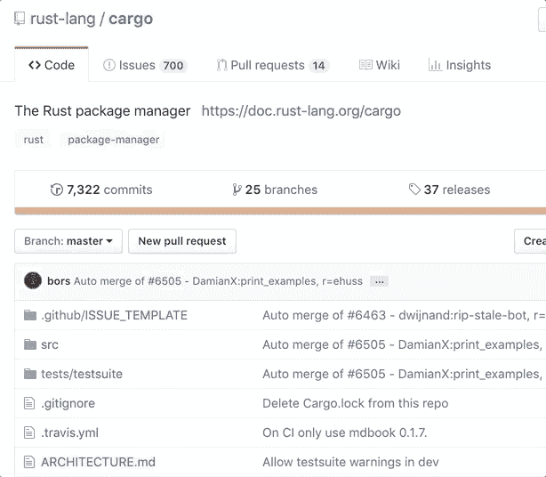
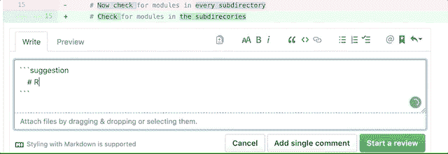
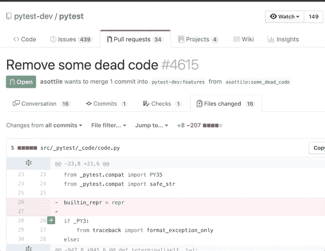
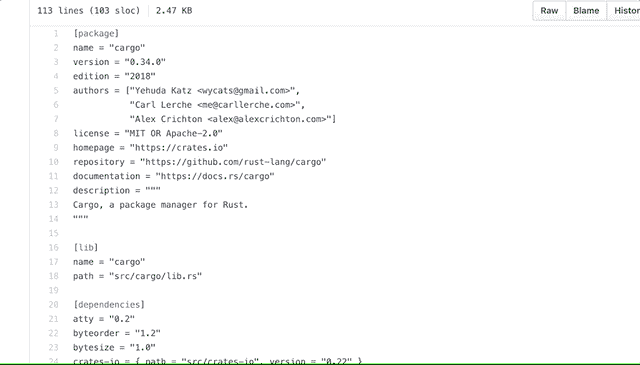
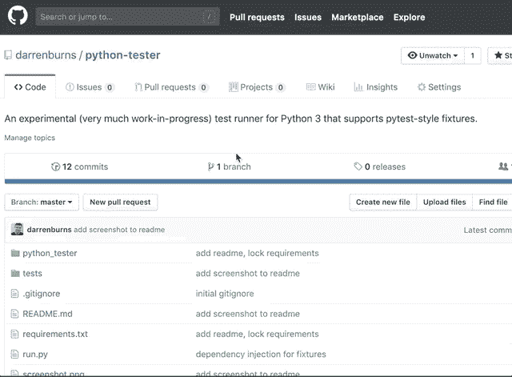
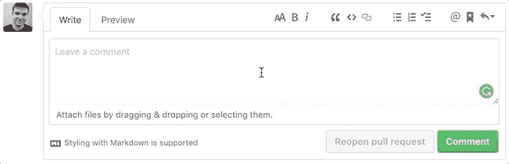

# 如何在 GitHub 上更高效

> 原文：<https://www.freecodecamp.org/news/how-to-be-more-productive-on-github-c3cedab043e3/>

作者达伦·伯恩斯

# 如何在 GitHub 上更高效

随着 GitHub 最近宣布[无限私有库](https://blog.github.com/2019-01-07-new-year-new-github)，让我们花几分钟时间，在我们把我们不希望其他人看到的代码推到云之前，确保我们充分利用了 GitHub 所提供的一切。

GitHub 是用一些非常有用的快捷方式和提高生产力的特性构建的。然而，从个人经验来看，很明显这些经常被开发人员忽略。

如果我曾经目睹过 GitHub 的某个特定功能给别人带来惊喜或帮助别人，它就在这个页面上。也就是说，以下内容绝不是一份详尽的清单。

#### 知识库中的快速模糊文件搜索

毫无疑问，当你知道你在找什么的时候，这是浏览存储库最快的方法。打开任意存储库并按下`t`。现在，您可以搜索存储库中任何文件的名称，并使用键盘上的箭头键浏览结果。按下`Enter`打开文件。

#### 拉请求中的代码更改建议

当对拉请求中的一段代码进行注释时，您可以使用“建议的更改”功能来建议替代代码。pull 请求的作者将能够在不离开 GitHub 的情况下立即应用您的建议。要提出建议，请用多行 Markdown 代码段包围代码段，并添加标记“suggestion”:

Suggesting a change in a pull request…

既然您已经提出了建议，拉请求的作者可以立即将它应用到他们的分支，而不需要手动更改文件！

…and then applying that change!

#### 像在 IDE 中一样导航代码树

这需要一个非官方的 Chrome 扩展，但与默认界面相比，这是一种更熟悉的导航代码的方式。八叉树扩展允许你浏览 GitHub 库，带有侧边栏树视图，类似于你在 VS Code 等应用程序中得到的。

#### 检查代码时跳转到一个函数

除非您正在审查一个单独的函数，否则代码审查通常会涉及到函数调用和它们的定义之间的大量跳转(因此需要大量的上下滚动)。GitHub 允许你在查看一个 pull 请求中的文件时，通过按`t`跳转到一个符号。

#### 创建指向文件的永久链接

当查看文件或目录时，按下`y`，URL 将被转换为永久链接，您可以安全地共享该链接，因为文件的内容永远不会改变。

如果你在 GitHub 上发送一个指向文件或目录的链接，而没有把它变成一个永久链接，你需要接受这个文件明天可能会消失，断开链接的可能性！

#### 查看责备和改变近期热图

当查看一个文件时，你可以按下`b`来查看 Git 错误和显示最近每一行被修改的热图。它会告诉你谁最近修改了每一行代码，并给你一个可点击的链接，带你到完整的提交，这是修改的一部分。

在装订线(包含提交消息和作者)的右边，您会注意到一个橙色的竖线。这个条越生动，最近的变化就越多，这意味着您可以轻松地扫描文件以找到最新的代码！

#### 强大的代码搜索

GitHub 索引了大多数代码，并提供了强大的搜索功能。如果您需要在存储库中找到一些东西，但是不打算对它进行任何更改。通常不需要签出存储库。按下`/`键搜索存储库中的所有代码。

如果您的搜索包含多个单词，并且您想要搜索特定搜索查询的匹配项，请在查询两边加上引号。你也可以通过其他东西来过滤你的搜索，比如文件大小、扩展名、文件所在的路径等等。

#### 保存的回复

如果你发现自己重复同样的评论，你可以通过创建一个[保存回复](https://github.com/settings/replies)来节省一些时间。下一次你发现你要再次输入注释，你可以从下拉菜单中选择:

要在不使用鼠标的情况下执行上述操作，我可以先做`ctrl` + `/`，再做`ctrl` + `1`。

#### 结论

感谢阅读。我希望你在这个页面上至少找到了一件能让你成为更有效率的 GitHub 用户的事情。如果你喜欢这篇文章或者有任何反馈，请告诉我！

如果你对更多类似的内容感兴趣，请在 Twitter 上关注我。

最初发布在我的[博客](https://darrenburns.net/posts/github-tips)上。

**P.S.** 你可以像 myoctocat.com[封面照片中的那只一样，制作自己的章鱼来分享！](https://myoctocat.com)