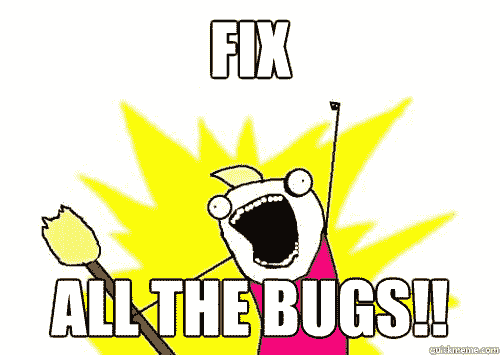

# 如何成为你所知道的超级明星实习生

> 原文：<https://www.freecodecamp.org/news/how-to-be-the-superstar-intern-you-know-you-are-54eb0372b5e5/>

作者:Maple Ong

# 如何成为你所知道的超级明星实习生

#### 遏制冒名顶替综合症，为你即将到来的软件工程实习做好准备

Photo by [Christin Hume](https://unsplash.com/photos/Hcfwew744z4?utm_source=unsplash&utm_medium=referral&utm_content=creditCopyText) on [Unsplash](https://unsplash.com/search/photos/study?utm_source=unsplash&utm_medium=referral&utm_content=creditCopyText)

我是一名自学成才的开发人员，拥有健康研究学位。自然，我对行业级软件开发的大部分了解来自于我的实习经历。

我目前有两次实习经历，现在是在 Shopify 的最后一次实习。我已经收到了之前工作过的两家公司的返聘通知。

你可以打赌，充分利用实习是在我的地盘上。

大多数实习生都感到力不从心，尤其是这是他们第一次实习。不要担心，希望这能对你的实习之旅有所帮助。

作为一名软件工程实习生，你学习新技术是有报酬的。没有人期望你从第一天起就精通。公司正在给你一个机会，看看你是否适合做全职员工。

你能在公司脱颖而出的方法是对你所做的工作产生影响，建立有意义的联系并发展你的技能。最重要的是，享受你学习和编码的时间！

### **影响**

根据你工作的公司，你可能会被分配给全职软件工程师的工作。这是一个做出重要决定的好机会，反过来，对团队或项目产生某种(希望是积极的)影响。但是，你也可能被指派去修复那些长期存在的错误。

Credits: QuickMeme.com

如果你正在修复 bug，你最好确保当你完成的时候没有 bug 留下。如果你正在建立一个实验性的项目，那就为长期而建。

不管分配的工作是什么，您都希望最大化您对团队和项目的影响。一如既往，产生影响的方式不止一种。你可以在团队会议上分享你的想法，或者主动学习你范围之外的东西，为你的项目做出贡献。

如果你对自己做了多少工作有任何疑问，不要犹豫，向你的导师或经理提出来。

对你的团队和项目有影响是影响你实习的最大因素之一，也是影响你如何在实习中大放异彩的因素之一。如果你想有机会在公司全职工作，这一点尤其重要。

### **一对一时间**

作为一名软件工程实习生，你可能会有一个导师、一个经理，或者两者兼而有之——你还会和他们进行一对一的会谈。

与你的导师一对一的会面(有时称为同步)是很有价值的机会。

Photo by [NESA by Makers](https://unsplash.com/photos/IgUR1iX0mqM?utm_source=unsplash&utm_medium=referral&utm_content=creditCopyText) on [Unsplash](https://unsplash.com/search/photos/code%2C-girl?utm_source=unsplash&utm_medium=referral&utm_content=creditCopyText)

你可以利用这段时间向你的导师——某个在该领域有工作经验的人——询问任何你想问的问题。通常，这也是你可以谈论你可能遇到的任何障碍、你可能在日常生活中遇到的任何问题或者你学到的任何有趣的事情的时候。

我有幸得到了有思想和聪明的工程师的指导，这让我期待与他们一对一的时间。在我们的会面中，我能够与他们谈论我的目标，设定任何期望(对双方)，并在职业和个人层面上更好地了解他们。

不要认为你的一对一时间是理所当然的！

### 了解你的团队

除此之外，和你的同事建立联系也很重要。他们可以给你一个在公司全职工作的好主意。此外，除了你的导师和经理，他们还是解决工作相关问题的好资源。​

我发现与同事建立牢固的关系让我每天上班都感觉更开心。也增加了我的工作满意度。

Credits: [startupPong](https://startupheretoronto.com/sectors/technology/startupong-wants-torontos-tech-community-to-give-back-with-ping-pong/) — A ping-pong tournament for startups in Toronto

尽管接近全职同事看起来令人生畏，但不管你是不是实习生，人们都倾向于包容。了解他人的一个好方法是参加工作之外的社交活动，比如桌游之夜或者公司的室内足球队决赛。

建立联系的另一个技巧是提问，以更多地了解他们在公司中的角色。人们在回答关于他们角色的具体问题和谈论他们的日常生活时会感觉更舒服。

如果你想更好地了解你公司的技术是如何运作的，这是非常有用的。顺便说一下，这将有助于你在全职软件工程面试中获得系统设计部分的更多洞察力。

### **成长心态**

> “在成长心态中，人们相信他们最基本的能力可以通过**奉献和努力**得到发展——头脑和天赋只是起点。这种观点创造了对学习的热爱和对巨大成就必不可少的适应力。”—卡罗尔·德韦克谈[心态](https://mindsetonline.com/whatisit/about/index.html)

技术发展是一个与你对你的团队和项目的影响成正比的因素。然而，作为一名软件开发人员，你可能会产生一定程度的影响，但却没有成长，因为你没有吸收任何新的东西。

话虽如此，我发现问自己，“接下来我能学什么？”或者“我还能在哪里应用这些知识？”能告诉我需要做些什么才能让我的技能更上一层楼。提问和不断学习这个简单的行为将有益于你的成长。

Photo by [Stanislav Kondratiev](https://unsplash.com/photos/MdexOj4D-MU?utm_source=unsplash&utm_medium=referral&utm_content=creditCopyText) on [Unsplash](https://unsplash.com/search/photos/growth?utm_source=unsplash&utm_medium=referral&utm_content=creditCopyText)

### **高效学习**

科学表明，学习风格，尽管从 20 世纪 50 年代就存在，却是一个神话。然而，扩展你的知识和有效地学习是一个富有成效的习惯——尤其是作为一名实习生。那么如何才能更高效的学习呢？

在我第一次软件工程实习期间，我注意到的关于我学习风格的第一件事是，比起*阅读*教程，我更喜欢*看*教程视频。当我试图阅读一个教程，然后实现一些东西时，我的思维很容易分心。

另一方面，我也喜欢阅读我不熟悉的领域的专家写的文章。与以教程为中心的文章不同，一般的文章提供了不同层次的细节和例子，这些都不适合 3 分钟的视频。

幸运的是，互联网上充斥着写得很好的文章。在谷歌上快速搜索你感兴趣的话题可以证明这一点。

为了更有效地学习，最好专注于你最喜欢的媒介。也许你最喜欢的 YouTuber 覆盖了一个你不熟悉的话题。或者一个著名的 CEO 写了一篇关于你很好奇的新技术的文章。保持开放，探索新的学习方法，并坚持下去。

关键是要自我反省，多了解自己是如何吸收信息的。如果你发现阅读无聊的 API 文档让你想抓狂，不要害怕改变。

### **问好问题**

人们说没有愚蠢的问题，但是看在上帝的份上，不要问你的导师一些你可以通过快速谷歌搜索解决的琐碎问题。

在寻求帮助之前，确保你尽力理解并解决问题。在要求填鸭式喂食和讨论这个问题之间应该有一个平衡。

Photo by [rawpixel](https://unsplash.com/photos/komOcyIICoA?utm_source=unsplash&utm_medium=referral&utm_content=creditCopyText) on [Unsplash](https://unsplash.com/search/photos/talking%2C-computer?utm_source=unsplash&utm_medium=referral&utm_content=creditCopyText)

这就引出了我的下一个观点:你应该随时准备好讨论你的想法和主意。不要只问答案，说明你做了一些思考和研究！毕竟，你想用一些脑力来解决问题。

不管你的技术水平如何，你在实习中付出的努力将与你从中获得的收益成正比。

保持积极的心态，不断学习——你的实习时间会过得很快。

### ？行动项目:

*   与你的导师/负责人设定学期期望:你这次实习的目标是什么？我们如何共同实现这一目标？
*   在会议上畅所欲言，不要害怕贡献自己的力量！
*   就你的软技能和硬技能寻求建设性的反馈
*   请你团队中的某个人去喝杯咖啡
*   参加一个非工作性质的社交活动，寻找乐趣
*   在 LinkedIn 上找到并联系你的同事
*   听一听你感兴趣的技术播客！我强烈推荐[软件工程日报](https://softwareengineeringdaily.com/)。
*   和你的导师谈谈你在过去一周学到了什么。你如何在未来的项目中应用这些知识？接下来你想学什么？

您已阅读完本文，感谢您的阅读！如果你喜欢，请给它一个掌声，并发表评论？如果你有什么要补充的。

在 [LinkedIn](https://www.linkedin.com/in/mapleong/) 上与我联系，并说“嗨！”